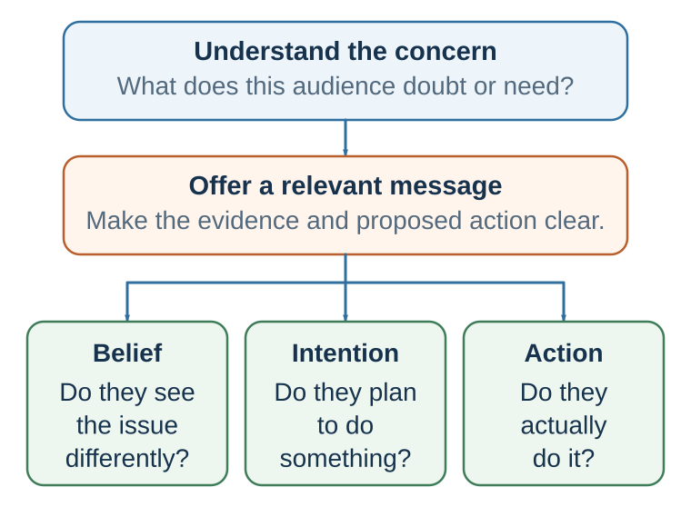

---
aliases:
  - 25-persuasion-is-model-updating.html
---

# Persuasion: Changing Minds Means Updating Models

*Changing minds requires more than adding facts*

::: {.chapter-epigraph}
> “Rhetoric may be defined as the faculty of observing in any given case the available means of persuasion.”
>
> — Aristotle, [*Rhetoric*](https://classics.mit.edu/Aristotle/rhetoric.1.i.html), c. 350 BCE, Book I, Part 2, 1355b
:::

::: {.callout-note .core-idea icon=false}
## Core Idea

Persuasion asks another person to revise the model through which evidence, values, emotion, and action are interpreted, while retaining the freedom to judge and refuse. But more facts or stronger arguments can harden resistance when the source lacks credibility, the message misses what the audience values, or influence quietly substitutes the speaker's agency for the audience's. Therefore this chapter treats persuasion as ethical model updating: diagnose the barrier, align evidence with relevance, and make revision warranted, feasible, and genuinely voluntary.
:::

## Learning goals

- Diagnose the main barrier preventing a particular audience from revising its model.
- Design an evidence-aligned message that integrates source, argument, emotion, and feasible action.
- Produce and ethically audit a persuasive proposal that preserves the audience's agency.

::: {.callout-note .loop-location icon=false}
## Where this chapter enters the loop

Persuasion enters when one person tries to produce a **warranted change in another person's model**. It can redirect attention, interpretation, prediction, valuation, and action. It does not replace the other person's judgment; it gives that judgment credible reasons and a feasible path for revision.
:::

Imagine that a company plans to replace a familiar project system with a shared digital platform. Senior leaders see delayed projects, duplicated work, and weak visibility. Employees see surveillance, extra data entry, and another initiative that may disappear in six months. The leaders prepare more efficiency statistics. Resistance hardens.

Many people imagine persuasion as argument: present evidence, give reasons, defeat objections, and the other person should change their mind. Sometimes that works. In this case it does not, because the message answers the leaders' question—*Will the system improve coordination?*—while employees are asking different questions: *Will it cost me autonomy? Will my data be used against me? Will the promised support arrive?*

Facts matter, but facts do not guarantee persuasion. They enter a mind already shaped by attention, prior beliefs, values, emotions, identity, trust, and social context. A message that is factually correct may fail if the audience does not trust the source, does not see relevance, feels threatened, lacks ability to process the information, or interprets the message as disrespect.

This is why persuasion is not only about what is said. It is also about who says it, to whom, in what context, with what evidence, through what emotional tone, and with what implied relationship.

The ancient tradition of rhetoric understood this well. Aristotle described three major modes of persuasion: ethos, pathos, and logos (Aristotle, trans. 2007). Logos refers to the argument: evidence, reasoning, examples, and structure. Pathos refers to emotion: the audience’s feelings, values, fears, hopes, anger, compassion, or pride. Ethos refers to the character and credibility of the speaker: whether the audience sees the speaker as knowledgeable, trustworthy, fair, and well-intentioned.

Modern persuasion research has given these ancient ideas more precise psychological language. Source credibility research studies ethos. Emotion and affect research studies pathos. Argument quality, evidence, and reasoning research studies logos. Dual-process theories explain when people scrutinize arguments carefully and when they rely more on cues such as credibility, attractiveness, fluency, emotion, or consensus.

The important lesson is that persuasion rarely works through one route alone. A strong argument from an untrusted source may fail. A trusted source with weak evidence may persuade temporarily but not deeply. A message that evokes emotion without evidence may move people but mislead them. A technically perfect argument may fail if it ignores the audience’s identity or values.

Effective persuasion begins with a question:

What is preventing this audience from changing its mind?

The obstacle may be lack of information. But it may also be distrust, fear, pride, confusion, identity threat, social norms, low relevance, competing goals, or lack of perceived efficacy.

A message should be designed for the actual obstacle, not the obstacle the persuader wishes were there.

## From information transfer to model updating

Information transfer says, “Here are more facts,” and quietly assumes that the audience will interpret them as the speaker does. Model-updating persuasion begins one step earlier: what model currently makes these facts mean what they mean? Audiences arrive with expectations about the speaker, the problem, the risk, the proposed solution, and themselves. The same observation can therefore look like traction, noise, danger, or opportunity.

This does not make facts optional. Evidence constrains the models that deserve belief. But a visible pattern may fit several accounts: steady growth, acceleration, or an approaching plateau. Good persuasion names the assumptions, asks what further observation would discriminate among the accounts, and makes uncertainty inspectable. It does not select the most convenient curve and call it “the data.”

{#fig-model-underdetermination fig-alt="Five identical synthetic observations are shared by three candidate curves through period five. Beyond the observed window, one curve grows steadily, one accelerates, and one plateaus. A future synthetic observation of 44 at period eight lies near the plateau curve. A note says this favors rather than proves the plateau because more out-of-sample evidence and a noise model are needed." width=100%}

Predictive processing offers a useful **theoretical lens**, especially in perception and action: the system predicts, compares incoming information with expectation, and updates when a credible discrepancy warrants revision (Clark, 2013). It does not scientifically validate a writing template. The practical persuasion sequence is an evidence-disciplined analogy:

| Stage | Diagnostic question | Design move |
| --- | --- | --- |
| Current model | What does this audience expect, and why is that expectation intelligible? | Begin inside shared reality. |
| Meaningful mismatch | What relevant observation can the old model not explain? | Surface one real, consequential gap. |
| Candidate model | What better explanation resolves the gap? | State the mechanism, not merely a preferred conclusion. |
| Evidence | Why should the new account receive more weight? | Match source, comparison, test, and uncertainty to the claim. |
| Action | What feasible next step follows if the update is accepted? | Name who does what, by when, while preserving refusal. |
: A practical model-updating sequence {#tbl-25-model-update}

Build an audience model before building the message. Specify the actual decision-maker; the desired change in thought, feeling, choice, or action; the current model; the main barrier—attention, belief, trust, value, identity, or feasibility; the evidence the audience would regard as credible; and the costs, risks, status concerns, and practical constraints that must be respected. The opening question is not “What do I want to say?” but “What must change in this audience's model?”

| Barrier | What the audience may be thinking | Appropriate design response |
| --- | --- | --- |
| Attention | “This is one more announcement.” | Lead with the consequential mismatch, not background. |
| Trust | “Management will use the data against us.” | Use a credible messenger, disclose governance, and make commitments verifiable. |
| Comprehension | “I cannot see how this changes my work.” | Demonstrate the workflow with concrete before-and-after tasks. |
| Identity and values | “This treats professional judgment as a defect.” | Protect valued competence and explain what remains under local control. |
| Feasibility | “Even if it helps, I have no time to learn it.” | Provide time, training, support, and a reversible pilot. |
| Belief | “The promised benefit is only a projection.” | State the mechanism, uncertainty, comparison, and success test. |
: A barrier matrix for persuasive design {#tbl-25-barriers}

The organizational-change case has several barriers, not one. Efficiency evidence is relevant to belief, but it cannot by itself repair distrust or create time for training. A persuasive design must therefore match each important barrier with a response.

::: {.callout-tip .activity icon=false}
## Bring one message to redesign

Choose a product, policy, behavior-change request, difficult conversation, or research claim. In six lines, write: audience; desired response; current model; main barrier; credible evidence; constraint. Then write one observation that would genuinely discriminate the old model from your proposed one. If you cannot state that test, you may have a preference rather than a persuasive explanation.
:::

## Source, evidence, and stakes

Aristotle's ethos, logos, and pathos remain useful because they identify three different reasons a message can receive weight. **Ethos** asks whether the source is competent, trustworthy, and accountable. **Logos** asks whether evidence and causal reasoning support the claim. **Pathos** asks whether the emotional meaning fits what is genuinely at stake. These are not competing recipes. A warranted update may require all three.

Source credibility depends especially on perceived expertise and trustworthiness, although goodwill, similarity, status, confidence, and intent can also affect reception (Hovland & Weiss, 1951; Pornpitakpan, 2004). Credentials do not settle trust. A technically expert manager may still be an unsuitable messenger when earlier promises were broken or when the proposal benefits management at employees' expense. Claims can also detach from their original sources as memory fades, which helps explain why low-credibility information may remain familiar even when its origin is forgotten; the sleeper effect is conditional rather than universal (Kumkale & Albarracín, 2004).

For the platform proposal, a respected project leader who tested the system may be a more credible messenger than the chief technology officer alone. Yet a better messenger cannot substitute for verifiable governance. Employees need to know which data are recorded, who can see them, how the data may be used, and what recourse exists if the commitment is violated.

Evidence must answer the audience's actual question and match the claim being made. A demonstration can show that a workflow is possible; comparison data can estimate an effect; a case can illustrate a mechanism; none automatically establishes the others. Two-sided refutational messages can be especially useful for informed or skeptical audiences because they acknowledge consequential objections and answer them rather than pretending they do not exist (Hovland et al., 1949; O'Keefe, 1999). The test is not whether an objection was mentioned, but whether a reasonable skeptic can inspect the comparison, assumptions, uncertainty, and conditions under which the proposal would be withdrawn.

Emotion gives those consequences value. Different emotions orient attention and action differently, so “make it emotional” is not a scientific prescription (Lerner et al., 2015). Fear appeals are most defensible when the threat is real and the recommended response is both effective and feasible; fear without efficacy can produce avoidance or defensive control rather than protective action (Rogers, 1975, 1983; Witte, 1992). Hope, pride, compassion, anger, or humor may also affect motivation, but the relevant question is whether the feeling is proportionate to the evidence and points toward a feasible action.

Three diagnostic questions keep the modes aligned:

1. **Source:** Why should this audience trust this messenger on this claim?
2. **Evidence:** What would a reasonable skeptic need to know, and what result would count against the proposal?
3. **Stakes:** What should the audience feel if it understood the consequences accurately?

For the platform, that means showing where duplication occurs, how the proposed workflow is expected to reduce it, what comparison produced the estimate, and which costs were included. The message can make avoidable frustration and pride in competent work salient. It should not manufacture fear of dismissal unless employment risk is real and openly addressed.

## Two routes through a message

{#fig-persuasion-update fig-alt="An author's teaching synthesis connects an audience model to message design and then to separate possible outcomes: belief revision, intention, and action. None is guaranteed by the preceding stage."}

Modern persuasion research is strongly shaped by dual-process models. Two of the most influential are the elaboration likelihood model and the heuristic-systematic model.

Persuasion depends on both message arguments and the audience’s motivation and ability to elaborate; source cues matter differently under different processing conditions (Petty & Cacioppo, 1986; Chaiken, 1980).

The elaboration likelihood model, developed by Petty and Cacioppo, uses *central* and *peripheral* routes as shorthand for the high- and low-elaboration ends of a continuum—not as two sealed boxes in the mind (Petty & Cacioppo, 1986; Petty & Briñol, 2012). Toward the high-elaboration end, people devote more thought to issue-relevant information. Toward the low-elaboration end, attitudes depend more on processes requiring little issue-relevant thought, such as familiarity, affect, or a simple source cue. Mixed processing is common.

The model does not say that one end is always good and the other bad. Nor does more thinking guarantee neutral or rational thinking: extensive elaboration can be selective or identity-defensive. Elaboration depends especially on how motivated and able people are to think about the message.

Motivation is higher when the issue is personally relevant, important, surprising, or connected to goals. Ability is higher when the message is understandable, the person has enough knowledge, distractions are low, and time is available. When motivation and ability are high, argument quality matters more. When motivation or ability is low, peripheral cues matter more.

Petty, Cacioppo, and Goldman (1981) demonstrated this with a study about comprehensive exams. When the issue was highly relevant to students, strong arguments produced more persuasion than weak arguments. When relevance was low, source expertise mattered more. More generally, the same variable can play different roles: source expertise can operate as a simple cue, be treated as evidence relevant to the merits, change the motivation to think, bias the thoughts generated, or change confidence in those thoughts. Its role must be identified rather than inferred from the label *central* or *peripheral*.

The heuristic-systematic model, developed by Chaiken, makes a related distinction between systematic processing and heuristic processing (Chaiken, 1980; Chaiken et al., 1989). Systematic processing involves comparatively careful evaluation of message content. Heuristic processing relies on simple rules such as “experts can be trusted,” “longer messages are stronger,” “consensus implies correctness,” or “likable people are credible.” The processes can co-occur rather than forcing an either–or classification.

One useful idea from this model is the sufficiency principle: people exert enough effort to reach a desired level of confidence, but not more. If a low-effort heuristic gives enough confidence, they may stop. If the decision is important or uncertainty remains, they may process more systematically.

These models connect persuasion to the rest of the book. Heuristics, fluency, authority, social proof, and affect can influence attitudes under lower elaboration, but they can also alter what people think about, how they interpret evidence, and how confident they are under higher elaboration. The scientific question is therefore not simply “Which route?” It is “How much issue-relevant thinking occurred, what did this variable do within that processing, and what changed—belief, evaluation, intention, or action?”

Attitudes formed or changed through greater elaboration tend, under appropriate conditions, to be more persistent, resistant to counterpersuasion, and predictive of behavior because they are connected to a more developed structure of supporting thoughts. That is a tendency, not a guarantee: durable reasoning can still be based on biased search or weak premises. Lower-elaboration change may be more fragile, though repetition, identity, learning, and later experience can stabilize it.

This has practical implications.

If the issue is important and the audience is motivated, provide strong arguments, evidence, and meaningful engagement. Do not rely only on slogans.

If the audience is overloaded or low-involvement, make the message simple, credible, timely, and easy to act on. Do not bury the point in technical detail.

If the audience is skeptical, acknowledge objections and provide credible evidence.

If the audience lacks ability to process, simplify without distorting.

If the audience’s identity is threatened, credibility and respect must come before argument.

A useful question is:

Is this audience willing and able to think deeply about this message right now?

The answer determines the persuasion strategy.

| Audience condition | Likely elaboration pattern | Design implication |
| --- | --- | --- |
| High motivation and ability | Higher elaboration is likely; cues may still shape direction or confidence. | Use strong evidence, causal logic, uncertainty, and counterarguments. |
| High motivation, low ability | Elaboration is desired but constrained by comprehension, time, or load. | Reduce jargon, scaffold concepts, and show concrete mechanisms. |
| Low motivation, high ability | Lower elaboration is likely unless relevance increases; mixed processing remains possible. | Establish genuine relevance before adding detail. |
| Low motivation and ability | Lower-elaboration processes and simple cues are more influential. | Use transparent cues, one clear action, and avoid exploiting inattention. |
: Audience conditions shift elaboration; they do not assign people to fixed routes {#tbl-25-1}

### Influence cues are signals, not buttons

Low-effort cues are often presented as a list of persuasion tricks. That framing is misleading. The cues below are heterogeneous: they may provide useful information, alter attention or motivation, create a felt obligation, or change behavior without changing the belief that supposedly justified it. Their influence is warranted only when the visible cue reliably tracks what it appears to signal.

| Cue | Legitimate information | Counterfeit form | Pause question |
| --- | --- | --- | --- |
| Reason-giving | The request has a relevant justification. | A reason-shaped phrase supplies no decision-relevant information. | Would this reason change my judgment if the word *because* disappeared? |
| Social proof | Independent others have relevant experience or information. | Purchased approval or correlated copying appears to be independent evidence. | How independent and relevant are these observations? See Chapter 26. |
| Commitment | A freely chosen promise expresses an endorsed value or plan. | A small early commitment is used after important costs have been concealed. | Was the later cost visible, and is revision or exit still meaningful? |
| Reciprocity | Help or a genuine concession signals goodwill and supports cooperation. | An unwanted gift or inflated first request manufactures obligation. | Am I evaluating the proposal, or merely repaying a feeling of debt? |
| Authority | Accountable, domain-relevant expertise improves the evidence. | A title, uniform, confidence, or logo substitutes for reasons. | What does this source know, how do they know it, and who can check them? See Chapter 28. |
| Scarcity | A real capacity or timing constraint changes the feasible choice set. | A fake countdown or artificial shortage creates urgency. | Is the constraint genuine, and does it change the option's underlying value? |
| Liking | Rapport or similarity may convey shared context and cooperative intent. | Manufactured affinity spills into judgments of truth or competence. | Would the claim survive if I did not like the messenger? |
| Unity | Shared identity can imply mutual obligation and a longer relationship. | Belonging is made conditional on compliance, or outsiders bear hidden costs. | Who is excluded, who pays, and can a member disagree without losing belonging? |
: Influence cues should be audited for cue validity, independence, transparency, and agency {#tbl-25-influence-signals}

Classic experiments show why the pause matters. In a low-cost photocopier request, reason-giving increased compliance even when the stated reason added little information, but the pattern weakened when the request imposed a larger cost (Langer et al., 1978). Small initial requests sometimes increased compliance with later related requests (Freedman & Fraser, 1966), while an apparent concession after a larger request sometimes increased acceptance of a smaller request (Cialdini et al., 1975). These studies identify conditional procedures, not universal buttons. They also measure compliance in particular settings; changed behavior does not by itself establish durable belief updating, and an effect demonstrated in one task does not supply an ethical license to conceal costs or manufacture obligation.

## Diagnose the audience before designing the message

A message is persuasive only in relation to an audience. Prior attitude, involvement, knowledge, identity, values, trust, and perceived efficacy change how the same words are processed. This is why persuaders so often commit an egocentric error: scientists add the evidence that would persuade scientists; managers emphasize the efficiency that matters to managers; officials present population risk when the audience is worried about dignity, cost, or control.

Audience analysis does not require stereotyping or confident mind-reading. It produces hypotheses to test. Ask what the audience currently believes, which value or identity is protected, what evidence it would regard as credible, what practical constraint blocks action, and what a reasonable refusal would look like. Moral translation can connect an argument to the audience's values without changing the underlying claim, but it becomes manipulation when the speaker merely borrows moral language while hiding costs or intent (Feinberg & Willer, 2015).

The message must then do four jobs: state a clear claim, supply evidence proportionate to it, make the consequential stake understandable, and identify a feasible action. Concreteness can make consequences imaginable, but one vivid case should not overpower a relevant base rate. Repetition and fluent wording can aid comprehension, but familiarity is not evidence. Framing can clarify one aspect while hiding another, so high-stakes messages should make consequential alternative frames available.

Finally, agreement and action are separate outcomes. A person may accept the claim yet lack time, opportunity, support, or a workable next step. “Support innovation” leaves action undefined; “approve a three-month pilot with predeclared success and stopping rules” creates a decision. Chapter 32 turns these requirements into a construction routine. Here the diagnostic principle is enough: a message is not ready until its claim, audience barrier, evidence, stake, and feasible action fit one another.

## Resistance and reactance

Persuasion is not only about changing minds. It is also about understanding why minds resist change.

People resist persuasion for many reasons. They may distrust the source. They may disagree with the evidence. They may feel the message threatens identity. They may fear loss. They may suspect manipulation. They may not believe action is possible. They may be loyal to a group. They may have heard counterarguments. They may simply not care.

Reactance occurs when people perceive that their freedom is being threatened and become motivated to restore it (Brehm, 1966; Brehm & Brehm, 1981). A message that says “You must,” “You have no choice,” or “Only ignorant people disagree” can produce resistance, especially when autonomy is valued. People may reject not only the message but also the messenger.

Reactance is common in health, politics, parenting, management, and marketing. A teenager may resist advice because it feels controlling. Employees may resist change because communication feels imposed. Citizens may resist public health guidance if it is framed as coercive or contemptuous. Consumers may resist sales pressure.

Reactance does not mean persuasion should avoid strong recommendations. Sometimes strong guidance is necessary. But autonomy-supportive communication often works better than controlling communication. Deci and Ryan’s self-determination theory emphasizes that people are more motivated when they experience autonomy, competence, and relatedness (Deci & Ryan, 2000). A message that supports choice, explains reasons, acknowledges concerns, and offers feasible action is less likely to trigger reactance.

A controlling message says: “You have to do this.” An autonomy-supportive message says: “Here is why this matters, here are the options, and here is what we recommend.”

Inoculation theory offers another approach to resistance. McGuire (1964) proposed that people can be made more resistant to persuasion by exposing them to weakened counterarguments and refutations, much like a vaccine exposes the body to a weakened threat. Inoculation messages warn people that they may encounter persuasion attempts, present common misleading arguments, and refute them. Meta-analyses suggest that inoculation can build resistance across domains (Banas & Rains, 2010).

Inoculation is useful against misinformation. For example, instead of only correcting false claims after they spread, communicators can teach people common manipulation techniques: fake experts, false balance, conspiracy logic, emotional scapegoating, cherry-picking, and misleading graphs. When people later encounter these tactics, they may recognize them.

However, persuasion can backfire if corrections threaten identity or repeat myths poorly. The evidence for a strong “backfire effect,” where corrections routinely strengthen false beliefs, is more limited than popular accounts sometimes suggest (Wood & Porter, 2019). Still, corrections can fail when people distrust sources or when misinformation fits identity. Effective correction should be clear, credible, repeated, and provide an alternative explanation (Lewandowsky et al., 2012).

Persuasion should also respect psychological ownership. People are more open when they feel they are participating in the conclusion. Asking questions, inviting reflection, and allowing self-generated reasons can be more effective than pushing. Motivational interviewing, developed in clinical contexts, uses empathy, autonomy support, and eliciting the person’s own reasons for change rather than direct confrontation (Miller & Rollnick, 2013). It is a model of respectful persuasion.

A useful question is:

What freedom, identity, or value might this message threaten?

If the persuader cannot answer that, resistance may be misdiagnosed as ignorance or stubbornness.

The platform pilot should preserve meaningful choice where possible: teams can compare two workflows, propose safeguards, and examine results before scale-up. Participation does not mean that every organizational decision becomes a referendum. It means that concerns become testable inputs rather than labels such as “resistance to change.”

## Ethical persuasion

Persuasion creates moral responsibility because it changes how people think and act.

Ethical persuasion is not the same as weak persuasion. It can be clear, forceful, emotional, and strategic. But it respects the audience as decision-makers rather than treating them as objects to manipulate.

Several principles can guide ethical persuasion.

Truthfulness. Do not knowingly use false claims, misleading statistics, fake experts, or deceptive framing. Omitting relevant information can also mislead.

Respect for autonomy. The audience should be able to understand the message, consider alternatives, and refuse without hidden punishment.

Proportional emotion. Emotional appeals should fit the real stakes. Do not manufacture fear, outrage, shame, or hope disconnected from evidence.

Transparency of intent. Persuasion should not disguise itself as neutral information when the intent is to influence.

Audience welfare. The message should not exploit vulnerability, confusion, addiction, fear, or social pressure against the audience’s interests.

Fair representation. Opposing views should not be caricatured when the issue is complex and high-stakes.

Accountability. Persuaders should be willing to answer for the consequences of their influence.

Manipulation occurs when persuasion bypasses or undermines the audience’s capacity to make a reflective choice. It may use deception, hidden motives, artificial urgency, identity threat, fear without efficacy, or emotional exploitation. Not all influence is manipulation. But influence becomes morally suspect when it benefits the persuader by making the audience less able to judge well.

Ethical persuasion is especially important in asymmetrical relationships: doctor-patient, teacher-student, manager-employee, government-citizen, expert-public, platform-user, adult-child, negotiator-counterpart with unequal power. The more power the persuader has, the greater the duty to communicate responsibly.

A useful ethical test is:

Would I still endorse this message if the audience fully understood how it was designed to influence them?

If the answer is no, the message needs revision.

## The platform proposal, redesigned

The original message said, in effect, “The evidence shows that this platform is efficient; therefore use it.” The redesigned proposal follows the audience's model instead of ignoring it.

First, it begins in shared reality: teams are losing time to duplicate files, conflicting versions, and invisible handoffs. Second, it names the concern fairly: a shared system can improve coordination **and** create surveillance if access rules are vague. Third, it offers evidence matched to the claims: workflow data for duplication, a live demonstration for usability, written governance for data use, and a limited pilot for predicted time savings. Fourth, it makes identity and value explicit: the aim is to protect professional time and judgment, not replace them. Finally, it proposes an actionable and revisable step: two volunteer teams test the system for six weeks against predeclared measures, with training time, an independent feedback channel, and a decision rule for stopping, revising, or scaling.

Ethos, logos, and pathos now support the same update. A trusted project leader and a technical specialist share the message. The causal argument is inspectable. The emotional stakes—avoidable frustration, competent work, and fear of misuse—fit the situation. Motivation and ability are supported by relevance, demonstration, training, and time. Resistance is not treated as a defect; it helps specify the test.

This design may still fail. Employees may reasonably reject the trade-off, the pilot may show little benefit, or governance may remain untrustworthy. Persuasion is not successful merely because the audience agrees. It is successful when a defensible model receives appropriate weight and the audience retains the capacity to judge and refuse.

::: {.callout-caution .evidence-and-boundary-conditions icon=false}
## Evidence Boundary

Research supports the importance of argument quality, credibility, motivation, ability, emotion, and perceived autonomy, but no checklist guarantees persuasion. Peripheral processing is not synonymous with stupidity: source and consensus can be rational cues when they reliably track expertise or independent evidence. Agreement does not establish that a message was true, ethical, or causally effective; coercion, incentives, conformity, and selective exposure can produce the same observable response.
:::

A broad, reliable "backfire effect" is not the default response to correction. Resistance depends on identity, trust, repetition, source, and correction design.

## Practice Lab

Choose one organizational change that has met resistance. Produce a one-page persuasion brief containing: the desired response; the audience's current model; a completed barrier matrix; one claim-evidence-warrant chain; the messenger and why that source deserves weight; the appropriate emotional stake; a feasible next action; and one observation that would make you revise or withdraw the proposal. End with the transparency test: would you still use this design if the audience could see the brief?

## Take it forward

- **Use this when:** accurate information is available but an audience's attention, trust, interpretation, values, or ability prevents warranted updating.
- **Do not infer:** acceptance proves truth, or resistance proves ignorance; both may reflect incentives, identity, power, or evidence quality.
- **Try this next:** replace one generic message with a barrier-matched proposal and predeclare what result would change your own mind.

## References cited in this chapter

::: {.reference}
Aristotle. (2007). On rhetoric: A theory of civic discourse (G. A. Kennedy, Trans., 2nd ed.). Oxford University Press. (Original work ca. 4th century BCE).
:::

::: {.reference}
Banas, J. A., & Rains, S. A. (2010). A meta-analysis of research on inoculation theory. Communication Monographs, 77(3), 281–311.
:::

::: {.reference}
Brehm, J. W. (1966). A theory of psychological reactance. Academic Press.
:::

::: {.reference}
Brehm, S. S., & Brehm, J. W. (1981). Psychological reactance: A theory of freedom and control. Academic Press.
:::

::: {.reference}
Chaiken, S. (1980). Heuristic versus systematic information processing and the use of source versus message cues in persuasion. Journal of Personality and Social Psychology, 39(5), 752–766.
:::

::: {.reference}
Chaiken, S., Liberman, A., & Eagly, A. H. (1989). Heuristic and systematic information processing within and beyond the persuasion context. In J. S. Uleman & J. A. Bargh (Eds.), Unintended thought (pp. 212–252). Guilford Press.
:::

::: {.reference}
Cialdini, R. B., Vincent, J. E., Lewis, S. K., Catalan, J., Wheeler, D., & Darby, B. L. (1975). Reciprocal concessions procedure for inducing compliance: The door-in-the-face technique. Journal of Personality and Social Psychology, 31(2), 206–215.
:::

::: {.reference}
Clark, A. (2013). Whatever next? Predictive brains, situated agents, and the future of cognitive science. Behavioral and Brain Sciences, 36(3), 181–204.
:::

::: {.reference}
Deci, E. L., & Ryan, R. M. (2000). The "what" and "why" of goal pursuits: Human needs and the self-determination of behavior. Psychological Inquiry, 11(4), 227-268.
:::

::: {.reference}
Feinberg, M., & Willer, R. (2015). From gulf to bridge: When do moral arguments facilitate political influence? Personality and Social Psychology Bulletin, 41(12), 1665–1681.
:::

::: {.reference}
Freedman, J. L., & Fraser, S. C. (1966). Compliance without pressure: The foot-in-the-door technique. Journal of Personality and Social Psychology, 4(2), 195–202.
:::

::: {.reference}
Hovland, C. I., Lumsdaine, A. A., & Sheffield, F. D. (1949). Experiments on mass communication. Princeton University Press.
:::

::: {.reference}
Hovland, C. I., & Weiss, W. (1951). The influence of source credibility on communication effectiveness. Public Opinion Quarterly, 15(4), 635–650.
:::

::: {.reference}
Kumkale, G. T., & Albarracín, D. (2004). The sleeper effect in persuasion: A meta-analytic review. Psychological Bulletin, 130(1), 143–172.
:::

::: {.reference}
Langer, E. J., Blank, A., & Chanowitz, B. (1978). The mindlessness of ostensibly thoughtful action: The role of “placebic” information in interpersonal interaction. Journal of Personality and Social Psychology, 36(6), 635–642.
:::

::: {.reference}
Lerner, J. S., Li, Y., Valdesolo, P., & Kassam, K. S. (2015). Emotion and decision making. Annual Review of Psychology, 66, 799–823.
:::

::: {.reference}
Lewandowsky, S., Ecker, U. K. H., Seifert, C. M., Schwarz, N., & Cook, J. (2012). Misinformation and its correction: Continued influence and successful debiasing. Psychological Science in the Public Interest, 13(3), 106–131.
:::

::: {.reference}
McGuire, W. J. (1964). Inducing resistance to persuasion: Some contemporary approaches. In L. Berkowitz (Ed.), Advances in experimental social psychology (Vol. 1, pp. 191–229). Academic Press.
:::

::: {.reference}
Miller, W. R., & Rollnick, S. (2013). Motivational interviewing: Helping people change (3rd ed.). Guilford Press.
:::

::: {.reference}
O’Keefe, D. J. (1999). How to handle opposing arguments in persuasive messages: A meta-analytic review of the effects of one-sided and two-sided messages. Annals of the International Communication Association, 22(1), 209–249.
:::

::: {.reference}
Petty, R. E., & Briñol, P. (2012). The elaboration likelihood model. In P. A. M. Van Lange, A. W. Kruglanski, & E. T. Higgins (Eds.), Handbook of theories of social psychology (Vol. 1, pp. 224–245). Sage.
:::

::: {.reference}
Petty, R. E., & Cacioppo, J. T. (1986). Communication and persuasion: Central and peripheral routes to attitude change. Springer.
:::

::: {.reference}
Petty, R. E., Cacioppo, J. T., & Goldman, R. (1981). Personal involvement as a determinant of argument-based persuasion. Journal of Personality and Social Psychology, 41(5), 847–855.
:::

::: {.reference}
Pornpitakpan, C. (2004). The persuasiveness of source credibility: A critical review of five decades’ evidence. Journal of Applied Social Psychology, 34(2), 243–281.
:::

::: {.reference}
Rogers, R. W. (1975). A protection motivation theory of fear appeals and attitude change. Journal of Psychology, 91(1), 93–114.
:::

::: {.reference}
Rogers, R. W. (1983). Cognitive and physiological processes in fear appeals and attitude change: A revised theory of protection motivation. In J. Cacioppo & R. Petty (Eds.), Social psychophysiology (pp. 153–176). Guilford Press.
:::

::: {.reference}
Witte, K. (1992). Putting the fear back into fear appeals: The extended parallel process model. Communication Monographs, 59(4), 329–349.
:::

::: {.reference}
Wood, T., & Porter, E. (2019). The elusive backfire effect: Mass attitudes’ steadfast factual adherence. Political Behavior, 41(1), 135–163.
:::
