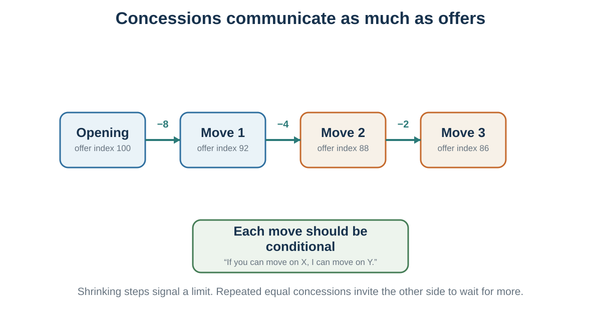

# First Offers, Anchors, Concessions, and Silence

*Claiming value without losing learning, reputation, or the deal*

::: {.callout-note .core-idea icon=false}
## Core Idea

A distributive move is both a transfer of value and a signal. Offers, pauses, concessions, deadlines, and justifications shape expectations about limits and legitimacy.
:::

## Learning goals

- Use precise and range offers appropriately.
- Respond to aggressive anchors with independent analysis and re-anchoring.
- Make concessions conditional, visible, and decreasing.
- Recognize common tactics and ethical boundaries.

## A campaign catastrophe

Begin with a decision, not a tactic. A famous teaching case, commonly recounted in negotiation texts, places Theodore Roosevelt's 1912 campaign under severe time pressure. Millions of campaign pamphlets had reportedly been printed with a photograph credited to Moffett Studios before permission was secured. Reprinting would be costly and slow; approaching the studio could reveal how desperate the campaign was. What should the campaign manager do first?

Write a private recommendation before reading further. State the objective, the evidence behind your inference, the missing information, and what would change your plan. The case is useful because a deadline and a weak-looking BATNA invite tunnel vision. It is presented here as a widely reported teaching account rather than a fully verified archival reconstruction (Lax & Sebenius, 2001).

The reported solution will return after the tools. For now, notice the sequence: diagnose the information problem, decide whether to open, choose a frame and rationale, and anticipate the ethical and relationship cost.

Ambitious aspirations can improve outcomes by directing attention and persistence, but ambition has two boundaries. An under-ambitious target creates a **winner's curse** when easy acceptance reveals that more may have been possible. An implausibly extreme demand can create a **chilling effect** by damaging credibility or ending useful conversation. The target is therefore optimistic **and** defensible, not merely high (White & Neale, 1994).

::: {.callout-tip .activity icon=false}
## Should you make the first offer?

Answer **yes**, **no**, or **it depends**, then specify the information on which your answer depends. Compare your answer with the first-offer decision matrix in Chapter 42. A first offer can anchor and inform at the same time; the question is who learns what from it.
:::

Not all anchors are equal.

A precise offer can sometimes be more powerful than a round offer. An offer of €48,750 may appear more informed than €50,000. It suggests calculation. It can make the offer seem less arbitrary and more connected to underlying data. Research on precise offers suggests that precision can influence counteroffers and perceptions of the offer-maker’s knowledge, though effects depend on context and expertise (Mason et al., 2013).

Precision must be used carefully. A precise number without a plausible rationale can look fake. Experts may see excessive precision as a sign of incompetence if the situation does not justify it. In a highly uncertain negotiation, pretending to know the exact value to the euro may reduce credibility. Precision works best when paired with a legitimate explanation.

Research distinguishes **moderate** precision, which can imply informed calculation, from excessive precision, which can backfire with experts or when the number has no credible basis (Loschelder et al., 2016, 2017). Precision is therefore a claim about knowledge. Show the assumptions that make that claim believable.

For example:

“Based on the repair estimate of €1,250, comparable listings around €9,800, and the age of the vehicle, I could offer €8,750.”

The number is precise because it follows from a calculation. By contrast, “I offer €8,743” with no reason may seem theatrical.

Range offers are another tool. Instead of offering one number, a negotiator offers a range: “I would be looking for something in the €70,000 to €75,000 range.” Ames and Mason (2015) found that certain range offers can improve outcomes while maintaining politeness. Both endpoints matter. A range can anchor the negotiation while seeming less rigid than a single demand.

However, range offers must be designed carefully. If you say, “I want €70,000 to €80,000,” the other side may hear €70,000. If the lower end is acceptable to you but not your target, the range may pull downward. A bolstering range sets the lower end at or near your target and the upper end above it. For example, if your target is €70,000, you might say, “I would be looking in the €70,000 to €75,000 range,” not “€65,000 to €70,000.”

Ranges should not be too wide. A very wide range can look unserious or uninformed. Narrow ranges are more credible. A range can also be linked to package terms:

“I would be looking for €70,000 to €75,000, depending on the bonus structure, flexibility, and review timeline.”

This invites multi-issue discussion while still anchoring value.

Precise offers and range offers are tools, not magic. They work best when embedded in preparation, information, and legitimacy.

## Responding to anchors

If the other side makes an aggressive first offer, the worst response is to treat it as the natural center of the conversation.

Precise and range offers affect perceived knowledge and counteroffers, but their credibility depends on context and justification (Mason et al., 2013; Ames & Mason, 2015).

First offers can anchor final settlements, but an uninformed first offer can reveal ignorance as well as shape the range (Galinsky & Mussweiler, 2001).

An anchor is not just a number. It is an attempt to define the frame. If you negotiate from their anchor, you may make concessions within their preferred range. To avoid this, you need to re-anchor.

First, pause. Do not respond emotionally or immediately. Silence can be useful. It signals that the offer is not self-evidently reasonable. It also gives you time to think.

Second, mentally return to your preparation. What is your BATNA? What is your reservation value? What is your target? What do you estimate their reservation value to be? Do not let their anchor replace your analysis.

Third, decide whether to ask for justification. If you genuinely need information, asking “How did you arrive at that number?” can be useful. But be careful: discussing their anchor in detail can strengthen it by making it the focus of the conversation. If the anchor is clearly extreme and not informative, it may be better to label it and re-anchor quickly.

Fourth, counter with a justified number or range. A good re-anchor does not merely say “no.” It offers an alternative frame.

For example:

“That number is far outside the market range I have seen. Based on comparable roles and the scope we discussed, I think a more appropriate range is €72,000 to €78,000.”

Or:

“I do not think €12,000 reflects the condition of the car or comparable listings. Given the repair estimate and market prices, I would be comfortable around €8,500.”

Fifth, give the other side a face-saving path. If an offer is extreme, the other side may need a way to move without humiliation. You might say:

“I suspect we may be using different assumptions. Could we look at the basis for the number?”

This allows them to moderate without appearing weak.

Strong anchors are especially dangerous when they create emotional reaction. A very low offer can feel insulting. A very high demand can feel aggressive. But outrage can make you focus on the anchor. The better response is disciplined re-anchoring.

A useful rule is:

Do not let their first number become your reference point. Return to your preparation and re-anchor with justification.

::: {.callout-tip icon=false}
## Watch and diagnose: tactics are signals

Watch [Jack Donaghy's negotiation tactics](https://www.youtube.com/watch?v=hVbyetnjA44). Before playing it, make four columns: **tactic**, **immediate reaction**, **hidden cost**, and **better alternative**. The exercise is to diagnose a move, not imitate a television character. No copyrighted frame is reproduced here.
:::

## Concessions and pressure

{#fig-concession-pattern fig-alt="Sequence of four offers with shrinking concessions of eight, four, and two units, plus a conditional-move rule."}

### When an offer is surprisingly good

If the first offer is better than expected, it may be tempting to accept immediately. This can be a mistake.

First, a surprisingly good offer may reveal that your expectations were too modest. You may have underestimated the bargaining zone. Before accepting, ask whether the other side has information you lack, whether the offer includes hidden conditions, or whether there is room for additional value.

Second, immediate acceptance can make the other side dissatisfied. If they offer €10,000 and you instantly say yes, they may wonder whether they offered too much. This is reactive devaluation in reverse: people may devalue their own offer if the other side accepts too eagerly. They may feel regret, suspicion, or embarrassment. Even when you like the offer, it may be wise to pause, ask clarifying questions, and make the agreement feel considered.

Third, accepting immediately may prevent you from discovering other issues. There may be terms, timing, support, warranty, flexibility, or future opportunities that matter.

This does not mean you should always bargain theatrically. If an offer is genuinely excellent and the relationship matters, you should not invent conflict for its own sake. But you can still respond thoughtfully:

“That is a strong offer. I appreciate it. Before I respond, could we clarify the timeline and support terms?”

Or:

“I think we are close. Let me review the full package so I can make sure we are aligned.”

If the offer is due to the other side’s obvious lack of information and you value the relationship, you may even choose to correct them. This can build trust and protect long-term value. Distributive negotiation is not a license to exploit every mistake. Context matters.

The practical rule is:

Do not accept the first offer reflexively. Understand it, test it, and consider the full agreement.

### Concessions communicate limits

Concessions are almost always necessary in distributive negotiation. But concessions do more than change the terms. They send signals.

A concession can signal flexibility, goodwill, weakness, impatience, closeness to agreement, or lack of confidence. The pattern of concessions often matters as much as their size.

Suppose a seller opens at €12,000. The buyer counters at €8,000. The seller drops immediately to €9,500. The buyer may infer that the seller’s first offer was inflated and that more concessions are available. If the seller then drops again quickly to €9,000, the buyer may continue pressing.

Immediate large concessions can teach the other side to wait. Repeated concessions without reciprocity can teach them that pressure works. Conceding twice in a row without receiving movement can weaken your position.

A better concession strategy has several principles.

First, do not make immediate concessions unless there is a clear reason. Respond to the other side’s movement, new information, or package trade. If you concede too quickly, the concession may not be appreciated.

Second, make concessions smaller over time. A decreasing concession pattern signals that you are approaching your limit. For example, a seller might move from €12,000 to €11,000, then to €10,400, then to €10,100. The decreasing size suggests less room remains. A pattern of equal concessions may imply more movement is possible. A pattern of increasing concessions signals panic.

Third, avoid making more than one concession in a row. If you move, expect reciprocal movement. This does not mean every concession must be exactly matched, but unreciprocated concessions create imbalance.

Fourth, label concessions. If you make a concession silently, the other side may treat it as the new baseline rather than as a meaningful movement.

For example:

“I can move from €10,000 to €9,600, but that assumes payment this week.”

Or:

“I can reduce the price by €500 if we remove the delivery requirement.”

This connects concessions to conditions.

Fifth, use conditional concessions. “If you can do X, then I can do Y.” Conditional concessions encourage reciprocity and protect against giving value away.

Sixth, package concessions. Instead of bargaining one issue at a time, connect issues. “I can be flexible on timing if we can agree on price.” Even in distributive negotiation, packaging helps preserve value.

Seventh, be patient. Silence after a concession can be powerful. Many negotiators become uncomfortable and fill silence by conceding again. Do not negotiate against yourself.

A useful rule is:

Every concession should have a purpose, a label, and preferably a condition.

Concessions should move the negotiation toward agreement, not simply relieve discomfort.

Research complicates the familiar advice to make every concession smaller. Decreasing concessions can signal an approaching limit, but recent experiments show that a perfectly shrinking pattern can also disadvantage the sender under some conditions (Tey et al., 2021). Treat the pattern as communication, not a formula. What matters is that moves are deliberate, reciprocal, and connected to new value or information.

### Reciprocal concession and the door in the face

The **door-in-the-face** technique begins with a large request likely to be rejected and then retreats to a smaller target request. In a classic field experiment, students asked only to chaperone juvenile offenders on a zoo trip agreed about 17% of the time; when the request followed refusal of a much larger two-year volunteer commitment, agreement rose to about 50% (Cialdini et al., 1975). Other demonstrations, including blood-donation requests, illustrate the same hypothesis but should not be treated as universal effect sizes.

Why might the retreat work? The second request can look like a concession, which creates pressure to reciprocate. Bargaining experiments likewise found that an extreme demand followed by movement could increase agreement and the counterpart's sense of responsibility for the outcome relative to a fixed extreme demand (Benton et al., 1972). The boundary matters: a transparently manipulative first request can reduce trust, and consent-sensitive or high-stakes contexts should not be engineered through artificial excess.

Use the idea defensively as well as strategically. When a demand falls dramatically, ask whether you learned something material or merely felt an obligation to “meet them halfway.” Reciprocate substance, not theatrical movement.

### The even-split ploy

One common tactic in distributive negotiation is the suggestion to “split the difference.”

Suppose a seller asks €10,000 and the buyer offers €8,000. The midpoint is €9,000. Splitting the difference can feel fair because it appears equal. But it may not be fair if the numbers leading to the midpoint were strategically chosen.

If one party anchors aggressively and then suggests splitting the difference, the midpoint may favor them. For example, if a buyer with a true reservation value of €10,000 offers €6,000 and the seller asks €10,000, splitting the difference at €8,000 may be excellent for the buyer but poor for the seller. The fairness of the midpoint depends on the legitimacy of the endpoints.

“Let’s split the difference” also creates pressure because refusing can make you appear unreasonable. The tactic uses fairness language to claim value.

A disciplined response is:

“I appreciate the spirit of finding a fair middle. But before we split the difference, we should ask whether the endpoints are reasonable.”

Or:

“I am open to a fair solution, but I do not think the midpoint between those two numbers reflects the market data.”

Splitting can be useful when both parties’ positions are legitimate and the remaining gap is small. It can also help close a deal when relationship matters. But it should not replace analysis.

A useful question is:

Split the difference between what and what?

If the endpoints are arbitrary, the midpoint is arbitrary too.

### Deadlines and patience

Time is a source of power.

A party under deadline pressure may concede more. A seller who must sell today is weaker than one who can wait. A candidate with an expiring offer may have less flexibility. A company facing production shutdown may accept costly terms. A negotiator whose flight leaves in two hours may rush agreement.

Deadlines can be real or artificial. Real deadlines come from external constraints: legal filing dates, production schedules, budget cycles, event dates, expiring permits, or competing offers. Artificial deadlines are created to pressure the other side: “This offer expires tonight,” “I need an answer now,” “Another buyer is waiting,” or “This is only available today.”

Deadlines affect psychology. As time runs out, desire for closure increases. People become more willing to concede to avoid failure. But deadlines can also coordinate agreement. If both sides want a deal, a deadline can focus attention and force decisions.

Good negotiators manage time deliberately.

They ask whether a deadline is real. They avoid revealing their own time pressure unnecessarily. They create alternatives before deadlines become desperate. They do not let artificial urgency replace analysis. They use breaks when emotions rise. They slow down when pressured to decide immediately.

If the other side uses an exploding offer, ask:

Why does the offer expire so quickly? What changes after the deadline? Can we extend the timeline to evaluate properly? What information do I need before deciding? Is this urgency a signal of scarcity or a pressure tactic?

Sometimes you must decide quickly. But even then, return to your reservation value. Time pressure should not make you accept a deal worse than your BATNA.

Patience can be a bargaining advantage. The person who can tolerate silence, delay, and discomfort often learns more and concedes less.

Time pressure tends to accelerate agreement and can increase concessions, but delay costs are rarely symmetric. A deadline may be joint while one side loses far more from waiting. Ask not only “When is the deadline?” but “What happens to each party at each point in time?” (Stuhlmacher et al., 1998).

Extended silence can also shift negotiators toward deliberation and, in some studied settings, support value creation (Curhan et al., 2022). Silence is not universally golden: it may communicate reflection, disagreement, disrespect, anxiety, or a need to consult, depending on the relationship, power, culture, and safety of the interaction. Announce a pause when ambiguity could harm the process: “I want to think for a moment before responding.”

::: {.callout-tip icon=false}
## Watch and compare two uses of silence

1. Watch this [*30 Rock* silence example](https://youtu.be/a7-eoiY4bOo). Identify who becomes uncomfortable, what information the pause produces, and when the move risks coercion or misinterpretation.
2. Watch [the “Michael Scott Method” from *The Office*](https://www.youtube.com/watch?v=r-GFmH0EK9Y). Again record tactic, reaction, cost, and better alternative.

The links support analysis; the book does not reproduce copyrighted frames.
:::

### Power without aggression

Distributive negotiation often tempts people into two unhelpful styles: softness and aggression.

A soft negotiator wants agreement and may make concessions to preserve harmony. This can be appropriate in some relationships, but if taken too far, it leads to one-sided losses, resentment, and exploitation.

An aggressive negotiator wants victory and may use threats, pressure, and deception. This can sometimes claim value in one-shot interactions, but it often damages trust, reputation, and implementation.

A better approach is to be firm and respectful: soft on the people, hard on the substance. This idea is associated with principled negotiation (Fisher et al., 2011), but it is equally important in distributive contexts. Claiming value does not require contempt. It requires clarity.

Firmness means:

Know your BATNA. Set a target. Make justified offers. Protect your reservation value. Do not reward pressure with unilateral concessions. Ask for reciprocity. Use standards. Walk away when necessary.

Respect means:

Do not humiliate the other side. Do not lie about material facts. Listen to constraints. Give face-saving exits. Use legitimate standards. Separate disagreement from disrespect. Preserve the possibility of future cooperation.

This combination is powerful because it avoids the weaknesses of both softness and aggression. It lets you claim value without turning negotiation into personal conflict.

A useful sentence pattern is:

“I understand why that matters to you. From my side, I cannot agree to that term because it would put us below our alternative. What I could do is…”

This acknowledges the person while protecting the substance.

### Common tactics and responses

Distributive negotiation includes many tactics. Some are legitimate. Some are questionable. Some are manipulative. The best defense is recognition.

An extreme anchor is an ambitious first offer designed to pull the bargaining range. Respond by re-anchoring with justification.

A flinch is a visible negative reaction to an offer, designed to make the other side feel unreasonable. Respond by asking for substantive reasons, not emotional cues.

A nibble occurs when one party asks for small additional concessions after the main agreement seems settled. Respond by linking any new concession to a reciprocal adjustment.

A limited authority tactic occurs when one negotiator says they cannot approve the deal and must check with someone else. Sometimes this is true; sometimes it is a way to extract more concessions. Respond by clarifying decision authority early: “Who needs to approve this agreement?”

A good cop/bad cop tactic uses one friendly negotiator and one tough negotiator to make concessions seem necessary. Respond by focusing on substance and not the interpersonal contrast.

An exploding offer creates deadline pressure. Respond by testing the deadline and asking for time to evaluate.

A take-it-or-leave-it offer attempts to end bargaining. Sometimes it reflects a real limit; sometimes it is a tactic. Respond by exploring whether there are other issues or standards that justify movement.

A bogey involves pretending an issue is important in order to trade it later. This is ethically questionable if it misrepresents true preferences. Respond by asking why the issue matters and looking for objective constraints.

A false scarcity claim suggests that the opportunity is limited when it is not. Respond by asking for evidence and returning to your BATNA.

A fake bottom line misrepresents reservation value. This can damage trust and become unethical if it involves deception about material facts.

Not every tactic requires confrontation. Sometimes the best response is a question, silence, a process reset, or a return to standards.

For example:

“Help me understand the basis for that.” “That does not work for us. Here is what would.” “If that issue is important, we can discuss it, but we would need movement on another issue.” “I do not want to make a rushed decision. Let’s take a break and review the numbers.” “Who has final authority to approve this?” “I am not comfortable with artificial deadlines. If the offer is real, we should be able to evaluate it properly.”

Recognizing tactics reduces their emotional power.

### Reasons, warmth, and the other side's problem

A tactic is easier to resist when the process supplies better alternatives. Give concise reasons rather than multiplying arguments. Ask questions that expose constraints. Frame a proposal as a solution to the other side's decision problem, not merely your own. Appropriate humor and warmth can support relationship, especially in lean online communication, but humor must never trivialize power, risk, or dignity (Kurtzberg et al., 2009). Strategic silence is useful only while it preserves the other's autonomy.

If direct negotiation stalls, a third party may change the process. A **mediator** helps parties communicate and generate options but ordinarily cannot impose a settlement. An **arbitrator** hears the case and issues a decision; in **final-offer arbitration**, the arbitrator selects one party's complete final proposal, which can encourage more reasonable final positions. These mechanisms differ in control, cost, privacy, precedent, and relationship effects. Do not invoke “a neutral” without specifying who decides what (Wall & Dunne, 2012).

## Ethics and process

### Ethics in claiming value

Distributive negotiation raises ethical tension because parties are expected to protect their own interests. You are not obligated to reveal your reservation value. You are not obligated to accept the first fair offer. You may open ambitiously. You may ask for more than you expect to receive. You may use silence, justification, and strategic concession patterns.

But not everything is acceptable.

Lying about material facts, fabricating alternatives, inventing fake offers, making promises you do not intend to keep, hiding defects you are obligated to disclose, or using artificial deadlines deceptively can cross ethical lines. Even when such tactics “work,” they may damage reputation, trust, and self-respect.

Negotiators often rationalize unethical behavior by saying, “Everyone does it,” “It is just bargaining,” or “They should have known.” This is ethical fading: the moral dimension disappears behind strategic language.

A useful distinction is between protecting private information and creating false beliefs.

It is usually acceptable not to reveal your reservation value. It is not acceptable to lie about having another offer. It is acceptable to make an ambitious opening offer. It is not acceptable to misrepresent a product’s condition. It is acceptable to say, “This is difficult for us.” It is not acceptable to invent a false deadline. It is acceptable to argue for a favorable standard. It is not acceptable to fabricate data.

Power also matters. A tactic used between sophisticated parties with equal information is different from the same tactic used against someone inexperienced or vulnerable. Ethical negotiation requires considering whether the other party can meaningfully understand and refuse the terms.

A practical test is:

Would I be comfortable if this tactic were described publicly? Would I accept this tactic if used against me by a more powerful party? Does this tactic help allocate value, or does it undermine informed consent? Will this behavior damage future trust if discovered?

Claiming value is legitimate. Deception is not made ethical by calling it negotiation.

### Common mistakes

Several mistakes appear repeatedly.

The first mistake is negotiating without preparation. People enter the conversation without a clear BATNA, reservation value, target, or estimate of the other side’s situation. Under pressure, they improvise. Improvisation feels flexible, but it often means vulnerability to anchors and emotions.

The second mistake is making the first offer without enough information. If you know too little and the other side knows much more, your first offer may reveal ignorance. Learn before anchoring.

The third mistake is making an insufficiently ambitious first offer. Many negotiators fear offending the other side and open too close to what they actually hope to get. They then have little room to concede and may claim too little value.

The fourth mistake is talking more than listening. Negotiators often try to influence before trying to learn. They explain, justify, and persuade, but fail to ask diagnostic questions.

The fifth mistake is revealing the reservation value. If the other side knows your walk-away point, they have little reason to offer more unless relationship or fairness motivates them.

The sixth mistake is miscalculating the bargaining zone and failing to update. Negotiators may assume there is a ZOPA when there is none, or assume there is none when there is. They must revise estimates as new information arrives.

The seventh mistake is making premature concessions. Immediate concessions, repeated concessions, or concessions without reciprocity teach the other side to ask for more.

The eighth mistake is accepting the first offer too quickly. This may leave value unclaimed and make the other side regret their offer.

The ninth mistake is splitting the difference without examining the endpoints. A midpoint is not fair if the anchors are not fair.

The tenth mistake is confusing value claiming with relationship destruction. Some negotiators become so focused on winning the slice that they damage the relationship needed to implement the deal or negotiate again.

The best protection against these mistakes is disciplined preparation and process.

### A distributive process

A distributive negotiation can be approached through a sequence.

Before the negotiation:

Define the issue. Identify your BATNA. Quantify your reservation value. Improve your BATNA where possible. Set your target. Estimate their BATNA and reservation value. Identify the likely bargaining zone. Gather standards and evidence. Decide whether you should make the first offer. Prepare your opening and justification. Plan your concession pattern. Identify ethical boundaries.

During the negotiation:

Learn before committing if information is limited. Listen for interests, constraints, alternatives, and deadlines. Anchor if you are well informed. Re-anchor if they anchor first aggressively. Justify offers with standards. Protect your reservation value. Make concessions slowly, conditionally, and reciprocally. Use silence when appropriate. Do not accept too quickly. Watch for tactics. Update your estimate of the bargaining zone. Know when to walk away.

After agreement:

Confirm all terms. Check implementation details. Clarify deadlines, responsibilities, and contingencies. Document the agreement. Preserve relationship where relevant. Reflect on what you learned.

This process does not guarantee success. But it reduces avoidable errors.

### The campaign case revisited

In the account most often used for teaching, campaign manager George Perkins reframed the studio's photograph as a publicity opportunity and asked what the studio would pay for the campaign to select it. Moffett Studios reportedly offered $250, and Perkins accepted without bargaining further (Lax & Sebenius, 2001).

The clever frame is not a moral endorsement. It redirected attention from the campaign's urgent problem to the studio's possible benefit, but it also appears to have withheld material context and exploited asymmetric information. The case should therefore end with two separate evaluations:

1. **Decision quality:** Perkins escaped the campaign's frame, considered the other side's problem, and avoided revealing desperation.
2. **Ethical quality:** Would the studio have understood the transaction differently if it knew the pamphlets were already printed? Was the communication merely selective, or did it deliberately create a materially false belief?

A tactic can be ingenious and still carry ethical, legal, reputational, or relational costs. That is exactly why “winning” a move is not a complete measure of negotiation success.

## Worked examples

### Worked example: salary

Consider a candidate negotiating a job offer.

The offer is €65,000. The candidate’s alternative is another job worth €62,000 but with less growth. The candidate values the current job more because of research opportunities and location. After comparing salary, benefits, flexibility, and growth, the candidate sets a reservation value equivalent to €64,000. Accepting less would be worse than the alternative.

The candidate researches market salaries and finds that comparable roles range from €68,000 to €78,000. The candidate sets a target of €74,000 and an opening range of €74,000 to €78,000 depending on the package.

The candidate says:

“I am very excited about the role. Based on comparable positions, the responsibilities we discussed, and my experience, I was expecting something in the €74,000 to €78,000 range, depending on the overall package.”

This is a range offer with justification. It anchors above the target while leaving room.

The employer responds:

“That is far beyond our budget. We might be able to do €67,000.”

The candidate should not immediately split the difference or drop sharply. A better response is:

“I appreciate the movement. Could you help me understand whether the constraint is salary band, total compensation, or budget for this year?”

This question gathers information. If the salary band is fixed, there may be other issues: signing bonus, relocation, research budget, remote work, title, professional development, earlier review, or performance bonus. If salary is flexible, the candidate can continue distributive bargaining.

Suppose the employer says salary cannot exceed €70,000 because of internal equity. The candidate might respond:

“If €70,000 is the salary ceiling, I would like to discuss a signing bonus and a six-month compensation review tied to clear performance criteria.”

This moves from pure distributive bargaining to multi-issue negotiation. But distributive discipline remains: the candidate knows the reservation value, target, and trade-offs.

Suppose instead the employer says:

“We can do €69,000, but only if you accept today.”

The candidate should test the deadline:

“I am very interested, but this is an important decision. What changes after today? I would like to review the full package and respond tomorrow.”

If the deadline is artificial, it may soften. If real, the candidate must compare the offer with the BATNA.

The lesson is that distributive negotiation is not about memorizing lines. It is about protecting value through preparation, information, anchors, and disciplined concessions.

### Worked example: used car

A buyer wants to buy a used car. After research, the buyer believes similar cars sell between €9,000 and €10,500. The buyer’s maximum willingness to pay is €10,000 because another acceptable car is available for that price. The buyer’s target is €8,800.

The seller lists the car for €11,500. The buyer inspects it and finds that tires will need replacement soon, estimated at €600. The buyer decides to make the first offer because they have good information.

The buyer says:

“Based on comparable listings around €9,500 and the tire replacement needed soon, I could offer €8,700.”

This is precise and justified. The seller responds:

“That is too low. I could maybe do €10,800.”

The buyer should not adjust too close to €10,800. Their reservation value is €10,000. They might respond:

“I understand you would like to stay close to the listing price. Given the market data and upcoming maintenance, €10,800 is above what makes sense for me. I could move to €9,000.”

The seller later says:

“Let’s split the difference between €9,000 and €10,800: €9,900.”

This is within the buyer’s reservation value, but the buyer should examine whether the endpoints are legitimate. The buyer might say:

“I appreciate trying to find a middle point. I do not think €10,800 is supported by the comparable listings. I could do €9,400 and complete payment this week.”

This concession is conditional: higher price in exchange for quick payment.

If the seller refuses below €10,300, the buyer should walk away because the alternative is better. Walking away is not failure. It is the purpose of having a BATNA.

::: {.callout-caution .evidence-and-boundary-conditions icon=false}
## A strong anchor can weaken the relationship

An aggressive anchor can improve the final number and still damage trust, legitimacy, or future cooperation. Evaluate the whole negotiation, not only the immediate price.
:::

## Key ideas

- A distributive move is both a transfer of value and a signal. Offers, pauses, concessions, deadlines, and justifications shape expectations about limits and legitimacy.
- Use precise and range offers appropriately.
- Respond to aggressive anchors with independent analysis and re-anchoring.
- Make concessions conditional, visible, and decreasing.

## Study and practice

1. How would you use precise and range offers appropriately in practice?

2. Respond to aggressive anchors with independent analysis and re-anchoring?

3. Make concessions conditional, visible, and decreasing?

::: {.callout-tip .activity icon=false}
## Activity

Run a bargaining simulation with a target, reservation value, and concession plan. Afterward, calculate surplus, identify where the anchor moved you, and evaluate process and relationship separately from the final number.  
EXPERIENCE - EXPLAIN - APPLY (MAXIMUM 120 WORDS)  
Experience: describe one specific decision, interaction, or observation. Explain: use one or two concepts from this chapter accurately. Apply: state one improvement, implication, or testable prediction.
:::

## References cited in this chapter

::: {.reference}
Ames, D. R., & Mason, M. F. (2015). Tandem anchoring: Informational and politeness effects of range offers in social exchange. Journal of Personality and Social Psychology, 108(2), 254–274.
:::

::: {.reference}
Benton, A. A., Kelley, H. H., & Liebling, B. (1972). Effects of extremity of offers and concession rate on the outcomes of bargaining. Journal of Personality and Social Psychology, 24(1), 73–83.
:::

::: {.reference}
Cialdini, R. B., Vincent, J. E., Lewis, S. K., Catalan, J., Wheeler, D., & Darby, B. L. (1975). Reciprocal concessions procedure for inducing compliance: The door-in-the-face technique. Journal of Personality and Social Psychology, 31(2), 206–215.
:::

::: {.reference}
Curhan, J. R., Overbeck, J. R., Cho, Y., Zhang, T., & Yang, Y. (2022). Silence is golden: Extended silence, deliberative mindset, and value creation in negotiation. Journal of Applied Psychology, 107(1), 78–94.
:::

::: {.reference}
Fisher, R., Ury, W., & Patton, B. (2011). Getting to yes: Negotiating agreement without giving in (3rd ed.). Penguin.
:::

::: {.reference}
Galinsky, A. D., & Mussweiler, T. (2001). First offers as anchors: The role of perspective-taking and negotiator focus. Journal of Personality and Social Psychology, 81(4), 657–669.
:::

::: {.reference}
Kurtzberg, T. R., Naquin, C. E., & Belkin, L. Y. (2009). Humor as a relationship-building tool in online negotiations. International Journal of Conflict Management, 20(4), 377–397.
:::

::: {.reference}
Lax, D. A., & Sebenius, J. K. (2001). Six habits of merely effective negotiators. Harvard Business Review, 79(4), 86–95.
:::

::: {.reference}
Loschelder, D. D., Friese, M., Schaerer, M., & Galinsky, A. D. (2016). The too-much-precision effect: When and why precise anchors backfire with experts. Psychological Science, 27(12), 1573–1587.
:::

::: {.reference}
Loschelder, D. D., Friese, M., & Trötschel, R. (2017). How and why precise anchors distinctly affect anchor recipients and senders. Journal of Experimental Social Psychology, 70, 164–176.
:::

::: {.reference}
Mason, M. F., Lee, A. J., Wiley, E. A., & Ames, D. R. (2013). Precise offers are potent anchors: Conciliatory counteroffers and attributions of knowledge in negotiations. Journal of Experimental Social Psychology, 49(4), 759–763.
:::

::: {.reference}
Stuhlmacher, A. F., Gillespie, T. L., & Champagne, M. V. (1998). The impact of time pressure in negotiation: A meta-analysis. International Journal of Conflict Management, 9(2), 97–116.
:::

::: {.reference}
Tey, K. S., Schaerer, M., Madan, N., & Swaab, R. I. (2021). The impact of concession patterns on negotiations: When and why decreasing concessions lead to a distributive disadvantage. Organizational Behavior and Human Decision Processes, 165, 153–166.
:::

::: {.reference}
Wall, J. A., Jr., & Dunne, T. C. (2012). Mediation research: A current review. Negotiation Journal, 28(2), 217–244.
:::

::: {.reference}
White, S. B., & Neale, M. A. (1994). The role of negotiator aspirations and settlement expectancies in bargaining outcomes. Organizational Behavior and Human Decision Processes, 57(2), 303–317.
:::
