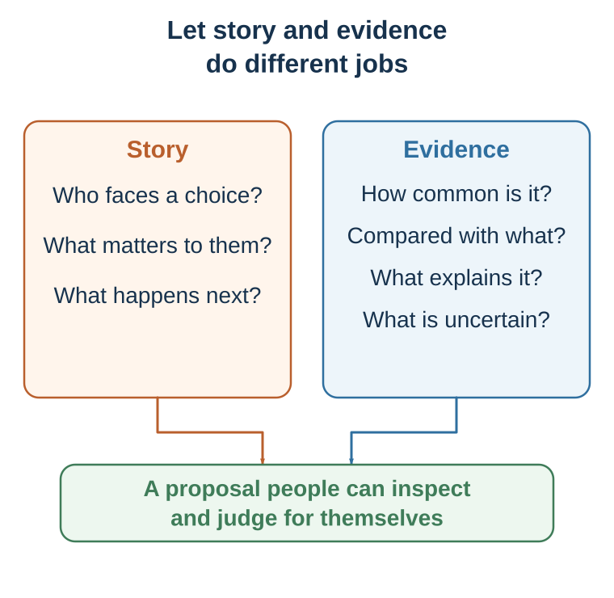

---
aliases:
  - 27-building-an-evidence-aligned-story.html
---

# Building an Evidence-Aligned Message

*Use narrative to carry evidence, not to replace it*

::: {.callout-note .core-idea icon=false}
## Core Idea

Stories can make change imaginable, and evidence can make a claim accountable. But a message fails when it starts from what the speaker wants to say, bypasses the audience's current model, hides the consequential mismatch, or lets narrative outrun what the evidence supports. Therefore this chapter turns persuasion into a design task: begin where the audience is, reveal the mismatch, offer a better account with proportionate evidence, and end with a specific, rejectable choice.
:::

## Learning goals

- Build a message with STORY and compress it with AND–BUT–THEREFORE.
- Match the strength of each claim to appropriate evidence, comparison, and uncertainty.
- Produce and audit a message that remains accurate, dignified, and genuinely rejectable.

::: {.callout-note .loop-location icon=false}
## Where this chapter enters the loop

Message design links **influence to action**. It starts from the audience's current interpretation, introduces evidence that may change prediction or valuation, and makes the next choice explicit. The message should improve model updating—not make a preferred conclusion feel inevitable.
:::

Many weak arguments fail because they begin with what the speaker wants to say rather than with what the audience currently believes. A conventional argument asks: What information do I want to deliver? A narrative persuasion approach asks: What belief does the audience currently hold, why does that belief make sense to them, what resistance prevents change, and what story would allow them to experience the limits of that belief?

The audience already has a story. They have beliefs about what is normal, fair, risky, trustworthy, costly, and possible. They have identities they are protecting and losses they fear. A story that ignores the audience's current worldview may be rejected before it is understood. Good persuasion begins inside the audience's model, then shows where that model stops working.

## Design the change

### Begin with the audience's current story

Begin by identifying what the audience currently believes. This belief may be explicit or implicit. Examples include: "Good decisions come from careful reasoning." "If people know the facts, they will change." "Innovation begins with a great idea." "Bias is something that happens to other people." "Customers choose the product with the best objective value." "Data-driven decision-making means surveillance." "Negotiation is about defending positions."

A persuasive story begins where the audience is, not where the speaker wishes they were. This is empathy, not manipulation. To change someone's mind, begin inside the story they already use to make sense of the world.

### Hidden resistance and protected identity

Next, identify why the audience may resist the new idea. Resistance may come from identity, habit, incentives, social pressure, fear, pride, confusion, mistrust, prior experience, or a legitimate constraint. Managers may resist behavioral science because it seems to imply that people are irrational. Students may resist statistics because they fear mathematics. Employees may resist data-driven decision-making because it feels like loss of professional judgment. Consumers may resist sustainability messages because they feel accused or powerless.

A good story does not ignore resistance. It dramatizes it. It lets the audience see why the old belief was attractive, useful, or protective - and why it is incomplete.

### Protagonist, goal, and stakes

A persuasive story needs a protagonist. The protagonist can be a patient, customer, employee, scientist, student, manager, parent, entrepreneur, citizen, negotiator, team, organization, community, or even a field of research. But the audience needs someone through whom to experience the situation.

The protagonist must want something. Without a goal, there is no story movement. The goal can be external - get treatment, launch a product, pass an exam, save money, negotiate agreement, reduce emissions, protect a team, survive a crisis. It can also be internal - preserve dignity, be seen as competent, belong, avoid shame, regain control, become honest, or act courageously.

Stakes answer why the goal matters. What happens if the protagonist fails? What is lost? Who is affected? Why now? Weak version: "A company needed to improve innovation." Stronger version: "A family-owned company had survived for thirty years by relying on craftsmanship and flexibility. But as older experts approached retirement, the knowledge that made the company special was at risk of disappearing." The stronger version gives the audience something to care about.

### Conflict, obstacle, and misbelief

Conflict is the engine of persuasion. It does not require melodrama. Conflict is the gap between desire and obstacle. The obstacle may be external, internal, interpersonal, institutional, or moral. External obstacles include money, time, tools, information, access, or opportunity. Internal obstacles include fear, shame, habit, craving, misbelief, identity threat, and overconfidence. Interpersonal obstacles include mistrust, competing interests, status threats, and social norms. Institutional obstacles include incentives, bureaucracy, metrics, silos, and culture. Moral obstacles include competing values and trade-offs.

The deepest persuasive stories do not merely show the protagonist receiving information. They show the protagonist's old belief becoming less workable and a new belief becoming more adaptive. A manager's misbelief may be, "If I ask for input, I will look weak." A student's misbelief may be, "If I do not understand immediately, I am not smart." A negotiator's misbelief may be, "If I reveal interests, I will be exploited." A patient's misbelief may be, "If I avoid the test, I avoid the disease." An organization's misbelief may be, "Our culture is already transparent because leaders are approachable."

Persuasion occurs when reality pressures that misbelief.

### Turning point, evidence, and change

A turning point is not merely an event. It is an event that forces reinterpretation. The dashboard that everyone ignored reveals that the problem was trust, not technology. The structured interview reveals that intuition was responding to confidence, not evidence. The data pattern reveals that a team has a decision problem, not a data problem. The negotiation question reveals that the deadline is about reassurance, not stubbornness.

A persuasive story then needs evidence. Evidence shows that the story is not just an anecdote. It can take the form of data, research, comparison cases, mechanism, repeated interviews, prototype tests, behavior patterns, or credible expert knowledge. Evidence is not the enemy of story. It is what keeps story from becoming manipulation.

Finally, something must change. The protagonist acts differently, sees differently, or chooses differently. The audience should not merely feel something; they should see differently. The new model may be a concept, framework, theory, principle, behavior, or decision rule.

## Build the message

{#fig-story-evidence-braid fig-alt="An author's ethical communication framework shows story and evidence as two strands that can be combined to support informed judgment. It is not a validated causal model."}

Story is useful here not as performance theater but as a practical tool for ethical model updating. STORY is the primary design framework. AND–BUT–THEREFORE is its compressed causal spine.

## The STORY framework

In entrepreneurship and applied persuasion, a longer structure is often needed. The STORY framework can be used in two closely related versions. In a business pitch, S often stands for stakeholder. In broader persuasive communication, S can stand for shared reality. The logic is the same: start from the audience's decision, not from your information.

A one-sentence STORY pitch can be written as: For [specific stakeholder] trying to [goal], [trouble] causes [cost, risk, or frustration], but [change or insight] creates a new opportunity; therefore [solution or idea] creates [value], supported by [evidence], and asks for [specific next step].

| Letter | Function | Test |
| --- | --- | --- |
| S · Shared reality | Start with an accepted goal, behavior, change, or constraint. | Is the opening recognizable without jargon or a claim the audience already rejects? |
| T · Trouble | Reveal the contradiction that makes the old model fail. | Are the pain, change, and stakes real and proportionate? |
| O · Opportunity | Explain the better model or mechanism of progress. | Does it resolve this trouble, rather than merely advertise a feature? |
| R · Reasons | Supply behavior, trials, comparison, mechanism, transparent numbers, uncertainty, and relevant source or team fit. | Is the proof concrete and difficult to fake, and does it match the claim? |
| Y · Yes | Ask for a specific decision or next step. | Who does what, by when, at what cost—and can the audience genuinely decline? |
: STORY as an operational model-update sequence {#tbl-27-story}

STORY extends ABT rather than replacing it. Shared reality corresponds to AND; Trouble supplies the governing BUT; Opportunity begins THEREFORE; Reasons make the proposed update safer; Yes turns agreement into a decision. It is an instructor framework for drafting, not a validated psychological law.

For a short message, write: **AND**—the relevant shared reality; **BUT**—the one consequential failure the current model cannot explain; **THEREFORE**—the proposed account and next action. A weak BUT merely changes topic. A strong BUT makes the proposed response necessary to consider. ABT gives direction; STORY forces the writer to add reasons and a real decision.

For an illustrative restaurant-forecasting pitch, the moves could be: **S**—independent restaurants already use point-of-sale and ordering tools; **T**—owners still have to guess daily preparation, so overestimates waste food and underestimates lose sales; **O**—a forecasting assistant turns existing sales history into preparation recommendations; **R**—report only verified pilot behavior, comparisons, uncertainty, and limits; **Y**—invite a defined number of eligible restaurants to a time-bounded pilot with stated success criteria. The sequence is reusable; any traction number must be real, sourced, and appropriate to the claim.

This structure prevents two common failures. First, it prevents product-first or speaker-first communication. The audience does not begin by caring what you built, what you know, or how impressive you are. It begins by caring about its own decision, risk, values, and cost of action. Second, STORY prevents evidence from becoming a data dump. A number should change what the audience believes about the story. If a statistic does not change the story, it is probably decoration.

## The evidence ladder

Story opens attention; proof earns trust. A practical evidence ladder helps move the weakest important claim one level higher. In a business pitch, "customers want this" is an assertion. One named customer story is better, but still weak. A repeated pattern across interviews is stronger. A prototype or demo shows that the mechanism works in practice. Traction shows that users pay, return, refer, or expand. Economics shows that the model can create and capture value.

The story tells us which claim matters. The evidence ladder tells us how risky that claim still is.

## Fluency: power and danger

Cognitive ease matters because messages are processed under limited attention. Legible structure, repeated core phrases, familiar words, and concrete language can reduce confusion and suspicion. This is not "dumbing down." It is respecting the audience's limited attention.

But ease is dangerous when it helps falsehood travel. Repetition can make claims feel familiar. Familiarity can feel like truth. Rhymes, simple slogans, vivid images, and fluent stories can make weak evidence feel stronger than it is. Ethical persuasion makes true things easier to understand, not false things easier to believe.

Fluent names, short words, legible visuals, clean structure, and repeated core ideas can ease processing, but ease can be misread as truth, quality, or trust (Hasher et al., 1977; Reber et al., 2004; Fazio et al., 2015). Even in financial settings, easier-to-pronounce company names and ticker codes were associated with very short-run IPO performance in one laboratory-and-field program, an effect that diminished beyond the first day in the ticker analysis (Alter & Oppenheimer, 2006). That is evidence that labels can influence early processing—not an investment rule or proof of lasting value. An unresolved, decision-relevant information gap can also create curiosity (Loewenstein, 1994); the ethical obligation is to resolve the gap rather than use suspense to conceal a weak claim. Memorability is not validity.

## The story-evidence braid

Some people distrust storytelling because stories can mislead. This concern is justified. A vivid anecdote can overpower base rates. A single emotional case can distort policy judgment. A manipulative story can hide weak evidence. A memorable narrative can make false claims feel true.

Narrative evidence is most defensible when a case is connected to representative data rather than allowed to substitute for base rates (Small et al., 2007; Slovic, 2007; Dahlstrom, 2014).

But the solution is not to abandon story. The solution is to integrate story and evidence responsibly.

Evidence without story can be ignored. Story without evidence can mislead. Story with evidence can make truth usable.

A useful structure is: story, evidence, mechanism, implication, return to story. Begin with a concrete situation that creates curiosity. Use evidence to show that the situation represents a broader pattern. Explain the mechanism that connects the story to the evidence. Translate the insight into action. Return to the story so the audience can see what the evidence means in lived experience.

For example, a public health message might begin with a patient who misses a screening appointment because the reminder letter is confusing and frightening. Evidence shows that missed appointments are common, especially among patients facing administrative burdens. Mechanism explains how complexity, fear, and friction reduce follow-through. Solution proposes simplified reminders, easy rescheduling, and planning prompts. The story resolves when the redesigned system helps the patient attend. The story does not replace the evidence. It makes the evidence psychologically available.

Use data to show scale; use story to show meaning. Data answers: How common is this? How large is the effect? How reliable is the pattern? Story answers: What does this mean in lived experience? Why should we care? How does the mechanism unfold? What action becomes possible?

## Adapt the message without changing its discipline

STORY travels across teaching, leadership, health, policy, entrepreneurship, and negotiation because all involve a person or group deciding whether to revise a model. The surface changes; the discipline does not. Start from the stakeholder's consequential decision, make the trouble specific, state the proposed mechanism, match reasons to claims, and end with an action that can be refused.

In teaching, a case should create the need for a concept and then yield to analysis. In leadership, a change story should acknowledge loss and protect valued identity rather than invent a “burning platform.” In health and policy, a patient or citizen story should be paired with prevalence, effects, alternatives, and uncertainty. In entrepreneurship, the stakeholder—not the product or founder—is usually the protagonist. In negotiation, a short story can explain why an interest matters without pretending that one side's account is the whole situation.

The message fails when adaptation becomes a new catalogue of tricks. Keep the same questions: What model is being updated? What evidence warrants that update? What action follows? What could the audience still reasonably reject?

## Ethics and common failure modes

### Ethical storytelling

Stories can enlighten, but they can also manipulate. A vivid story can make rare events seem common. A heroic story can justify reckless action. A victim story can erase broader statistics. A national story can dehumanize outsiders. A brand story can manufacture identity anxiety. A political story can turn complexity into scapegoating. A personal story can be used to silence structural analysis. A success story can create survivorship bias.

Narrative persuasion is dangerous when it helps people see one thing by making everything else disappear. Because stories work through emotion, identification, and simulated experience, they can narrow critical scrutiny. Ethical storytelling is therefore not a decorative final topic. It is part of responsible message design.

### Common mistakes

## Worked transformations

### Worked example: structured hiring

Persuasive goal: convince managers to use structured hiring interviews.

Information-only version: "Structured interviews have higher validity than unstructured interviews. They reduce bias and noise by asking comparable questions and using predefined criteria."

Story version: Maria had hired dozens of people and believed she was good at reading candidates. In one interview, a candidate from a familiar university spoke confidently about teamwork and leadership. Maria felt an immediate connection. Another candidate was quieter, less polished, and from an institution Maria did not know well. The team hired the first candidate. Six months later, performance problems appeared: missed deadlines, poor collaboration, and resistance to feedback. During a later review, Maria reread the interview notes and realized there were almost none. She had recorded impressions, not evidence. When the company introduced structured interviews, she resisted at first. They felt mechanical. But after using the same job-relevant questions and scoring evidence separately, she noticed something uncomfortable: her "intuition" had often been confidence responding to confidence. The structure did not replace her judgment. It gave her judgment something better to work with.

This story begins inside the manager's existing belief: "I can read people." It introduces conflict: intuitive confidence produces error. It creates a turning point: rereading the notes reveals the absence of evidence. It offers a new model: structure improves judgment rather than replacing it. It then prepares the audience to accept the research.

### Worked example: negotiation deadline

Persuasive goal: explain why a delivery deadline matters without making it sound like an arbitrary demand.

Information-only version: "We need delivery by June 1."

Story version: Last year, a component arrived four days late. The delay looked small on paper. But the production line had been scheduled tightly, customers had already booked installation dates, and workers were assigned to shifts that depended on the component arriving. By June 5, the line was stopped, customer orders were rescheduled, and the team had to explain a preventable delay. This year, the June 1 date is not a preference; it is the point that keeps the rest of the system from failing. We are willing to discuss price, batch size, or earlier partial delivery, but we need a plan that protects that date.

This story explains an interest without revealing a reservation value. It humanizes the constraint and opens problem-solving rather than simply asserting a position.

## Edit for clarity without confusing fluency with truth

Once the message is evidence-aligned, make it easier to process: use concrete verbs, legible comparisons, one governing tension, and a visible denominator. Familiar language can provide an entry point and one meaningful surprise can create attention. These are editing choices, not reasons to believe the claim.

Numbers, images, and metaphors should make magnitude or mechanism inspectable. Ask what each representation reveals, what it hides, and whether the audience could reconstruct the underlying quantity. A memorable metaphor may help organize a claim, but its average persuasive advantage is small and context-dependent (Sopory & Dillard, 2002).

A message worth sharing is not necessarily worth believing. People may pass content on because it expresses identity, creates connection, signals competence, helps someone, or supports collective action (Berger & Milkman, 2012; Falk et al., 2013; Baek et al., 2017). Optimize first for accuracy and inspectability, then for transmission.

::: {.callout-caution .evidence-and-boundary-conditions icon=false}
## Evidence Boundary

STORY and ABT are practical writing tools, not validated psychological laws. A memorable structure cannot rescue false evidence, a hidden conflict of interest, an unrepresentative case, or a recommendation that removes meaningful choice. Fluency, emotional response, agreement, and sharing are message outcomes—not proof that the model is correct.
:::

| Form | What it does | Example | Limitation |
| --- | --- | --- | --- |
| Information | States facts, events, features, dates, or numbers. | "Employee engagement increased by 12%." | May not show why the change was difficult or meaningful. |
| Example | Clarifies a concept by illustrating it. | "Netflix is an example of business-model innovation." | May not create tension, cause, stakes, or transformation. |
| Anecdote | Provides a vivid individual case. | "One customer waited three hours and gave up." | Can be unrepresentative and can overpower base rates. |
| Case | Describes a real or hypothetical situation for analysis. | A company adopts a feedback system and engagement rises. | May remain descriptive unless it shows inner conflict and meaning change. |
| Story | Shows motivated action under constraint and change through cause and consequence. | Sara resists anonymous feedback, sees that her competence has become a bottleneck, changes her meeting ritual, and creates a habit of honesty. | Can mislead if causality, evidence, or representativeness is distorted. |
: Information, example, anecdote, case, and story {#tbl-27-1}

| Principle | Guiding question | Warning sign |
| --- | --- | --- |
| Truthfulness | Is the story factual, composite, or fictional, and is that clear? | Invented realism or altered key facts. |
| Representativeness | Does the case reflect a broader pattern supported by evidence? | Anecdote pretending to be a base rate. |
| Dignity | Are people more than props, victims, villains, or stereotypes? | Humans reduced to symbols or emotional instruments. |
| Complexity | Is causality simplified without becoming false? | One villain explains everything. |
| Transparency | Does the audience know what kind of story this is? | Composite or illustrative stories presented as single real cases. |
| Evidence alignment | Does the story illuminate evidence rather than replace it? | The story is used to hide weak or missing evidence. |
| Agency | Does the story expand action possibilities? | Fear, shame, or identity threat without a path forward. |
| Plurality | Are important missing perspectives acknowledged? | The story prevents the audience from seeing anything else. |
| Proportion | Does emotional force match the real significance of the issue? | Rare cases presented as common without scale. |
| Actionability | Does the story point toward a meaningful response? | Distress without a credible path. |
: An ethical story audit {#tbl-27-2}

## Practice Lab

Build a 90-second evidence-aligned message for one research claim, policy, product, leadership request, or negotiation proposal. Submit four observable outputs: (1) a STORY table naming shared reality, trouble, opportunity, reasons, and yes; (2) a one-sentence ABT version; (3) a claim-to-evidence map that identifies the base rate, comparison, mechanism, uncertainty, and strongest alternative account; and (4) a completed ethical audit. Peer feedback must identify one unsupported inferential jump and propose one concrete revision.

## Take it forward

- **Use this when:** a defensible claim needs a clear route from the audience's current model to an informed next decision.
- **Do not infer:** narrative force, clarity, emotional intensity, or circulation makes a claim representative or true.
- **Try this next:** draft with STORY, compress with ABT, then strengthen the weakest important claim by one rung on the evidence ladder.

## References cited in this chapter

::: {.reference}
Baek, E. C., Scholz, C., O’Donnell, M. B., & Falk, E. B. (2017). The value of sharing information: A neural account of information transmission. Psychological Science, 28(7), 851–861.
:::

::: {.reference}
Alter, A. L., & Oppenheimer, D. M. (2006). Predicting short-term stock fluctuations by using processing fluency. Proceedings of the National Academy of Sciences, 103(24), 9369–9372.
:::

::: {.reference}
Berger, J., & Milkman, K. L. (2012). What makes online content viral? Journal of Marketing Research, 49(2), 192–205.
:::

::: {.reference}
Berger, J., & Heath, C. (2007). Where consumers diverge from others: Identity signaling and product domains. Journal of Consumer Research, 34(2), 121–134.
:::

::: {.reference}
Fazio, L. K., Brashier, N. M., Payne, B. K., & Marsh, E. J. (2015). Knowledge does not protect against illusory truth. Journal of Experimental Psychology: General, 144(5), 993–1002.
:::

::: {.reference}
Dahlstrom, M. F. (2014). Using narratives and storytelling to communicate science with nonexpert audiences. Proceedings of the National Academy of Sciences, 111(Suppl. 4), 13614-13620.
:::

::: {.reference}
Falk, E. B., Morelli, S. A., Welborn, B. L., Dambacher, K., & Lieberman, M. D. (2013). Creating buzz: The neural correlates of effective message propagation. Psychological Science, 24(7), 1234–1242.
:::

::: {.reference}
Hasher, L., Goldstein, D., & Toppino, T. (1977). Frequency and the conference of referential validity. Journal of Verbal Learning and Verbal Behavior, 16(1), 107–112.
:::

::: {.reference}
Loewenstein, G. (1994). The psychology of curiosity: A review and reinterpretation. Psychological Bulletin, 116(1), 75–98.
:::

::: {.reference}
Reber, R., Schwarz, N., & Winkielman, P. (2004). Processing fluency and aesthetic pleasure: Is beauty in the perceiver's processing experience? Personality and Social Psychology Review, 8(4), 364–382.
:::

::: {.reference}
Slovic, P. (2007). If I look at the mass I will never act: Psychic numbing and genocide. Judgment and Decision Making, 2(2), 79-95.
:::

::: {.reference}
Small, D. A., Loewenstein, G., & Slovic, P. (2007). Sympathy and callousness: The impact of deliberative thought on donations to identifiable and statistical victims. Organizational Behavior and Human Decision Processes, 102(2), 143-153.
:::

::: {.reference}
Sopory, P., & Dillard, J. P. (2002). The persuasive effects of metaphor: A meta-analysis. Human Communication Research, 28(3), 382–419.
:::
