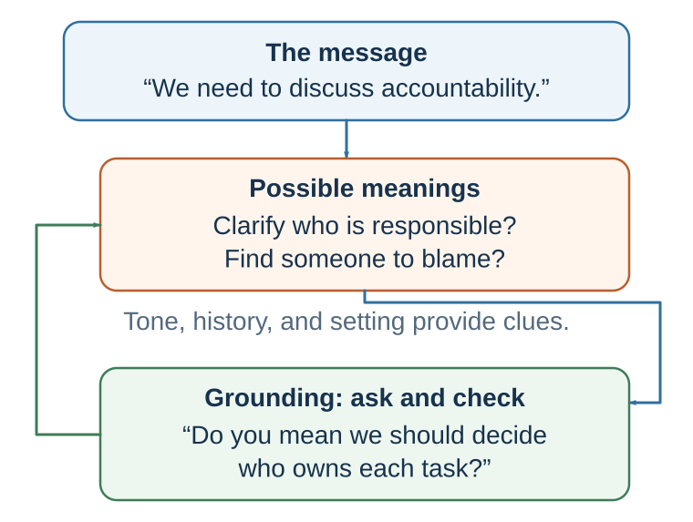

---
aliases:
  - 28-communication-is-joint-inference.html
---

# Communication

*Language Is Not a File Transfer*

::: {#chapter-33-start .chapter-epigraph}
> “Words, in their primary or immediate signification, stand for nothing but the ideas in the mind of him that uses them.”
>
> — John Locke, [*An Essay Concerning Human Understanding*](https://www.gutenberg.org/cache/epub/10616/pg10616.html), 1690, Book III, ch. II, §2
:::

[]{#begin-with-a-failed-email}After a project deadline slips, a manager writes: “We need to discuss accountability. Please come prepared tomorrow.” The manager intends urgency and clearer ownership. One employee reads blame. Another expects layoffs. A third assumes the sentence targets someone else. The next meeting begins defensively before anyone has spoken.

The words were transmitted perfectly. Meaning was not. Each reader combined the sentence with a different history, power relationship, expectation, and fear. Communication therefore cannot be understood as placing a complete meaning into a message and sending it intact. It is joint inference under incomplete information.

::: {.callout-note .core-idea icon=false}
## Core Idea

Words give another person evidence about what we mean. Their interpretation also depends on context and experience, so a clear intention can still produce a misunderstanding. Communication improves when people can test their interpretations, correct them, and agree on what to do next.
:::

## Learning goals

- Map how the same utterance can produce different interpretations.
- Use grounding and perspective-getting to test a social inference.
- Redesign a high-stakes message so its intent, context, action, and repair path are recoverable.

[]{#shared-reality-in-communication}

Here, **shared reality** means a perceived commonality with another person's inner state about a referent: for example, feeling that both of you understand the same problem in a similar way or attach similar significance to an event (Echterhoff et al., 2009). It does not require identical backgrounds, complete agreement, or one merged perspective. Nor does it establish truth. Two people can share an interpretation that the evidence does not support; grounding makes the interpretation mutually testable, while external evidence must still test the world it describes.

## Meaning is inferred, tested, and repaired

{#fig-communication-iceberg fig-alt="The accountability message may mean clarifying responsibility or assigning blame. Tone, history, and setting offer clues; a concrete question and correction can revise the interpretation. The goal is enough shared understanding for the next action." .phone-fit}

Language turns an intention into a public signal, but meaning is not simply a submerged object with a fixed size that the listener retrieves. The listener infers a working interpretation from words, tone, relationship, history, power, culture, local context, and beliefs about what both parties know. The speaker can then respond to that interpretation, so meaning is partly **jointly constructed** through grounding and repair. The same “Fine. Let’s discuss this tomorrow” could signal genuine agreement, irritation, overload, caution, a wish to de-escalate, or a threat. Interpretation feels immediate even when the evidence permits several stories.

The design goal is therefore **recoverability**, not perfect transmission. A recoverable message supplies enough context, makes intent and relational stance visible, names the next action, and invites correction: “I am too tired to give this a fair hearing tonight. I am not dismissing the concern. Could we discuss it at 09:00 tomorrow? If I have misunderstood what is urgent, tell me now.” The message cannot eliminate ambiguity, but it gives the other person a path to repair it.

## Communication is coordination and repair

{#fig-communication-grounding fig-alt="Two people exchange words and signals, then use grounding and repair in a feedback loop." .phone-fit}

If the email had been corrupted or lost, restoring the signal would solve a transmission problem. Here every word arrived, yet the employees prepared for different conversations. Sending the same words again gives them no new basis for checking those interpretations. The manager needs a way to discover and repair the interpretations before acting on them.

The transmission model associated with Shannon and Weaver’s mathematical theory of communication (Shannon & Weaver, 1949) explains how a sender transmits a signal through a channel to a receiver and how noise can interfere. Human coordination adds a further task: checking what the receiver understood the signal to mean.

Herbert Clark’s work emphasizes common ground: the shared knowledge, assumptions, and context that speakers use to understand one another (Clark, 1996). Communication requires people to coordinate on what they both know, what they assume, and what has already been established. Clark and Brennan (1991) describe grounding as the process of establishing that people have understood each other well enough for the current purpose.

Grounding is why conversation includes signals such as “yes,” “I see,” “wait,” “what do you mean?,” “so you are saying…,” nods, pauses, repetition, examples, and repair. These are not meaningless fillers. They are coordination devices. They help participants check whether meaning is shared.

Grice’s cooperative principle also helps explain communication. Grice (1975) argued that conversation is guided by expectations that speakers provide information that is relevant, truthful, sufficiently informative, and clear. Much meaning comes from these expectations. If someone says, “Some of the students passed,” listeners may infer that not all passed, even though the sentence does not logically say that. If someone asks, “Can you pass the salt?” the literal answer may be “yes,” but the intended meaning is a request.

Human communication depends heavily on implication. People often say less than they mean because they expect listeners to infer. This makes communication efficient, but also fragile. Misunderstanding happens when people do not share the same assumptions.

This is especially clear in email and text communication. Kruger and colleagues (2005) found that people overestimate how well they can communicate tone over email. In Study 2, participants sent statements intended to be either sarcastic or serious. For email, senders expected about 78% correct interpretation and receivers judged themselves about 89% accurate, while actual accuracy was about 56%—not statistically distinguishable from the 50% chance benchmark. Voice raised accuracy to about 73%, although errors remained. These are results for a constrained tone-decoding task, rather than a general error rate for everyday email. The striking result is the gap: both sides can feel confident while reconstructing different tones. The sender thinks, “How could they not understand?” The receiver thinks, “How could they write such a thing?”

{#fig-communication-calibration-evidence fig-alt="Two-panel figure. A grouped bar chart shows approximate sender forecasts, receiver judgments of their accuracy, and actual tone-decoding accuracy for email and voice in Kruger and colleagues' Study 2. A flow diagram contrasts imagining another person's perspective, which risks projection, with asking, listening, and verifying, which creates a correctable model." width=95%}

The left panel shows calibration in a sarcasm task. The right panel shows a practical response: use richer evidence when stakes rise, and let the other person correct the model you have formed (Eyal et al., 2018).

| If a message is easy to misread, add... | Example |
| --- | --- |
| Context | “I am writing after today’s deadline changed.” |
| Intent | “My aim is to clarify ownership, not assign blame.” |
| Relational stance | “I value the work and want us to solve this together.” |
| Next action | “Please mark the two dates you can meet.” |
| Repair invitation | “If this lands differently from how I intend, call me.” |
: Designing a message for recoverability {#tbl-28-recoverability}

The manager's email can now be rewritten: “Yesterday's delay exposed two handoffs without clear owners. My aim is to repair the workflow, not assign blame. Before tomorrow's meeting, please mark where you believed ownership changed and one constraint I may not see. We will compare the maps, agree on the next handoff, and record unresolved concerns. If you read this as a performance warning, please tell me; that is not the purpose of this meeting.” The revision makes the intended model, evidence request, next action, and correction path visible.

At the meeting, “Which handoff did you think you owned?” will reveal more than “Everyone understands now?” A concrete example lets each person check whether the same words imply the same action.

| Failure | Hidden source | Repair move |
| --- | --- | --- |
| Same word, different meaning | Different assumptions or professional models. | Ask for an example and define the term in use. |
| Tone is misread | Text removes vocal and contextual cues. | State intent explicitly and check interpretation. |
| Mind-reading hardens | An inference is treated as fact. | Name it as a hypothesis and ask the person. |
| Agreement is assumed | Silence is interpreted as consent; [local conventions](29-culture-and-identity-the-same-action-is-not-the-same-act.qmd#chapter-29-start) are overlooked. | Invite a summary, private response, or explicit concern. |
| Perspective-taking projects the self | We imagine what we would feel. | Use perspective-getting: ask, listen, and verify. |
: Grounding failures and repair moves {#tbl-28-1}

## Mind-reading is a hypothesis

A curt reply seems to tell us how a colleague feels: “She is angry with me.” Responding to that anger may seem sensible, yet the reply could reflect an urgent task we cannot see. Defending ourselves before checking can introduce a dispute where there was only a hurried message. Inferring another person’s beliefs or intentions is often called **mentalizing** or **theory of mind**. We need it to cooperate and coordinate; the task is to keep the interpretation open to correction before acting on it.

One mismatch concerns the level of detail. We can judge ourselves through the fine-grained circumstances of an action while other people form a broader impression. Eyal and Epley (2010) found that matching these levels of construal could improve judgments of how one was seen. The practical question is what evidence the other person had: the manager remembers the pressures behind the email, while the employee sees a brief, ominous instruction.

### When your own view becomes the default

One major error is egocentric projection: anchoring on one’s own perspective and insufficiently adjusting to another person’s perspective (Epley et al., 2004). We assume that our model of the world is closer to theirs than it really is. “I would not be offended by this feedback, so she should not be offended.” “I understood the email, so they should understand it.” “I enjoy this kind of small talk, so they must too.” “I would want direct advice, so they must want it.”

The communication task is to notice when your own reaction is doing more work than evidence about the other person. Ask what they understood before defending what you intended.

A related error is the false consensus effect: people overestimate how common their own beliefs, preferences, choices, and behaviors are (Ross et al., 1977). If I think an action is ethical, I may assume most reasonable people agree. If I dislike a policy, I may assume most people secretly dislike it too. If I would accept a risk, I may assume others would. False consensus is a population-level version of egocentric projection.

Keep the levels distinct. Egocentric projection is the inferential process by which my own state anchors a judgment about your state; false consensus is one possible population judgment about how widely a view is shared. Both imply a useful diagnostic: my judgment of another person contains information about them, but also about the values, expectations, experiences, and concerns through which I interpreted them.

People can also misjudge how self-serving others’ accounts will be. Kruger and Gilovich (1999) studied such “naïve cynicism” in responsibility judgments. Expecting a colleague to claim all the credit can make their explanation sound strategic before we have examined it.

### When intention feels visible

Another error is the illusion of transparency: people overestimate how visible their internal states are to others (Gilovich et al., 1998). We think our anxiety, gratitude, embarrassment, confusion, or affection is obvious. A manager may therefore leave appreciation unspoken, believing the team already knows, while an employee waits for an acknowledgment that never comes. [Connection and Repair](34-connection-and-repair-warm-honesty-makes-truth-usable.qmd#chapter-34-start) develops the relational consequences of making that meaning explicit.

The counterpart is the illusion of understanding: overestimating how much of the context in our own mind survived in the message. Likewise, faces, bodies, and brief behavioral samples can contain information without becoming reliable dictionaries of a person's exact emotion, motive, or truthfulness (Ambady & Rosenthal, 1993; Barrett et al., 2019; DePaulo et al., 2003). Verbal information and direct questions are often more diagnostic than confident interpretation of isolated expressions (Gesn & Ickes, 1999; Hall & Schmid Mast, 2007). If something is important, do not rely on hints, microexpressions, or silence. State it, ask, and verify.

In the deadline case, the employee’s defensiveness may reflect guilt, but it may also reflect an innocent misunderstanding or a history of blame. Treat the inference as a hypothesis that the next exchange can revise.

## Ask rather than merely imagine

The manager wants to respond fairly and tries to imagine why a colleague missed the deadline. But imagining the colleague’s position while assuming they knew the new date preserves the very mistake that needs correcting. Before judging responsibility, the manager needs information only the colleague can supply. **Perspective-taking** means imagining how a situation looks to another person. **Perspective-getting** means asking them and listening to the answer. Imagination can generate the question; listening can revise its premise.

Across 25 experiments, Eyal, Steffel, and Epley (2018) found no overall accuracy improvement from instructions to take another person’s perspective. In their final experiment, direct conversation improved accuracy where imagining the other person’s perspective did not. Asking supplies information that imagination alone cannot, although its usefulness still depends on what the person knows and is willing to disclose.

For the manager, a useful question is: “When did you learn that the deadline had changed?” That may uncover a missing message rather than reluctance to accept responsibility. Follow with a paraphrase the colleague can correct: “So you were still working toward Friday because the new date was only discussed with the client team?”

Use **ask–listen–reflect–verify** as a practical routine: ask a specific question, listen without completing the answer, reflect what you understood, and invite correction or check the consequential fact. The name is this book’s shorthand for applying grounding and perspective-getting, not a separately validated four-step intervention.

Direct answers can also be incomplete, especially when honesty carries a cost. Perspective-getting works best when the question is specific and the response can be given without avoidable pressure; consequential factual claims may still need independent checking.

## Close the loop: utterance to shared-enough meaning

The manager's first email treated understanding as private: the sender knew the intended meaning and assumed everyone else would recover it. The revised email treats understanding as a sequence:

**Utterance → interpretation → test → correction → shared-enough meaning.**

At the meeting, each person first maps where they believed ownership changed. The manager asks for examples rather than motives. Participants reflect what they heard before defending a view. Differences become visible: one handoff was never defined, one deadline changed without reaching operations, and one employee interpreted an ambiguous sentence through a previous experience of blame. The group does not need identical feelings or a single story. It needs enough grounded meaning to assign the next action and enough openness to revise the map when new evidence appears.

This is the boundary between communication and [persuasion](30-persuasion-changing-minds-means-updating-models.qmd#chapter-30-start). Persuasion seeks a warranted change in another person's model. Communication makes the models mutually testable. Either can support the other, but a communicator has not established shared meaning merely because the other person complied.

## Practice Lab

Choose a recent high-stakes email, message, or instruction. Produce a one-page grounding map with: literal words; intended meaning; at least two plausible interpretations; missing context; power or relationship cues; a perspective-getting question; a reflective summary; a correction invitation; and the shared action required. Rewrite the message so another reader can identify its context, intent, relational stance, next action, and repair path without guessing.

## Take it forward

Choose one interpretation you have been treating as settled in a conversation. Turn it into a question, listen to the answer, and offer a summary the other person can correct. The useful outcome is an understanding both people can work with, even when they still disagree.

## References cited in this chapter

::: {.reference}
Ambady, N., & Rosenthal, R. (1993). Half a minute: Predicting teacher evaluations from thin slices of nonverbal behavior and physical attractiveness. Journal of Personality and Social Psychology, 64(3), 431–441.
:::

::: {.reference}
Barrett, L. F., Adolphs, R., Marsella, S., Martinez, A. M., & Pollak, S. D. (2019). Emotional expressions reconsidered: Challenges to inferring emotion from human facial movements. Psychological Science in the Public Interest, 20(1), 1–68.
:::

::: {.reference}
Clark, H. H. (1996). Using language. Cambridge University Press.
:::

::: {.reference}
Clark, H. H., & Brennan, S. E. (1991). Grounding in communication. In L. B. Resnick, J. M. Levine, & S. D. Teasley (Eds.), Perspectives on socially shared cognition (pp. 127–149). American Psychological Association.
:::

::: {.reference}
DePaulo, B. M., Lindsay, J. J., Malone, B. E., Muhlenbruck, L., Charlton, K., & Cooper, H. (2003). Cues to deception. Psychological Bulletin, 129(1), 74–118.
:::

::: {.reference}
Echterhoff, G., Higgins, E. T., & Levine, J. M. (2009). Shared reality: Experiencing commonality with others’ inner states about the world. Perspectives on Psychological Science, 4(5), 496–521.
:::

::: {.reference}
Epley, N., Keysar, B., Van Boven, L., & Gilovich, T. (2004). Perspective taking as egocentric anchoring and adjustment. Journal of Personality and Social Psychology, 87(3), 327–339.
:::

::: {.reference}
Eyal, T., & Epley, N. (2010). How to seem telepathic: Enabling mind reading by matching construal. Psychological Science, 21(5), 700–705.
:::

::: {.reference}
Eyal, T., Steffel, M., & Epley, N. (2018). Perspective mistaking: Accurately understanding the mind of another requires getting perspective, not taking perspective. Journal of Personality and Social Psychology, 114(4), 547–571. https://doi.org/10.1037/pspa0000115
:::

::: {.reference}
Gesn, P. R., & Ickes, W. (1999). The development of meaning contexts for empathic accuracy: Channel and sequence effects. Journal of Personality and Social Psychology, 77(4), 746–761.
:::

::: {.reference}
Gilovich, T., Savitsky, K., & Medvec, V. H. (1998). The illusion of transparency: Biased assessments of others’ ability to read one’s emotional states. Journal of Personality and Social Psychology, 75(2), 332–346.
:::

::: {.reference}
Grice, H. P. (1975). Logic and conversation. In P. Cole & J. L. Morgan (Eds.), Syntax and semantics: Speech acts (Vol. 3, pp. 41–58). Academic Press.
:::

::: {.reference}
Hall, J. A., & Schmid Mast, M. (2007). Sources of accuracy in the empathic accuracy paradigm. Emotion, 7(2), 438–446.
:::

::: {.reference}
Kruger, J., Epley, N., Parker, J., & Ng, Z.-W. (2005). Egocentrism over e-mail: Can we communicate as well as we think? Journal of Personality and Social Psychology, 89(6), 925–936.
:::

::: {.reference}
Kruger, J., & Gilovich, T. (1999). “Naïve cynicism” in everyday theories of responsibility assessment: On biased assumptions of bias. Journal of Personality and Social Psychology, 76(5), 743–753.
:::

::: {.reference}
Locke, J. (1690). *An essay concerning human understanding*. https://www.gutenberg.org/cache/epub/10616/pg10616.html
:::

::: {.reference}
Ross, L., Greene, D., & House, P. (1977). The false consensus effect: An egocentric bias in social perception and attribution processes. Journal of Experimental Social Psychology, 13(3), 279–301.
:::

::: {.reference}
Shannon, C. E., & Weaver, W. (1949). The mathematical theory of communication. University of Illinois Press.
:::
