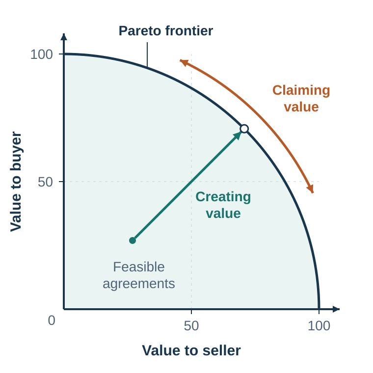

# Integrative Negotiation: Create Value Before Dividing It

*Creating value before dividing it*

::: {.callout-note .core-idea icon=false}
## Core Idea

Integrative negotiation creates value by discovering differences in interests, priorities, time, risk, beliefs, and capabilities - then trading on those differences rather than splitting positions.
:::

## Learning goals

- Distinguish integration from compromise.
- Explain Pareto efficiency and the Pareto frontier.
- Diagnose fixed-pie perception and illusory conflict.
- Use interest discovery, priority mapping, and logrolling.

## Why would a supplier refuse a million-pound order?

A large buyer and a small European supplier have reportedly agreed on $18 per pound for one million pounds of an ingredient each year. The buyer will invest in a new product only if competitors cannot obtain the ingredient, yet the supplier refuses exclusivity—even after the buyer offers minimum orders and more money. What should the buyer do next?

Write one sentence you would say at the table. The most useful sentence is not another concession. It is a question: “Help me understand what selling outside this agreement protects for you.” In the teaching case, the supplier's objection concerned an existing promise to sell only 250 pounds a year to a cousin. A narrowly tailored exception could protect that relationship while giving the buyer commercial exclusivity. The reported numbers make the contrast memorable; the transferable logic is to diagnose the interest before paying to move the position (Thompson et al., 2010).

This chapter follows that teaching sequence: begin with an apparently irrational position, diagnose fixed-pie assumptions, map interests and priorities, construct trades, then test whether the package really improves both sides.

::: {.callout-tip icon=false}
## Watch and diagnose: position versus interest

Watch [“Focus on interests, not positions”](https://youtu.be/QCT1BWZByko). Pause before the explanation and write (1) the visible positions, (2) at least two possible interests behind each, and (3) the question that would distinguish those hypotheses. No video frame is reproduced here.
:::

Distributive and integrative negotiation are often taught separately, but real negotiations usually contain both.

A salary negotiation may create value by adding flexibility, professional development, start date, title, bonus, and review schedule. But the parties may still divide value over salary. A supplier contract may create value through quality guarantees, delivery flexibility, risk sharing, and future volume commitments. But the parties may still bargain over price. A peace agreement may create value through security guarantees, demilitarized zones, recognition, and monitoring. But the parties may still disagree over territory, compensation, or authority.

Value creation and value claiming are not mutually exclusive. They are two tasks inside the same negotiation.

This creates a central tension. To create value, negotiators must often share information about their interests, priorities, constraints, and preferences. But sharing information can make them vulnerable when value is later claimed. If I tell you that delivery speed matters more to me than price, you may use that information to demand a higher price. If you tell me that you have no strong alternative, I may push harder. If I reveal that one issue is easy for me to concede, you may ask for it without giving anything back.

Lax and Sebenius (1986) call this the negotiator’s dilemma: the tension between cooperative moves that create value and competitive moves that claim value. Too little openness prevents value creation. Too much openness can lead to exploitation.

Good negotiators manage this tension. They do not reveal everything. They do not hide everything. They reveal enough to make value creation possible while protecting essential information such as their reservation value. They ask questions. They share interests rather than bottom lines. They make conditional offers. They propose multiple options. They use objective standards. They build trust gradually. They keep both value creation and value claiming in view.

A useful principle is:

Create value before claiming it, but prepare to claim value before you start creating it.

This means that integrative negotiation still requires the preparation discussed in Chapter 38: BATNA, reservation value, target, standards, and alternatives. Without distributive discipline, a cooperative negotiator can create value and then fail to capture a fair share of it.

## Pareto efficiency

{#fig-pareto fig-alt="Graph with value to two parties on the axes and a Pareto frontier; arrows move from compromise to better package to efficient deal."}

The goal of integrative negotiation is not simply to reach agreement. The goal is to reach an agreement that uses the available value well.

An agreement is Pareto efficient if no party can be made better off without making another party worse off. In negotiation, a Pareto efficient agreement is one in which all possible joint value has been created. The parties may still argue about how that value is divided, but there is no missed opportunity to improve one side without hurting the other.

A Pareto frontier is the set of all Pareto efficient agreements. Agreements inside the frontier are inefficient: there is some way to make one or both parties better off. Agreements on the frontier are efficient: to improve one party from that point, another party must give something up.

Consider a negotiation between a software provider and a client. The parties negotiate price, start date, service level, customization, training, and contract length. Suppose they reach an agreement with a moderate price, late start date, no training, and short contract. Later they realize that the provider had unused training capacity, the client urgently needed training, and a longer contract would have reduced the provider’s risk enough to lower the price. The initial agreement was not Pareto efficient. Both could have been better off.

Pareto efficiency does not mean fairness. One party can receive most of the value and the agreement can still be Pareto efficient. Efficiency is about whether value is wasted. Fairness is about how value is divided. A complete negotiation must consider both.

This distinction matters because negotiators often settle for agreements that are both inefficient and unfair. They compromise on visible positions while missing hidden trades. They split one issue while ignoring others. They accept a deal that is better than impasse but worse than what both could have achieved.

True integrative negotiation asks:

Are there issues we have not discussed? Are there differences in priorities we can trade on? Are there risks one side can bear more cheaply? Are there timing differences that matter? Are there future events we can make the agreement contingent on? Are there capabilities each side can contribute? Are there ways to improve implementation? Can one party get something valuable that costs the other party little?

The best negotiators do not only ask, “Is this acceptable?” They ask, “Is this the best agreement we can jointly design?”

## Compromise is not integration

Compromise is often treated as the ideal negotiation outcome. Each side gives something up. The result feels balanced. But compromise is not always integrative. Sometimes compromise produces a worse outcome for both parties than a more creative agreement would have.

A simple example is the story of two children arguing over an orange. A compromise cuts the orange in half. But if one child wants the juice and the other wants the peel for baking, splitting the orange is inefficient. Both could have received more of what they wanted by revealing their interests.

Another example is the “brown shoe and black shoe” problem. If one person wants a pair of brown shoes and another wants a pair of black shoes, compromise might give each person one brown shoe and one black shoe. This is equal, but useless. Compromise can be lose-lose when the parties split positions instead of satisfying interests.

Compromise is especially tempting when conflict is uncomfortable. Splitting the difference creates closure. It feels fair. It avoids asking difficult questions. But it may leave value on the table.

Consider a job negotiation. The candidate asks for €80,000. The employer offers €70,000. They compromise at €75,000. This may be acceptable. But perhaps the employer cannot exceed €72,000 because of internal equity, while the candidate mainly cares about professional development and flexibility. A package of €72,000, remote work, conference funding, and a six-month review may be better for the candidate and easier for the employer than €75,000.

Consider a deadline negotiation. A client wants delivery in March. A supplier wants July. They compromise on May. But perhaps the client only needs one component in March, while the supplier can deliver that component early if the full system is delivered later. A staged delivery creates more value than splitting the date.

Consider a budget negotiation. Two departments each ask for €100,000. The dean gives each €50,000. But perhaps one department needs staff time and the other needs equipment; perhaps external grants can support one but not the other; perhaps shared infrastructure can satisfy both. Equal division may look fair while wasting value.

The key lesson is:

Compromise divides positions. Integration satisfies interests.

Compromise is not always bad. Sometimes it is the best available option. But it should not be the first imagination. Before compromising, ask whether the parties are solving the wrong problem.

## Barriers to value creation

If integrative negotiation is so valuable, why do negotiators so often fail to create value?

Fixed-pie beliefs and inaccurate social perception prevent negotiators from discovering compatible interests and differences in priorities (Thompson & Hastie, 1990).

The first barrier is fixed-pie perception. Negotiators assume that the other side’s interests are directly opposed to their own. Thompson and Hastie (1990) showed that negotiators often falsely assume a fixed pie even when integrative potential exists. If I assume everything you gain is my loss, I will hide information, resist questions, and interpret your proposals defensively. The fixed-pie perception becomes self-fulfilling.

The second barrier is illusory conflict. Parties may believe their interests conflict when they are actually compatible. For example, two departments may both oppose a shared plan because each assumes the other wants control. Discussion may reveal that one wants visibility and the other wants operational autonomy. These interests can be combined.

The third barrier is positional bargaining. When parties bargain over demands rather than interests, they narrow the negotiation. “I need €80,000.” “We can only offer €70,000.” “I need March.” “We can only do July.” Positions invite concession or resistance. Interests invite problem-solving.

The fourth barrier is mistrust. If parties fear exploitation, they will not share useful information. This is rational in some environments. Trust must be built through process, reciprocity, confidentiality, objective standards, and credible behavior.

The fifth barrier is poor listening. Negotiators often try to influence before trying to learn. They defend their position, repeat arguments, and prepare counterarguments instead of asking what matters to the other side.

The sixth barrier is overconfidence. Negotiators may be too confident in their predictions, legal case, market valuation, project timeline, or future demand. Overconfidence prevents contingent agreements because each side wants the other to accept its forecast.

The seventh barrier is self-serving bias. Each side interprets fairness in a way that favors itself. A seller thinks its price is fair because of effort and quality. A buyer thinks a lower price is fair because of market alternatives and defects. Both see themselves as reasonable and the other as biased.

The eighth barrier is reactive devaluation. A proposal may seem less attractive simply because it comes from the other side (Ross, 1995). If they suggested it, perhaps it must benefit them. This can block good deals.

The ninth barrier is single-issue framing. When negotiators discuss issues one by one, they often turn each issue into a distributive battle. Multi-issue package negotiation makes trade-offs easier.

The tenth barrier is fear of appearing weak. Some negotiators believe that asking about interests or offering options signals softness. In fact, curiosity is not weakness. It is information gathering.

A useful diagnostic question is:

Are we failing because no agreement can create value, or because our process prevents us from seeing it?

Often the second answer is closer to the truth.

## Interests behind positions

The basic move in integrative negotiation is to separate positions from interests.

Perspective-taking can improve discovery of integrative agreements, particularly when it supports diagnostic questioning rather than untested projection (Galinsky et al., 2008).

A position is what a party says it wants. An interest is why the party wants it.

Positions are visible. Interests are hidden.

“I want full ownership.” Why? Control, identity, security, future flexibility, investor expectations, legal simplicity?

“I need a higher salary.” Why? Living costs, status, fairness, debt, family obligations, future salary trajectory, recognition?

“We cannot accept delay.” Why? Customer commitments, regulatory deadline, cash-flow pressure, reputation, coordination with other projects?

“We require exclusivity.” Why? Investment protection, brand consistency, fear of competition, quality control?

The same position can serve different interests. The same interest can be served by different positions. This is why interest discovery creates value.

To uncover interests, ask:

What makes this important? What problem would this solve? What happens if this issue is not addressed? Who else is affected? What concern are you trying to protect? What would a good outcome allow you to do? If this exact term is difficult, what alternative could meet the same need?

Interests are not only material. They can include money, time, risk, predictability, autonomy, status, identity, face, fairness, trust, reputation, learning, security, dignity, and future opportunity.

Many negotiators ask too few “why” questions because they fear appearing intrusive. But respectful questions often improve negotiation. They signal that you are not simply rejecting the other side’s position; you are trying to understand the problem behind it.

A good phrase is:

“Help me understand what that term is meant to protect.”

This question respects the other side’s concern while opening space for alternatives.

In high-stakes negotiation, even identifying the relevant **audience** can change the problem. A retrospective account of the 2006 kidnapping of journalist Jill Carroll describes negotiators hypothesizing that the captors' public messages addressed a broader regional audience, not only Western officials. Carroll's father was therefore coached to frame her as someone reporting on the circumstances of Iraqi people; she was later released. The sequence does not establish that the message caused the release, and retrospective interpretations are uncertain. Its safe teaching point is narrower: ask whose beliefs, face, or legitimacy a position is designed to influence, and treat the answer as a hypothesis to test rather than a motive you somehow know (Cole, 2009).

## Camp David: sovereignty and security

One of the most famous examples of integrative negotiation is the Camp David Accords between Egypt and Israel. At first, the dispute over the Sinai Peninsula appeared distributive. Egypt wanted the return of the Sinai. Israel did not want to return it. Splitting the land was not acceptable to either side (U.S. Department of State, Office of the Historian, n.d.).

The breakthrough came from understanding interests behind positions. Egypt’s core interest was sovereignty over land it regarded as historically and politically Egyptian. Israel’s core interest was security from land or air attack. These interests were not identical to the stated positions. Once the interests were understood, a trade became possible: Egypt regained sovereignty over the Sinai, while security arrangements, demilitarization, and monitoring addressed Israel’s security concerns.

The lesson is not that all conflicts can be solved this way. Some interests genuinely conflict. Some parties lack trust. Some disputes involve sacred values, violence, trauma, or domestic political constraints. But the example shows how positions can make conflict appear impossible while interests reveal room for agreement.

The question “Who gets the Sinai?” produces a zero-sum frame. The question “What does each side need from the Sinai?” opens integrative possibilities.

This applies far beyond diplomacy.

“Who gets the office?” may become: one person needs quiet for writing; another needs visibility for team coordination. “Who gets the budget?” may become: one unit needs equipment; another needs travel; both can share infrastructure. “Who owns the idea?” may become: one person needs recognition; another needs implementation authority. “What price?” may become: one side needs cash now; the other needs lower risk over time.

Integrative negotiation often begins by changing the question.

## Preparing across issues

Integrative negotiation requires preparation. Improvisation is not enough.

A useful preparation process has six steps.

First, identify the issues. Do not reduce the negotiation to one visible issue too early. In a job negotiation, issues may include salary, title, start date, location, remote work, travel, budget, teaching load, research support, bonus, review timing, and professional development. In a supplier negotiation, issues may include price, volume, quality, delivery, payment timing, warranty, service level, exclusivity, penalties, data sharing, and future contract length.

Second, identify your position and underlying interest for each issue. What do you want, and why? Rank your priorities. Which issues matter most? Which are flexible? Which are symbolic? Which are essential?

Third, assess the other party’s likely positions, interests, and priorities. What do they ask for? What might that protect? Which issues are probably more important to them than to you? Which are probably less important?

Fourth, identify your BATNA, target, and reservation value. Integrative negotiation does not eliminate the need for distributive preparation. You still need to know when to walk away.

Fifth, estimate the other party’s BATNA and reservation value. What happens to them if no agreement occurs? What constraints do they face? How strong are their alternatives?

Sixth, update during the negotiation. Preparation creates hypotheses, not certainties. As you ask questions and observe reactions, revise your assessment.

A preparation table can be useful:

Such a table makes differences visible. Differences are not a problem. They are opportunities for trade.

The most important question in multi-issue preparation is:

What do I value less than they do, and what do I value more than they do?

That question is the beginning of logrolling.

| Issue | My priority | Their likely priority | Potential trade |
| --- | --- | --- | --- |
| Price / salary | High | High | Use standards; do not expect easy integration. |
| Timing | High | Low or different | Trade speed, start date, or staging for value elsewhere. |
| Risk allocation | Medium | Different tolerance or forecast | Use warranties, insurance, or contingent terms. |
| Recognition / title | Low cost to one side | High symbolic value to the other | Trade status or visibility for a material term. |
| Future relationship | Different time horizons | Different | Use volume, renewal, review, or option clauses. |
: A priority map for integrative trade-offs {#tbl-33-1}

### Discover priorities rather than guessing them

The phrase “Which issues matter most?” is a start, not a complete diagnosis. Use several low-risk tests:

1. **Quick rank:** Ask each side to order the issues from most to least important.
2. **Label and confirm:** Offer a tentative inference—“It sounds as if delivery reliability matters more than customization; have I understood that correctly?”
3. **Allocate 100 points:** Spread 100 points across issues to force explicit trade-offs. Do this separately before sharing, then compare patterns rather than exact scores.
4. **Ask thresholds:** “What is a must-have, what is a preference, and what is flexible?” A threshold is different from a ranking.
5. **Run a small reaction test:** Offer two safe packages that differ on one trade and observe which direction is preferred.

Each tool can mislead. People may answer strategically, priorities may change as packages become concrete, and a “deal-breaker” may hide an unexamined interest. Mirror the answer back, ask what evidence supports it, and update throughout the conversation.

## Logrolling

Logrolling means trading across issues based on differences in priorities. Each side gives way on issues it values less in exchange for gains on issues it values more.

Suppose a supplier cares most about contract length because it wants predictable revenue. The buyer cares most about delivery flexibility because demand is uncertain. A value-creating agreement might give the supplier a longer contract while giving the buyer flexible delivery quantities.

Suppose a job candidate values remote work highly and salary moderately. The employer values salary cost highly but is flexible on remote work. The candidate may accept a lower salary increase in exchange for remote work.

Suppose a publisher is cautious about paying a large advance, while an author is confident in future sales and values upside. The publisher can pay a lower advance but higher royalties. The author gets upside; the publisher reduces risk.

Logrolling works only when negotiators know priorities. This is why asking about interests matters. If parties hide all priorities, they cannot trade efficiently.

A useful question is:

“Which issues are most important to you, and where do you have more flexibility?”

Some negotiators fear answering because they believe every revealed priority will be exploited. One way to reduce vulnerability is reciprocal disclosure:

“I can share which issues are most important to us if you are willing to do the same. That may help us find trades rather than bargain issue by issue.”

Another way is to use packages:

“If we can be flexible on contract length, could you be flexible on delivery quantities?”

This reveals a trade without fully revealing reservation values.

The mistake is to negotiate each issue separately. If parties settle price first, then delivery, then warranty, then payment timing, they may turn every issue into a small distributive fight. Package negotiation allows trade-offs:

“I can accept your preferred delivery schedule if we can agree on longer payment terms and a higher service level.”

Logrolling is the heart of integrative negotiation. It transforms difference into value.

### An information strategy for creating and claiming value

Not every piece of information does the same work. Some information mostly affects value claiming; other information is needed to create value. The consolidated matrix below makes the trade-off explicit (Fisher et al., 2011; Thompson et al., 2010).

| Information | Effect on claiming value | Effect on creating value | Sensible default |
| --- | --- | --- | --- |
| BATNA and reservation value | Exact disclosure often weakens leverage; credible constraint disclosure can prevent impasse. | Usually not needed to discover trades. | Protect exact limits; disclose only for a clear process or agreement benefit. |
| Position or opening demand | Opacity and an ambitious opening can help claim value. | A position alone reveals little about how to enlarge the pie. | State it with a legitimate reason, then move to interests. |
| Interests | Disclosure can expose where pressure would hurt. | Essential for inventing alternative ways to solve the problem. | Share progressively and reward reciprocity. |
| Priorities | May reveal which concessions are cheap or costly. | Essential for logrolling and claiming a share of the enlarged surplus. | Reveal relative priorities through questions, packages, and conditional trades. |
| Key facts | Information asymmetry can create bargaining power, but concealment may be unlawful or unethical. | Accurate material facts improve agreement quality and implementation. | Verify and disclose facts required for informed consent or performance. |
| Substantiation | Reasons and evidence strengthen a claim. | Shared standards can reduce conflict and support joint search. | Use real evidence; avoid ploys that damage trust. |
: What different kinds of information do in negotiation {#tbl-33-information-matrix}

The matrix is not a license for concealment. Material facts, legal duties, safety, fraud, and informed consent set boundaries that strategic advice cannot override.

## Differences are opportunities

In everyday life, people often treat differences as obstacles. In negotiation, differences often create value.

Differences in valuation create trade. If you value an item more than I do, I can give it to you in exchange for something I value more.

Differences in cost create efficiency. If I can provide a service cheaply that is valuable to you, including it in the agreement creates value.

Differences in capabilities create cooperation. One firm has technology; another has distribution. One partner has local knowledge; another has capital. One colleague is good at analysis; another is good at presentation.

Differences in risk attitudes create insurance-like trades. A party better able to bear risk may accept uncertain payoff in exchange for compensation. A risk-averse party may prefer certainty.

Differences in time preferences create borrowing, lending, staged payments, early delivery discounts, or delayed compensation. One side may value cash now; another may value higher total payment later.

Differences in beliefs create contingent contracts. If one side is optimistic and the other skeptical, rather than arguing endlessly about who is right, they can make payments depend on future outcomes.

Differences in tax position, regulation, reputation, capacity, inventory, seasonality, or stakeholder constraints can also create value.

The key is not to convince the other side to think like you. If you like apples and they like oranges, do not spend the negotiation persuading them that apples are better. Trade.

This principle is easy to state but difficult to practice because disagreement often triggers persuasion. When someone values an issue differently, we may want to prove that our valuation is correct. In integrative negotiation, the better response is curiosity:

“If you value that issue more than I do, how can we structure a trade?”

Difference is not only a source of conflict. It is the raw material of agreement.

::: {.callout-caution .evidence-and-boundary-conditions icon=false}
## Creating value does not replace claiming it

Creating value does not eliminate value claiming. A cooperative negotiator still needs a BATNA, reservation value, target, and standards for a fair division of the enlarged pie.
:::

## Key ideas

- Integrative negotiation creates value by discovering differences in interests, priorities, time, risk, beliefs, and capabilities - then trading on those differences rather than splitting positions.
- Distinguish integration from compromise.
- Explain Pareto efficiency and the Pareto frontier.
- Diagnose fixed-pie perception and illusory conflict.

## Study and practice

1. How would you distinguish integration from compromise?

2. How would you explain pareto efficiency and the pareto frontier?

3. Diagnose fixed-pie perception and illusory conflict?

::: {.callout-tip .activity icon=false}
## Activity

List at least five issues in a multi-issue negotiation. Rank your priorities and estimate theirs. Identify one issue that is cheap for you and valuable to them, and one with the opposite pattern. Propose a conditional trade.  
EXPERIENCE - EXPLAIN - APPLY (MAXIMUM 120 WORDS)  
Experience: describe one specific decision, interaction, or observation. Explain: use one or two concepts from this chapter accurately. Apply: state one improvement, implication, or testable prediction.
:::

## References cited in this chapter

::: {.reference}
Cole, R. (2009, April 10). FBI brings experience and skill to Somali hostage negotiations. Los Angeles Times. https://www.latimes.com/archives/la-xpm-2009-apr-10-fg-pirates-fbi10-story.html
:::

::: {.reference}
Fisher, R., Ury, W., & Patton, B. (2011). Getting to yes: Negotiating agreement without giving in (3rd ed.). Penguin.
:::

::: {.reference}
Galinsky, A. D., Maddux, W. W., Gilin, D., & White, J. B. (2008). Why it pays to get inside the head of your opponent: The differential effects of perspective taking and empathy in negotiations. Psychological Science, 19(4), 378–384.
:::

::: {.reference}
Lax, D. A., & Sebenius, J. K. (1986). The manager as negotiator: Bargaining for cooperation and competitive gain. Free Press.
:::

::: {.reference}
Ross, L. (1995). Reactive devaluation in negotiation and conflict resolution. In K. Arrow, R. H. Mnookin, L. Ross, A. Tversky, & R. Wilson (Eds.), Barriers to conflict resolution (pp. 26–42). W. W. Norton.
:::

::: {.reference}
Thompson, L. L., & Hastie, R. (1990). Social perception in negotiation. Organizational Behavior and Human Decision Processes, 47(1), 98–123.
:::

::: {.reference}
Thompson, L. L., Wang, J., & Gunia, B. C. (2010). Negotiation. Annual Review of Psychology, 61, 491–515.
:::

::: {.reference}
U.S. Department of State, Office of the Historian. (n.d.). The Camp David Accords and the Arab-Israeli peace process. https://history.state.gov/milestones/1977-1980/camp-david
:::
