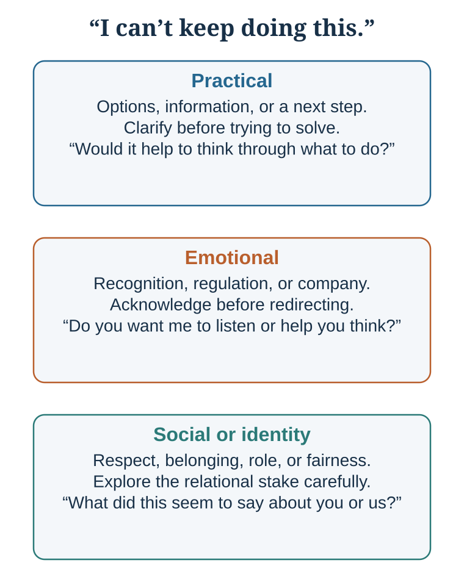
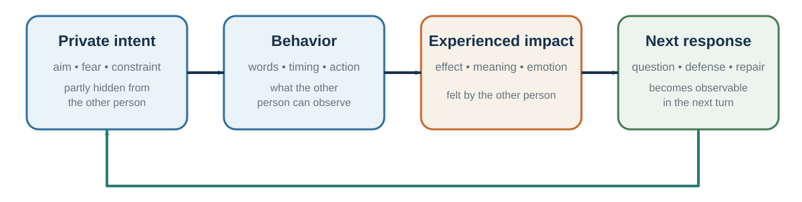

---
aliases:
  - 29-the-art-of-conversation-and-repair.html
---

# Connection and Repair: Warm Honesty Makes Truth Usable

*Understand accurately, speak with warm honesty, and repair what breaks*

::: {.chapter-epigraph}
> “Real communication occurs, and this evaluative tendency is avoided, when we listen with understanding.”
>
> — Carl R. Rogers and F. J. Roethlisberger, [“Barriers and Gateways to Communication”](https://digicoll.lib.berkeley.edu/record/70979/files/irla0191.pdf), 1952, p. 47
:::

::: {.callout-note .core-idea icon=false}
## Core Idea

Joint inference makes meaning testable, and conversation makes the relationship carrying that meaning visible through attention, questions, honesty, and response. But practical problems, emotional needs, and identity threats can occupy the same words, so explanation may deepen harm when recognition or repair is required. Therefore this chapter develops connection as a disciplined practice: diagnose the real conversation, separate observation from interpretation, speak with warm honesty, and repair harm through responsibility and changed behavior.
:::

## Learning goals

- Diagnose whether a difficult conversation calls for practical help, emotional recognition, or identity repair.
- Produce a warm-honesty opening that separates observable behavior, experienced impact, inferred intent, and a testable request.
- Complete a repair sequence that acknowledges harm, accepts responsibility, and specifies changed behavior.

::: {.callout-note .loop-location icon=false}
## Where this chapter enters the loop

Connection and repair determine whether shared meaning can survive threat. Accurate listening updates the model of the other person; warm honesty makes private impact discussable; repair turns a damaging interaction into new expectations and behavior. Relationships govern what evidence can be spoken and heard.
:::

Chapter 33 established how people ground meaning. This chapter begins where grounding becomes relationally difficult: the words implicate competence, fairness, belonging, care, or trust. Good conversation is mutual responsiveness under uncertainty, but connection becomes visible in what happens when meaning threatens the relationship carrying it.

A project manager receives a colleague's section after the client deadline and writes, “This is unacceptable. We need to discuss your reliability.” The colleague replies, “You never told me the client changed the date.” The exchange now contains three problems: a practical failure in the workflow, an emotional experience of exposure and blame, and an identity threat around competence and fairness. This conversation will carry the chapter from misunderstanding through repair.

## 1. Understand accurately

### Diagnose the conversation before answering it

The same sentence can carry at least three kinds of need. A **practical** conversation asks what to do. An **emotional** conversation asks for recognition, regulation, or company. A **social or identity** conversation asks what the event says about respect, belonging, competence, fairness, or the relationship (Duhigg, 2024; Stone et al., 2010). This three-conversation map is a practitioner-informed teaching synthesis, not a validated exhaustive taxonomy or a license to diagnose an unspoken need. Advice fails when the speaker is asking to be understood; validation frustrates when an urgent plan is needed.

| Conversation layer | What the speaker may need | A useful opening question | Common mismatch |
| --- | --- | --- | --- |
| Practical | Options, information, decision, next step. | “Would it help to think through what to do?” | Solving before the problem is understood. |
| Emotional | Validation, containment, companionship. | “Do you want me to listen, or help you think?” | Advice that implies the feeling is a defect. |
| Social or identity | Dignity, respect, belonging, role clarity. | “What did this seem to say about you or the relationship?” | Debating facts while the person experiences disrespect. |
: Three conversations can occupy the same words {#tbl-29-conversation-layer}

{#fig-conversation-needs-map fig-alt="An author's diagnostic map branches one sentence to three possible, non-exhaustive concerns: practical, emotional, and social or identity. Each branch offers a question to test rather than assume the interpretation." width=90%}

The map is a starting hypothesis, not a personality label. A conversation may move between layers, so the listener asks what kind of help is useful now and updates as the answer changes.

::: {.callout-note .media-example icon=false}
## Watch for the mismatch

[It’s Not About the Nail](https://www.youtube.com/watch?v=-4EDhdAHrOg) is a comic illustration, not research evidence. Before watching, predict what kind of help each person thinks the conversation requires. While watching, note the sentence where practical problem-solving and emotional recognition diverge. Afterward, write a response that both validates and asks permission before solving.
:::

Asking questions is one of the easiest ways to build connection. Huang and colleagues (2017) found that people who ask more questions, especially follow-up questions, are better liked by conversation partners. Follow-up questions show attention because they build on what the other person has just said.

Good questions move conversation from surface to depth. A useful ladder is:

| Level | Example question |
| --- | --- |
| Facts or events | What happened? |
| Experience | Which moment stays with you? |
| Meaning | What did that mean to you? |
| Emotion | What did you feel then? |
| Values or needs | What mattered, or what did you need? |
: A question ladder {#tbl-29-1}

Depth does not mean forcing intimacy. It means allowing the conversation to move beyond labels into experience, meaning, emotion, values, needs, or identity when appropriate. Follow the last answer rather than reciting a prepared list. Ask for specificity, label emotion tentatively, invite correction, and move only one level deeper at a time.

Good conversational questions include:

What was that like for you? What made that important? What surprised you? What did you learn? What are you hoping for? What is the hardest part? What would help?

Sensitive questions often go better than askers predict, and deeper conversations can create more connection than expected (Kardas et al., 2022). But an average result is not permission to intrude. Context, culture, relationship, power, and consent determine whether refusal is genuinely safe. Preface a personal question with control: “May I ask something a little more personal? It is completely fine to pass.” A deep question is an invitation, not a demand.

Closeness depends on more than question depth. In structured studies, gradually escalating **reciprocal** self-disclosure increased temporary feelings of closeness between strangers (Aron et al., 1997). In ongoing relationships, disclosure was more closely connected to intimacy when the partner was experienced as understanding, validating, and caring (Laurenceau et al., 1998). The lesson is not to reveal as much as possible. It is to disclose at an appropriate pace, notice whether the other person reciprocates voluntarily, and respond to what was entrusted rather than treating vulnerability as a technique.

### Test the social forecast

The obstacle to connection can arise before a conversation begins. Epley and Schroeder (2014) randomly assigned commuters to connect with a stranger, remain disconnected, or commute as usual. People expected more enjoyment from solitude, but participants assigned to connect reported a more positive experience, without the predicted loss of productivity. Boothby and colleagues (2018) documented a related **liking gap**: after conversations, people tended to underestimate how much their partners liked them. Anxiety is therefore a forecast, not a verdict. When the situation is appropriate, test a small prediction—say hello, ask one genuine follow-up question, or invite later contact—and compare the anticipated with the experienced result.

These average patterns do not mean that every stranger welcomes conversation or that every interaction is beneficial. Privacy, safety, cultural expectations, power, and consent determine whether an approach is appropriate and whether refusal is genuinely easy. The diagnostic is not “talk more.” It is “when contact is safe and welcome, do not let an untested pessimistic forecast make the decision by itself.”

The named patterns below adapt Brooks's (2025) practitioner framework; Huang et al. (2017) provide experimental evidence for the broader value of responsive follow-up questions, not a separate causal test of every label. Treat the table as a diagnostic prompt rather than an effect taxonomy:

| Pattern | What goes wrong | Better move |
| --- | --- | --- |
| Boomerasking | Ask, then immediately answer your own question; the interest appears performative. | Disclose directly, then ask a real follow-up. |
| Gotcha question | The question is designed to expose or corner. | State the concern and invite an explanation. |
| Repeated question | Re-asking signals disbelief or ignores the answer. | Paraphrase the answer and identify what remains unclear. |
| Agenda-laden question | Only one acceptable answer is implied. | Use neutral wording and acknowledge your own interest. |
: Questions should make updating possible {#tbl-29-question-patterns}

A practical conversational habit is:

Listen for the point of aliveness. Where does the other person become more animated, thoughtful, emotional, or specific? Ask one more question there.

Connection often begins where a person feels that their inner world has been noticed.

### Put the partner at the center of attention

Partner-centered attention means deliberately tracking the other person’s goals, interpretations, constraints, and dignity while still pursuing your own purpose. Egocentrism makes our own goal and discomfort more accessible, so a behavior intended as efficient may land as dismissive or unsafe. When context is uncertain, state the observation, offer a plausible benefit of the doubt, and ask before attributing motive: “The draft arrived after review time. I may be missing a constraint—what happened from your side?” Agreement is optional; preserving dignity and updating the model are not (Epley et al., 2004; Laurenceau et al., 1998).

Benefit of the doubt is a starting hypothesis, not a requirement to ignore repeated harm. Where conduct is unsafe, the appropriate move may be a boundary, documentation, representation, or a formal channel.

### Replace mind-reading with verified understanding

Use the ask–listen–reflect–verify loop from Chapter 33 until the other person can recognize or correct your account. Here its relational function matters: a specific paraphrase, content-linked question, or acknowledgment shows that the person's meaning affected your model. Nods, eye contact, generic agreement, and silence are too ambiguous to establish this on their own. Agreement remains optional; visible uptake and a path to correction do not (Laurenceau et al., 1998).

### Listen for the layer beneath the words

{#fig-conversation-repair fig-alt="An author's classroom procedure moves from an event and private interpretation through feeling and perspective-getting toward possible repair. A boundary notes that unsafe or coercive situations may require support or exit instead."}

When communication is difficult, it helps to slow down and separate layers of experience. One practical model is:

| Layer | Meaning | Question |
| --- | --- | --- |
| What | Perceived situation, event, issue, task, or context | What is happening? |
| How | Bodily feeling, emotion, affect, impulse, anticipated feeling | How does it land in me? |
| Why | Interpretation, appraisal, attribution, perceived intent, prediction | Why did I feel that way? |
| Who | Value, need, identity, dignity, status, belonging, competence, autonomy | What self-relevant concern is touched? |
| When | History, habit, culture, prior experience, learned expectation | Where did I learn to see or feel it this way? |
| Action | Automatic reaction or mindful response | What do I do next? |
: Listening beneath the surface {#tbl-29-2}

This model helps because people often argue at the “what” level while the real conflict is at the “who” level.

A manager says, “The report was late.” The employee hears, “You think I am incompetent.” A partner says, “You forgot to call.” The other hears, “You do not care about me.” A colleague says, “Can we revisit this assumption?” The presenter hears, “You are attacking my work.”

The “what” is the event. The “how” is the feeling. The “why” is the interpretation. The “who” is the identity concern. The “when” is the personal or cultural history. The “action” is what follows.

Good listening asks:

What happened? How did it feel? What story did your mind tell? What value or identity did it touch? Where might that reaction come from? What response would serve the relationship and the goal?

This model also helps with self-regulation. Before responding defensively, ask: what layer am I reacting from? Is the other person attacking me, or did my mind interpret uncertainty as threat?

Communication improves when people can name the layers rather than collapse them into accusation.

### Validation creates understanding; expansion creates growth

Validation shows that a partner’s meaning was noticed, understood, and incorporated. It may be as small as a precise “That makes sense because…” or “I see why that mattered.” It does not require endorsing every conclusion or action. Repeated, diagnostic signals—paraphrase, follow-up, acknowledgment, and specific appreciation—help build shared reality (Laurenceau et al., 1998; Rossignac-Milon et al., 2021).

Self-expansion is complementary: people can broaden possible selves by learning or entering a new role together (Aron et al., 1997). Strained relationships often need validation before expansion.

::: {.callout-tip icon=false}
## Two small practices that strengthen connection

People often underestimate the value of a sincere appreciation and others' willingness to help (Bohns, 2016; Kumar & Epley, 2018; Zhao & Epley, 2021, 2022). Make appreciation specific—name the action and its effect. Make a request specific—say why you ask this person, make refusal safe, receive the help without minimizing it, and close the loop by saying what changed. These practices support connection only when they are genuine and do not exploit hierarchy or obligation.
:::

## 2. Speak with warm honesty

### Truth, vulnerability, and feedback

Connection also depends on truth.

Secrets can create psychological burden and isolation. Slepian and colleagues have shown that the burden of secrecy often comes not only from hiding in social interaction but from mind-wandering back to the secret (Slepian et al., 2017). Sharing a secret with a trusted person can sometimes reduce isolation and increase connection, though disclosure must be safe and appropriate.

Honesty is complicated because people often use kindness as a reason to avoid truth. White lies can protect feelings, but they can also be paternalistic or prevent learning. People often underestimate others’ desire for honest feedback and overpredict how badly honest conversations will go (Levine & Cohen, 2018; Levine et al., 2020). This does not make every disclosure prosocial: relevance, timing, motive, safety, and the recipient’s capacity to act still matter. In professional contexts, avoiding necessary feedback may feel kind in the moment but unfair in the long run.

Good feedback is specific, respectful, and actionable. Avoid the “praise sandwich” if it makes praise seem like packaging for criticism. Instead:

Name the specific behavior. Explain the impact. Acknowledge context where appropriate. Invite perspective. Offer a path forward.

For example:

“In yesterday’s meeting, when you interrupted Anna twice, the discussion narrowed and she stopped contributing. I know the topic was urgent, but I want us to make space for the whole team. What was happening from your side?”

This is more useful than “You need to be more respectful” or “Great work overall, but…”

Vulnerability can support connection when it is honest and appropriately bounded. A leader who admits a mistake can make learning safer. A teacher who says, “Many people find this concept difficult at first,” can reduce shame. A colleague who shares uncertainty can invite collaboration.

But vulnerability should not be used theatrically. It should serve truth, relationship, and learning.

A useful question is:

What truth would strengthen this relationship if expressed with care?

### Cross the net carefully

Warm honesty differs from nice silence, protective distortion, and “brutal honesty.” It combines care with information the other person can examine. Conflict is an interpersonal cycle: private intent becomes observable behavior, that behavior has an impact, and the response becomes observable behavior in the next turn. Good intent does not erase impact, and impact does not prove intent. Stay on your own side of the net: describe the observable behavior, own its impact on you or the work, name the relevant need, and make a testable request. Then ask across the net about the other person’s intent, constraints, and experience instead of declaring them.

{#fig-intent-behavior-impact-cycle fig-alt="Four evenly spaced boxes form a cycle from private intent to observable behavior, experienced impact, and next response. A return arrow shows that the response becomes new input. A warm-honesty sequence separates observation, impact, inquiry, and request." width=92%}

The figure shows why repair requires two kinds of evidence at once: describe what crossed the net, and ask about what remained private. That keeps impact discussable without turning it into a verdict about motive.

| Stay on your side | Ask across the net |
| --- | --- |
| “The revised file arrived after the client deadline.” | “What happened from your side?” |
| “I felt exposed because I had promised delivery.” | “What constraints did I not see?” |
| “I need earlier warning when timing changes.” | “What warning process would work for you?” |
| “Could you message me by 14:00 if the date is at risk?” | “What would make that request unrealistic?” |
: Warm honesty separates observable impact from inferred motive {#tbl-29-net}

Conflict often follows a **pinch → story → avoidance → crunch** cycle. A small disappointment creates a private story about motive. Avoidance prevents correction. The accumulating pattern later erupts as a large conflict. Raise the pinch while it is still observable: “When the agenda changed without notice, I felt unprepared. What happened?” In unsafe settings or strong power asymmetries, direct conversation may not be prudent; documentation, a representative, or formal support may be necessary.

In the project case, warm honesty changes the opening: “The section arrived after the client deadline, and I felt exposed because I had promised delivery. I interpreted the delay as a reliability problem, but I had not checked whether the revised date reached you. What happened from your side? I need an early warning when a date is at risk. Could we agree on where that warning appears and who confirms it?” The manager owns the impact and the mistaken inference without erasing the missed handoff.

## 3. Repair meaning and relationship

### Support without trapping attention

Being heard can regulate distress, but repeated mutual venting can become co-brooding: attention circles the injury and intensifies emotion without producing a wider view or action (Rose, 2002). Co-reflection adds perspective without skipping validation.

Ask what kind of support is wanted: listening, problem-solving, distraction, or company. First make the feeling intelligible; then, with permission, ask what else might be true, what remains controllable, or how the event may look from a more distant standpoint (Kross & Ayduk, 2011). Support that rushes to optimism feels dismissive. Support that never releases attention from the injury can maintain distress.

### Constructive disagreement

Connection does not mean avoiding disagreement. In fact, strong relationships and good decisions require disagreement. The question is whether disagreement destroys shared reality or deepens it.

Disagreement becomes destructive when people feel unheard, disrespected, or existentially isolated: “How can you not see what is obvious?” When people disagree about seemingly self-evident truths, they may feel that the other person inhabits a different reality. That feeling can push people toward groups that validate them and away from dialogue.

Civility matters because contempt closes minds and damages the conditions for thought. Civility does not require weakness or false equivalence. Personal experience can humanize why a stake matters, but it does not replace evidence about prevalence or causality.

Moral reframing is also useful. A review by Feinberg and Willer (2019) describes evidence that political arguments can be more persuasive when framed in terms of the audience’s moral values rather than only the speaker’s. If someone values loyalty, authority, liberty, care, fairness, or purity differently than you do, repeating only your own moral language may fail. Translation is not manipulation when it remains truthful; it is respect for the listener’s moral world.

Personal experience can also preserve respect across moral disagreement. Kubin and colleagues (2021) found that experiences of harm were judged as more rational and increased respect more than factual claims in several political disagreements. This does not make anecdotes better evidence of prevalence or causality. Stories can humanize a stake; reliable evidence is still needed for empirical claims.

Constructive disagreement requires several habits:

Show that you want to understand before trying to be understood. Reflect the other person’s argument in a form they accept. Ask what value they are protecting. Share personal experience without treating it as universal proof. Use evidence, but do not use evidence as a weapon. Avoid contempt. Translate into the other person’s moral language when possible. Look for the concern beneath the position.

A useful disagreement question is:

What would make an intelligent, decent person see it this way?

This question does not force agreement. It restores complexity.

### Apology and repair

Connection is tested when harm occurs.

A good apology repairs moral meaning. It acknowledges the violation, accepts appropriate responsibility, expresses remorse, and offers repair or changed behavior (Fehr & Gelfand, 2010; Lewicki et al., 2016). In doing so, it makes future behavior more predictable: I see what happened, understand the harm, and can name what will be different.

Apologies often help, but they work best when they are specific, responsible, empathic, reparative, and followed by changed behavior. Lewicki, Polin, and Lount (2016) identify several components of effective apologies: expression of regret, explanation, acknowledgment of responsibility, declaration of repentance, offer of repair, and request for forgiveness. Acknowledging responsibility and offering repair are especially important.

A weak apology says:

“I’m sorry if you were offended.”

A stronger apology says:

“I interrupted you twice in the meeting. That was disrespectful and it made it harder for you to contribute. I am sorry. In the next meeting, I will make sure you have space to finish your point, and I will also acknowledge this to the team.”

Apologies are hard because offenders focus on shame, blame, and loss of face. Victims often focus on whether the offender understands the harm and will repair it. The offender asks, “Will I look bad?” The harmed person asks, “Do they get it?”

Forgiveness is related but distinct. Forgiveness does not mean excusing, forgetting, or eliminating accountability. It means releasing the desire for revenge and moving toward a different relationship with the harm. Worthington’s REACH model is one structured approach: recall the hurt, empathize, offer an altruistic gift of forgiveness, commit, and hold onto forgiveness (Worthington, 2006). Forgiveness is associated with better mental and physical health in many studies, though it should not be demanded from victims or used to pressure people to remain in harmful relationships (Toussaint et al., 2015).

Repair often requires psychological distance. In conflict, people become trapped in immediate emotion. Asking how one will view the event in six months, how a neutral third party would describe it, or what larger pattern is at stake can restore perspective.

A useful apology checklist:

Name the harm. Take responsibility. Express remorse and empathy. Explain without excusing. Repair if possible. Commit to change. Allow the harmed person to respond. Do not demand immediate forgiveness.

Repair is not a speech. It is a process.

## Connection as decision infrastructure

Communication and connection are infrastructure for good decisions. A team without trust hides information; a doctor without rapport misses patient concerns; a negotiator without listening misses value creation; an organization without repair repeats avoidable failure.

Connection improves information flow. It lowers defensiveness. It makes uncertainty speakable. It allows people to share weak signals before they become crises. It makes disagreement less threatening. It supports cooperation, learning, and repair.

This does not mean connection replaces analysis. Warmth without rigor can produce avoidance and groupthink. Teams need both trust and standards. Leaders need both empathy and clarity. Negotiators need both relationship and preparation. Doctors need both compassion and evidence. Teachers need both care and intellectual challenge.

When apparent agreement could reflect authority, suppressed dissent, unshared information, pluralistic ignorance, or diffused responsibility, use the mechanism-specific diagnosis in [Authority, Groupthink, and Shared Responsibility](28-authority-groupthink-and-shared-responsibility.qmd).

The best communication combines clarity, listening, grounding, responsiveness, trust, repair, and action. It now carries into negotiation, where joint decisions depend on interests, constraints, and meaning becoming recoverable.

::: {.callout-caution .evidence-and-boundary-conditions icon=false}
## Evidence Boundary

Question-asking, responsiveness, appropriate disclosure, specific appreciation, and complete apologies can support connection on average. They do not guarantee safety, trust, forgiveness, or agreement. Relationship history, culture, power, retaliation risk, trauma, and repeated conduct change what is appropriate. In unsafe settings, direct vulnerability or repair may be the wrong tool; documentation, boundaries, representation, or formal support may be necessary.
:::

## Practice Lab

Use the late-project case or a genuinely low-stakes issue. Produce three artifacts: (1) a verified-understanding transcript containing one ask, one paraphrase, and one accepted correction; (2) a warm-honesty opening that names observable behavior, impact, inquiry, and a reviewable request; and (3) a repair statement containing acknowledgment, responsibility, remorse, repair, and changed behavior. An observer marks any sentence that crosses from evidence about behavior into an unsupported claim about motive.

## Take it forward

- **Use this when:** a relationship must carry accurate information through misunderstanding, disagreement, or harm.
- **Do not infer:** warmth requires agreement, good intent erases impact, or an apology obliges forgiveness.
- **Try this next:** raise one small pinch before it becomes a crunch, stay on your side of the net, and ask the other person to correct your account.

## References cited in this chapter

::: {.reference}
Aron, A., Melinat, E., Aron, E. N., Vallone, R. D., & Bator, R. J. (1997). The experimental generation of interpersonal closeness: A procedure and some preliminary findings. Personality and Social Psychology Bulletin, 23(4), 363–377.
:::

::: {.reference}
Bohns, V. K. (2016). Underestimating our influence over others. Current Directions in Psychological Science, 25(2), 119–123.
:::

::: {.reference}
Boothby, E. J., Cooney, G., Sandstrom, G. M., & Clark, M. S. (2018). The liking gap in conversations: Do people like us more than we think? Psychological Science, 29(11), 1742–1756.
:::

::: {.reference}
Brooks, A. W. (2025). Talk: The science of conversation and the art of being ourselves. Crown.
:::

::: {.reference}
Duhigg, C. (2024). Supercommunicators: How to unlock the secret language of connection. Random House.
:::

::: {.reference}
Epley, N., & Schroeder, J. (2014). Mistakenly seeking solitude. Journal of Experimental Psychology: General, 143(5), 1980–1999.
:::

::: {.reference}
Epley, N., Keysar, B., Van Boven, L., & Gilovich, T. (2004). Perspective taking as egocentric anchoring and adjustment. Journal of Personality and Social Psychology, 87(3), 327–339.
:::

::: {.reference}
Fehr, R., & Gelfand, M. J. (2010). When apologies work: How matching apology components to victims’ self-construals facilitates forgiveness. Organizational Behavior and Human Decision Processes, 113(1), 37–50.
:::

::: {.reference}
Feinberg, M., & Willer, R. (2019). Moral reframing: A technique for effective and persuasive communication across political divides. Social and Personality Psychology Compass, 13(12), e12501.
:::

::: {.reference}
Huang, K., Yeomans, M., Brooks, A. W., Minson, J., & Gino, F. (2017). It doesn’t hurt to ask: Question-asking increases liking. Journal of Personality and Social Psychology, 113(3), 430–452.
:::

::: {.reference}
Kardas, M., Kumar, A., & Epley, N. (2022). Overly shallow? Miscalibrated expectations create a barrier to deeper conversation. Journal of Personality and Social Psychology, 122(3), 367–398.
:::

::: {.reference}
Kross, E., & Ayduk, O. (2011). Making meaning out of negative experiences by self-distancing. Current Directions in Psychological Science, 20(3), 187–191.
:::

::: {.reference}
Kubin, E., Puryear, C., Schein, C., & Gray, K. (2021). Personal experiences bridge moral and political divides better than facts. Proceedings of the National Academy of Sciences, 118(6), e2008389118.
:::

::: {.reference}
Kumar, A., & Epley, N. (2018). Undervaluing gratitude: Expressers misunderstand the consequences of showing appreciation. Psychological Science, 29(9), 1423–1435.
:::

::: {.reference}
Kumar, A., & Epley, N. (2023). A little good goes an unexpectedly long way: Underestimating the positive impact of kindness on recipients. Journal of Experimental Psychology: General, 152(1), 236–252.
:::

::: {.reference}
Laurenceau, J.-P., Barrett, L. F., & Pietromonaco, P. R. (1998). Intimacy as an interpersonal process: The importance of self-disclosure, partner disclosure, and perceived partner responsiveness. Journal of Personality and Social Psychology, 74(5), 1238–1251.
:::

::: {.reference}
Lewicki, R. J., Polin, B., & Lount, R. B., Jr. (2016). An exploration of the structure of effective apologies. Negotiation and Conflict Management Research, 9(2), 177–196.
:::

::: {.reference}
Levine, E. E., & Cohen, T. R. (2018). You can handle the truth: Mispredicting the consequences of honest communication. Journal of Experimental Psychology: General, 147(9), 1400–1429.
:::

::: {.reference}
Levine, E. E., Roberts, A. R., & Cohen, T. R. (2020). Difficult conversations: Navigating the tension between honesty and benevolence. Current Opinion in Psychology, 31, 38–43.
:::

::: {.reference}
Rose, A. J. (2002). Co-rumination in the friendships of girls and boys. Child Development, 73(6), 1830–1843.
:::

::: {.reference}
Rogers, C. R., & Roethlisberger, F. J. (1952). Barriers and gateways to communication. *Harvard Business Review, 30*(4), 46–52. https://digicoll.lib.berkeley.edu/record/70979/files/irla0191.pdf
:::

::: {.reference}
Rossignac-Milon, M., Bolger, N., Zee, K. S., Boothby, E. J., & Higgins, E. T. (2021). Merged minds: Generalized shared reality in dyadic relationships. Journal of Personality and Social Psychology, 120(4), 882–911.
:::

::: {.reference}
Slepian, M. L., Chun, J. S., & Mason, M. F. (2017). The experience of secrecy. Journal of Personality and Social Psychology, 113(1), 1–33.
:::

::: {.reference}
Stone, D., Patton, B., & Heen, S. (2010). Difficult conversations: How to discuss what matters most (2nd ed.). Penguin.
:::

::: {.reference}
Toussaint, L., Worthington, E. L., Jr., & Williams, D. R. (Eds.). (2015). Forgiveness and health: Scientific evidence and theories relating forgiveness to better health. Springer.
:::

::: {.reference}
Worthington, E. L., Jr. (2006). Forgiveness and reconciliation: Theory and application. Routledge.
:::

::: {.reference}
Zhao, X., & Epley, N. (2021). Insufficiently complimentary? Underestimating the positive impact of compliments creates a barrier to expressing them. Journal of Personality and Social Psychology, 121(2), 239–256.
:::

::: {.reference}
Zhao, X., & Epley, N. (2022). Surprisingly happy to have helped: Underestimating prosociality creates a misplaced barrier to asking for help. Psychological Science, 33(10), 1708–1731.
:::
