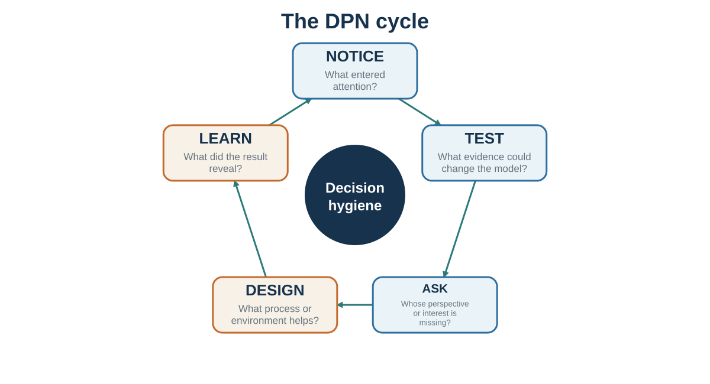

# Decision Hygiene

*Notice, test, ask, design, and learn*

::: {.callout-note .core-idea icon=false}
## Core Idea

Better judgment is less a personality trait than a property of a well-designed process: independent evidence, explicit assumptions, structured disagreement, meaningful alternatives, ethical influence, and feedback protected from hindsight.
:::

## Learning goals

- Design a decision process before debating the answer.
- Protect independent judgment and constructive dissent.
- Use environments, messages, conversations, and agreements as design objects.
- Debrief process quality separately from outcome.

::: {.callout-important .the-final-standard icon=false}
## The Final Standard

A useful intervention should remain defensible if the people affected understand how it works, whose objective it serves, what evidence supports it, and how they can refuse or revise it.
:::

By the end of this book, a familiar temptation appears: make a list of biases, promise to remember them, and trust the improved self to perform better next time. That is rarely enough. A bias label does not automatically change a meeting. Knowledge about anchors does not prevent an anchor from entering. Knowing that people conform does not make dissent socially safe. Knowing one should ask about interests does not make the question appear under pressure.

Decision hygiene treats judgment as a system property. The central question is not only whether an individual is intelligent or well intentioned. It is whether the process makes relevant evidence visible, protects independent thought, separates prediction from valuation, creates useful alternatives, records uncertainty, and produces feedback that can be learned from.

## Before the decision: improve the input

Start by defining the decision, the decision-maker, the deadline, and the real constraints. Generate alternatives before comparing them. Include doing nothing, delaying, piloting, negotiating, combining options, and changing the problem. Then make the best feasible alternative forgone visible. The sentence "By choosing this, we give up..." is a practical defense against invisible opportunity cost.

Decision hygiene improves judgment by changing the process around the judge: independent estimates, structured aggregation, premortems, calibration, and after-action review (Klein, 2007; Milkman et al., 2009; Soll et al., 2015; Kahneman et al., 2021).

Use the outside view before the inside story becomes emotionally complete. Identify a reference class and ask what usually happens. Collect independent estimates before discussion so that hierarchy, charisma, and early anchors do not manufacture agreement. Predefine evaluation criteria when hiring, selecting projects, or judging proposals. A rubric cannot eliminate judgment, but it can stop the first global impression from silently deciding every criterion.

## During the decision: structure disagreement

Separate prediction from valuation. Ask first what each person believes will happen and what evidence supports that belief. Ask separately what outcomes matter, which trade-offs are acceptable, and whose welfare or rights count. Many arguments become clearer when "too risky" is decomposed into probability and consequence.

Assign dissent a role rather than waiting for courage. Use a premortem: imagine that the decision failed and list plausible reasons. Ask one person to construct the strongest case against the emerging preference. Protect the dissenter from becoming the problem. The purpose is not permanent opposition; it is to expose information before commitment makes it expensive to hear.

## Design choices, not just advice

When behavior repeats, redesign the environment. Change defaults, friction, prompts, timing, information format, social visibility, and feedback. Make desired actions easier at the moment they must occur and make harmful impulsive actions harder. Ethical choice architecture preserves meaningful exit and serves goals that the affected person could endorse under informed reflection.

In persuasion, begin with the audience model rather than the speaker's facts. Identify the current story, the barrier to updating, the protected identity, and the evidence that would be treated as credible. In communication, ask before assuming and make interpretation testable. In negotiation, improve the BATNA, map interests and priorities, and prepare packages before the pressure of the table.

## After the outcome: learn without worshipping luck

Review the process using what was knowable at the time. A good decision can produce a bad outcome, and a poor process can get lucky. Compare forecasts with outcomes, not stories with feelings. Ask which assumptions failed, which information was missing, which values changed, and which parts of the process should remain even though the outcome was disappointing.

Do not update from one noisy result more than the evidence warrants. Regression to the mean, random variation, and selective feedback can create false lessons. Calibrate over many predictions. Reward accurate uncertainty and timely revision, not only confident success.

## The DPN cycle: notice, test, ask, design, learn

{#fig-dpn-cycle fig-alt="Circular five-step cycle: notice, test, ask, design, and learn, around decision hygiene."}

The course can be compressed into five verbs. Notice what attention selected and what it excluded. Test the model with base rates, counterevidence, experiments, and alternative explanations. Ask other people for their perspective, interests, constraints, and meaning. Design the environment, message, conversation, or agreement so that good action is easier. Learn from a record that existed before the outcome.

Decision, persuasion, communication, and negotiation are not separate skills. They are different forms of model management. In each case, we are trying to understand how a mind represents a situation, what it expects, what it values, which actions appear possible, and what feedback will change the next cycle. The deepest practical lesson is therefore not "think harder." It is "build a process in which better thinking has a chance to occur."

| Move | Core question | Typical tool |
| --- | --- | --- |
| Notice | What entered attention, and what stayed invisible? | Attention audit; option generation |
| Test | What would disconfirm the current model? | Base rate; premortem; pilot; alternative explanation |
| Ask | Whose perspective, interest, or constraint is missing? | Perspective-getting; diagnostic questions |
| Design | How can the environment or process make better action easier? | Criteria; defaults; friction; packages; role design |
| Learn | What did we predict, what happened, and what was luck? | Decision journal; calibration; process debrief |
: The integrated DPN audit {#tbl-35-1}

## Key ideas

- Better judgment is less a personality trait than a property of a well-designed process: independent evidence, explicit assumptions, structured disagreement, meaningful alternatives, ethical influence, and feedback protected from hindsight.
- Design a decision process before debating the answer.
- Protect independent judgment and constructive dissent.
- Use environments, messages, conversations, and agreements as design objects.

## Study and practice

1. Design a decision process before debating the answer?

2. Protect independent judgment and constructive dissent?

3. How would you use environments, messages, conversations, and agreements as design objects in practice?

::: {.callout-tip .activity icon=false}
## Activity

Complete the integrated DPN studio on one real challenge: (1) notice the current loop, (2) test the model and base rate, (3) ask for missing perspectives and interests, (4) redesign the choice, message, conversation, or agreement, and (5) set a feedback date.  
EXPERIENCE - EXPLAIN - APPLY (MAXIMUM 120 WORDS)  
Experience: describe one specific decision, interaction, or observation. Explain: use one or two concepts from this chapter accurately. Apply: state one improvement, implication, or testable prediction.
:::

## References cited in this chapter

::: {.reference}
Kahneman, D., Sibony, O., & Sunstein, C. R. (2021). Noise: A flaw in human judgment. Little, Brown Spark.
:::

::: {.reference}
Klein, G. (2007). Performing a project premortem. Harvard Business Review, 85(9), 18–19.
:::

::: {.reference}
Milkman, K. L., Chugh, D., & Bazerman, M. H. (2009). How can decision making be improved? Perspectives on Psychological Science, 4(4), 379–383.
:::

::: {.reference}
Soll, J. B., Milkman, K. L., & Payne, J. W. (2015). A user’s guide to debiasing. In G. Keren & G. Wu (Eds.), The Wiley Blackwell handbook of judgment and decision making (pp. 924–951). Wiley Blackwell.
:::
