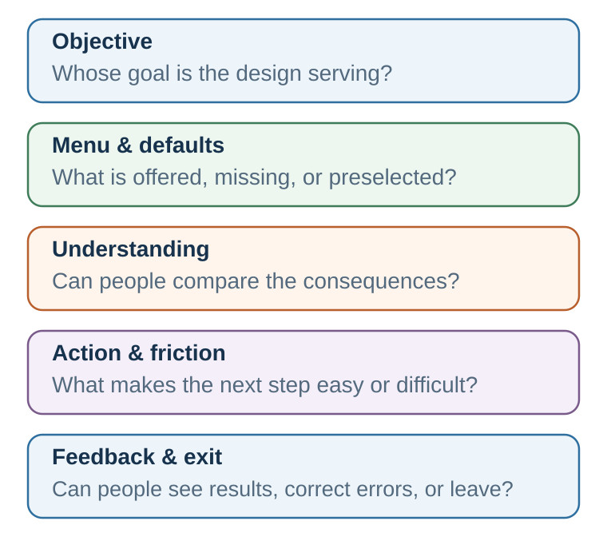

# Choice Architecture: The Environment Gets a Vote

*Every choice is presented somehow. The question is whether that presentation helps people act on informed goals or quietly substitutes someone else's goals for their own.*

::: {.callout-note .core-idea icon=false}
## Core Idea

Choice architecture is the design of the path through which a person notices options, understands consequences, acts, and learns. A nudge changes that path without forbidding options or substantially changing material incentives. Good architecture expands practical agency; bad architecture exploits predictable attention, effort, and inference.
:::

## Learning goals

- Diagnose where a menu, default, mapping, friction, timing, social signal, or feedback changes a choice path.
- Compare nudges with boosts, incentives, mandates, and structural change for the same barrier.
- Design and test an intervention that protects understanding, welfare, and meaningful exit.

::: {.callout-note .loop-location icon=false}
## Where this chapter enters the loop

Choice architecture redesigns the path from context and menu through understanding, action, and feedback. Unlike individual behavior design, it asks how an institution presents recurring choices to many people.
:::

## Opening puzzle: the form that already chose

Imagine enrolling in a retirement plan. The contribution field already says 6 percent. The recommended fund sits first. The opt-out link is in smaller type. Projected income is shown per month rather than as a distant lump sum. A reminder arrives on payday, and a progress bar shows how close you are to the employer match.

Nothing has been forbidden. Yet the choice is not untouched. The prefilled number anchors valuation. The default turns inaction into an outcome. Order directs attention. Monthly income changes how future consequences are mapped. Timing brings the decision closer to the moment of ability. The progress bar makes feedback visible. The form has not merely displayed a decision; it has helped construct one.

Now reverse the example. A subscription site makes enrollment one click and cancellation nine screens. A travel site labels an expensive option “most popular” without explaining the comparison. A checkout page adds a warranty unless the buyer notices a faint checkbox. These designs use the same behavioral mechanisms, but their objective and treatment of exit are different.

The teaching question is therefore not, “Does architecture influence choice?” Every environment does. The useful questions are: **Which objective does it serve? Which mechanism does it use? What evidence says it helps? Who may be harmed? Can a person understand, refuse, and recover from it?**

## From behavior design to choice architecture

Behavior design often begins with a person who wants to perform a behavior but does not reliably do so: study before opening email, take medication, pause before a defensive reply, or prepare a negotiation before entering the room. Choice architecture widens the lens. It examines the menu, sequence, interface, institution, and rules that organize choices for many people.

Richard Thaler and Cass Sunstein use **choice architecture** for the way choices are organized and **nudge** for an intervention that predictably changes behavior without banning options or substantially altering economic incentives (Thaler & Sunstein, 2008). Defaults, reminders, simpler forms, social-norm messages, and rearranged menus can be nudges. A large tax, a prohibition, or a compulsory rule is not merely a nudge, although it may be justified on other grounds.

Keep three levels separate. **Choice architecture** is the broad environment. A **nudge** is one feature of that environment. **Libertarian paternalism** is a normative argument for some welfare-oriented nudges: preserve meaningful choice while helping people act in ways they themselves would endorse under reflection. Calling a design a nudge therefore does not establish that its objective is legitimate or that its use is ethical.

The boundary matters because “nudge” should not become a flattering label for every intervention. At least five families of tools should be kept distinct:

| Instrument | What it changes | Example | Central question |
| --- | --- | --- | --- |
| Education | Facts and explanation | Balanced guide to vaccine benefits and risks | Can the person understand and use the information at the relevant moment? |
| Nudge | The immediate choice environment | Put healthier food first; send a timely reminder | Does the architecture help without closing meaningful options? |
| Boost | The person's competence | Teach natural frequencies or negotiation preparation | Will the skill transfer beyond this environment? |
| Incentive | The material payoff | Deposit refund; late fee; performance bonus | Is the reward aligned with the desired outcome and protected from gaming? |
| Mandate | The available actions or minimum standard | Safety requirement; disclosure rule | Is restriction proportionate to the risk and rights involved? |
| Structural change | The conditions producing the problem | Staffing, access, pricing, transport, or workload reform | Is individual choice really the main bottleneck? |
: Different tools for different barriers {#tbl-35-policy-tools}

A reminder cannot repair an unaffordable service. A literacy module cannot compensate for a deliberately deceptive contract. A default cannot create a good option that is absent from the menu. The first discipline of design is diagnosis.

## The plausible path: where architecture enters the loop

{#fig-choice-architecture fig-alt="A left-to-right path with five evenly spaced boxes: objective, menu, understanding, action, and feedback. Beneath it are aligned levers: defaults and order, mapping and salience, friction and timing, social information, and learning. A governance bar under the full path asks whose goal is served, what evidence supports it, who can exit, and how harms are monitored."}

An intervention is plausible only when the proposed design can be connected to a barrier through a credible path:

1. **Objective.** What outcome is being improved, for whom, and according to whose values?
2. **Menu.** Which options are available, missing, grouped, ordered, or made normal?
3. **Understanding.** Can people map each option to consequences they can compare?
4. **Action.** Can intention survive attention limits, timing, friction, and competing demands?
5. **Feedback.** Can people see what happened and revise the next choice?

This sequence prevents magical thinking. “Add a reminder” is not a mechanism. A defensible claim is narrower: eligible people already intend to book; forgetting at the relevant moment is a major barrier; a timely reminder makes the action salient; the booking path is feasible; and attendance can be measured without creating new burdens.

## Construct the menu: options, order, and overload

The first architecture is the option set itself. A menu can create a false binary, hide a combination, make delay invisible, or omit the option of gathering more information. Categories and order also shape comparison. People do not evaluate every item in isolation; they interpret an option relative to what appears beside it.

More options can increase fit and autonomy, but more is not automatically better. Iyengar and Lepper's jam study made choice overload vivid: a large display attracted attention, while a smaller display produced more purchases (Iyengar & Lepper, 2000). Later reviews show that overload is not universal. It is more likely when preferences are uncertain, options are hard to compare, the task is difficult, and the decision goal is unclear (Scheibehenne et al., 2010; Chernev et al., 2015).

The practical response is not simply to shrink every menu. It is to **structure** the menu:

- remove dominated or genuinely redundant options;
- organize by a decision-relevant dimension rather than by administrative history;
- provide a small, explainable shortlist while preserving access to the full set;
- support filtering without turning the filter into a hidden recommendation;
- make “do nothing,” “decide later,” “pilot,” and “seek advice” visible when they are legitimate;
- reveal conflicts of interest behind featured or sponsored options.

Choice also contains sacrifice. A well-designed menu makes opportunity cost legible: “Choosing this means giving up...” When alternatives remain invisible, the visible benefit of one option can crowd out the cost of the path displaced by it (Frederick et al., 2009).

::: {.callout-note .personal-example icon=false}
## Ask, do not merely tell—but define the real choice

When it is time to leave an amusement park, I sometimes ask my daughter, “Would you like to leave now or in ten minutes?” rather than “Do you want to leave now?” At breakfast, I might ask, “Would you like one egg or two?” rather than “Do you want eggs?” These are personal illustrations, not evidence that the wording will work generally.

Both questions preserve a small area of agency, but they also make acceptance presumptive. They are therefore better understood as **constrained-menu architecture** than as pure equivalent-description framing. The ethical boundary depends on what is genuinely negotiable. If the family must leave, I should state that boundary honestly and offer a real choice over timing. If eggs are optional, “no egg” must remain an easy, respected answer. “Ask, do not tell” supports agency only when the offered choice is real and the response can matter.
:::

## Set the starting point: defaults and active choice

A **default** is what happens if a person does nothing. Defaults are powerful because doing nothing is often easier, because the default may be interpreted as advice, and because moving away from a starting point can feel like giving something up (Johnson & Goldstein, 2003; Jachimowicz et al., 2019).

Defaults can be helpful when preferences are broadly aligned, inaction is common, reversibility is high, and the default is a reasonable recommendation. They are more dangerous when preferences vary greatly, switching costs are hidden, the default benefits the designer at the chooser's expense, or non-response is treated as meaningful consent.

Three designs should be compared rather than treating one as universally best:

- **Opt-in:** no enrollment without an affirmative action. Appropriate when consent must be explicit or preferences are highly heterogeneous.
- **Opt-out:** enrollment occurs unless declined. Appropriate when the default is evidence-based, low-risk, reversible, and aligned with most affected people's considered goals.
- **Active choice:** the person must select among clearly described options. Appropriate when preference is essential and omission should not decide, but it can become burdensome when the choice is frequent, technical, or badly timed.

A **smart default** uses relevant, legitimate information to improve fit—for example, a retirement contribution that responds to age and employer match. It also raises governance questions: Which data are used? Can the recommendation be explained? Does personalization create discrimination? How easily can a person choose otherwise?

The empirical examples also need their institutional boundaries. Automatic enrollment substantially increased participation in one large 401(k) plan, while active-decision designs have raised participation relative to ordinary opt-in systems (Madrian & Shea, 2001; Carroll et al., 2009). Organ-donation consent is highly sensitive to default format, but actual donation also depends on eligibility, family involvement, trust, coordination, and health-system capacity (Johnson & Goldstein, 2003). These studies show that starting points matter; they do not identify one morally or practically optimal default for every setting.

## Make consequences understandable: mapping and metrics

People choose an option, but they care about its consequences. **Mapping** is the connection between the selectable feature and the outcome that matters. A mortgage rate must be mapped to total cost and payment risk. A medical probability must be mapped to natural frequencies and meaningful time horizons. Energy use must be mapped to money, emissions, or another metric the audience can interpret.

Poor mapping creates an architecture of confusion even when every legal fact is technically present. Better mapping can use:

- natural frequencies instead of conditional percentages;
- absolute risk alongside relative risk;
- a consistent time horizon and denominator;
- total cost rather than a tempting installment alone;
- side-by-side consequences under the same assumptions;
- uncertainty ranges rather than a single false-precision forecast;
- labels that explain the comparison class behind “recommended” or “popular.”

Metrics are frames. [Chapter 12](15-frames-change-the-decision.qmd) showed why equivalent descriptions can change choice; architecture determines which description becomes the default view. “Save €40 per month” and “save €480 per year” are equivalent arithmetically but not psychologically. A fair design does not pretend framing can be eliminated; it uses symmetric, decision-relevant representations and makes important alternative frames available.

Even familiar units can map poorly. Miles per gallon is nonlinear in fuel consumed: an improvement from 10 to 20 MPG saves much more fuel over a fixed distance than an improvement from 30 to 40 MPG. Gallons per hundred miles makes that consequence easier to compare (Larrick & Soll, 2008). The design question is not which unit looks intuitive, but which one reveals the welfare-relevant difference.

[Chapter 21](42-mental-accounting.qmd) developed mental accounting as cognitive bookkeeping. Here the implication is architectural: an interface can either reinforce narrow accounts or reveal the broader balance sheet. People may treat a refund as free money, recent gains as “house money,” a credit balance as less real than cash, or a sunk ticket price as a reason to continue an unenjoyable activity (Thaler, 1985). Categories can support self-control, but they can also conceal total exposure. A responsible interface preserves useful budgets while also showing the whole budget, forward-looking costs and benefits, monthly and total cost, aggregate risk, and opportunity cost.

## Make action feasible: simplification, friction, and sludge

Friction is not trivial. A form, password, waiting period, extra click, inconvenient appointment time, ambiguous instruction, or request for a document can determine whether an intention becomes behavior. Removing unjustified friction can improve access without changing anyone's underlying preference.

But friction also protects. Confirmation screens, cooling-off periods, withdrawal limits, and deliberate pauses can reduce impulsive or irreversible harm. The right question is not “Can we remove a click?” It is “Which error does this friction prevent, and whose interest does it serve?”

**Sludge** is excessive or unjustified friction that makes a beneficial action difficult or an unwanted action hard to escape (Sunstein, 2021). Dark patterns reverse the ethical direction of good design: they exploit attention and effort to obtain consent, extract data, add charges, or obstruct cancellation.

A simple symmetry test is revealing:

> If joining is easy, is leaving comparably easy? If consent is prominent, is refusal equally legible? If the likely benefit is vivid, are material costs and risks comparably recoverable?

Simplification must preserve meaning. Shortening a form helps only if the remaining questions still protect eligibility, safety, and informed choice. Removing text is not the same as reducing cognitive work; sometimes a comparison table or worked example adds words while making the decision easier.

Administrative burden has at least three components: learning what exists and whether one qualifies, complying with procedures, and bearing the stress, stigma, or loss of autonomy attached to the process (Herd & Moynihan, 2018). Field studies show why this distinction matters. Simplifying benefit notices increased take-up of an earned-income tax credit, while hands-on assistance with financial-aid forms improved aid receipt and college enrollment; information by itself was not the whole bottleneck (Bhargava & Manoli, 2015; Bettinger et al., 2012). A sludge audit should therefore count time and steps **and** ask who must translate, disclose, wait, travel, or absorb psychological cost.

## Support action at the right moment

Information delivered at the wrong time is often inert. A reminder can close an intention–action gap when the person has already formed an intention, forgetting is plausible, and the action is feasible at the moment of contact. Reminders fail when the real barrier is cost, fear, low trust, no available appointment, or disagreement with the goal.

Timing and planning tools connect architecture to behavior design:

- a prompt should arrive when attention and ability can meet;
- an implementation intention specifies, “If situation X occurs, I will do Y” (Gollwitzer, 1999);
- a date-and-time prompt converts a distant intention into an appointment with context;
- a deadline can motivate, but excessive urgency can suppress inspection and manufacture consent;
- temptation bundling connects a delayed-benefit action with an immediate, controlled reward (Milkman et al., 2014).

Salience is selective. Making one action vivid necessarily pushes something else toward the background. Ethical design therefore asks not only what the cue reveals, but what it makes easier to forget.

Planning evidence makes the mechanism concrete: prompting employees to write the date and time of a flu clinic increased vaccination relative to a reminder without that planning field (Milkman et al., 2011). Commitment devices solve a different problem by letting a person constrain a predictable future state; because they may impose costs, they are not always nudges in the strict sense. Save More Tomorrow illustrates a hybrid: workers committed part of future salary increases to saving, combining advance commitment, timing, and inertia (Thaler & Benartzi, 2004).

## Use social information carefully

Social information can help people infer what works, what is safe, or what others approve. It can also create the behavior it reports. A message saying that many people evade taxes, waste energy, or misuse a service may normalize the very conduct it condemns. Descriptive norms tell people what others do; injunctive norms tell them what others approve.

Norm messages should use an honest reference group, avoid inventing consensus, and anticipate boomerang effects. People already performing better than the stated norm may regress toward it unless approval for the better behavior is also made clear (Schultz et al., 2007). “Most guests reuse towels” is not interchangeable with “Most guests in this room reuse towels,” and neither is defensible if the number is fabricated.

[Chapter 26](22-social-learning-mimicry-and-attribution.qmd) distinguished **dynamic norms** from descriptive and injunctive norms. Here the design question is deployment: a dynamic-norm message can describe a verified trend when the desirable behavior is not yet common, and such messages have shifted sustainable choices in experiments (Sparkman & Walton, 2017). The trend, denominator, and reference group must be relevant and honest; “more people” is not a license to manufacture momentum.

Identity can make a choice meaningful, but assigning a flattering or shaming identity can become manipulation. A stronger design invites agency: “People like you do this” pressures the self; “Here is what others did, why it may matter, and how to choose” informs a decision.

## Close the loop: feedback and error-proofing

Feedback is useful when it is timely, interpretable, attributable, and linked to an action the person can take. A vague annual report may arrive too late to guide a repeated behavior. A real-time warning may be ignored if it fires constantly. A progress display may motivate when the target is meaningful, but game behavior when the metric becomes the goal.

Error-proofing designs around predictable mistakes. Examples include showing the selected account before a transfer, warning about duplicate medication, previewing who will receive a message, requiring a second person for an irreversible organizational action, or making the cost of delay visible before a deadline passes.

Feedback also belongs to the designer. An intervention should generate evidence about who receives it, who acts, who benefits, who is burdened, and which unintended effects appear. Without that loop, a nudge can persist because it is elegant rather than because it works.

Home-energy reports illustrate the full learning problem. Repeated comparison and action feedback reduced electricity use, and some effects persisted after reports stopped, although they decayed over time (Allcott & Rogers, 2014). The relevant outcome is not merely whether one message moved behavior once, but whether the architecture produced useful, durable learning without making already-efficient households regress.

## Digital architecture operates at full-path scale

Digital systems can personalize menus, defaults, ranking, timing, social evidence, and feedback simultaneously. That makes them powerful and difficult to audit. A platform does not merely host choices; its recommender system decides what becomes visible, its interface defines the next easiest action, and its metrics determine what the system learns to optimize.

Three separations are essential:

1. **User objective versus platform metric.** Time on site, clicks, or conversion may be measurable without being the user's welfare.
2. **Short-term response versus long-term effect.** An intervention can increase immediate engagement while degrading attention, satisfaction, or trust.
3. **Personalization versus accountability.** Tailoring can improve relevance while making discrimination, inconsistent treatment, and hidden experimentation harder to see.

Good digital governance includes explainable recommendations, accessible settings, symmetric cancellation, data minimization, meaningful consent, monitoring across groups, and an appeals or correction path when the system is wrong.

Dark patterns are not only hypothetical. Design research has catalogued interfaces that obstruct, sneak, pressure, or misdirect, and a large crawl documented such patterns across shopping websites (Gray et al., 2018; Mathur et al., 2019). Continuous personalization and experimentation raise the governance burden: the same system can expose different people to different paths while leaving no shared interface for outsiders to inspect.

## Treat every intervention as a hypothesis

Behavioral effects are heterogeneous. An average effect may conceal strong benefit for one group, no effect for another, and harm for a third. Context, trust, baseline behavior, implementation quality, and the availability of good options all matter. Meta-analytic evidence suggests that choice-architecture interventions can change behavior, but effects vary substantially across domains, intervention types, and study settings (Mertens et al., 2022).

Scale is a separate test. Quantitative reviews find substantial variation across nudge designs, and trials run at scale by public nudge units have produced more modest average effects than prominent academic studies might lead designers to expect (Hummel & Maedche, 2019; DellaVigna & Linos, 2022). The response is not “nudges work” or “nudges fail,” but diagnosis, comparison, and evidence in the setting where the design will operate.

Evaluation should therefore precede celebration. Define the target outcome, mechanism, baseline, comparison, time horizon, and possible harm before launch. When feasible, pilot or randomize. Measure behavior rather than intention alone. Check persistence and spillovers. Compare the nudge with plausible alternatives, including a boost, an incentive, service redesign, or no intervention.

A null result is informative if the mechanism was explicit. It may show that forgetting was not the barrier, the prompt arrived at the wrong time, the action was infeasible, or the target metric did not capture welfare. Iteration should revise the model, not merely intensify the same tactic.

## Ethics and governance: helping, steering, or manipulating?

The ethical issue is not solved by saying that choices remain technically available. An option that requires exceptional attention, time, literacy, or courage may exist legally while being inaccessible in practice. Ethical architecture should be assessed on at least six dimensions:

| Test | Question |
| --- | --- |
| Purpose | Whose objective is being advanced? |
| Welfare | Would affected people endorse the objective under informed reflection? |
| Evidence | Is there a credible mechanism and proportionate evidence? |
| Transparency | Can people understand the material feature and the designer's role? |
| Exit | Is refusal, switching, or correction practically easy? |
| Distribution | Who benefits, who bears burdens, and are vulnerable groups protected? |
| Plural values | Are legitimate preferences diverse enough that active choice is safer than a strong default? |
| Nonexploitation | Does the feature support informed action rather than use confusion, urgency, or inattention against the chooser? |
| Accountability | Who monitors the path, answers challenges, and removes a design that does not earn its place? |
| Proportionality | Is the strength of influence justified by the problem, evidence, stakes, and rights involved? |
: An ethical choice-architecture audit {#tbl-35-ethics}

Transparency does not require a warning label so large that the intervention ceases to function. It does require that material facts, sponsorship, data use, and options are recoverable without detective work. The strongest practical standard is the one used throughout this book: **Would the design remain defensible if the people affected understood how it worked, whose goal it served, and how to refuse it?**

## The plausible-path design cycle

Use the following sequence before changing an environment:

1. **Define the behavior precisely.** Describe an observable action, population, context, and time—not a trait such as “careless” or “unmotivated.”
2. **Diagnose the barrier.** Is the failure in attention, understanding, value, ability, trust, timing, habit, social meaning, or access?
3. **Map the path.** Show how the proposed feature changes that barrier and how the change reaches the target outcome.
4. **Compare instruments.** Consider a nudge, boost, incentive, mandate, structural change, or combination.
5. **Protect agency.** Make important information legible, avoid deception, and provide meaningful exit.
6. **Pilot and measure.** Predefine success, subgroup effects, harms, persistence, and a stop rule.
7. **Learn and govern.** Publish or record what happened, revise the model, and remove architecture that does not earn its place.

### Worked example: missed appointments

Suppose a clinic wants to reduce missed appointments. “Patients forget” is a hypothesis, not a diagnosis. The team first checks whether missed visits cluster by time, transport access, language, cost, waiting time, or difficulty cancelling.

If forgetting is important, a reminder can state the time, place, preparation, and one-tap paths to confirm, reschedule, or cancel. The message arrives while action is possible. The clinic measures attendance, timely cancellation, rescheduling, staff burden, and subgroup effects. If transport or unpredictable work is the real barrier, reminders alone will disappoint; flexible scheduling or service redesign is needed.

### Worked example: subscription and cancellation sludge

A digital service can be joined with one prominent button but requires a search, password re-entry, retention offers, and a telephone call to leave. The business may describe each screen as an opportunity to prevent an accidental cancellation. The full path reveals a different objective: friction is asymmetric, the expected revenue from inattention accrues to the designer, and exit exists formally while being costly in practice.

A defensible redesign makes the current plan, renewal date, total cost, data consequences, and cancellation control visible in the same account area. Leaving should require confirmation proportionate to the consequences, not endurance. A brief, freely dismissible offer to pause or change plans may be legitimate when it does not obscure cancellation. Evaluation should include successful cancellation, time and errors, unwanted renewals, complaints, and differential burden—not only retained revenue.

## Take it forward

- **Use this when:** a recurring choice path makes one option unusually visible, easy, normal, or difficult to escape.
- **Do not infer:** keeping options technically available makes an architecture neutral, effective, or ethical.
- **Try this next:** map one real path from objective to menu, understanding, action, feedback, and exit; then name the barrier and one competing intervention.

::: {.callout-tip .activity icon=false}
## Practice Lab: architecture autopsy and redesign

In groups, document one real choice path from first cue to feedback. Mark the menu, default, mapping, friction, timing, social information, and exit. Then write a one-sentence causal claim: “Changing **X** should affect **Y** because **mechanism Z**.” Propose one alternative instrument and one harm measure. Exchange designs and ask: Would this remain defensible if users understood it completely?

EXPERIENCE – EXPLAIN – APPLY (MAXIMUM 120 WORDS)  
Experience: describe one specific choice environment. Explain: identify one mechanism and one boundary condition. Apply: propose one ethical redesign and one observable prediction.
:::

## References cited in this chapter

::: {.reference}
Chernev, A., Böckenholt, U., & Goodman, J. (2015). Choice overload: A conceptual review and meta-analysis. Journal of Consumer Psychology, 25(2), 333–358.
:::

::: {.reference}
Frederick, S., Novemsky, N., Wang, J., Dhar, R., & Nowlis, S. (2009). Opportunity cost neglect. Journal of Consumer Research, 36(4), 553–561.
:::

::: {.reference}
Gollwitzer, P. M. (1999). Implementation intentions: Strong effects of simple plans. American Psychologist, 54(7), 493–503.
:::

::: {.reference}
Iyengar, S. S., & Lepper, M. R. (2000). When choice is demotivating: Can one desire too much of a good thing? Journal of Personality and Social Psychology, 79(6), 995–1006.
:::

::: {.reference}
Jachimowicz, J. M., Duncan, S., Weber, E. U., & Johnson, E. J. (2019). When and why defaults influence decisions: A meta-analysis of default effects. Behavioural Public Policy, 3(2), 159–186.
:::

::: {.reference}
Johnson, E. J., & Goldstein, D. G. (2003). Do defaults save lives? *Science, 302*(5649), 1338–1339.
:::

::: {.reference}
Mertens, S., Herberz, M., Hahnel, U. J. J., & Brosch, T. (2022). The effectiveness of nudging: A meta-analysis of choice architecture interventions across behavioral domains. Proceedings of the National Academy of Sciences, 119(1), e2107346118.
:::

::: {.reference}
Milkman, K. L., Minson, J. A., & Volpp, K. G. M. (2014). Holding the Hunger Games hostage at the gym: An evaluation of temptation bundling. Management Science, 60(2), 283–299.
:::

::: {.reference}
Scheibehenne, B., Greifeneder, R., & Todd, P. M. (2010). Can there ever be too many options? A meta-analytic review of choice overload. Journal of Consumer Research, 37(3), 409–425.
:::

::: {.reference}
Schultz, P. W., Nolan, J. M., Cialdini, R. B., Goldstein, N. J., & Griskevicius, V. (2007). The constructive, destructive, and reconstructive power of social norms. Psychological Science, 18(5), 429–434.
:::

::: {.reference}
Sunstein, C. R. (2021). Sludge: What stops us from getting things done and what to do about it. MIT Press.
:::

::: {.reference}
Thaler, R. H. (1985). Mental accounting and consumer choice. Marketing Science, 4(3), 199–214.
:::

::: {.reference}
Thaler, R. H., & Sunstein, C. R. (2008). Nudge: Improving decisions about health, wealth, and happiness. Yale University Press.
:::

::: {.reference}
Allcott, H., & Rogers, T. (2014). The short-run and long-run effects of behavioral interventions: Experimental evidence from energy conservation. American Economic Review, 104(10), 3003–3037.
:::

::: {.reference}
Bettinger, E. P., Long, B. T., Oreopoulos, P., & Sanbonmatsu, L. (2012). The role of application assistance and information in college decisions: Results from the H&R Block FAFSA experiment. Quarterly Journal of Economics, 127(3), 1205–1242.
:::

::: {.reference}
Bhargava, S., & Manoli, D. (2015). Psychological frictions and the incomplete take-up of social benefits: Evidence from an IRS field experiment. American Economic Review, 105(11), 3489–3529.
:::

::: {.reference}
Carroll, G. D., Choi, J. J., Laibson, D., Madrian, B. C., & Metrick, A. (2009). Optimal defaults and active decisions. Quarterly Journal of Economics, 124(4), 1639–1674.
:::

::: {.reference}
DellaVigna, S., & Linos, E. (2022). RCTs to scale: Comprehensive evidence from two nudge units. Econometrica, 90(1), 81–116.
:::

::: {.reference}
Gray, C. M., Kou, Y., Battles, B., Hoggatt, J., & Toombs, A. L. (2018). The dark patterns side of UX design. Proceedings of the 2018 CHI Conference on Human Factors in Computing Systems, 1–14.
:::

::: {.reference}
Herd, P., & Moynihan, D. P. (2018). Administrative burden: Policymaking by other means. Russell Sage Foundation.
:::

::: {.reference}
Hummel, D., & Maedche, A. (2019). How effective is nudging? A quantitative review on the effect sizes and limits of empirical nudging studies. Journal of Behavioral and Experimental Economics, 80, 47–58.
:::

::: {.reference}
Larrick, R. P., & Soll, J. B. (2008). The MPG illusion. Science, 320(5883), 1593–1594.
:::

::: {.reference}
Madrian, B. C., & Shea, D. F. (2001). The power of suggestion: Inertia in 401(k) participation and savings behavior. Quarterly Journal of Economics, 116(4), 1149–1187.
:::

::: {.reference}
Mathur, A., Acar, G., Friedman, M. J., Lucherini, E., Mayer, J., Chetty, M., & Narayanan, A. (2019). Dark patterns at scale: Findings from a crawl of 11K shopping websites. Proceedings of the ACM on Human-Computer Interaction, 3(CSCW), 1–32.
:::

::: {.reference}
Milkman, K. L., Beshears, J., Choi, J. J., Laibson, D., & Madrian, B. C. (2011). Using implementation intentions prompts to enhance influenza vaccination rates. Proceedings of the National Academy of Sciences, 108(26), 10415–10420.
:::

::: {.reference}
Sparkman, G., & Walton, G. M. (2017). Dynamic norms promote sustainable behavior, even if it is counternormative. Psychological Science, 28(11), 1663–1674.
:::

::: {.reference}
Thaler, R. H., & Benartzi, S. (2004). Save More Tomorrow: Using behavioral economics to increase employee saving. Journal of Political Economy, 112(S1), S164–S187.
:::
