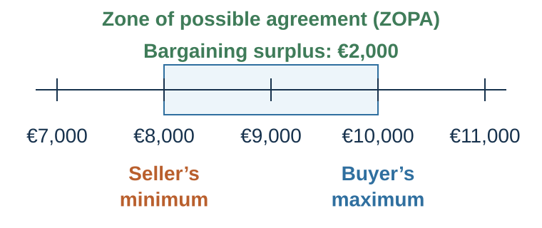
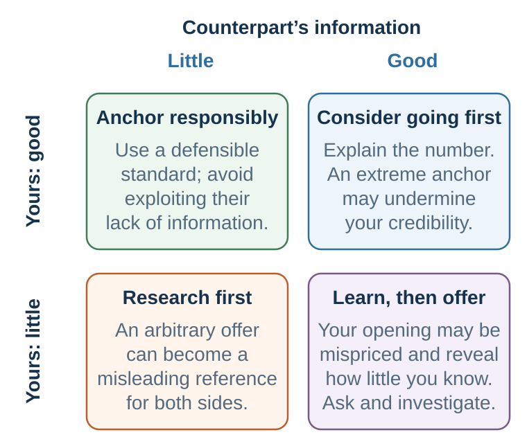

---
aliases:
  - 31-preparing-to-claim-value.html
---

# Preparing and Claiming Value

*Prepare, open, respond, move, and close without losing the walk-away discipline*

::: {.chapter-epigraph}
> “Now the general who wins a battle makes many calculations in his temple ere the battle is fought.”
>
> — Sun Tzu, [*The Art of War*](https://www.gutenberg.org/files/66706/old/old/66706-h.htm), ch. I, §26, translated by Lionel Giles, 1910
:::

::: {.callout-note .core-idea icon=false}
## Core Idea

Joint decision design defines the search, but bargaining power is largely built before anyone makes an offer through alternatives, walk-away points, ambitious targets, standards, and informed estimates of the other side. But entering with only a desired outcome leaves people vulnerable to anchors, pressure, and concessions that drift below what no agreement would provide. Therefore this chapter turns preparation into disciplined value claiming: establish the BATNA and reservation value, open with rationale, update from signals, move conditionally, and close without losing walk-away discipline.
:::

## Learning goals

- Produce a preparation sheet containing BATNA, reservation value, target, estimated ZOPA, standards, and learning questions.
- Make or answer a first offer using independent analysis and a defensible rationale.
- Conduct and audit a concession sequence from opening through close.

::: {.callout-note .loop-location icon=false}
## Where this chapter enters the loop

Value claiming turns preparation into a sequence of signals and choices. Alternatives discipline what to accept; a first offer changes the comparison point; questions update estimates; concessions communicate movement and limits; and the close must still beat the BATNA.
:::

## 1. Prepare: the case before the vocabulary

Imagine that you are selling a used car. Your best alternative is another buyer who has made a firm offer of €8,000. The current buyer has not named a number. Before reading on, write down:

1. the lowest amount you would accept;
2. what you would like to obtain;
3. what you think the buyer might pay;
4. what evidence could change each number; and
5. whether you would make the first offer.

The exercise exposes a preparation problem. People often enter with a wish but without a walk-away point, an evidence base, or a learning plan. Preparation increases confidence and credibility, makes anchors and pressure easier to resist, and reduces avoidable renegotiation. The familiar “80% preparation, 20% negotiation” phrase is best treated as a teaching heuristic, not an empirical law. Its useful message is that information gathering and alternative development usually have higher leverage before the bargaining begins (Fisher et al., 2011; Thompson et al., 2010).

Negotiation is disciplined by alternatives.

A party should not evaluate an agreement in isolation. It should compare the agreement with what it can do if no agreement is reached. This is the BATNA: the best alternative to a negotiated agreement (Fisher et al., 2011). Your BATNA is your best realistic course of action if the negotiation fails.

If you are negotiating a job offer, your BATNA may be another offer, staying in your current job, continuing your search, starting a PhD, or freelancing. If you are selling a car, your BATNA may be another buyer or keeping the car. If a company is negotiating with a supplier, its BATNA may be another supplier, internal production, redesigning the product, or delaying launch.

BATNA is not what you wish you had. It is not a fantasy alternative. It must be concrete and realistic. “I can always find another job” is not a BATNA unless there is a credible path. “We can sue” is not necessarily a good BATNA if litigation is costly, slow, uncertain, and relationship-damaging.

BATNA matters because it determines power. Negotiation power does not come mainly from personality, volume, or confidence. It comes from alternatives. If you can walk away to a good alternative, you have power. If you have no good alternative, you are vulnerable.

The reservation value is the worst agreement you would rationally accept before walking away to your BATNA. For a seller, it may be the lowest acceptable price. For a buyer, the highest acceptable price. In more complex negotiations, it includes multiple dimensions: money, risk, timing, relationship, reputation, and future opportunity.

The target or aspiration is what you aim to achieve. A good target should be ambitious but defensible. If your reservation value is the minimum acceptable outcome, your target is the outcome you actively try to reach.

The bargaining zone or zone of possible agreement exists when there are agreements both sides prefer to their BATNAs. In a simple price negotiation, if the buyer’s maximum willingness to pay is higher than the seller’s minimum acceptable price, a bargaining zone exists. If not, no agreement should occur unless other issues are added.

For example, a seller’s reservation price is €40,000. A buyer’s reservation price is €50,000. The bargaining zone is €40,000 to €50,000. Where the final price falls depends on information, anchors, concessions, patience, skill, fairness norms, and alternatives.

But many negotiations are not one-dimensional. A job offer includes salary, title, role, start date, location, flexibility, bonus, development, and future review. A supplier contract includes price, quality, delivery, warranty, payment terms, exclusivity, penalties, and future volume. A peace negotiation includes territory, security, recognition, monitoring, prisoner exchange, reparations, and political legitimacy.

In multi-issue negotiations, the bargaining zone is not a line. It is a space.

Preparation requires knowing your own BATNA and reservation value. It also requires estimating the other side’s. But estimates should be treated as hypotheses. Overconfidence about the other side’s alternative can lead to insulting offers. Underestimating your own alternative can lead to unnecessary concessions.

A useful BATNA discipline is:

Improve your BATNA before negotiating. Estimate their BATNA before proposing. Set your reservation value before hearing their anchor. Do not accept worse than your BATNA. Do not bluff about alternatives you do not have. Do not fall in love with agreement for its own sake.

Sometimes the best negotiation decision is no deal.

### The negotiation before the negotiation

Improvisation is overrated. Preparation is the foundation of negotiation.

Good preparation has several parts.

First, define the decision. What agreement are we trying to reach? What happens if no agreement is reached? Who must approve? What is the timeline?

Second, identify your interests. What do you really care about? Which interests are essential, important, or nice to have? Which are material, relational, reputational, ethical, or strategic?

Third, identify issues. What dimensions can be negotiated? Price, timing, quality, scope, role, title, risk, payment terms, confidentiality, exclusivity, support, review, future work, public recognition, dispute resolution?

Fourth, assess your BATNA. What will you do if no agreement is reached? How can you improve that alternative? What is your reservation value?

Fifth, set your target. What outcome is ambitious but defensible? What opening position might help you reach it?

Sixth, estimate their interests and BATNA. What do they need? What pressures do they face? Who are their stakeholders? What alternatives might they have? What do they value more or less than you?

Seventh, identify value-creation possibilities. What differences could be traded? What low-cost concessions might be high value to them? What low-cost concessions might be high value to you? Can risk, time, information, or future outcomes be structured creatively?

Eighth, prepare standards of legitimacy. What market data, precedents, benchmarks, expert opinions, cost information, or principles support your proposal?

Ninth, plan information strategy. What will you ask? What will you reveal? What will you not reveal? How will you build trust without becoming vulnerable?

Tenth, design the process. Who speaks first? What agenda? What tone? What medium? What sequence? What should be resolved first? What should wait? How will emotions be handled? How will agreement be documented?

A preparation worksheet should include:

My interests. Their likely interests. Issues. My BATNA. Their likely BATNA. My reservation value. My target. Possible bargaining zone. Objective standards. Questions to ask. Information to reveal. Information to protect. Possible trades. Implementation concerns. Ethical boundaries.

Preparation does not eliminate uncertainty. It makes uncertainty manageable.

### A complete preparation test

Before entering the room, answer the questions below for **both** sides where possible:

| Domain | Decision to make before bargaining |
| --- | --- |
| Alternatives | What are each side's BATNA and current reservation value? How could ours improve, and how might theirs change over time? |
| Surplus | Is a positive ZOPA plausible? What facts support that estimate, and what would falsify it? |
| Aspiration | What is our ambitious but defensible target? What objective standard supports it? |
| Unknowns | Which facts, constraints, stakeholders, and approvals do we need to learn? What question could reveal each one? |
| Issues and priorities | Which issues matter to each side, how strongly, and where might priorities differ? |
| Trades and forecasts | What can be exchanged across issues? Where do predictions differ enough for a contingent term? |
| Process | Who decides, in what sequence, by what deadline, and how will agreement be documented and implemented? |
: Preparation as a set of decisions rather than a list of wishes {#tbl-31-preparation-test}

Prepare at least one tough question you would prefer not to hear, then answer it truthfully without surrendering private information. Also prepare one question whose answer could make you abandon your favored strategy. That second question protects preparation from becoming confirmation bias.

### Map the bargaining zone

{#fig-zopa fig-alt="Number line showing seller reservation at 8,000 euros, buyer reservation at 10,000 euros, and a 2,000-euro zone between them."}

A distributive negotiation occurs when parties divide a resource and their interests are directly opposed on at least one issue. The clearest example is a single-issue price negotiation.

Suppose a seller owns a used car. The seller would rather keep the car than sell it for less than €8,000. The buyer would rather buy the car than walk away if the price is €10,000 or lower. The seller’s reservation value is €8,000. The buyer’s reservation value is €10,000.

The bargaining zone, also called the zone of possible agreement or ZOPA, lies between €8,000 and €10,000. Any price in that zone is better than no agreement for both sides. At €8,000, the seller is just indifferent between selling and walking away, while the buyer gets a very favorable deal. At €10,000, the buyer is just indifferent between buying and walking away, while the seller gets a very favorable deal. At €9,000, the surplus is split evenly.

The bargaining surplus is the overlap between the parties’ reservation values. In this case:

$$
\text{Bargaining surplus}
= \text{buyer reservation value} - \text{seller reservation value}
= €10{,}000 - €8{,}000
= €2{,}000.
$$

If the final price is €9,200, the buyer’s surplus is:

$$
\text{Buyer surplus}
= \text{buyer reservation value} - \text{settlement}
= €10{,}000 - €9{,}200
= €800.
$$

The seller's surplus is:

$$
\text{Seller surplus}
= \text{settlement} - \text{seller reservation value}
= €9{,}200 - €8{,}000
= €1{,}200.
$$

The total surplus remains €2,000, but the distribution changes. The seller claimed €1,200 of the surplus; the buyer claimed €800.

This simple example captures the core structure of distributive negotiation. The parties should reach agreement if there is a positive bargaining zone. But each party prefers agreement closer to the other party’s reservation value.

A positive bargaining zone exists when the buyer’s maximum willingness to pay is greater than the seller’s minimum willingness to accept. A negative bargaining zone exists when there is no overlap. If the seller will not accept less than €12,000 and the buyer will not pay more than €10,000, there is no deal on price alone. The parties should either walk away or add issues that might create value, such as warranty, financing, delivery, timing, repairs, or future business.

A common mistake is to continue bargaining when the bargaining zone is negative. Negotiators may become emotionally committed to agreement, interpret failure as personal defeat, or keep making concessions in the hope that agreement must exist. But no agreement is sometimes the rational outcome. Negotiation is not successful merely because it ends with a yes. It is successful when the agreement is better than the negotiator’s alternative.

This is why the first rule of distributive negotiation is simple:

Know when to walk away.

### BATNA, aspiration, and bargaining power

Power in negotiation is often misunderstood. People think power comes from confidence, toughness, rank, charm, or personality. These can matter, but the deepest source of bargaining power is the quality of your alternative.

A negotiator’s BATNA and reservation value discipline acceptance decisions, while ambitious but defensible aspirations can improve bargaining outcomes (Fisher et al., 2011; White & Neale, 1994).

Your BATNA is your best alternative to a negotiated agreement: what you will do if this negotiation fails. Your reservation value is the quantified value of that alternative in the current negotiation. It is your walk-away point.

If you are selling a car and already have another buyer willing to pay €8,000, your reservation value is at least €8,000. If you are negotiating a job offer and have another offer worth €70,000, your reservation value should reflect that alternative, adjusted for differences in location, growth, benefits, risk, and personal value. If you are negotiating with a supplier and have another supplier who can deliver at an acceptable quality for €100 per unit, that alternative shapes your reservation value.

A negotiator with a strong BATNA can walk away. A negotiator with a weak BATNA is vulnerable. This is why improving your BATNA before negotiation often matters more than clever tactics during negotiation.

Before negotiating, ask:

What will I do if we do not reach agreement? How realistic is that alternative? Can I improve it before the negotiation? Can I create more alternatives? What is the value of my best alternative? What agreement would be worse than walking away?

Reservation value should be set before the negotiation begins. If you wait until the heat of bargaining, you become vulnerable to anchors, pressure, liking, fear, deadlines, and desire for closure. A clear reservation value protects you against accepting a bad deal because the conversation feels difficult.

Your reservation value is not your target. It is your minimum acceptable outcome. Your target should be more ambitious. If a seller’s reservation value is €8,000, the target might be €9,800. If a buyer’s reservation value is €10,000, the target might be €8,300. The reservation value prevents bad agreements; the target guides value claiming.

A strong target matters because aspirations shape outcomes. Negotiators with higher aspirations often obtain better deals, provided their aspirations are realistic and supported by preparation. Low aspirations can become self-fulfilling. If you ask for too little, the other side may accept quickly, revealing that your demand was insufficiently ambitious. Negotiation writers sometimes call this a *winner's curse*, but the classic auction concept is different: winning can be bad news because the highest bid may reflect the most optimistic estimate of a common-value asset. Here the problem is an underinformed opening and the regret it reveals.

However, targets should not be fantasies. An extreme demand may create a chilling effect: the other side becomes offended, distrustful, or unwilling to continue. Ambition must be balanced with legitimacy. A strong target should be optimistic but defensible.

Distributive preparation therefore begins with three numbers:

Reservation value: the walk-away point. Target: the desired outcome. Opening offer: the initial proposal designed to shape the bargaining range.

Many negotiators know what they want but do not know what they will refuse. That is dangerous. In distributive negotiation, the ability to say no is as important as the ability to ask.

### Estimate the other side

Knowing your own reservation value is necessary but not sufficient. You must also estimate the other side’s.

In a price negotiation, the other side’s reservation value defines the far boundary of what you might obtain. If you are a buyer, you want to estimate the seller’s minimum acceptable price. If you are a seller, you want to estimate the buyer’s maximum willingness to pay. In salary negotiation, an employer estimates the candidate’s alternatives and minimum acceptable package; the candidate estimates the employer’s budget, urgency, internal equity constraints, and cost of restarting the search.

Estimating the other side’s reservation value requires information. Sources may include market prices, public data, industry norms, previous offers, deadlines, inventory levels, budget cycles, visible constraints, alternative suppliers, job market conditions, comparable salaries, and the other side’s behavior.

But estimates are uncertain. The other side may have alternatives you do not know about. They may value issues differently. They may be under pressure. They may be bluffing. They may be misinformed about their own alternatives. They may have hidden stakeholders.

This is why negotiation is an information game. The person who learns more usually has an advantage, provided they use the information well.

Good questions include:

What alternatives are you considering? What would make this agreement difficult for you? How did you arrive at that number? What constraints are you working within? What would make this proposal acceptable? What timeline are you facing? Who else needs to approve this? What happens if we cannot reach agreement?

Some of these questions may not be answered directly. But the way the other side responds can still provide information. Hesitation, justification, specificity, irritation, flexibility, and repeated concerns all reveal something.

The danger is confirmation bias. Negotiators often form an early belief about the other side’s reservation value and then interpret all evidence to support it. A buyer may assume the seller is desperate and ignore signs of another offer. A seller may assume the buyer has a high willingness to pay and ignore signs of budget constraint. A candidate may assume the employer has flexibility and ignore internal salary bands.

Because estimates are uncertain, skilled negotiators update during the conversation. If the other side rejects a seemingly reasonable offer quickly and credibly, your estimate may be wrong. If they accept too quickly, your estimate may also be wrong. If they make small concessions, they may be near their limit—or they may be signaling that they want you to believe they are near their limit.

A useful discipline is to write down before negotiation:

My estimate of their reservation value. Why I believe this. What evidence would make me revise it. What questions can test it.

Negotiation is not only influencing the other side. It is learning from the other side.

### Reservation value is private by default, not sacred in every case

Revealing an exact reservation value usually weakens value claiming because it tells the other side how far it can push. Yet secrecy is not an absolute rule. A credible disclosure can sometimes correct a mistaken estimate, prevent an avoidable impasse, satisfy a transparency obligation, or make a multi-issue agreement possible. The decision is not “honest or secretive”; it is whether this particular disclosure improves the chance of an informed agreement without unnecessarily surrendering value.

If disclosure is useful, explain the underlying constraint and evidence before giving a naked number. “Our board-approved ceiling is €10,000 and we cannot exceed it” is more informative than “€10,000 is my bottom line,” but it should be said only if it is true and if the strategic and relational benefits exceed the cost. Never fabricate a reservation value or alternative.

## 2. Open: anchor only when you can defend the frame

The first offer is one of the most powerful moves in distributive negotiation because it acts as an anchor.

Anchoring occurs when an initial number influences subsequent judgments, even when people know the number may be arbitrary or self-serving. Tversky and Kahneman (1974) showed that anchors can shape numerical estimates. In negotiation, Galinsky and Mussweiler (2001) showed that first offers can strongly influence final settlements.

The reason is partly cognitive. Once a number is placed on the table, people tend to adjust away from it insufficiently. The first offer shapes what feels reasonable, what counts as a concession, and where the bargaining range begins. It also influences the other side’s beliefs about your expectations and possibly your reservation value.

If a seller opens at €12,000, the buyer may revise upward what they think the seller expects. If a job candidate asks for €80,000, the employer may consider a higher range than if the candidate asks for €65,000. If a consultant proposes €50,000, the client may evaluate counteroffers relative to that figure.

A common lesson is: if you have good information, consider making the first offer. A strong first offer can pull the final agreement toward your side.

But first offers have two effects, and they are in tension.

First, they anchor. Second, they reveal information.

A first offer tells the other side something about your expectations, confidence, and possible reservation value. If you are well informed, this is usually acceptable. If you are poorly informed and the other side is well informed, your first offer may expose your ignorance.

This leads to a more nuanced rule:

Make the first offer when you have enough information to anchor ambitiously and defensibly. Avoid making the first offer when you are poorly informed and the other side may know much more.

If neither side has much information, making the first offer may be useful because the anchor has room to operate. If both sides are well informed, the first offer still matters but extreme anchors are less likely to succeed. If the other side is better informed, try to learn before offering.

{#fig-first-offer-information-matrix fig-alt="Two-by-two matrix crossing your information, good or weak, with the counterpart's information, weak or good. Good-good suggests considering an ambitious justified opening; weak-good says learn before revealing; good-weak says anchor with restraint; weak-weak says research before centering an arbitrary number. Each cell names a risk." width="92%"}

The matrix highlights why “always make the first offer” is too crude: opening can create leverage, but it also discloses the quality and limits of your preparation.

The deck's first-offer matrix can be translated into a deliberately conservative heuristic:

| Your information | Counterpart's information | Default move | Main risk to test |
| --- | --- | --- | --- |
| Good | Good | Consider opening first. | Credibility or chilling from an extreme offer. |
| Weak | Good | Invite or learn before opening. | Revealing ignorance and anchoring below a defensible target. |
| Good | Weak | A first offer can anchor, but use a defensible standard. | Exploitation, relationship cost, or an uninformed impasse. |
| Weak | Weak | Research first; if forced, use a provisional, justified range. | An arbitrary number becoming the conversation's center. |
| Unknown | Unknown | Ask and investigate before committing. | Mistaking confidence for information. |
: A first-offer decision heuristic, not an automatic rule {#tbl-31-first-offer-matrix}

A first offer should be ambitious but not absurd. It should leave room for concession but not give away the bargaining zone. It should be supported by a rationale. A number without justification is easier to dismiss. A number tied to market data, cost structure, precedent, quality, risk, or comparable agreements feels more legitimate.

For example:

“Based on comparable roles, the scope of responsibility, and the market range for this position, I would be looking for a salary around €78,000.”

This is stronger than:

“I want €78,000.”

Justification protects the anchor from being treated as arbitrary.

| Concept | Question |
| --- | --- |
| BATNA | What will I actually do if no agreement is reached? |
| Reservation value | What is the worst agreement still better than the BATNA? |
| Target | What ambitious but defensible outcome am I pursuing? |
| Opening offer | What anchor can I justify with standards and information? |
| Estimated ZOPA | Where might both parties prefer agreement to their alternatives? |
: The numbers to set before bargaining {#tbl-31-1}

## 3. Respond: return to independent analysis

Suppose the buyer opens at €6,500. The seller's most costly response is to become outraged and begin negotiating inside the buyer's frame. Pause. Return to the €8,000 alternative, the €9,800 target, comparable listings, condition, and the estimated buyer ceiling. Ask for the basis of the number only if the answer could teach you something; otherwise label the gap and re-anchor promptly:

“€6,500 is outside the comparable range and below a firm alternative I already have. Based on the car's condition and recent listings, €9,800 is the appropriate starting point.”

A strong response does four jobs: it refuses the anchor, supplies an independent standard, places a new reference point, and gives the other side a face-saving explanation for moving. Precision can signal informed calculation when the assumptions justify it; excessive precision can look theatrical or uninformed (Mason et al., 2013). A narrow range may combine ambition with flexibility, but both endpoints anchor. If €9,800 is the target, “€9,800 to €10,200 depending on timing and payment” is safer than a range whose lower endpoint concedes the target (Ames & Mason, 2015).

If the first offer is unexpectedly attractive, do not invent conflict. Pause long enough to inspect hidden conditions, other issues, and implementation. Immediate acceptance can create regret on the other side or leave important terms undefined. A considered acceptance is still acceptance.

## 4. Move: make concessions carry information

Concessions change terms and teach the counterpart how to bargain with you. A large immediate move can imply that the opening lacked legitimacy. Two unreciprocated moves can teach that waiting produces value. A silent concession can disappear into the new baseline.

Use four disciplines:

1. **Make movement reciprocal.** Do not negotiate against yourself.
2. **Label what you give.** Make the cost and significance visible without exaggeration.
3. **Make movement conditional.** “If payment is completed this week, I can move to €9,500.”
4. **Connect movement to information or value.** A concession should respond to a changed term, verified constraint, or reciprocal move—not discomfort alone.

Shrinking concessions can signal an approaching limit. Across seven studies, recipients of decreasing concessions made less ambitious counteroffers and, in one interactive study, reached worse deals; the disadvantage fell on the recipient, not the sender, and a pre-set target was protective (Tey et al., 2021). This is a signaling effect, not a universal formula. Treat the pattern as communication and ask whether each move is deliberate, credible, and connected to exchange.

Silence can create time for deliberation and sometimes improve value creation, but it can also signal disrespect, anxiety, or disengagement (Curhan et al., 2022). Make the pause recoverable: “I want a moment to compare that with the full package.” Deadlines require the same discipline. Ask what changes at the deadline and for whom. Time pressure can accelerate agreement, but delay costs are rarely symmetric (Stuhlmacher et al., 1998).

## 5. Close: test the agreement, not the relief

Suppose the buyer offers €9,400 with payment this week. The seller should compare the **whole agreement** with the €8,000 alternative, not compare €9,400 with the emotionally salient €9,800 target. Before closing, confirm the condition of the car, payment method, transfer date, documents, and whether either side has added a new term. A midpoint is not fair merely because it is a midpoint; inspect the legitimacy of the endpoints.

Closing also means stopping. Do not let a late “nibble” convert relief into another unilateral concession. Link any new request to a reciprocal adjustment. If no package beats the BATNA, walk away. No deal can be the correct result of excellent preparation.

[]{#evidence-boundary}

::: {.callout-caution .evidence-and-boundary-conditions icon=false}
## Evidence Boundary

First offers often influence settlements, but effect size and direction depend on information, credibility, standards, expertise, relationship, and the possibility of exit. Concession patterns and silence are signals, not formulas. A better final number does not by itself establish a better negotiation if the tactic damages informed consent, relationship, implementation, or the ability to learn.
:::

## Practice Lab

Run the used-car negotiation in pairs. Before speaking, each side submits a preparation sheet with BATNA, reservation value, target, estimated counterpart limit, evidence, opening decision, and planned questions. Record every offer, concession, condition, pause, and justification. Afterward, calculate each party's surplus; mark where an anchor changed an estimate; and evaluate economic outcome, information quality, relationship, ethics, and implementation separately.

## Take it forward

- **Use this when:** at least one issue is distributive and you need to protect value without losing the wider agreement.
- **Do not infer:** an anchor defines value, a midpoint defines fairness, or an accepted deal beats the walk-away alternative.
- **Try this next:** set the reservation value before hearing a number, then make every concession visible, conditional, and connected to new value or information.

## References cited in this chapter

::: {.reference}
Fisher, R., Ury, W., & Patton, B. (2011). Getting to yes: Negotiating agreement without giving in (3rd ed.). Penguin.
:::

::: {.reference}
Galinsky, A. D., & Mussweiler, T. (2001). First offers as anchors: The role of perspective-taking and negotiator focus. Journal of Personality and Social Psychology, 81(4), 657–669.
:::

::: {.reference}
Thompson, L. L., Wang, J., & Gunia, B. C. (2010). Negotiation. Annual Review of Psychology, 61, 491–515.
:::

::: {.reference}
Tversky, A., & Kahneman, D. (1974). Judgment under uncertainty: Heuristics and biases. Science, 185(4157), 1124–1131.
:::

::: {.reference}
White, S. B., & Neale, M. A. (1994). The role of negotiator aspirations and settlement expectancies in bargaining outcomes. Organizational Behavior and Human Decision Processes, 57(2), 303–317.
:::

::: {.reference}
Ames, D. R., & Mason, M. F. (2015). Tandem anchoring: Informational and politeness effects of range offers in social exchange. Journal of Personality and Social Psychology, 108(2), 254–274.
:::

::: {.reference}
Curhan, J. R., Overbeck, J. R., Cho, Y., Zhang, T., & Yang, Y. (2022). Silence is golden: Extended silence, deliberative mindset, and value creation in negotiation. Journal of Applied Psychology, 107(1), 78–94.
:::

::: {.reference}
Mason, M. F., Lee, A. J., Wiley, E. A., & Ames, D. R. (2013). Precise offers are potent anchors: Conciliatory counteroffers and attributions of knowledge in negotiations. Journal of Experimental Social Psychology, 49(4), 759–763.
:::

::: {.reference}
Stuhlmacher, A. F., Gillespie, T. L., & Champagne, M. V. (1998). The impact of time pressure in negotiation: A meta-analysis. International Journal of Conflict Management, 9(2), 97–116.
:::

::: {.reference}
Sun Tzu. (1910). *The art of war* (L. Giles, Trans.). Project Gutenberg. https://www.gutenberg.org/files/66706/old/old/66706-h.htm (Original work published ca. fifth century BCE)
:::

::: {.reference}
Tey, K. S., Schaerer, M., Madan, N., & Swaab, R. I. (2021). The impact of concession patterns on negotiations: When and why decreasing concessions lead to a distributive disadvantage. Organizational Behavior and Human Decision Processes, 165, 153–166.
:::
