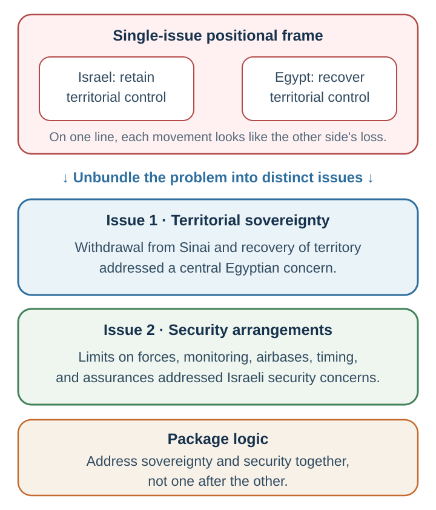

---
aliases:
  - 33-interests-priorities-and-trade-offs.html
---

# Integrative Negotiation {#creating-value-across-differences}

*Creating Value Across Differences*

::: {#chapter-37-start .chapter-epigraph}
> “If you want to make peace with your enemy, you have to work with your enemy. Then he becomes your partner.”
>
> — Nelson Mandela, [*Long Walk to Freedom*](https://www.mpm.edu/sites/default/files/images/exhibitions/special/mandela/edu%20pdfs/Intro%20to%20Nelson%20Mandela%20%28Powerpoint%29.pdf), 1994, quoted in the official Mandela exhibition
:::

[]{#why-would-a-supplier-refuse-a-million-pound-order}In a reported negotiation case, a large buyer and a small European supplier have agreed on $18 per pound for one million pounds of an ingredient each year. The buyer will invest in a new product only if competitors cannot obtain the ingredient, yet the supplier refuses exclusivity—even after the buyer offers minimum orders and more money. The commercial opportunity is substantial, but the condition that makes the investment worthwhile is the very condition the supplier rejects. Raising the price again may simply make an unworkable proposal more expensive. What would the buyer need to learn before deciding whether this agreement is possible?

Write one sentence you would say at the table. Before offering another concession, try asking, “Help me understand what selling outside this agreement protects for you.” In the teaching case, the supplier's objection concerned an existing promise to sell only 250 pounds a year to a cousin. A narrowly tailored exception could protect that relationship while giving the buyer commercial exclusivity. Malhotra and Bazerman (2007) report the case with identifying details changed. Its practical lesson is to diagnose the interest before paying to move the position.

The refusal looked puzzling because the buyer had not understood what exclusivity would cost the supplier. We will use that gap to examine how questions reveal priorities, how differences support trades, and how to check whether the resulting package improves on each side’s alternative.

::: {.callout-note .core-idea icon=false}
## Core Idea

A disagreement over one term can hide an opportunity elsewhere. When parties value issues differently, they may each gain by trading something less important for something more important. Discovering such trades requires questions about interests and priorities, followed by a comparison of the whole package with each side’s alternative.
:::

## Learning goals

- Diagnose the interests and constraints hidden beneath a stated position.
- Build a priority map that identifies differences capable of creating joint value.
- Produce and evaluate a package trade that improves both parties without surrendering distributive discipline.

::: {.callout-tip .predict-first icon=false}
## Watch and diagnose: position versus interest

[Predict first]{.reading-label}

Watch [“Focus on interests, not positions”](https://youtu.be/QCT1BWZByko). Pause before the explanation and write (1) the visible positions, (2) at least two possible interests behind each, and (3) the question that would distinguish those hypotheses.
:::

The buyer still wants a good price, and the supplier still wants a margin. Discovering a useful exception does not end that conflict; it gives the parties a better package within which to bargain. **Value creation** changes what is available, while **value claiming** determines how the benefits are divided.

The same distinction matters when the stakes extend far beyond a commercial contract. The Camp David negotiations illustrate why separating issues can open possibilities that a single disputed demand conceals. In the Egypt–Israel strand of the Camp David process, an official U.S. account describes Egypt pressing for Israeli withdrawal from the Sinai in exchange for security arrangements; the negotiations also addressed settlements, airbases, timing, implementation, and Palestinian questions. The issue split in @fig-camp-david-two-issue shows how separating territorial sovereignty from security arrangements made a multi-issue package conceivable (U.S. Department of State, Office of the Historian, n.d.).

The 1978 framework paired a return to full Egyptian sovereignty with security zones, limits on forces and armaments, phased Israeli withdrawal, and transfer of Sinai airfields to Egyptian civilian control (Carter, 1978). A peace treaty followed in 1979. Separating sovereignty from military arrangements allowed a package that a simple division of the land could not express. The design lesson is to specify the different functions of a disputed resource, then ask whether those functions can be governed separately.

{#fig-camp-david-two-issue fig-alt="A single-issue frame contrasts Israel retaining territorial control with Egypt recovering it. Two issue cards separate Egyptian territorial sovereignty from security arrangements addressing Israeli concerns. The package combines the issues instead of requiring a compromise along one territorial line." style="width:100%;min-width:0;max-width:100%;max-height:none;height:auto;"}

This creates a central tension. To create value, negotiators must often share information about their interests, priorities, constraints, and preferences. But sharing information can make them vulnerable when value is later claimed. If I tell you that delivery speed matters more to me than price, you may use that information to demand a higher price. If you tell me that you have no strong alternative, I may push harder. If I reveal that one issue is easy for me to concede, you may ask for it without giving anything back.

Lax and Sebenius (1986) call this the negotiator’s dilemma: the tension between cooperative moves that create value and competitive moves that claim value. Too little openness prevents value creation. Too much openness can lead to exploitation.

Manage this tension through staged, reciprocal disclosure. Explaining why a delivery date matters may reveal a possible trade without disclosing the highest price you would pay. A conditional offer—“If we guarantee volume, can you reserve capacity?”—then tests the trade.

Keep the [preparation from Chapter 36](36-preparing-and-claiming-value.qmd#chapter-36-start): your alternative, walk-away point, and target. Creating more value does not ensure that you receive an acceptable share.

## Creating value beyond splitting the difference {#compromise-is-not-integration}

Splitting the difference can be a reasonable way to settle a distributive issue, but it may conceal a better trade. Before choosing a midpoint, check whether the parties need different things from the disputed term.

In the supplier case, offering more money for complete exclusivity is positional compromise: the buyer moves on price and expects the supplier to move on exclusivity. It still treats “exclusive or not” as one line. Interest discovery changes the option. The buyer needs commercial protection for a major investment; the supplier needs to honor a small family commitment. A carve-out for the existing 250-pound sale can protect both. No one split exclusivity in half. The parties changed its scope.

The exception works only if the buyer’s commercial protection is preserved and the family commitment can be defined and verified. Integration changes the option being considered.

### Discover compatibility beneath apparent conflict {#vietnamese-prunes}

Apparent competition for the same resource can disappear when the parties discover that they need it for different purposes. The Vietnamese prunes exercise makes this possibility concrete. Two parties compete for the same batch of fruit. One needs the fruit's mash; the other needs its pits. If each asks only how much the other will pay for the prunes, they can conduct an elaborate distributive negotiation over a conflict that their actual uses do not require (Zhang, 2022a).

In a simplified classroom version, assume the parts can be separated without damaging either use and at negligible cost. Splitting the batch gives each side only part of what it needs. Allocating all the mash to one and all the pits to the other can satisfy both. Begin with “What do you need the prunes for?” and follow with questions about quantity, quality, timing, and processing. Then check who will separate the parts, bear the cost, and verify delivery. A good idea still needs an operating arrangement.

This is **illusory conflict**: the parties initially perceive incompatible goals where compatible interests are available. Mistrust can keep those interests hidden. One side may fear that explaining its use will invite a higher price; the other may interpret reluctance as evidence of hostility. A limited, reciprocal exchange about intended uses can be enough to discover the compatibility without disclosing either side's maximum payment.

A mechanical compromise can also destroy the usefulness of a package. If one person wants a matching pair of brown shoes and another wants a matching pair of black shoes, giving each one shoe of each color can satisfy neither. A fifty-fifty division is a division rule; whether it meets the underlying needs depends on what the parties can use. The right question is what each would gain from the proposed allocation.

For a teaching debrief, record the moment a question changed the apparent conflict. If no such question was asked, identify what assumption prevented it. The same analysis can accompany the linked position-versus-interest video: distinguish a change in the resource from a change in the parties' understanding of it.

## Barriers to value creation

A useful trade depends on discovering how the parties differ, yet the conversation can make those differences hard to reveal. A negotiator may treat every gain for the other side as a loss, hide a priority that could support a trade, or read a firm position as the whole interest. The result can be an avoidable impasse—or an agreement that costs both sides more than necessary. The barriers below identify what blocks the search.

A **fixed-pie belief** treats the available value as fixed, so one side’s gain must be the other’s loss. Such beliefs and inaccurate judgments about the counterpart can hide compatible interests and differences in priorities (Thompson & Hastie, 1990). The diagnosis in @tbl-value-creation-barriers separates this problem from missing information and an unhelpful bargaining process:

| Barrier family | Typical failure | Corrective move |
| --- | --- | --- |
| Beliefs | Fixed-pie assumptions, illusory conflict, overconfidence, self-serving fairness, or reactive devaluation make compatibility invisible (Ross, 1995; Thompson & Hastie, 1990). | State the competing hypothesis, evaluate proposals independently of their source, and identify what evidence would revise the forecast. |
| Information | Mistrust, weak listening, and fear of appearing vulnerable prevent priorities and constraints from becoming recoverable. | Ask diagnostic questions, disclose interests progressively, and reciprocate useful information without revealing exact limits automatically. |
| Process | Positional or single-issue bargaining converts every term into a separate fight. | Expand the issue set, compare packages, and defer final commitment until trade-offs can be evaluated together. |
: Three families of barriers to value creation {#tbl-value-creation-barriers}

Use the diagnosis to decide what to try next. A question can test an assumed conflict; a package comparison can test whether different priorities support a trade. If those tests reveal no acceptable package, insisting that “there must be a win-win” would replace inquiry with pressure to agree.

[]{#interests-behind-positions}

[Chapter 35](35-negotiation-as-joint-decision-design.qmd#positions-interests-and-issues) distinguished a position from the interest it protects. Here that distinction becomes a search procedure. Galinsky and colleagues (2008) found that instructed perspective-taking could improve outcomes in negotiation tasks. The [communication research](33-communication-language-is-not-a-file-transfer.qmd#ask-rather-than-merely-imagine) supplies a complementary discipline: get new information through questions and let the counterpart correct the account (Eyal et al., 2018). The same demand for exclusivity might protect investment, quality control, brand consistency, or an internal promise. Each diagnosis implies different packages.

The question “What is this term meant to protect?” is a useful opening. Follow the answer with a concrete test: “Would a named exception meet that concern, or is a wider freedom to sell important?” Also ask who must approve the deal. A term may protect an obligation to someone outside the room.

## Preparing across issues

List the negotiable issues and distinguish your priorities from guesses about theirs. The supplier case includes exclusivity, volume, timing, investment, price, and quality. Which of these can move, and what would each movement cost?

Build a two-sided preparation sheet before bargaining. For each issue, write your position, underlying interest, and priority; then record the counterpart's stated position separately from your hypothesis about its interest. A priority rank tells you what matters more, while a threshold tells you what cannot be traded away. Add your BATNA, target, and reservation package beneath the issue list, together with your current estimates for the other side. During the conversation, replace assumptions with what you learn and note which question or proposal justified the update (Zhang, 2022c).

The hypotheses in @tbl-33-1 identify possible differences that could support a trade. Priorities, costs, risk attitudes, and time horizons are distinct sources of difference; each row names the comparison being proposed. Update the hypotheses as the counterpart explains or chooses between packages.

| Issue | Possible difference to investigate | Potential trade |
| --- | --- | --- |
| Price / salary | Both sides may give the material term high priority. | Use standards; do not expect easy integration. |
| Timing | One side may value speed strongly while the other has more flexibility. | Trade speed, start date, or staging for value elsewhere. |
| Risk allocation | The sides may differ in willingness to bear risk or forecasts of the outcome; check which difference is present. | Use warranties, insurance, or contingent terms. |
| Recognition / title | Recognition may cost one side little while carrying high symbolic value for the other. | Trade status or visibility for a material term. |
| Future relationship | The sides may value short-term and longer-term outcomes differently. | Use volume, renewal, review, or option clauses. |
: Illustrative hypotheses about differences to test, not facts about a counterpart {#tbl-33-1}

[]{#discover-priorities-rather-than-guessing-them}

The phrase “Which issues matter most?” is a start, not a complete diagnosis. Use several low-risk tests:

1. **Quick rank:** Ask each side to order the issues from most to least important.
2. **Label and confirm:** Offer a tentative inference—“It sounds as if delivery reliability matters more than customization; have I understood that correctly?”
3. **Allocate 100 points:** Spread 100 points across issues to force explicit trade-offs. Do this separately before sharing, then compare patterns rather than exact scores.
4. **Ask thresholds:** “What is a must-have, what is a preference, and what is flexible?” A threshold is different from a ranking.
5. **Run a small reaction test:** Offer two safe packages that differ on one trade and observe which direction is preferred.

As packages become concrete, priorities may change and a “deal-breaker” may reveal a previously unexamined interest. Mirror the answer back, ask what evidence supports it, and update throughout the conversation.

## Logrolling

Suppose a supplier wants a longer contract for predictable revenue, while the buyer wants delivery flexibility because demand is uncertain. Bargaining over each demand in isolation makes the requested concession look like a cost with nothing in return. Considering them together creates another possibility: the buyer offers a longer commitment in exchange for flexible quantities.

**Logrolling** means trading across issues based on differences in priorities. Each side gives way on issues it values less in exchange for gains on issues it values more. The question is which linked concessions improve the whole package for both sides.

Test the relative priorities through a conditional package: “If we commit for longer, could you allow more flexible quantities?” This reveals a possible trade without disclosing either reservation value. The counterpart may accept the logic, reject the assumed cost, or propose another exchange. Each response improves the map.

Settling price, delivery, warranty, and timing one at a time can use up those opportunities before their connections become visible. Keep the linked concessions conditional until the whole package can be assessed.

[]{#an-information-strategy-for-creating-and-claiming-value}

Not every piece of information does the same work. Some information mostly affects value claiming; other information is needed to create value. The separate columns in @tbl-33-information-matrix make this trade-off explicit (Fisher et al., 2011; Thompson et al., 2010).

| Information | Effect on claiming value | Effect on creating value | Sensible default |
| --- | --- | --- | --- |
| BATNA and reservation value | Exact disclosure often weakens leverage; credible constraint disclosure can prevent impasse. | Usually not needed to discover trades. | Protect exact limits; disclose only for a clear process or agreement benefit. |
| Position or opening demand | Opacity and an ambitious opening can help claim value. | A position alone reveals little about how to enlarge the pie. | State it with a legitimate reason, then move to interests. |
| Interests | Disclosure can expose where pressure would hurt. | Essential for inventing alternative ways to solve the problem. | Share progressively and reward reciprocity. |
| Priorities | May reveal which concessions are cheap or costly. | Essential for logrolling and claiming a share of the enlarged surplus. | Reveal relative priorities through questions, packages, and conditional trades. |
| Key facts | Information asymmetry can create bargaining power, but concealment may be unlawful or unethical. | Accurate material facts improve agreement quality and implementation. | Verify and disclose facts required for informed consent or performance. |
| Substantiation | Reasons and evidence strengthen a claim. | Shared standards can reduce conflict and support joint search. | Use real evidence; avoid ploys that damage trust. |
: What different kinds of information do in negotiation {#tbl-33-information-matrix}

Handle material facts according to disclosure duties, safety, and informed consent.

## Differences are opportunities

Even after priorities are clear, the parties may disagree about what will happen or what it will cost to deliver. Trying to settle those differences by winning the argument can leave a useful trade unexplored. One party may have spare capacity, another may need earlier delivery, or one may bear a particular risk more cheaply. Different forecasts can also motivate a contingent term: payment varies with a later outcome rather than requiring agreement about it now. [Chapter 38](38-designing-better-agreements.qmd#use-contingent-terms-when-forecasts-differ) explains the conditions that make such terms workable.

Treat a difference as a question about the package. “If you value reliable volume more than a fixed monthly schedule, could we combine an annual commitment with flexible call-offs?” This searches for value without requiring either party to adopt the other’s preferences.

The sources of trade in @tbl-negotiation-sources-of-trade call for different terms. A disagreement about how likely a loss is differs from a disagreement about how painful the same loss would be.

| Difference | Why a trade may help | Example to investigate |
| --- | --- | --- |
| Valuation | The same item or term matters more to one side | Trade the apples you value less for the oranges you value more |
| Time preferences or financing costs | Receiving or paying earlier has different value to each side | A discount for early payment, if financing costs support it |
| Risk-bearing capacity | One side can absorb or pool a risk more cheaply | Insurance, a warranty, or sharing a variable cost |
| Capabilities | Specialization can lower the cost of meeting both parties' needs | One party supplies design expertise while the other supplies production capacity |
| Beliefs about future outcomes | The parties value an outcome-dependent payment differently | A sales royalty, milestone bonus, or other contingent payment |
: Differences that can support value creation {#tbl-negotiation-sources-of-trade}

There is little reason to persuade someone to prefer apples when their preference for oranges supports an exchange. Forecast differences require more care: a bet can make both parties optimistic without increasing the underlying resource. Chapter 38's MPharm case follows that distinction through the numbers and incentives.

## Pareto efficiency

{#fig-pareto .phone-fit fig-alt="A square plot has value to the seller on the horizontal axis and value to the buyer on the vertical axis, both from 0 to 100. A downward-curving Pareto frontier bounds the shaded feasible agreements. A creating-value arrow moves northeast from an interior agreement to the frontier, improving both outcomes. A two-headed claiming-value arrow follows the frontier: more for one party means less for the other."}

Both parties can prefer a deal to walking away and still leave gains undiscovered. Agreement answers whether the package is acceptable; it does not tell them whether another package could improve one side’s outcome without costing the other. To judge how well the negotiation used the available value, they need a second benchmark.

An agreement is Pareto efficient **relative to a specified feasible set** if there is no feasible alternative that at least one specified party prefers while no specified party is worse off. The parties may still argue about distribution, rights, or implementation, but no Pareto improvement remains within the parties, issues, constraints, and value measures included in that comparison.

A Pareto frontier is the set of Pareto-efficient agreements under those specifications. In the schematic example in @fig-pareto, creating value moves the agreement northeast toward the frontier, improving both parties' outcomes. Claiming value changes the division along the frontier: one party gains while the other gives up value. Both axes use a 0–100 scale for the illustration, with each party's scores interpreted separately.[^ch37-value-units] Actual feasible sets may contain discrete packages, have a different shape, or be only partly known.

For a separate four-package example, assign **hypothetical, party-specific scores** to the contract-length and delivery trade.

| Package | Buyer’s score | Supplier’s score |
| --- | --- | --- |
| Short contract, fixed quantities | 30 | 30 |
| Short contract, flexible quantities | 100 | 0 |
| Long contract, fixed quantities | 0 | 100 |
| Long contract, flexible quantities | 70 | 70 |
: A trade across differently valued issues {#tbl-37-package-scores}

In @tbl-37-package-scores, moving from short/fixed to long/flexible raises both scores from 30 to 70. Within this four-package menu, every package except short/fixed is nondominated: improving one party beyond its score in any of them would hurt the other. The scores need not be comparable across parties, so adding the columns would not measure social welfare.

Pareto efficiency does not mean fairness. One efficient package can favor one party relative to another efficient package. Efficiency asks whether a specified feasible mutual improvement remains; fairness asks whether the rights, process, risks, and division are defensible. A complete negotiation must consider both, and must also ask whether important parties or issues were excluded from the map.

Suppose walking away scores 40 for the buyer and 45 for the supplier. Only the long/flexible package in this menu beats both alternatives. Efficiency and acceptability therefore answer different questions; neither can be inferred merely from a signature.

## Build and test complete packages {#build-the-supplier-package}

A complete package links the proposed concessions so that each side can compare the combined gains, costs, and constraints. The buyer and supplier can now replace isolated demands with linked terms. The exclusivity exception in @tbl-33-supplier-package follows the reported teaching case; the remaining rows are proposed extensions for exploring a fuller agreement, rather than reported terms from that case:

| Issue | Buyer values | Supplier values | Package move |
| --- | --- | --- | --- |
| Exclusivity | Protection of the product investment | Honoring the existing family commitment | Commercial exclusivity with a named 250-pound legacy exception. |
| Volume | Reliable capacity | Predictable revenue | Annual minimum volume with quarterly call-off forecasts. |
| Timing | Delivery before production milestones | Protection from uncontrollable schedule risk | Staged delivery and jointly defined dependency dates. |
| Price and investment | Competitive unit economics | Recovery of dedicated-capacity cost | Volume tiers plus a contribution to verifiable capacity investment. |
| Quality | Reliable inputs | Clear acceptance criteria | Shared specifications, inspection, cure periods, and review. |
: Turning differences into a supplier package {#tbl-33-supplier-package}

The proposed links give the parties something concrete to evaluate. They still need to check whether the trades create gains, decide how to divide any gains, and compare the result with their alternatives. A package worth accepting also needs promises that can be measured and fulfilled, which is the task of the next chapter.

[]{#integrative-search-and-decision}

The search can be organized as a repeated decision. First assess resources and alternatives. Next investigate differences in interests, priorities, capabilities, and forecasts. Construct linked offers, then compare the best available package with both sides' requirements. A rejected package is useful information when it identifies a constraint or an unexplored trade.

If a promising change remains, return to the issue map and test it. If no feasible revision is worth the time and cost, use the alternative to agreement. When both sides accept, move to implementation rather than assuming the search itself has specified every obligation. A later, voluntary search for improvements can use the signed deal as its protected fallback—the post-settlement procedure developed in Chapter 38. This repeated search links assessment, proposal, decision, and implementation (Zhang, 2022c).

One useful way to test a revision is to offer several packages you value approximately equally and ask which the counterpart prefers. These **multiple equivalent simultaneous offers**, or **MESOs**, turn a general question about priorities into a concrete comparison. The next chapter shows how to construct the offers, check their equivalence, and learn from the response.

## Practice Lab

Begin with @tbl-37-package-scores: identify the dominated package and compare each remaining package with the stated walk-away scores. Then use the opening supplier case to draft three more realistic packages. The reported case does not supply complete valuations or BATNAs, so label any scoring assumptions you introduce and identify the information needed to replace them. In pairs, assign roles and exchange rankings or conditional package preferences before revealing exact limits. Working alone, write two plausible priority maps and the question that would distinguish them. Revise one package after that check.

Use the prunes exercise as a short diagnostic first: identify whether the obstacle was opposed interests, undisclosed uses, mistrust, or processing cost. In the fuller supplier negotiation, compare this diagnosis with your own process. Did you settle an issue before discovering what it could purchase on another issue? Did a question or package reveal a priority you had guessed incorrectly? Record the remaining possible improvement before calling the agreement efficient.

## Take it forward

When a term seems immovable, ask what it is protecting. A delivery date, a price, or a quantity may stand for a concern that another package could satisfy. Finding that difference creates a possible trade; deciding whether the trade is fair and workable remains part of the negotiation.

[^ch37-value-units]: Party-specific value scores need not have comparable units, so their sum is not a measure of total welfare.

## References cited in this chapter

::: {.reference}
Carter, J. (1978, September 17). Letter from President Carter to Soviet General Secretary Brezhnev. In *Foreign Relations of the United States, 1977–1980, Volume VI, Soviet Union* (Document 144). U.S. Department of State, Office of the Historian. https://history.state.gov/historicaldocuments/frus1977-80v06/d144
:::

::: {.reference}
Eyal, T., Steffel, M., & Epley, N. (2018). Perspective mistaking: Accurately understanding the mind of another requires getting perspective, not taking perspective. Journal of Personality and Social Psychology, 114(4), 547–571. https://doi.org/10.1037/pspa0000115
:::

::: {.reference}
Fisher, R., Ury, W., & Patton, B. (2011). Getting to yes: Negotiating agreement without giving in (3rd ed.). Penguin.
:::

::: {.reference}
Follett, M. P. (1940). Constructive conflict. In H. C. Metcalf & L. Urwick (Eds.), *Dynamic administration: The collected papers of Mary Parker Follett* (pp. 30–49). Harper & Brothers. (Address delivered 1925; first published 1926.) https://archive.org/details/dli.ernet.18299
:::

::: {.reference}
Galinsky, A. D., Maddux, W. W., Gilin, D., & White, J. B. (2008). Why it pays to get inside the head of your opponent: The differential effects of perspective taking and empathy in negotiations. Psychological Science, 19(4), 378–384. https://doi.org/10.1111/j.1467-9280.2008.02096.x
:::

::: {.reference}
Lax, D. A., & Sebenius, J. K. (1986). The manager as negotiator: Bargaining for cooperation and competitive gain. Free Press.
:::

::: {.reference}
Malhotra, D., & Bazerman, M. H. (2007). Investigative negotiation. *Harvard Business Review, 85*(9), 72–78. https://hbr.org/2007/09/investigative-negotiation
:::

::: {.reference}
Ross, L. (1995). Reactive devaluation in negotiation and conflict resolution. In K. Arrow, R. H. Mnookin, L. Ross, A. Tversky, & R. Wilson (Eds.), Barriers to conflict resolution (pp. 26–42). W. W. Norton.
:::

::: {.reference}
Thompson, L. L., & Hastie, R. (1990). Social perception in negotiation. Organizational Behavior and Human Decision Processes, 47(1), 98–123.
:::

::: {.reference}
Thompson, L. L., Wang, J., & Gunia, B. C. (2010). Negotiation. Annual Review of Psychology, 61, 491–515.
:::

::: {.reference}
U.S. Department of State, Office of the Historian. (n.d.). The Camp David Accords and the Arab-Israeli peace process. https://history.state.gov/milestones/1977-1980/camp-david
:::

::: {.reference}
Zhang, H. (2022a). *Understanding negotiation* [Unpublished lecture notes, Decision, Persuasion, and Negotiation]. University of Southern Denmark.
:::

::: {.reference}
Zhang, H. (2022c). *Integrative negotiation* [Unpublished lecture notes, Decision, Persuasion, and Negotiation]. University of Southern Denmark.
:::
