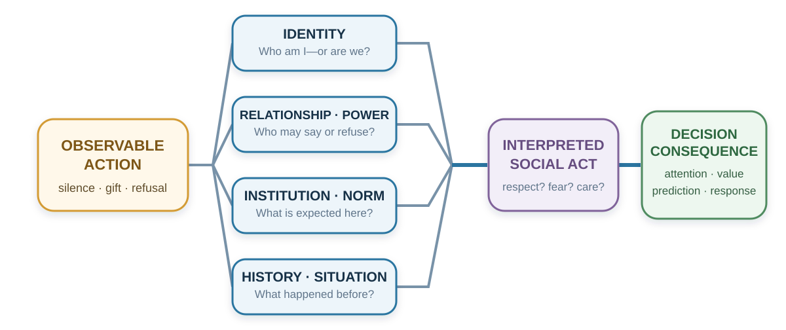

# Culture and Identity: The Same Action Is Not the Same Act

*People choose inside worlds of meaning*

::: {.callout-note .core-idea icon=false}
## Core Idea

Social behavior is never interpreted in a vacuum, and culture and identity can shape what options, actions, and relationships mean. But the same observable act may communicate respect, weakness, honesty, obligation, care, or insult across settings, while group averages remain poor diagnoses of any particular person. Therefore this chapter uses culture and identity as hypotheses for a meaning audit: identify the local relationship and institution, then test what the action means here.
:::

## Learning goals

- Use four lenses—salient self, sanction strength, hierarchy and face, and local relational meaning—to interpret an ambiguous action.
- Distinguish group-level tendencies from individual diagnosis and generate evidence that could correct a cultural interpretation.
- Redesign one meeting or decision process so disagreement, dignity, and local verification can coexist.

::: {.callout-note .loop-location icon=false}
## Where this chapter enters the loop

Culture and identity shape **Notice**, **Interpret**, and **Value** before choice. They influence what an action means, which self is salient, who can speak, and what disagreement costs.
:::

The preceding chapter showed that authority, silence, and apparent agreement can suppress evidence or diffuse responsibility. But none of these signals has one context-free meaning. Before inferring motive or designing influence, we must ask how identity, hierarchy, relationship, and institution turn an observable behavior into a social act.

## Opening puzzle: what did the silence mean?

A senior manager presents a proposal to an international project team and asks, “Does everyone agree?” Nobody speaks.

The manager has several possible stories:

- The team agrees.
- The team is disengaged.
- Junior members disagree but do not believe open challenge is safe.
- People need more time to think.
- The question is too broad.
- Silence shows respect for the leader.
- Everyone is waiting for the person with formal responsibility.
- Members expect disagreement to be raised privately.

The physical event is the same in every story: no one speaks. The social act is not.

If the manager assumes agreement, the project moves ahead. If silence meant caution or fear, the organization has converted a meaning error into a decision error. More data about the proposal will not repair the problem until someone asks what silence means here.

This is where culture enters decision-making. Culture is not an ornament added after “real” economic or psychological analysis. It helps define the action being analyzed. A payment can be a wage, gift, bribe, apology, insult, or repayment. A concession can be weakness, pragmatism, respect, or generosity. A direct answer can be honest in one relationship and needlessly humiliating in another.

The central question of this chapter is:

> What does this option mean to this person, in this relationship, institution, and moment?

{#fig-culture-meaning-map fig-alt="An observable action branches through four evenly spaced meaning lenses: identity; relationship and power; institution and norm; and history and situation. The branches converge into an interpreted social act, which changes attention, value, prediction, and response. A final rule says to use culture to generate questions about meaning, not answers about a person."}

## Culture is a meaning environment

Culture is often introduced through visible differences: language, food, clothing, ritual, or holiday. These matter, but they do not capture its decision function. Culture is a system through which people learn what events signify, which motives are legitimate, what emotions fit a situation, who may speak, what counts as fairness, and what kind of person an action reveals.

Geertz (1973) described people as living within webs of significance they have collectively created. Swidler (1986) described culture as a repertoire of stories, symbols, practices, and strategies of action. Both perspectives move culture away from the idea of a single program stored inside a national mind. Culture is a shared interpretive environment.

That environment is distributed across:

- language, stories, categories, metaphors, and jokes;
- roles, relationships, rituals, and conflict scripts;
- laws, markets, schools, families, professions, and religious institutions;
- meeting rules, office layouts, grading systems, dashboards, and technologies;
- what is rewarded, punished, celebrated, excused, or left unsaid.

These elements enter the decision loop early. They shape whether a situation is categorized as a personal preference, family duty, market transaction, moral obligation, status contest, or loyalty test. They affect which options feel available: Can I say no? May I negotiate? Is asking for help competent or shameful? They shape value: Is public recognition a reward or an embarrassment? They shape prediction: Will disagreement produce learning, rejection, or loss of face?

Culture does not eliminate agency. People inherit, combine, contest, and revise cultural repertoires. They may follow one script at home, another in a profession, and a third among friends. Culture is therefore neither a prison nor a costume. It is a meaning environment within which agency becomes intelligible.

## A cultural tendency is not a diagnosis

It is tempting to turn culture into a country-level answer: “People from group A are direct; people from group B are collective.” This is efficient and often wrong.

Every named group contains variation by generation, region, class, gender, religion, profession, organization, language, migration history, and personal experience. People move among cultural worlds. Situations activate different scripts. Cultures change. National averages can conceal large overlap between distributions and can become stale when institutions and populations change.

Research samples also deserve scrutiny. Henrich, Heine, and Norenzayan (2010) warned that findings from Western, educated, industrialized, rich, and democratic populations had often been treated as universal human psychology. The correction is not to replace one universal stereotype with a catalogue of national stereotypes. It is to test how a mechanism depends on institutions, histories, meanings, and samples.

Use cultural knowledge as a **hypothesis generator**:

> “This silence may protect face or reflect hierarchy; I should ask how disagreement is expressed here.”

Do not use it as an identity verdict:

> “They are silent because people from that country do not disagree.”

The first formulation expands interpretation and invites evidence. The second closes interpretation and mistakes a group label for a cause.

::: {.callout-caution .evidence-and-boundary-conditions icon=false}
## Cultural dimensions do not diagnose a person

Cultural dimensions describe tendencies under specified measures and samples. They do not assign a trait to every member of a nation, explain every behavior, or remain constant across situations and time. Person, role, organization, power, language, and current incentives are competing explanations.
:::

## Lens 1: Which self or identity enters the decision?

Markus and Kitayama (1991) distinguished two influential ways of construing the self.

An **independent self-construal** emphasizes autonomy, bounded individuality, internal preferences, abilities, and personal goals. An **interdependent self-construal** emphasizes relationships, roles, obligations, and adjustment to significant others. Most people can experience both. The useful question is which form of self a setting makes salient and legitimate.

Consider a job offer.

An independent framing foregrounds:

- What work expresses my interests?
- Where will I grow?
- Which option fits my strengths and ambitions?

An interdependent framing also foregrounds:

- What will this choice require from my family?
- Which obligations and relationships would it strengthen or strain?
- What role am I expected to fulfill?
- Whose opportunity or security depends on my choice?

Neither frame is inherently rational or irrational. Each brings values and opportunity costs into view. Trouble begins when an adviser treats one self-model as natural and the other as interference.

Self-construal can also shape attention and explanation. Reviews of cultural cognition have found broad, context-dependent tendencies toward more analytic attention to focal objects in some settings and more holistic attention to relations and context in others (Nisbett et al., 2001). Experiments have reported differences in how objects are judged relative to their visual frames (Kitayama et al., 2003). Attribution studies have found variation in the weight placed on dispositions, situations, and relationships when explaining behavior (Miller, 1984; Morris & Peng, 1994).

### A three-object prediction

Before reading on, choose the two things that most naturally belong together.

{#fig-culture-triad-monkey-panda-banana fig-alt="An original textbook illustration shows a monkey and a giant panda above a banana, evenly spaced on a warm neutral background." width="82%"}

**Monkey + panda** share a taxonomic category: both are animals. **Monkey + banana** share a functional relationship: a monkey may eat a banana. The first pairing foregrounds focal-object similarity; the second foregrounds relation and context. Neither answer diagnoses a culture or a person. The prompt makes a quieter point: categorization itself depends on what kind of similarity the current setting has trained us to notice. Ask for the reason before interpreting the choice.

These findings do not divide the world into people who see objects and people who see contexts. They establish a design question: **What is the current environment training people to notice and treat as causal?**

A manager may read silence as absence of opinion; a team member may use silence to protect hierarchy or allow collective reflection. A student may not volunteer because they are unprepared, because public error threatens face, because the teacher has not invited junior voices, or because the language of instruction makes rapid entry difficult. “Passive” is not yet an explanation.

## Lens 2: How tightly is deviation sanctioned?

Norms vary in strength. Gelfand and colleagues (2011) use **tightness** for contexts with strong norms and low tolerance for deviation and **looseness** for contexts with weaker norms and greater tolerance for variation.

Tightness can support coordination, predictability, and safety. It may be adaptive where errors spread quickly or collective discipline is essential. Looseness can support experimentation, difference, and improvisation. It may be adaptive where exploration and adaptation matter.

Each also has a failure mode:

| Norm environment | Possible strength | Possible failure |
| --- | --- | --- |
| Tighter | Reliability, coordination, clear expectations | Suppressed dissent, conformity, exclusion, low experimentation |
| Looser | Innovation, flexibility, tolerance of difference | Ambiguity, inconsistent execution, weak coordination |
: Tightness and looseness are context-dependent trade-offs {#tbl-culture-tight-loose}

A hospital operating room and an early-stage design studio may rationally need different levels of deviation. Even within one organization, medication verification can be tight while idea generation remains loose. The design problem is fit, not ideological preference.

Historical threats, ecological danger, scarcity, and coordination demands can help explain why tighter norms emerge (Gelfand et al., 2011). That explanation should not become a moral ranking. A useful audit asks: Which errors are costly enough to justify a strong norm? Where would tolerance improve learning? Who is protected by the rule, and who is silenced?

## Lens 3: How do hierarchy and face filter information?

Power distance refers to the degree to which unequal power is expected or accepted. Hofstede's (1980) national dimensions made the concept prominent in management research. They can offer rough questions, but national scores should not be used as personality tests; samples age, nations are internally diverse, and local organizations may reverse a national tendency.

The mechanism matters more than the score. Hierarchy shapes:

- who is expected to decide;
- who may ask questions or deliver bad news;
- whether a junior person can contradict a senior person in public;
- whose uncertainty is interpreted as care and whose as incompetence;
- which statements anchor the group before independent views appear.

If the senior person speaks first, others do not reveal independent evidence under the same conditions. If dissent carries career risk, silence is not a clean measure of agreement. Hierarchy can therefore degrade the information available to the hierarchy itself.

The solution is not always to eliminate authority. Some roles require accountable decisions. The solution is to design an information path that does not require courage at every step: independent judgments before discussion, explicit invitations to junior expertise, alternative channels for concern, leaders who name uncertainty, and a rule that disagreement addresses the proposal rather than the person's loyalty.

### Face, honor, and dignity: what else is at stake?

Material outcomes rarely exhaust the stakes of an interaction.

**Face** is socially recognized worth in an encounter. Face-work protects one's own and others' standing (Goffman, 1955). Face-negotiation theory further asks whether conflict protects self-face, other-face, or mutual face and how cultural context changes those priorities (Ting-Toomey, 1988). A public correction may transmit accurate information while imposing humiliation. Preserving face is not necessarily evasion; it can maintain the relationship required for truth to be heard.

**Honor** centers reputation for strength, loyalty, and willingness to answer threat or insult. Such a logic can become especially important where formal protection is unreliable and reputation deters exploitation. **Dignity** emphasizes worth that does not depend entirely on public reputation. Leung and Cohen (2011) show that face, honor, and dignity are cultural logics with substantial variation within as well as between societies.

Cohen, Nisbett, Bowdle, and Schwarz (1996) tested one narrow version of an honor mechanism. In their 1990s University of Michigan sample, an insult produced a much larger mean cortisol increase among White male students raised in the U.S. South than among those raised in the North. Control and insult were different participants: the comparison is between subjects, not a before-and-after path. The insult condition was experimentally assigned, but regional upbringing was measured rather than randomized. The study therefore identifies a region-by-insult response difference under these conditions; it does not establish that a cultural origin caused the difference. The experiment recruited 173 participants; the cortisol analysis included 169. The figure keeps the design, restricted population, and historical setting visible so that a contextual result does not become a regional personality label.

{#fig-culture-honor-study-redraw fig-alt="An original grouped bar chart shows mean cortisol change of 42 percent in the southern control group and 79 percent in the southern insult group, compared with 39 percent in the northern control group and 33 percent in the northern insult group. A boundary panel identifies experimentally assigned insult, measured regional upbringing, a between-subject comparison, recruited N of 173, analytic cortisol N of 169, and the restricted White male student sample at one university in the 1990s."}

| Event | Face logic may foreground | Honor logic may foreground | Dignity logic may foreground |
| --- | --- | --- | --- |
| Public criticism | Relational standing and mutual face | Whether respect or strength is challenged | Whether the claim is fair to an equal person |
| Apology | Repair and restoration of interaction | Possible responsibility, strength, or status loss | Ownership without loss of inherent worth |
| Concession | Harmony and relationship | Reputation and vulnerability to exploitation | Pragmatic trade consistent with equal standing |
| Insult | Disruption of social order | Threat to reputation requiring response | Offense that need not determine worth |
: Different cultural logics can assign different stakes to the same exchange {#tbl-culture-face-honor-dignity}

These are interpretive possibilities, not country labels. The practical question is: **What social value is at stake besides the material outcome—face, honor, dignity, respect, belonging, legitimacy, or status?**

### Identity turns “What do I want?” into “Who are we?”

People define themselves partly through group membership: profession, family, organization, religion, nationality, political community, university, team, or moral group. Social identity theory and self-categorization theory explain how different group identities become salient and reorganize perception and conduct (Tajfel & Turner, 1979; Turner et al., 1987).

One person may evaluate the same proposal as a researcher, teacher, department member, parent, taxpayer, or citizen. Each identity supplies different standards of value and obligation.

Identity can improve decisions:

- “We protect patients.”
- “People like us report errors early.”
- “We are scientists; we change our minds when evidence changes.”
- “A good negotiator prepares questions before claims.”

Identity can also protect a bad model:

- Criticism of **our** strategy becomes disloyalty.
- Evidence against a political belief becomes an attack on belonging.
- A profession treats outside knowledge as low status.
- An “innovative” organization ignores reliability.
- A “practical” organization dismisses imagination.

Akerlof and Kranton (2000) incorporated identity into economic analysis by showing that acting consistently with an identity can itself carry utility. Oyserman's (2009) identity-based motivation account adds that identity changes how difficulty is interpreted. Difficulty can mean “this is important work people like us persist in” or “this shows that people like me do not belong.”

Identity is therefore not another preference sitting beside salary, time, and risk. It can change what counts as a cost, which evidence receives trust, and which actions enter the option set.

## Lens 4: What does the action mean in this relationship or institution?

Giving someone €50 is physically and arithmetically the same transfer across settings. Socially, it can be:

- payment for work;
- a birthday gift;
- repayment of a debt;
- a tip;
- charity;
- compensation;
- an apology;
- a bribe;
- an insult.

Zelizer (1994) showed that people earmark money and distinguish household money, gift money, wages, inheritance, and other categories even though economic models often treat money as fungible. The category carries relationship and purpose.

This is why incentives are messages as well as prices.

Titmuss (1970) argued that paying for blood could alter the meaning of donation. Experimental and meta-analytic evidence indicates that external rewards can sometimes reduce intrinsic motivation, particularly when experienced as controlling, although effects depend on task and reward conditions (Deci et al., 1999). In day-care centers, introducing a fine for late pickup increased lateness; a plausible interpretation is that the sanction converted a social obligation into a priced service (Gneezy & Rustichini, 2000). Bowles (2008) reviews how policies built for purely self-interested agents can crowd out civic or moral motives.

The conclusion is not “incentives backfire.” Incentives often work. The boundary is that an incentive changes both payoff and meaning.

| Design action | Intended material effect | Possible meaning introduced |
| --- | --- | --- |
| Bonus for helping colleagues | Increase helping | “Helping is paid extra” or “help is valued” |
| Monitoring software | Increase compliance | “We do not trust you” |
| Public ranking | Increase effort | “Colleagues are competitors” |
| Small gift | Express appreciation | Gratitude, obligation, or attempted influence |
| Fine | Deter conduct | Moral sanction or purchasable permission |
: Incentives enter both the payoff and the relationship {#tbl-culture-incentive-meaning}

Silence, directness, and apology are similarly unstable:

- Silence can mean agreement, fear, thought, respect, confusion, boredom, or strategic refusal.
- A direct “no” can mean honesty or disrespect.
- An indirect refusal can mean evasiveness or care.
- An apology can signal responsibility, weakness, humility, legal exposure, or repair.
- Eye contact can signal confidence, aggression, sincerity, or impropriety.

Do not interpret the action only by its physical form. Ask what act it performs within the local relationship.

### Organizations are local cultures

Organizations create meanings at a smaller scale. A start-up may equate speed with intelligence. A hospital may treat caution as professionalism. A university may connect autonomy with academic dignity. A consultancy may mistake polish for competence. A research group may treat criticism as care—or as a status attack.

Schein (2010) distinguishes:

1. **Artifacts:** visible layouts, language, ceremonies, dashboards, routines, and meeting formats.
2. **Espoused values:** innovation, integrity, inclusion, customer focus, safety.
3. **Underlying assumptions:** what success means, who matters, whether people can be trusted, and what happens when bad news arrives.

Decision failure often appears in the gap. A firm praises integrity and rewards only sales. A university praises teaching and promotes mainly publication count. A hospital values safety and punishes error reports. A team praises diversity and accepts only one communication style.

Leaders teach culture through repeated allocation of attention and consequence. What do they ask first? Whom do they promote? What do they tolerate? How do they respond when a forecast fails? Do they thank the person who brings bad news or investigate their loyalty?

Psychological safety makes interpersonal risk less costly and can support team learning (Edmondson, 1999). It does not mean comfort, agreement, or low standards. A useful culture makes it possible to say “I may be wrong,” “I see a risk,” and “the evidence changed” without removing accountability for preparation and performance.

### An organizational culture audit

Do not begin with the values poster. Ask:

- What behavior is rewarded, punished, and promoted?
- What is praised publicly but discouraged privately?
- Who can disagree with whom?
- What happens to the messenger when results are bad?
- Which metric defines success?
- Which contribution remains invisible?
- What do stories about heroes, failures, and difficult clients teach?
- What subject is never safely discussed?

Culture is the meaning system that turns a rule or incentive into lived behavior.

## Cross cultures by asking, not assuming

Cultural intelligence is the capability to learn and act effectively across cultural settings, not a memorized list of national characteristics (Earley & Ang, 2003). It combines knowledge with motivation, metacognition, and behavioral flexibility.

Seven habits make cultural knowledge safer and more useful:

1. **Separate person, role, organization, and culture.** A behavior may reflect temperament, professional training, hierarchy, language fluency, incentive, fatigue, or a local norm.
2. **Ask before interpreting.** “I noticed the room became quiet. How should I understand that?” produces evidence.
3. **Find the local script.** How are disagreement, gratitude, refusal, help, apology, and commitment expressed here?
4. **Attend to power.** Less powerful members may adapt to dominant norms. Observed behavior may show constraint rather than preference.
5. **Expect plural identities.** Bicultural and multicultural people can shift interpretive frames with context (Hong et al., 2000).
6. **Use a cultural hypothesis to open alternatives.** If it makes you certain about the person, it has become a stereotype.
7. **Create shared process explicitly.** Decide how the team will decide, disagree, invite junior voices, interpret silence, give feedback, and repair misunderstanding.

Cross-cultural experience can broaden cognition when people engage and adapt rather than merely travel; living abroad has been associated with creativity under such conditions (Maddux & Galinsky, 2009). Diversity itself does not guarantee learning. If differences remain silent or unsafe, the information never reaches the decision.

## Worked application: redesign the silent meeting

Return to the opening puzzle. The manager can redesign the process without pretending to know why everyone was silent.

**Step 1: Separate observation from interpretation.** Observation: nobody responded to a public yes-or-no question after the senior person presented.

**Step 2: Generate meanings.** Agreement, uncertainty, deference, fear, processing time, language difficulty, private-disagreement norm.

**Step 3: Inspect power and process.** Who spoke first? Was independent thinking possible? Can a junior person disagree publicly without cost?

**Step 4: Ask locally.** In one-to-one conversations or an anonymous channel, ask how concerns are normally raised and what would make disagreement usable.

**Step 5: Change the architecture.** Distribute the proposal in advance. Ask everyone to record risks independently. Invite the most junior or relevant expert before senior commentary. Use “What concern would we regret not discussing?” rather than “Does everyone agree?” Provide a private escalation path.

**Step 6: Learn.** Compare the number, novelty, and usefulness of concerns before and after the redesign. Check whether some members still carry disproportionate social cost.

The design does not assume that direct public speech is always superior. It makes consequential information accessible through more than one culturally loaded channel.

Later chapters apply the same four lenses to persuasion, communication, negotiation, and institutional design. The point here is diagnosis: before changing a message, agreement, or rule, identify which self is active, what deviation costs, how hierarchy filters evidence, and what the proposed act communicates locally.

## Ethics: whose common sense becomes the system?

Designing for culture is not the same as freezing culture. Respect for meaning does not require accepting discrimination, coercion, violence, exclusion, or an unsafe hierarchy as “just cultural.” Nor does a universal value become culturally neutral simply because a powerful institution states it.

An ethical design asks:

- Whose meaning system is treated as common sense?
- Who must translate, adapt, or suppress part of themselves?
- Does the design make participation possible through more than one legitimate style?
- Is cultural knowledge being used to help people understand and choose, or to manipulate identity?
- Are face, dignity, belonging, and material welfare all protected?
- Can people contest the category assigned to them?
- Does accommodation preserve agency, or entrench unequal power?

Pluralism also has limits. Teams still need shared standards for safety, truthfulness, consent, non-discrimination, and accountability. The task is to negotiate those standards explicitly, explain their purpose, and provide fair ways to challenge their implementation.

## The culture-and-identity meaning audit

Before a consequential decision or design, ask:

| Audit question | Decision risk it exposes |
| --- | --- |
| Which identities are active? | Treating a person as an abstract chooser |
| What does each option symbolize? | Missing status, loyalty, care, or belonging |
| What norms determine what can be said? | Mistaking silence for preference |
| Who can disagree with whom? | Information filtered by hierarchy |
| What do acceptance and refusal communicate? | Material offer interpreted as social act |
| Whose script is treated as normal? | Dominant-culture design hidden as neutrality |
| Could an incentive change the meaning of the action? | Crowding out or distrust |
| What local evidence could correct our interpretation? | Stereotype replacing inquiry |
| Who bears the cost of adaptation? | Power and unequal cultural labor |
| Would affected people endorse the design and its identity message? | Efficient influence that reduces dignity or agency |
: A culture-and-identity meaning audit {#tbl-culture-meaning-audit}

The purpose is not to make every decision infinitely complex. It is to prevent one recurring error: assuming that the same material option is the same human option for everyone.

## Practice Lab

Choose one ambiguous action: silence, a direct refusal, a gift, an apology, public praise, a concession, or asking for help. Produce a Meaning Audit with four rows: salient self or identity; sanction strength; hierarchy and face; local relational or institutional meaning. For each row, state a rival interpretation, evidence that would distinguish it, and one perspective-getting question. Finish with a process redesign that prevents interpretation from silently becoming judgment.

## Take it forward

- **Use this when** the same observable behavior can plausibly carry different meanings across roles, relationships, groups, or institutions.
- **Do not infer** an individual's motive or personality from a national average, cultural dimension, or familiar script.
- **Try this next** by asking one non-leading question and changing one process feature that makes disagreement safer.

Once the same action can mean different things across audiences and relationships, influence cannot begin with the message alone. It must begin with the model through which the audience interprets it. Part V takes up that deliberate task through persuasion, communication, and repair.

## References cited in this chapter

::: {.reference}
Akerlof, G. A., & Kranton, R. E. (2000). Economics and identity. Quarterly Journal of Economics, 115(3), 715-753.
:::

::: {.reference}
Bowles, S. (2008). Policies designed for self-interested citizens may undermine “the moral sentiments”: Evidence from economic experiments. Science, 320(5883), 1605-1609.
:::

::: {.reference}
Deci, E. L., Koestner, R., & Ryan, R. M. (1999). A meta-analytic review of experiments examining the effects of extrinsic rewards on intrinsic motivation. Psychological Bulletin, 125(6), 627-668.
:::

::: {.reference}
Earley, P. C., & Ang, S. (2003). Cultural intelligence: Individual interactions across cultures. Stanford University Press.
:::

::: {.reference}
Edmondson, A. C. (1999). Psychological safety and learning behavior in work teams. Administrative Science Quarterly, 44(2), 350-383.
:::

::: {.reference}
Geertz, C. (1973). The interpretation of cultures. Basic Books.
:::

::: {.reference}
Gelfand, M. J., Raver, J. L., Nishii, L., Leslie, L. M., Lun, J., Lim, B. C., Duan, L., Almaliach, A., Ang, S., Arnadottir, J., Aycan, Z., Boehnke, K., Boski, P., Cabecinhas, R., Chan, D., Chhokar, J., D’Amato, A., Ferrer, M., Fischlmayr, I. C., … Yamaguchi, S. (2011). Differences between tight and loose cultures: A 33-nation study. Science, 332(6033), 1100-1104.
:::

::: {.reference}
Gneezy, U., & Rustichini, A. (2000). A fine is a price. *Journal of Legal Studies, 29*(1), 1–17. https://doi.org/10.1086/468061
:::

::: {.reference}
Cohen, D., Nisbett, R. E., Bowdle, B. F., & Schwarz, N. (1996). Insult, aggression, and the southern culture of honor: An experimental ethnography. Journal of Personality and Social Psychology, 70(5), 945-960.
:::

::: {.reference}
Goffman, E. (1955). On face-work: An analysis of ritual elements in social interaction. Psychiatry, 18(3), 213-231.
:::

::: {.reference}
Henrich, J., Heine, S. J., & Norenzayan, A. (2010). The weirdest people in the world? Behavioral and Brain Sciences, 33(2-3), 61-83.
:::

::: {.reference}
Hofstede, G. (1980). Culture's consequences: International differences in work-related values. Sage.
:::

::: {.reference}
Hong, Y.-Y., Morris, M. W., Chiu, C.-Y., & Benet-Martínez, V. (2000). Multicultural minds: A dynamic constructivist approach to culture and cognition. American Psychologist, 55(7), 709-720.
:::

::: {.reference}
Kitayama, S., Duffy, S., Kawamura, T., & Larsen, J. T. (2003). Perceiving an object and its context in different cultures: A cultural look at New Look. Psychological Science, 14(3), 201-206.
:::

::: {.reference}
Leung, A. K.-Y., & Cohen, D. (2011). Within- and between-culture variation: Individual differences and the cultural logics of honor, face, and dignity cultures. Journal of Personality and Social Psychology, 100(3), 507-526.
:::

::: {.reference}
Maddux, W. W., & Galinsky, A. D. (2009). Cultural borders and mental barriers: The relationship between living abroad and creativity. Journal of Personality and Social Psychology, 96(5), 1047-1061.
:::

::: {.reference}
Markus, H. R., & Kitayama, S. (1991). Culture and the self: Implications for cognition, emotion, and motivation. Psychological Review, 98(2), 224-253.
:::

::: {.reference}
Miller, J. G. (1984). Culture and the development of everyday social explanation. Journal of Personality and Social Psychology, 46(5), 961-978.
:::

::: {.reference}
Morris, M. W., & Peng, K. (1994). Culture and cause: American and Chinese attributions for social and physical events. Journal of Personality and Social Psychology, 67(6), 949-971.
:::

::: {.reference}
Nisbett, R. E., Peng, K., Choi, I., & Norenzayan, A. (2001). Culture and systems of thought: Holistic versus analytic cognition. Psychological Review, 108(2), 291-310.
:::

::: {.reference}
Oyserman, D. (2009). Identity-based motivation: Implications for action-readiness, procedural-readiness, and consumer behavior. Journal of Consumer Psychology, 19(3), 250-260.
:::

::: {.reference}
Schein, E. H. (2010). Organizational culture and leadership (4th ed.). Jossey-Bass.
:::

::: {.reference}
Swidler, A. (1986). Culture in action: Symbols and strategies. American Sociological Review, 51(2), 273-286.
:::

::: {.reference}
Tajfel, H., & Turner, J. C. (1979). An integrative theory of intergroup conflict. In W. G. Austin & S. Worchel (Eds.), The social psychology of intergroup relations (pp. 33-47). Brooks/Cole.
:::

::: {.reference}
Ting-Toomey, S. (1988). Intercultural conflict styles: A face-negotiation theory. In Y. Y. Kim & W. B. Gudykunst (Eds.), Theories in intercultural communication (pp. 213-235). Sage.
:::

::: {.reference}
Titmuss, R. M. (1970). The gift relationship: From human blood to social policy. Allen & Unwin.
:::

::: {.reference}
Turner, J. C., Hogg, M. A., Oakes, P. J., Reicher, S. D., & Wetherell, M. S. (1987). Rediscovering the social group: A self-categorization theory. Basil Blackwell.
:::

::: {.reference}
Walton, G. M., & Cohen, G. L. (2011). A brief social-belonging intervention improves academic and health outcomes among minority students. Science, 331(6023), 1447-1451.
:::

::: {.reference}
Zelizer, V. A. (1994). The social meaning of money. Basic Books.
:::
