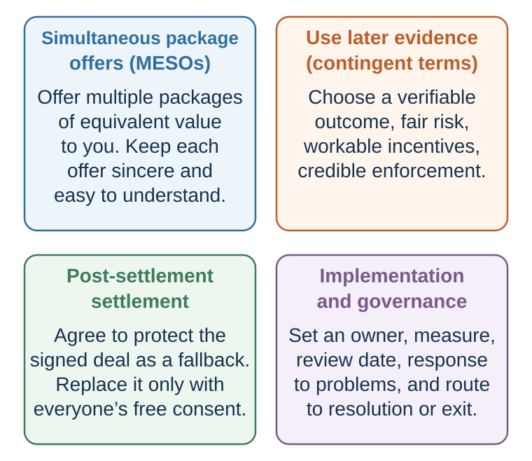

---
aliases:
  - 34-mesos-contingent-contracts-and-better-agreements.html
---

# Designing Better Agreements

*Turn packages, disagreement, trust, and implementation into agreement architecture*

::: {.callout-note .core-idea icon=false}
## Core Idea

Package trades can create value across differences, and agreement design can turn that value into durable terms. But unresolved forecasts, unverifiable claims, unclear authority, and missing review or dispute rules can merely postpone the conflict. Therefore, this chapter turns negotiated value into agreement architecture: use multiple packages to reveal priorities, contingencies to let later evidence test disagreement, staged disclosure and verification to manage trust, and explicit implementation, mediation, and decision rules to govern what happens after yes.
:::

## Learning goals

- Design multiple equivalent packages that reveal priorities without using decoys.
- Write a contingent term with measurable outcomes, aligned incentives, and verifiable data rather than relying on confidence or demeanor.
- Produce an implementation architecture covering cultural meaning, authority, disclosure, review, adaptation, mediation, and arbitration.

::: {.callout-note .loop-location icon=false}
## Where this chapter enters the loop

Agreement design turns a promising package into a decision that can survive the future. Packages reveal priorities; contingencies let later evidence resolve forecast disagreement; staged disclosure and verification manage trust; process rules guide interaction; third parties can assist or decide when direct negotiation fails; and implementation converts promises into observable action and learning.
:::

## Return to the supplier table

The buyer and supplier have identified a promising structure: commercial exclusivity with one legacy exception, minimum annual volume, flexible call-offs, shared capacity investment, quality criteria, and staged delivery. They have created options. They have not yet designed a safe agreement.

Several uncertainties remain. How much capacity is genuinely available? Who bears a delay caused by late forecasts, transport disruption, or supplier failure? How will defect rate be measured? What information can each side verify? Who may change volume, and when? A sophisticated package can merely relocate conflict unless these questions become terms, measures, and review rules.

## 1. Reveal priorities through packages

One powerful tool for discovering integrative agreements is the use of multiple equivalent simultaneous offers, or MESOs.

A MESO is a set of two or more offers made at the same time, each designed to be roughly equal in value to the offer-maker but different in how value is allocated across issues. The other side’s reaction reveals priorities.

The supplier might offer three packages it has privately valued as roughly equivalent:

- **Capacity package:** lower unit price, firm annual minimum, narrow monthly call-off band.
- **Flexibility package:** higher unit price, wider call-off band, quarterly forecast commitment.
- **Investment package:** middle unit price, buyer contribution to dedicated tooling, longer term, and an exit schedule for unrecovered investment.

If the packages are genuinely equivalent for the supplier, the buyer's reaction reveals how it values price, flexibility, commitment, and capacity security. The supplier learns without asking the buyer to disclose its reservation value.

MESOs have several advantages.

First, they reveal priorities. If the other side prefers Option B to Option A, early start matters. If they prefer Option C to Option A, premium service matters. If they reject all premium options, service level may be less valuable than expected.

Second, they signal flexibility. A single offer may feel rigid. Multiple offers say, “There are several ways to solve this.”

Third, they can improve satisfaction. People often like having choice, especially when options are meaningful. Even if the final agreement differs from all initial options, MESOs can create a more collaborative tone.

Fourth, they reduce the trade-off between claiming and creating value. Because all offers are equivalent to you, you do not give away value by offering choice. At the same time, the other side’s choice helps identify value-creating trades.

However, MESOs require preparation. If the options are not truly equivalent to you, the other side may choose the one that is worst for you. If the options are too complex, the other side may become confused. If one option is a manipulative decoy, trust may suffer. If you offer too many options, choice overload may reduce clarity.

Good MESOs should be:

Equivalent in value to you. Different in issue combinations. Simple enough to compare. Legitimate and sincere. Designed to reveal priorities. Open to discussion rather than take-it-or-leave-it.

A useful phrase is:

“We see several possible ways to structure this. These packages are all workable from our side, but they emphasize different priorities. Your reaction may help us understand what matters most.”

MESOs turn offers into questions. They allow the other side to teach you how value can be created.

### Turn a package into a diagnostic question

The simplest package comparison contrasts **July at $650,000** with **March at $635,000**. The point is not that these two options must be equivalent for every provider. The designer must first value each package privately and adjust the issues until they are genuinely close in value from its side.

Then ask pairwise questions:

- “Which of these two structures is closer to what you need?”
- “What makes that option better?”
- “If we moved toward your preferred start date, which term could move toward ours?”
- “What would make the rejected package workable?”

MESOs reduce the risk of learning priorities through direct interrogation, and research suggests that offering a choice of first offers can improve both economic and relational outcomes in studied settings (Leonardelli et al., 2019). They remain proposals, not a menu of traps. A decoy that is not sincerely available undermines the tool.

## 2. Use contingent terms when forecasts differ

{#fig-agreement-design fig-alt="Four balanced panels state conditions for MESOs, contingent terms, post-settlement search, and governance. A lower flow sends candidate terms through a feasibility, BATNA, legality, fairness, understanding, and implementation test before implementation and learning."}

The conditions in @fig-agreement-design are substantive. A MESO is informative only when its packages are sincere, understandable, and approximately equivalent to the offer-maker; a preference is a clue, not proof of a stable priority. A contingent term is useful only when the outcome can be measured and verified, incentives and control are aligned, enforcement is credible, and sabotage and risk-bearing remain acceptable. Post-settlement search protects rather than reopens the signed deal only when the parties explicitly and voluntarily preserve it as the fallback. None of these tools substitutes for comparing the package with each BATNA or testing feasibility, fairness, legality, consent, and implementation.

Sometimes parties disagree not because they value different issues, but because they predict the future differently.

The seller believes the company will grow quickly. The buyer is skeptical. The author believes the book will sell well. The publisher is skeptical. The lawyer believes the case is strong. The client is unsure. The television producer expects high ratings. The station doubts it. The builder is confident the project will finish early. The buyer fears delay.

One approach is to argue about whose forecast is right. Another is to design a contingent contract: an agreement whose terms depend on future outcomes.

Contingent contracts are valuable because they allow parties to “bet” on their beliefs. If the optimistic party is right, they receive more. If the skeptical party is right, they are protected.

A lawyer might receive a large payment if the client wins and little or nothing if the client loses. An author might accept a lower advance in exchange for higher royalties. A television production company might receive a higher price if ratings exceed a threshold and a lower price if ratings disappoint. A salesperson might accept lower base pay and higher commission if confident in performance. A buyer and seller might set part of a company acquisition price as an earn-out based on future revenue.

The construction-delay example illustrates this logic. A buyer demands penalties if a building is delayed. The builder initially sees this as a last-minute concession demand. But the demand reveals an interest: timely completion is valuable to the buyer. If the builder is confident in its schedule, the builder can offer higher penalties for delay in exchange for bonuses for early completion. Both sides benefit. The buyer gets stronger protection and incentive alignment. The builder gets upside for performance.

Contingent contracts are especially useful when parties differ in:

Beliefs about future performance. Confidence in ability. Risk tolerance. Control over outcomes. Information about hidden quality. Expectations about market demand. Timing of value realization.

But contingent contracts have risks. They must be carefully designed.

First, the outcome must be measurable. Vague terms create future disputes. “Successful launch” is less useful than “revenue of at least €2 million by December 31.”

Second, the outcome must be verifiable. Both parties must agree on how performance will be observed.

Third, the contract must be enforceable. If enforcement is too costly or ambiguous, the contingent term may fail.

Fourth, incentives must not create perverse behavior. If a television station pays less when ratings are low, but also controls advertising and time slot, it might have incentive to reduce ratings unless the contract accounts for this. If a manager receives a bonus for cutting costs, quality may suffer. If a supplier pays penalties for late delivery, it may rush and compromise safety unless quality is also measured.

Fifth, risk must be allocated to the party best able to control or bear it. Do not make a party responsible for outcomes outside its influence unless compensation is appropriate.

Sixth, the contract should consider relationship. Contingent contracts can reduce disagreement, but they can also create monitoring, suspicion, and future conflict if poorly designed.

A useful contingent-contract checklist:

What future uncertainty divides us? Who is more optimistic? What outcome would reveal who was right? Can that outcome be measured clearly? Who controls the outcome? Could the incentive distort behavior? How will data be verified? What happens if external shocks occur? Is the contingent term worth the complexity?

Contingent contracts are not only legal devices. They are decision tools for transforming disagreement about the future into value.

### Apply the logic to supplier capacity

The buyer expects monthly demand to remain within a narrow band. The supplier expects volatile peaks that would require overtime and displaced orders. Arguing about whose forecast is right will not create capacity. A contingent term can allocate the consequence:

- The buyer supplies a rolling twelve-week forecast and commits only to the first four weeks.
- Volume inside the agreed band receives the base price.
- Volume above the band is accepted only when capacity is confirmed and carries a predeclared surge price.
- If the buyer's committed forecast arrives late, the delivery clock moves by the same number of days.
- If the supplier confirms capacity and then misses a dependency it controls, service credits apply; repeated failure activates cure and exit rights.

This term turns forecast disagreement into a measurable allocation of responsibility. It still needs definitions: what counts as a forecast, confirmation, surge volume, supplier-controlled delay, external shock, and cure? The agreement should avoid cliffs that reward strategic reporting just above or below a threshold. When parties disagree about the future, let future evidence affect terms only when measurement, control, incentives, and enforcement are credible (Bazerman & Gillespie, 1999).

## 3. Stage disclosure and verification

Integrative negotiation requires information, but information is not free. Revealing interests and priorities can create vulnerability.

This is why trust matters. But trust does not require blind openness. Trust can be built gradually through reciprocal disclosure, consistency, confidentiality, and behavior.

Start with low-risk information. Share interests that explain positions without revealing your reservation value.

“We care about delivery reliability because our customer contract has penalties.” “Our budget is tight this year, but we may have flexibility next year.” “We value public recognition because this project is important for our stakeholders.” “We need predictability more than the lowest possible price.”

Then ask for similar information:

“What constraints are most important on your side?” “Which issue is hardest for you to move on?” “Where do you have flexibility?” “What would make implementation easier?”

Information exchange should be purposeful. The goal is not confession. The goal is to discover trades.

A useful distinction is between interests, priorities, and limits.

Interests explain why something matters. Priorities reveal relative importance. Limits define reservation values.

In integrative negotiation, sharing interests and some priority information often helps. Revealing hard limits too early can weaken value claiming.

A good negotiator might say:

“Timing is more important to us than customization.”

This helps create value. They would not necessarily say:

“We would pay up to €200,000 for early delivery.”

That reveals a limit.

Trust is also built by how negotiators respond to information. If one party reveals a concern and the other exploits it immediately, future disclosure stops. If one party reveals a priority and the other proposes a trade, trust grows. Integrative negotiation is interactive. Each response teaches the other side whether openness is safe.

A useful rule is:

Reward useful disclosure with problem-solving, not exploitation.

This does not mean giving away value. It means using information to construct trades that both sides can accept.

### Ask before inferring

The communication chapter distinguished perspective-taking from perspective-getting. This distinction is critical in negotiation.

Perspective-taking means imagining the other side’s perspective. It can help reduce egocentrism and improve strategic thinking. In negotiation experiments, Galinsky and colleagues (2008) found that perspective-taking increased discovery of hidden agreements and improved value creation or claiming relative to comparison conditions. Those outcomes do not establish accurate interest-understanding as the unique mechanism. Perspective-taking can also become projection: you may imagine what *you* would think in their situation rather than what they actually think.

Perspective-getting means asking. Across interpersonal-accuracy studies, directly obtaining another person's perspective was more accurate than trying to simulate it without new information (Eyal et al., 2018).

Good negotiators ask questions that reveal interests, priorities, constraints, and evaluation criteria:

What problem are you trying to solve with that term? Which of these issues matters most to you? What would make this agreement easier to approve internally? Where do you have flexibility? What would implementation success look like? What risks worry you most? If we cannot meet that exact request, what alternative might satisfy the same concern?

The challenge is that people may not answer fully. They may fear exploitation, lack self-awareness, or be constrained by role. This is why questions must be paired with trust-building and reciprocal openness.

Perspective-getting is especially useful when the other side’s position seems unreasonable. Instead of reacting immediately, ask:

“What would make that position make sense from their side?”

Then test the hypothesis.

Perhaps their demand is not about money but precedent. Perhaps their refusal is not about stubbornness but internal approval. Perhaps their deadline is not pressure but a real dependency. Perhaps their silence is not disinterest but consultation. Perhaps their anger is not aggression but fear of embarrassment.

Integrative negotiation begins when negotiators stop treating the other side’s position as irrational and start investigating the structure that makes it rational to them.

### Culture changes the meaning of a move

The instruction to ask rather than infer becomes more important across cultural, professional, organizational, and legal settings. A direct question may signal efficiency in one interaction and disrespect in another. Silence may mean refusal, consultation, deference, or careful thought. An early concession may invite reciprocity, signal weakness, preserve face, or simply follow a familiar bargaining script.

Research supports the claim that cultural context can shape negotiation inputs, strategies, interaction, and outcomes. It does **not** support reading a national average as a counterpart's personality. In one simulated-negotiation study, U.S.–Japanese pairs achieved lower joint gains than either U.S.–U.S. or Japanese–Japanese pairs and showed less understanding of one another's priorities (Brett & Okumura, 1998). That result identifies a problem in one task and set of samples, not a timeless property of two nationalities. A later meta-analysis covering 3,899 negotiations in 76 independent samples found that widely used theories and measures of value-creating strategy did not predict joint gains evenly across the cultural groupings represented in the evidence (Brett et al., 2021). The finding is a warning about transportability: a measure developed in one setting may not capture the same process elsewhere.

Return to the **Meaning Audit** in [Culture and Identity](29-culture-and-identity-the-same-action-is-not-the-same-act.qmd). Treat cultural knowledge as a set of hypotheses and ask how this interaction works:

- How is disagreement expressed safely here?
- Who must be consulted before a proposal can become a commitment?
- Does “yes” mean agreement, acknowledgment, or willingness to continue?
- Which terms need explicit definition rather than assumed shared meaning?
- Would a public concession, correction, or apology impose an avoidable face cost?

Gunia, Brett, and Gelfand (2016) review how cultural variation can enter negotiation inputs, processes, and outcomes. The **Meaning Audit** turns that review into a prescriptive rule: treat group-level evidence as hypotheses, then test them in the particular interaction.

### Replace lie detection with claim verification

Negotiation creates incentives to manage information. A person may lie by commission, omit a material fact, answer a different question, or use literally true statements to create a false impression—the practice called *paltering* (Rogers et al., 2017). But privacy is not automatically deception. A negotiator may decline to reveal a reservation value, private preference, or confidential alternative without making a false claim.

The dangerous response is to become a human lie detector. A meta-analysis of 206 documents involving 24,483 judges found average unaided truth–lie classification of 54 percent: 47 percent of lies were identified as deceptive and 61 percent of truths as truthful (Bond & DePaulo, 2006). Reviews conclude that nonverbal cues to deception are faint and unreliable (Vrij et al., 2019). A pause, gaze shift, nervous movement, polished delivery, or confident tone does not reliably diagnose deceit. Such behavior can also reflect stress, memory search, language, status, culture, or fear of being disbelieved.

![Beliefs about behavioral “tells” can be much stronger than the observed associations. The observed points reproduce all nine behaviors in the source comparison; student and professional belief estimates were available for seven, but were not reported there for nodding or hand movements. The values describe group-level associations and beliefs—not the diagnostic accuracy of a cue for an individual person. No single behavior proves that someone is lying. Original redraw of Sporer and Schwandt (2007), Figure 1.](../figures/lie-cues-belief-gap.svg){#fig-lie-cues-belief-gap fig-alt="A dot plot reproduces nine observed meta-analytic correlations for nonverbal behaviors and, where the source reports them, belief effect sizes for students and professionals. Observed correlations range from minus point one nine to point zero six. Beliefs are often much larger, especially for adaptor, foot and leg, gaze-aversion, blinking, and illustrator cues. The source comparison reports no belief estimates for nodding or hand movements, which are explicitly marked as unavailable. A side panel says that association is not diagnosis and recommends verifying claims rather than reading demeanor." width="96%"}

This is the same inference problem developed in [The Predictive Mind](04-the-predictive-mind-perception-is-inference.qmd), [Beliefs That Defend Themselves](10-beliefs-that-defend-themselves.qmd), and [Communication Is Joint Inference](33-communication-language-is-not-a-file-transfer.qmd). Suspicion supplies a prior; ambiguous behavior then appears to confirm it. The correction is not greater confidence in reading people. It is a better evidence path.

For every material claim, ask:

1. What exactly has been asserted, and what has merely been implied?
2. What record, date, document, authority, reference, test, or independent source could verify it?
3. Can the claim become a representation, warranty, milestone, inspection right, or contingent term?
4. What happens if the claim is mistaken rather than deceptive?

Direct questions can reduce deception, but they do not guarantee truth. Schweitzer and Croson (1999) found an overall reduction in deception in their first study; in their second, direct questions particularly reduced omission but could increase lies of commission. Therefore ask a precise question **and** verify the answer when it matters. Good agreement design makes important claims testable without pretending that every inconsistency reveals intent.

## 4. Negotiate the process

Sometimes the best way to create value is to improve the process before negotiating substance.

Process questions include:

Who should be at the table? Who has authority to decide? What issues should be discussed? Should issues be negotiated one by one or as packages? What information should be exchanged before offers? What standards will be used? How will confidentiality be handled? How will emotions or conflict be managed? How will agreements be documented? How will implementation be reviewed?

If process is poorly designed, integrative potential disappears. For example, if parties negotiate price first and aggressively, trust may collapse before they discuss service level, timing, or future opportunities. If the wrong people are present, creative options may be impossible to approve. If confidentiality is unclear, parties may hide information. If the agenda is too narrow, hidden issues never emerge.

Good process design often begins with a joint statement:

“Before we discuss numbers, could we spend some time understanding what matters most on each side? Then we can look at packages rather than negotiate issue by issue.”

Or:

“Since there are several moving parts, I suggest we list all the issues first, discuss priorities, and then build a few package options.”

Or:

“Some of this information is sensitive. Could we agree that exploratory discussion is not a commitment and that either side can return to its BATNA if no package works?”

Negotiating the process may feel slow, but it often saves time. It creates the conditions for information exchange and value creation.

A useful process principle is:

Do not let the most visible issue become the only issue.

Many negotiations become distributive because the process makes them distributive.

The process itself can be summarized as a loop:

1. assess resources, alternatives, issues, and constraints;
2. diagnose differences in priorities, costs, time, risk, beliefs, and capabilities;
3. build packages, trades, or contingent terms;
4. compare the current best package with both BATNAs;
5. agree or move to impasse without forcing a bad deal;
6. specify implementation, measurement, review, and dispute resolution; and
7. after a secure agreement, test for a post-settlement improvement.

At each step ask what evidence would send you backward. A process model is useful only if it supports updating rather than disguising a predetermined deal.

### When direct negotiation needs a third party

A third party can repair a process or replace it. These are different interventions. The mediation–arbitration distinction below follows the non-adjudicatory versus adjudicatory allocation of authority used in the UNCITRAL frameworks; the fit and risk columns are the author's decision aid, not comparative-effect estimates (UNCITRAL, 2022).

| Process | Third party's primary role | Who controls the outcome? | Best fit | Central risk |
| --- | --- | --- | --- | --- |
| **Mediation** | Structure communication, clarify issues, test assumptions, and help the parties search for settlement | The parties: the mediator does not ordinarily impose a settlement | The parties still need a negotiated solution, especially when communication, trust, emotion, or option search has stalled | Power imbalance, strategic delay, pressure to settle, or no agreement |
| **Arbitration** | Hear the parties' submissions and decide the dispute under agreed rules | The arbitrator or tribunal, to the extent specified by the agreement, rules, and governing law | The parties need finality, authoritative interpretation, or a decision after bargaining has failed | Loss of outcome control, cost, adversarial escalation, and a result neither party would have designed |
: Author decision aid: mediation assists party choice; arbitration transfers decision authority {#tbl-34-third-party-processes}

Mediation is therefore not “soft arbitration,” and arbitration is not “strong mediation.” A mediator can reframe, carry proposals, surface interests, manage difficult interaction, and reality-test a package while leaving acceptance to the parties. An arbitrator receives authority to decide. The precise legal effects, confidentiality, review, and enforceability depend on the clause, institutional rules, governing law, and jurisdiction.

Evidence does not justify treating mediation as universally superior. A 2012 review of the preceding decade found diverse goals, settings, mediator strategies, and outcomes, but relatively few controlled studies comparing specific strategies or observing actual mediation behavior (Wall & Dunne, 2012). It remains a boundary on what that literature had established, not a current comparative-effect estimate. Choose the process by its task: **Do the parties need help making a joint decision, or do they need someone else to make a decision?**

A staged commercial clause might move from operational leads, to executive sponsors, to mediation, and finally to arbitration or litigation. It should specify the triggering dispute, decision authority, time limits, interim obligations, applicable rules, and how urgent action can be taken. Legal drafting requires advice for the relevant jurisdiction; the design principle is to make the transfer of control explicit.

Hybrid procedures such as mediation–arbitration offer a settlement opportunity plus finality and may produce perceived time or cost savings in some disputes. They also create a predictable problem when one person performs both roles: information disclosed to a mediator in confidence may appear relevant when that person later becomes the decision-maker. Parties may become less candid or doubt impartiality. Barsky (2013) analyzes these risks in family-law disputes; recent American Arbitration Association commercial-practice guidance identifies the same concerns about candor, ex parte information, informed consent, and the integrity of an eventual award (American Arbitration Association, 2025). If a hybrid is used, the parties should decide in advance whether separate neutrals will serve, what information can cross stages, and whether renewed consent is required before the role changes. Potential speed should not hide a change in authority or confidentiality.

### Search safely after agreement

A post-settlement settlement is an improved agreement reached after the parties have already reached an initial agreement.

This idea may sound strange. If agreement has already been reached, why keep negotiating?

The reason is psychological safety. Before agreement, parties fear that exploring alternatives may weaken their position. After agreement, the parties can search for improvements without risking the deal **only if an explicit, protected, and voluntary rule keeps the signed settlement as the fallback unless every required party freely accepts a replacement**. Without that rule, “search” can become pressure to reopen settled concessions.

The logic is:

“We have an agreement. That agreement protects both of us. Now let us see whether there is a better agreement that both of us prefer. If not, we keep the original agreement.”

This can reveal value that was missed due to time pressure, mistrust, fatigue, or narrow framing.

A post-settlement settlement process has several steps.

First, acknowledge the progress already made. This reduces fear that the agreement is being reopened.

Second, say that there may be aspects each side wishes could be improved.

Third, clarify that the goal is not to take back concessions but to search for a mutually better agreement.

Fourth, record that the original signed agreement remains in place unless every required party voluntarily accepts an improved version; preserve each party's right to stop the search without penalty.

Fifth, brainstorm improvements using interests, trade-offs, and contingencies.

A possible script is:

“We are both satisfied enough to sign this agreement. At the same time, there may be aspects of the deal that each of us wishes could be improved. Since we now have a secure agreement, would it be worth spending a little time asking whether there is a version that makes both of us even better off? If we find nothing, the current agreement stands. If we find something both prefer, we can improve it.”

Post-settlement settlements are useful because they separate agreement security from creative search. They are especially valuable when parties reached agreement under pressure or did not fully explore multi-issue trades.

However, PSS requires care. If one side uses it to reopen distributive bargaining, trust collapses. If the initial agreement is not secure, the process may create anxiety. If one side lacks authority or time, PSS may be impractical.

The rule is:

Post-settlement settlement should only improve the deal for both parties. It should never be a disguised attempt to claw back value.

## 5. Design implementation and review

### Ethics of value creation

Integrative negotiation sounds morally attractive because it aims for mutual gain. But it also has ethical risks.

First, value creation can become a cover for manipulation. A powerful party may say, “Let us create value,” while using the conversation to extract information and then claim most of the gains.

Second, integrative language can pressure people to be “reasonable” when they should protect themselves. A party with weak power may be told to collaborate while the stronger party controls the terms.

Third, contingent contracts can create perverse incentives. If payment depends on performance metrics, parties may manipulate metrics. If penalties are too severe, parties may hide problems. If bonuses reward speed, quality may suffer.

Fourth, MESOs can be designed as deceptive choice architecture. A negotiator may present options that appear flexible but all favor one side, or include decoy options to steer the other party.

Fifth, information sharing can be abused. If one party reveals interests in good faith and the other exploits them, trust is violated.

Ethical integrative negotiation requires:

Truthful representation. Reciprocal information sharing. Respect for BATNAs and rights. Attention to power asymmetry. No hidden traps in complex packages. Clear measurement in contingent terms. No perverse incentives. Implementation fairness. Voluntary agreement.

The ethical test is not only whether both parties signed. It is whether the process allowed informed, voluntary, and respectful agreement.

A useful question is:

Does this value-creating proposal make both parties genuinely better off, or does it merely make exploitation look cooperative?

The language of win-win should be earned, not assumed.

### Turn the supplier package into operating rules

A manufacturing firm is negotiating with a component supplier. The buyer wants a low price, flexible delivery, high quality, and short lead time. The supplier wants higher price, predictable volume, longer contract length, and earlier payment.

A distributive negotiation over unit price may become difficult. The buyer wants €10 per unit. The supplier wants €12. They argue and settle at €11. But this compromise may miss value.

An integrative negotiation begins by identifying interests.

The buyer’s real interests:

Keep production costs low.

Avoid stockouts.

Maintain quality.

Preserve flexibility because demand is uncertain.

Reduce cash tied up in inventory.

The supplier’s real interests:

Protect margin.

Predict production volume.

Reduce last-minute changes.

Improve cash flow.

Justify investment in tooling.

The parties identify differences. The supplier values predictable volume more than the buyer realized. The buyer values flexibility more than the supplier realized. The supplier can provide higher quality at modest cost if volume is stable. The buyer can pay earlier for part of the order if price is lower.

A possible integrative package:

Base price of €10.80 per unit.

Two-year contract with minimum annual volume.

Flexible monthly delivery within a defined band.

Early payment discount for part of the volume.

Quality bonus if defect rates stay below threshold.

Shared forecast updates every month.

Option to increase volume at pre-agreed price if demand rises.

This package may be better for both than simply splitting price. The supplier gets predictability, cash flow, and potential bonus. The buyer gets flexibility, quality, and a price below the supplier’s initial demand.

The lesson is that price was not the whole problem. Price was the visible conflict. Value was hidden in volume, timing, risk, quality, and information.

The package becomes implementable only after the parties name owners, evidence, and review. The buyer owns the rolling forecast; the supplier confirms capacity within two working days. A shared dashboard records committed volume, accepted surge orders, defects, and dependency delays. A monthly operating review handles forecasts and quality; a quarterly governance review can revise bands and investment milestones. Cure periods precede exit except for safety or fraud. Disputes escalate first to named operational leads, then commercial sponsors, then the agreed formal mechanism. The agreement records which terms survive termination and how dedicated-tooling value is recovered.

Agreement architecture therefore answers six questions: **Who acts? What is observed? Who may verify? What happens when assumptions fail? Who may revise the term? How can either side exit?** A deal is not complete when it looks clever on paper. It is complete when the parties can carry it out, detect failure, and adapt without inventing a new negotiation each time.

| Issue | My position | My interest | My priority | Their likely position | Their likely interest | Their likely priority |
| --- | --- | --- | --- | --- | --- | --- |
| Price | Lower | Budget constraint | High | Higher | Margin/reputation | High |
| Delivery | Flexible | Planning certainty | Medium | Earlier | Capacity utilization | Low/Medium |
| Payment timing | Later | Cash flow | High | Earlier | Cash flow | Medium |
| Service level | High | Reliability | High | Standard | Cost control | Medium |
| Contract length | Flexible | Optionality | Low | Longer | Predictability | High |
: A multi-issue priority map {#tbl-34-1}

::: {.callout-caution .evidence-and-boundary-conditions icon=false}
## Evidence Boundary

MESOs can reveal preferences only when the packages are sincere, understandable, and close in value to the offer-maker. A preference between packages need not reveal a stable priority; strategic response, culture, and context also matter. Contingent terms work only when outcomes are measurable, verifiable, sufficiently controllable, enforceable, and worth the complexity. Cultural evidence describes distributions, not individuals. Demeanor does not reliably identify deception. Mediation does not guarantee settlement or fairness, and arbitration does not guarantee a correct decision. Signing does not establish informed consent, fairness, or implementation capacity.
:::

## Practice Lab

Complete an agreement-design file for the supplier case containing: three equivalent packages; the priority each comparison is meant to test; one contingent term for demand or delivery uncertainty; definitions for every metric and threshold; data source and verification rights; incentive and sabotage risks; one cultural-meaning hypothesis and the question that would test it; disclosure sequence; decision authority; implementation owners; review cadence; cure and escalation; adaptation rule; and exit. Identify one material claim that must be independently verified. Choose mediation or arbitration for the unresolved-dispute stage and explain why party control should be preserved or transferred. Stress-test the agreement against one demand shock, one supplier failure, one buyer-caused delay, and one ambiguous measurement.

## Take it forward

- **Use this when:** a promising multi-issue package still depends on uncertain forecasts, sensitive information, or future cooperation.
- **Do not infer:** more options, more complex terms, or a signature automatically creates value, fairness, trust, or enforceability.
- **Try this next:** add one owner, measure, verification source, review date, and failure rule to the term most likely to break.

## References cited in this chapter

::: {.reference}
American Arbitration Association. (2025, November 6). Single-neutral dual-role processes—workable or worrisome redux. https://www.adr.org/news-and-insights/single-neutral-dual-role-processes/
:::

::: {.reference}
Barsky, A. E. (2013). “Med-arb”: Behind the closed doors of a hybrid process. Family Court Review, 51(4), 637–650. https://doi.org/10.1111/fcre.12057
:::

::: {.reference}
Bazerman, M. H., & Gillespie, J. J. (1999). Betting on the future: The virtues of contingent contracts. Harvard Business Review, 77(5), 155–160.
:::

::: {.reference}
Bond, C. F., Jr., & DePaulo, B. M. (2006). Accuracy of deception judgments. Personality and Social Psychology Review, 10(3), 214–234. https://doi.org/10.1207/s15327957pspr1003_2
:::

::: {.reference}
Brett, J. M., & Okumura, T. (1998). Inter- and intracultural negotiation: U.S. and Japanese negotiators. Academy of Management Journal, 41(5), 495–510. https://doi.org/10.5465/256938
:::

::: {.reference}
Brett, J. M., Ramirez-Marin, J., & Galoni, C. (2021). Negotiation strategy: A cross-cultural meta-analytic evaluation of theory and measurement. Negotiation and Conflict Management Research, 14(4), 231–265. https://doi.org/10.34891/20210918-525
:::

::: {.reference}
Eyal, T., Steffel, M., & Epley, N. (2018). Perspective mistaking: Accurately understanding the mind of another requires getting perspective, not taking perspective. Journal of Personality and Social Psychology, 114(4), 547–571. https://doi.org/10.1037/pspa0000115
:::

::: {.reference}
Galinsky, A. D., Maddux, W. W., Gilin, D., & White, J. B. (2008). Why it pays to get inside the head of your opponent: The differential effects of perspective taking and empathy in negotiations. Psychological Science, 19(4), 378–384. https://doi.org/10.1111/j.1467-9280.2008.02096.x
:::

::: {.reference}
Gunia, B. C., Brett, J. M., & Gelfand, M. J. (2016). The science of culture and negotiation. Current Opinion in Psychology, 8, 78–83. https://doi.org/10.1016/j.copsyc.2015.10.008
:::

::: {.reference}
Köhnken, G. (1988). *Glaubwürdigkeit* [Credibility]. Unpublished habilitation thesis, University of Kiel, Kiel, Germany.
:::

::: {.reference}
Leonardelli, G. J., Gu, J., McRuer, G., Medvec, V. H., & Galinsky, A. D. (2019). Multiple equivalent simultaneous offers (MESOs) reduce the negotiator dilemma: How a choice of first offers increases economic and relational outcomes. Organizational Behavior and Human Decision Processes, 152, 64–83.
:::

::: {.reference}
Rogers, T., Zeckhauser, R., Gino, F., Norton, M. I., & Schweitzer, M. E. (2017). Artful paltering: The risks and rewards of using truthful statements to mislead others. Journal of Personality and Social Psychology, 112(3), 456–473. https://doi.org/10.1037/pspi0000081
:::

::: {.reference}
Schweitzer, M. E., & Croson, R. (1999). Curtailing deception: The impact of direct questions on lies and omissions. International Journal of Conflict Management, 10(3), 225–248. https://doi.org/10.1108/eb022825
:::

::: {.reference}
Sporer, S. L., & Schwandt, B. (2007). Moderators of nonverbal indicators of deception: A meta-analytic synthesis. Psychology, Public Policy, and Law, 13(1), 1–34. https://doi.org/10.1037/1076-8971.13.1.1
:::

::: {.reference}
United Nations Commission on International Trade Law (UNCITRAL). (2022). *UNCITRAL Model Law on International Commercial Mediation and International Settlement Agreements Resulting from Mediation with Guide to Enactment and Use (2018).* United Nations. https://uncitral.un.org/en/texts/mediation/modellaw/commercial_conciliation
:::

::: {.reference}
Vrij, A., Hartwig, M., & Granhag, P. A. (2019). Reading lies: Nonverbal communication and deception. Annual Review of Psychology, 70, 295–317. https://doi.org/10.1146/annurev-psych-010418-103135
:::

::: {.reference}
Wall, J. A., & Dunne, T. C. (2012). Mediation research: A current review. Negotiation Journal, 28(2), 217–244. https://doi.org/10.1111/j.1571-9979.2012.00336.x
:::

::: {.reference}
Zuckerman, M., Koestner, R., & Driver, R. (1981). Beliefs about cues associated with deception. Journal of Nonverbal Behavior, 6, 105–114.
:::
