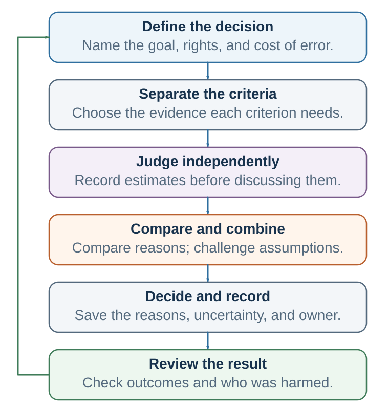
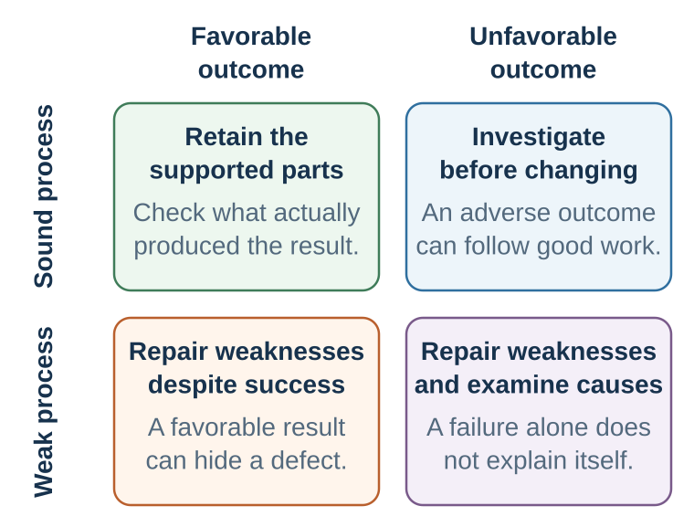

---
aliases:
  - 35-decision-hygiene.html
---

# Decision Hygiene: Build a Process That Can Learn

::: {.content-visible unless-format="epub"}
[]{#decision-hygiene-build-a-process-that-can-learn}
:::

*Notice, test, ask, design, and learn*

::: {.chapter-epigraph}
> “Subjective experience is not a reliable indicator of judgment accuracy.”
>
> — Daniel Kahneman and Gary Klein, [“Conditions for Intuitive Expertise”](https://doi.org/10.1037/a0016755), 2009, p. 515
:::

A hiring committee is ready to compare candidates when its chair says, “I was very impressed by the first applicant.” Several members had doubts about the work sample, but the conversation now begins with reasons to share the chair’s enthusiasm. The committee eventually agrees. Six months later, the appointee struggles, and everyone remembers having warned about the risk.

The problem spans two meetings: one in which judgments became correlated before the evidence was compared, and another in which memory rewrote the earlier uncertainty. Recognizing bias is useful, but the committee also needs a procedure that preserves independent views and a record that later events cannot silently change.

This final chapter brings the book’s tools together around that task: making consequential decisions easier to inspect and learn from.

::: {.callout-note .core-idea icon=false}
## Core Idea

Protect judgment before the answer becomes obvious: define the criteria, gather independent assessments, examine disagreement, and record what is expected. Afterward, compare the outcome with that original record. The process should help people revise what the evidence challenges while recognizing what one result cannot tell them.
:::

## Learning goals

- Build a proportionate judgment process before debating its answer.
- Protect independent evidence, structured disagreement, and accountable use of models or AI.
- Review forecasts, process, fairness, and outcomes without confusing luck with quality.

::: {.callout-important .the-final-standard icon=false}
## The final standard

A useful intervention should remain defensible if the people affected understand how it works, whose objective it serves, what evidence supports it, and how they can refuse or revise it.
:::

## Why judgment systems fail: bias, noise, and misplaced intuition

Bias has a direction relative to a defensible target. A forecaster who is consistently too optimistic or a scale that always reads two kilograms high is biased when later outcomes or a calibrated standard supplies that target. In many value-laden decisions, however, there is no simple observable bullseye; the benchmark must be specified and defended rather than smuggled into the picture. **Noise** is unwanted variation among repeated, commensurable judgments that should be similar. If qualified teachers grade the same essay very differently, physicians use different thresholds for the same case, or managers rate the same candidate from 4 to 9 on a ten-point scale, the system is noisy (Kahneman et al., 2021).

{#fig-bias-and-noise fig-alt="Four target diagrams compare low and high bias with low and high noise. A banner says that the analogy requires repeated commensurable judgments and an observable or defensible accepted target. Separate panels define level noise as persistent differences in judges' average levels and pattern noise as different reactions to case features."}

The bullseye is an analogy, not a universal measurement model. It summarizes the location and spread of a set of comparable judgments when a target can be observed or normatively accepted; it cannot establish that the target is legitimate, identify why errors occurred, or decompose the spread by itself. **Level noise** is persistent variation in judges' average severity or generosity. **Pattern noise** arises when judges react differently to features of particular cases. **Occasion noise** is additional within-judge variation across times or contexts. Estimating these components requires an appropriate repeated-judgment design, not one isolated decision.

Noise is easy to miss because people usually encounter one judgment, not the distribution of judgments they might have received. One candidate meets one panel. One paper receives one set of reviews. One patient sees one clinician. Yet fairness requires that similar cases receive similar treatment unless a relevant difference justifies the variation.

| Failure | What it looks like | First diagnostic question |
| --- | --- | --- |
| Bias | Judgments are wrong in a systematic direction. | What recurring factor shifts the average? |
| Level noise | Some judges are generally harsher or more generous. | Does the result depend on which judge was assigned? |
| Pattern noise | Judges weight features idiosyncratically. | Are the criteria and their weights shared? |
| Occasion noise | The same judge varies with time, order, fatigue, or context. | Would this person decide the same way tomorrow? |
| Legitimate discretion | Variation reflects relevant information, values, or circumstances. | Can the exception be explained and documented? |
: Different sources of disagreement in a judgment system {#tbl-36-noise}

The distinction matters statistically and ethically. Error increases when judgments are shifted in the wrong direction, widely dispersed, or both. Reducing dispersion around a bad target does not create a good system. Nor should consistency erase morally relevant differences. A noise audit measures variation first; responsible judgment then decides which variation is arbitrary and which is justified.

Decision hygiene is broader than teaching a catalogue of biases. The analogy is medical hygiene: handwashing can prevent infection without identifying the exact germ in advance. Independent scoring, explicit criteria, reference classes, checklists, and decision records can reduce several errors without requiring the user to diagnose the precise bias operating in the moment.

Intuition still has a place. It deserves more trust when the environment contains stable patterns and the judge receives rapid, accurate, attributable feedback. Chess and some skilled emergency work can provide such learning conditions. Long-range strategy, one-off hiring, political forecasting, and innovation often do not. Repetition can create confidence even when feedback is delayed, selective, or confounded (Kahneman & Klein, 2009).

The rule is therefore not “ignore intuition.” It is **delay the global impression until the evidence has been structured**. Record the first impression if it may contain expertise, but do not let it silently determine every component score. Ask not only, “How experienced is this person?” but, “Could this environment have taught the person the right lesson?”

## The structured judgment pipeline

A workflow helps connect preparation with later review. The one below is a practical synthesis to adapt to the decision:

{#fig-structured-judgment-pipeline fig-alt="Six steps define a decision, separate its criteria, elicit independent judgments, compare and combine them, record a decision, and review the result. A return arrow informs the next process while preserving the original record. This is a proposed workflow rather than a universal stage order."}

1. **Define.** State the decision, prediction target, values, decision rights, affected people, and error costs.
2. **Decompose.** Evaluate distinct criteria before forming a coherent global story.
3. **Ground.** Begin with base rates, reference classes, or a transparent baseline.
4. **Judge independently.** Record estimates and reasons before discussion, hierarchy, advocacy, or AI output creates correlation.
5. **Aggregate and compare.** Examine the center, dispersion, profiles, disagreements, and model output.
6. **Challenge.** Seek disconfirming evidence, run a premortem or red team, and ask what would change the conclusion.
7. **Decide and document.** State the choice, trade-offs, authority, assumptions, exceptions, and implementation conditions.
8. **Review and learn.** Compare forecasts with outcomes, audit fairness and drift, and change the process where the evidence warrants it.

This is a proportional pipeline, not a command to make every choice slow. A low-stakes reversible decision may need only a quick check. A repeated, consequential, uncertain, contested, difficult-to-reverse, or partly automated decision deserves more structure.

## Before the decision: improve the input

For the hiring committee, the first improvement happens before anyone advocates for a candidate. Agree on what successful work requires, what evidence can be collected comparably, and who will make the final decision. Keep alternatives visible, including reopening the search if no applicant meets an essential requirement.

Then ask where the present procedure is unreliable. More scoring forms will not help if the criteria themselves measure the wrong thing.

### Diagnose before redesigning: run a noise audit

Before installing a rubric, algorithm, or extra meeting, measure the variation the system actually produces. Select representative cases from a repeated task—grading, hiring, underwriting, forecasting, peer review, or project approval. Give identical evidence to several qualified judges without discussion. Ask for anchored scores, probability estimates, confidence, and brief reasons. Examine the range and dispersion, general severity differences, and case-specific disagreement. If occasion noise matters, repeat selected cases later.

The final step is interpretive. Which disagreements reflect missing information or legitimate values? Which reflect vague criteria, different thresholds, order, mood, or irrelevant cues? Redesign the specific weak stage and repeat the audit. The question is concrete: **Would we accept this decision changing merely because another equally qualified person happened to make it?**

::: {.callout-tip .activity icon=false}
## Ten-Minute Noise-Audit Lab

Give everyone the same candidate, project, settlement proposal, essay, or risk case. Without discussion, collect one anchored score, one probability, one confidence judgment, and one brief reason. Display the distribution before revealing any preferred answer. Separate disagreement caused by different information or legitimate values from disagreement caused by vague criteria, thresholds, irrelevant cues, or occasion. Redesign one weak stage, then have the class judge a comparable second case independently.
:::

### Define and decompose before evaluating

Unstructured judgment lets charisma, familiarity, or one vivid weakness organize the whole evaluation. Decomposition asks judges to assess job-relevant or decision-relevant dimensions separately. In hiring, for example, technical skill, learning ability, teamwork, communication, and role requirements should be scored from evidence before asking, “Would I hire this person?” Comparable questions, work samples, and anchored scoring make the judgment more inspectable (Dana et al., 2013; Highhouse, 2008).

Good criteria have four properties:

- they connect to the actual objective rather than a convenient proxy;
- their evidence can be observed or elicited comparably;
- their scale anchors describe meaning, not just numbers;
- their weighting or trade-off is decided explicitly rather than smuggled in through a halo.

Structure can make the wrong value consistently influential. A perfect rubric for “cultural fit” is harmful if fit means similarity to current insiders. Decomposition improves judgment only when the target and criteria are legitimate.

### Ground forecasts in the outside view

An inside view explains why this candidate, project, product, or strategy is special. An outside view begins with what happened in comparable cases and then adjusts for case-specific evidence. The reference class should be close enough to inform and broad enough to contain useful variation.

Projects make the contrast visible. Teams commonly build a detailed internal schedule and underestimate cost or delay; a reference-class forecast asks how comparable projects actually performed before accepting the case-specific story (Kahneman & Lovallo, 1993; Flyvbjerg et al., 2002). The reference class is itself a judgment and can be gamed. Record alternative classes considered, the outcome distribution in each, and the reason for every adjustment so that “our case is different” becomes an inspectable claim.

Forecasts should be probabilities or ranges, not only adjectives such as “likely” or “risky.” Over a portfolio of forecasts, calibration becomes visible: events assigned 70 percent should occur about 70 percent of the time. A Brier score can summarize probabilistic accuracy, but the deeper practice is to reward honest uncertainty and timely revision rather than confidence alone (Brier, 1950; Mellers et al., 2014).

When the choice involves a rare project with poor direct precedents, use several reference classes, analogous mechanisms, scenario ranges, and explicit assumptions. “No perfect comparison exists” is not permission to use no comparison at all.

### Preserve independence, then aggregate

Discussion is valuable after information has been captured. Before discussion, it creates correlation. Early speakers anchor the range; senior people change what feels safe; repeated arguments sound more supported than they are; and private doubts disappear behind public consensus.

Use the sequence **estimate first, discuss second**. Ask members to record a score, forecast, strongest reason, and key uncertainty. Then display the distribution. Simple averaging can outperform immediate debate when individual errors are partly independent. Weighted aggregation can help when weights are earned through relevant calibration rather than status. Disagreement is not merely an obstacle to eliminate; it is evidence about ambiguous criteria, different information, or different models.

Aggregation is not a ritual average. It helps when judges possess relevant information and their errors are not perfectly correlated; it cannot remove a shared bias, and it can dilute a person who holds uniquely diagnostic evidence. Diverse problem-solving perspectives can improve a group's search, but only when the process preserves and integrates them rather than producing conformity (Hong & Page, 2004; Sunstein & Hastie, 2015). Inspect the spread and reasons before deciding whether to average, weight, investigate, or escalate a decisive concern.

Senior people should normally speak after independent input is captured. Anonymous concerns can protect information in high-power settings. A facilitator should ask what evidence explains the spread, not pressure everyone toward the midpoint.

[]{#ai-accountable-judgment}

::: {.callout-note .research-lens icon=false}
## Research Lens: AI and accountable judgment

In repeated predictive tasks with measurable outcomes, simple mechanical or statistical rules often match or outperform unaided human judgment because they apply weights consistently (Meehl, 1954; Dawes et al., 1989; Grove et al., 2000). That advantage is task-specific. A model can be consistently wrong when its target, data, or deployment context is wrong.

AI is often valuable because it improves **prediction**, but prediction is only one task inside a decision. Building on Agrawal et al. (2019), keep four tasks separate.^[Agrawal et al. (2019) use *judgment* for assigning payoffs to consequences. In standard decision-science terminology, and throughout this book, that task is **valuation**. Elsewhere, **judgment** retains its broader meaning of forming beliefs and assessments.]

| Task | Accountable question |
| --- | --- |
| **Prediction** | What state or outcome is likely, with what uncertainty, and how well is the model calibrated here? |
| **Valuation** | Which consequences matter, whose welfare and rights count, and how should error costs be traded off? |
| **Intervention design** | Which feasible action could change the outcome, under what causal assumptions and constraints? |
| **Decision and responsibility** | What should be implemented, under whose authority, with what exception, appeal, monitoring, and review? |
: Prediction is one task inside accountable decision-making {#tbl-ai-prediction-judgment-causation}

**Prediction is not responsibility.** A forecast can inform a decision, but it cannot determine which consequence should count, which intervention is justified, who may authorize it, or who must answer for the result.

Suppose an AI system predicts hospital readmission accurately. The estimate does not determine whether a home visit, delayed discharge, telephone call, or no intervention would work. Nor does it decide how to weigh a missed readmission against an unnecessary intervention or how the patient's circumstances and preferences should count. Human oversight is not a final click after the model has settled everything important. A person or institution must own the objective, causal assumptions, stakeholder costs, action, exceptions, appeal, and consequences.

The same discipline applies to different tools. Validate forecasts out of sample and inspect calibration and subgroup error. Verify facts and sources in generated summaries. Treat generated alternatives as search aids rather than complete menus. Version fixed rules and record justified exceptions. Require the accountable decision-maker to own any reasons or records produced with AI. A polished answer is not evidence of truth or completeness (Ji et al., 2023; National Institute of Standards and Technology, 2023).

Three governance failures deserve special attention. First, the **target-variable problem** allows technical accuracy to optimize the wrong objective or reproduce historical labels (Obermeyer et al., 2019). Second, automation bias and algorithm aversion produce over- and under-reliance rather than trust calibrated to comparative evidence (Dietvorst et al., 2015; Mosier et al., 1998). Third, fairness criteria can conflict, so no technical switch can choose among rights, error costs, history, and institutional purpose (Barocas et al., 2019). Higher stakes therefore require stronger validation, transparency, subgroup analysis, contestability, privacy protection, and real human authority to correct the system.

A practical test is: **Could we explain to an affected person what the system contributed, who had power to challenge it, why that authority was legitimate, and how an error can be corrected?** A reviewer without enough information or power to challenge the output cannot provide meaningful oversight and may instead be left carrying responsibility for a system they could not control (Elish, 2019).

### Minimum AI-use record {#minimum-ai-use-record}

When a model materially informs a consequential decision, record five fields. The purpose is not to preserve every keystroke. It is to make the contribution, verification, authority, and correction path inspectable.

| Field | Minimum record |
| --- | --- |
| **1. Task and tool** | The task delegated; tool, model, or rule used; version or access date; and why it was appropriate for this task. |
| **2. Inputs and boundaries** | Material inputs, sources, missing information, and any privacy, consent, or use restriction. Do not copy sensitive data into an unauthorized record. |
| **3. Output and reliance** | The material output, recommendation, or forecast; what the decision-maker followed, modified, or rejected; and why. |
| **4. Independent checks** | Fact and source verification, comparison with a baseline or independent human view, uncertainty and subgroup checks where relevant, and the strongest contrary evidence. |
| **5. Authority and correction** | Named decision owner, affected people, available exception or appeal, monitoring signal, review date, and who can pause or reverse the use. |
: A minimum record for consequential AI-supported judgment {#tbl-minimum-ai-use-record}

For low-stakes drafting or search assistance, a brief record may be enough. As consequence, repetition, irreversibility, unequal power, or automation grows, the record and validation should grow with it. [Appendix C](../appendices/appendix-c-portable-course-tools.qmd#ai-use-record) provides a printable version.
:::

Some choices should also be designed to learn. A pilot, diagnostic test, negotiation question, or request for supporting sources can reveal a hidden state before commitment. Ask not only which option currently looks best, but which safe action would most improve the next decision.

## During the decision: structure disagreement

Separate prediction from valuation. Ask first what each person believes will happen and what evidence supports that belief. Ask separately what outcomes matter, which trade-offs are acceptable, and whose welfare or rights count. Many arguments become clearer when "too risky" is decomposed into probability and consequence.

Checklists can protect against omissions in repeated work when they are short, located at a useful pause, and tied to known failures. Haynes et al. (2009) observed lower complication and mortality rates after introducing a surgical safety checklist in eight hospitals. This was a before-and-after study, so the change cannot be attributed to the document alone; implementation and concurrent changes matter. A hiring checklist likewise needs to address an actual failure, such as scoring work samples before discussing impressions.

A **premortem** asks each person to imagine that the plan has failed and independently write plausible causes. The fictional certainty of failure gives doubt permission to speak (Klein, 2007). A **red team** goes further by constructing an adversarial test of assumptions, evidence, and execution. Red teams need genuine access, time, and protection; a ceremonial critic who cannot change the plan is not decision hygiene. A designated devil's advocate can be dismissed as merely performing a role, so it should not replace authentic independent concern. Challenge earns its place only when someone has authority to inspect the evidence and the team records what changed in response.

Psychological safety is the social infrastructure beneath these tools. It means that people can ask, disagree, admit error, and surface risk without interpersonal punishment; it does not mean comfort, agreement, or low standards (Edmondson, 1999). Leaders create it behaviorally by inviting specific dissent, responding productively to bad news, separating a concern from the status of the person who raised it, and showing that early correction is valued more than late loyalty.

For the distinct routes by which authority, suppressed dissent, unshared information, pluralistic ignorance, and diffused responsibility can silence challenge, see [Authority, Groupthink, and Shared Responsibility](28-authority-groupthink-and-shared-responsibility.qmd).

Safety and accountability are complements. High safety without evidence standards can become comfortable imprecision; high standards without safety can produce polished silence. The accountable system makes reasoning inspectable, expects preparation and correction, and protects the person who reveals a problem before it becomes a failure.

## Design choices, not just advice

Advice leaves the surrounding process intact. Chapters 30–40 supplied stronger design moves: diagnose the audience model, make meaning testable, map alternatives and interests, redesign recurring cues and friction, and govern the whole choice path. Decision hygiene does not reteach those mechanisms. It asks which one repairs the diagnosed weak stage while preserving agency, challenge, and feedback.

## Better meetings: do not let the presentation become the decision

Many organizations call a meeting before defining what must be decided. Participants hear a polished recommendation, then try to recover independent judgment from inside its frame. A better meeting separates the stages:

| Phase | Process rule | What it protects |
| --- | --- | --- |
| Before | Define the decision, criteria, evidence, authority, and affected people. | The agenda does not silently set the target. |
| Independent input | Collect estimates and concerns before advocacy, discussion, or AI output. | Information diversity and unanchored forecasts. |
| Evidence | Separate facts, assumptions, predictions, values, and recommendations. | Disagreement becomes diagnosable rather than personal. |
| Challenge | Use an outside view, premortem, strongest objection, and “what would change our minds?” | Doubt becomes a role, not an act of disloyalty. |
| Decision | State the choice, trade-offs, exceptions, owner, and implementation conditions. | Conversation becomes accountable action. |
| Review | Set indicators, thresholds, and a review date. | Outcomes can update the process without rewriting it. |
: A decision meeting organized around judgment rather than presentation {#tbl-36-meeting}

Roles can make the process visible: one person tracks criteria, one assumptions, one risks and dissent, one unresolved questions, and one implementation. Decision rights must also be explicit. Who decides? Who advises? Who must consent? Who implements? Ambiguity here produces recurring debate and hidden vetoes.

## The decision audit: from a smooth story to an inspectable process

A coherent account of a decision is not the same thing as the process that produced it. Begin an audit by writing the ordinary five-sentence story: What decision did I face? What did I choose? Why did it seem right? What happened? How good was the decision? That story is useful because it captures what is currently retrievable. It is also dangerous because it tends to blend what was known then with what became known later.

Now slow the story into six inspectable components:

| Component | Audit question | Common failure | Process redesign |
| --- | --- | --- | --- |
| Alternatives | What options were actually on the table? | Treating the first menu as complete. | Generate, combine, negotiate, delay, or pilot. |
| Prediction | What was expected under each option? | Confusing confidence with evidence. | Use base rates, ranges, and disconfirming tests. |
| Valuation | What mattered, to whom, and why? | Treating priorities as obvious or unanimous. | Name stakeholders, trade-offs, and protected values. |
| Opportunity cost | What was the best feasible path forgone? | Making the unchosen future psychologically invisible. | Ask “Compared with what?” before commitment. |
| Context and state | What cue, emotion, norm, identity, or constraint was active? | Misattributing an incidental influence to the option. | Change timing, order, frame, role, or environment. |
| Feedback | What was supposed to be learned, and when? | Letting hindsight rewrite the original forecast. | Record assumptions and set a review date. |
: A decision-loop diagnostic {#tbl-35-decision-audit}

The audit does not prove that the chosen option was best, recover the road not taken, or reveal how every counterfactual future would have unfolded. It can reveal missing options, unsupported predictions, hidden values, invisible opportunity costs, contextual pressures, and feedback that was never designed. Its purpose is prospective: make the next decision more testable than the last one.

{#fig-decision-audit fig-alt="A two-by-two matrix crosses sound and weak decision processes with favorable and unfavorable outcomes. A sound process can still meet an unfavorable outcome, and a weak process can receive a favorable one. Neither pairing alone identifies luck or the cause of the result."}

## After the outcome: learn without worshipping luck

### What a decision journal is—and is not {#what-a-decision-journal-is}

A **decision journal** is a collection of structured, time-stamped records created at two different moments. Before the outcome is known, an entry preserves what was knowable, expected, valued, and chosen. After a specified review date or trigger, a linked review records what happened and what should be learned **without overwriting the original entry**. Its unit is a consequential decision, not a day in the writer's life.

The journal links two different records: what you believed before choosing and what later happened. Meeting minutes can document the choice, but usually do not preserve the alternative forecasts and learning rules needed for this comparison.

Its research basis is in components, rather than a trial of one universal journal template. Decision analysis identifies the options, consequences, and values to record (Raiffa, 1968; Keeney & Raiffa, 1976). Hindsight and outcome-bias research explains why later recollection cannot substitute for a contemporary record (Fischhoff, 1975; Baron & Hershey, 1988). Forecasting research makes predictions resolvable across repeated decisions (Brier, 1950; Mellers et al., 2014).

Writing and review also depend on the conditions. In a study of Chinese judges, reason writing before judgment reduced the influence of an induced negative feeling, but forced deliberation produced a similar effect (Liu, 2018). A meta-analysis found benefits of structured debriefing across 46 samples ($N = 2{,}136$; average $d = 0.67$), not evidence that this entire journal format works for every decision (Tannenbaum & Cerasoli, 2013). Accountability can also encourage conformity when the evaluator’s preferred answer is known (Lerner & Tetlock, 1999).

The practical sequence is **freeze, compare, update**: preserve the original account, compare each prediction or assumption with relevant evidence, then change a rule or forecast where warranted. A record helps only if it is candid, reviewed, and protected from retrospective editing.

::: {.callout-important icon=false}
## The same-name rule

Every after-outcome prompt should answer the before-choosing record with the **same label on the same row**. If a concern appears only later, record it as “not anticipated”; do not pretend it was part of the original reasoning. The practical rhythm is **freeze → compare → update**.
:::

### A simplified decision journal {#decision-journal-example}

The table below illustrates the two-stage structure. The case and numbers are hypothetical: a university teacher is deciding whether to pilot an AI-assisted feedback tool. The point is not to fill every possible field, but to create a short record that can later contradict convenient memory.

| Matched learning loop | Before choosing — freeze | After the outcome — compare and update |
| --- | --- | --- |
| **1. Decision and execution** | By 15 September, decide whether to keep the current feedback process, run a four-week pilot in one course, or adopt the tool in all courses. | The four-week pilot was implemented for 100 assignments as planned. Record any deviations before interpreting its results. |
| **2. Alternatives and opportunity cost** | The best forgone option is the current process with additional teaching-assistant time. | The teaching-assistant option was not tested, so its counterfactual result remains unknown. No clearly feasible option omitted from the original menu emerged. |
| **3. Evidence and reference class** | A local test of 20 assignments reduced average editing time from 12 to 8 minutes, but 4 drafts needed major correction. The sample is small and local; no external comparison is available. | Across 100 assignments, editing averaged 8.5 minutes, 8% needed major correction, 62% of students rated the feedback helpful, and no privacy breach was reported. This strengthens local evidence but does not establish performance elsewhere. |
| **4. Predictions and assumptions** | Pilot forecasts: 60% chance editing time is below 9 minutes; 70% chance at least 70% of students rate feedback helpful; 15% chance more than 10% of drafts need major correction. Assumptions: instructors catch material errors and opting out is meaningful. | Resolve the same forecasts: time below 9 minutes—yes; helpfulness at least 70%—no; correction above 10%—no. The recorded correction rate is below the threshold; unrecognized errors and whether opting out felt meaningful remain untested. One realized event does not by itself prove that a stated probability was well calibrated. |
| **5. Values and stakeholders** | Faster feedback matters, but accuracy, privacy, student trust, and a genuine option to decline are protected values. A privacy breach is unacceptable even if time is saved. | The observed major-correction rate met the threshold and no privacy breach was reported; this does not rule out undetected errors or breaches. Helpfulness was weaker than hoped. Trust and the experience of students who opted out were not measured, so those original values cannot yet be evaluated. |
| **6. Context, incentives, dissent, and tools** | Instructors want to reduce workload and may be unusually receptive to the tool. The strongest objection is that verification could consume the time saved. Record any model or AI advice and why it was followed or overridden. | Verification did not eliminate the time saving, but student concerns received less measurement than instructor workload. Reassess whether dissent was answered and whether reliance on the tool was calibrated to where it actually added value. |
| **7. Choice, thresholds, and learning rule** | Run the limited pilot; review after 100 assignments. Stop after a confirmed privacy breach. Do not scale if major correction exceeds 10% or helpfulness is below 70%. | The recorded implementation and review thresholds were followed, and the measured outcome was mixed. Do not scale: helpfulness missed the stated threshold. Continue only as a limited test, improve the student explanation, measure trust and opt-out experience, and set the next review before collecting more outcomes. |
: A hypothetical decision journal in which every ex-post entry answers its ex-ante counterpart {#tbl-simplified-decision-journal}

Review the process using what was knowable at the time. A good decision can produce a bad outcome, and a poor process can get lucky. Compare forecasts with outcomes, not stories with feelings. Ask which assumptions failed, which information was missing, which values changed, and which parts of the process should remain even though the outcome was disappointing.

Do not update from one noisy result more than the evidence warrants. Regression to the mean, random variation, and selective feedback can create false lessons. Calibrate over many predictions. Reward accurate uncertainty and timely revision, not only confident success.

The hiring committee’s later review should begin with its original scores and reasons. Without them, the chair’s enthusiasm can become a shared memory of caution. With them, members can ask which evidence was useful, which uncertainty remained, and what should change before the next appointment.

### The matched fields: one name, two moments {#decision-journal-before-choice}

[]{#decision-journal-after-outcome}

The minimum useful entry identifies the decision, separates prediction from valuation, and defines how later evidence will be interpreted. Append the review; never edit the original entry into agreement with what occurred.

| Learning loop | Before choosing — freeze | After the outcome — compare |
| --- | --- | --- |
| **1. Decision and execution** | Decision, date, owner, deadline, and scope | What was implemented, including deviations and delays |
| **2. Alternatives and opportunity cost** | Serious options and the best feasible alternative forgone | Missing options, new evidence, and counterfactuals still unknown |
| **3. Evidence and reference class** | Sources, comparable cases, missing evidence, and assumptions | Which evidence proved useful, misleading, or unresolved |
| **4. Predictions and assumptions** | Consequences, probabilities or ranges, time horizons, and resolution rules | Resolve each forecast; mark assumptions supported, failed, or untested |
| **5. Values and stakeholders** | Priorities, affected people, rights, and unacceptable trade-offs | Benefits, harms, omitted perspectives, and any later change in values |
| **6. Context, incentives, dissent, and tools** | Pressures, contrary views, and model or AI advice followed or rejected | What influence each had and whether reliance was justified |
| **7. Choice, thresholds, and learning rule** | Choice, implementation owner, review date, and continue/stop/revise rules | Whether rules were followed; process and outcome assessed separately; next test |
: A matched decision-journal template: freeze, compare, and update {#tbl-35-decision-journal}

Reflection differs from rationalization because it produces a testable change. “How can I defend what I did?” searches for coherence. “What process produced this choice?” separates evidence, values, context, and luck. “What will I do differently next time?” turns the answer into a new rule, forecast, or experiment.

## The decision-improvement cycle: notice, test, ask, design, learn

{#fig-master-loop-finale fig-alt="Three reading questions connect finding the obstacle, changing the conditions, and checking the results. They organize Part VII's design and learning tools."}

The three questions in the part map can guide a brief review: What is getting in the way? What condition could change? What result would tell us whether the change helped? For a more detailed diagnosis, the five verbs below locate the work that remains.

| Move | Core question | Typical tool |
| --- | --- | --- |
| Notice | What entered attention, and what stayed invisible? | Attention audit; option generation |
| Test | What would disconfirm the current model? | Base rate; premortem; pilot; alternative explanation |
| Ask | Whose perspective, interest, or constraint is missing? | Perspective-getting; diagnostic questions |
| Design | How can the environment or process make better action easier? | Criteria; defaults; friction; packages; role design |
| Learn | What did we predict, what happened, and what was luck? | Decision journal; calibration; process debrief |
: The integrated decision audit {#tbl-35-1}

## Return to the hiring decision

Before reviewing candidates, the committee defines job-relevant outcomes, error costs, decision rights, and criteria that can be observed comparably. It records a relevant performance base rate and identifies what evidence would justify departing from it. Each member then reviews the same work sample and structured evidence, scores each dimension independently, and records a probability of success before seeing other judgments or an AI summary.

Only then does the committee compare the distribution. A spread in scores is information: perhaps the criterion is vague, members possess different evidence, or one feature has created a halo. The chair speaks after independent input. The group tests its leading account against the strongest alternative, records the choice, uncertainty, trade-offs, and reasons for any exception, and sets an implementation and review plan.

After the outcome, the committee reviews what was knowable at the time. It does not treat the selected candidate's success or failure as proof that every earlier inference was correct. Across hires, it examines calibration, predictive validity, subgroup outcomes, exceptions, and process variation. The opening choice has become an inspectable learning system.

## Ethics, governance, and proportionality

Structure is not automatically fair. A rubric can make the wrong values consistently influential. A model can turn historical discrimination into a scalable rule. A checklist can suppress professional attention. A decision journal can become surveillance. A demand for consistency can erase relevant differences.

Ask whether the criteria serve legitimate goals, whether exceptions are reasoned and reviewable, and whether affected people can challenge errors. Inspect how benefits and burdens are distributed. A model, committee, or consultant should not obscure who has authority and responsibility.

Scale the procedure to the stakes. A low-cost reversible choice may need a short note and a review date; a repeated hiring process needs stronger evidence and checks for unfair treatment. Remove a control when its burden exceeds its useful contribution.

| Failure mode | First-line protection | Stronger response when stakes warrant it |
| --- | --- | --- |
| Inconsistent judges | Noise audit and anchored criteria | Multiple judges, calibration, model comparison |
| Overconfident plan | Outside view and probability ranges | Premortem, staged investment, stop criteria |
| Hierarchy or conformity | Independent input; senior person speaks last | Anonymous concerns, external review, red team |
| Hindsight learning | Decision journal and review date | Forecast scoring and portfolio-level analysis |
| Repeated prediction | Transparent statistical baseline | Validated model with fairness and drift audit |
| AI-supported judgment | Independent human view and verification | Contestability, subgroup audit, human review board |
| Excess bureaucracy | Short, failure-linked checklist | Remove low-value controls; preserve justified discretion |
: Proportionate decision hygiene {#tbl-36-proportionality}

::: {.callout-tip .activity icon=false}
## Practice Lab: integrated decision studio

Produce one completed, one-page judgment pipeline for a real decision:

1. **Define:** state the decision, deadline, owner, affected people, and most costly error.
2. **Decompose:** name three to five criteria and the evidence each requires before giving an overall judgment.
3. **Ground:** record one base rate, reference class, transparent baseline, or the reason none is available.
4. **Judge independently:** obtain at least two estimates, scores, or written views before discussion or AI output; if only one decision-maker is available, record an initial estimate before seeking advice.
5. **Compare:** display the estimates, disagreement, and reasons; do not average away uniquely diagnostic evidence.
6. **Challenge:** write the strongest objection, one disconfirming observation, and one safe information-gaining action.
7. **Decide and document:** state the choice, trade-offs, implementation owner, and any justified exception. If AI materially informed it, attach the [minimum AI-use record](#minimum-ai-use-record).
8. **Review and learn:** specify an observable outcome, threshold or resolution rule, review date, and what will continue, stop, scale, or change.

The submitted artifact is the completed pipeline, not an essay about decision hygiene. For a low-stakes reversible choice, use only **define → challenge → decide → review**. For a consequential, repeated, contested, difficult-to-reverse, or partly automated decision, complete all eight stages.
:::

## Take it forward

Return to the hiring meeting that opened the book. A better process cannot promise the best hire every time, but it can make the reasons for the choice clearer, expose disagreement before commitment, and preserve what the outcome can teach. Start with one recurring decision and build the conditions under which the next decision can improve.

## References cited in this chapter

::: {.reference}
Agrawal, A., Gans, J., & Goldfarb, A. (2019). Prediction, judgment, and complexity: A theory of decision-making and artificial intelligence. In A. Agrawal, J. Gans, & A. Goldfarb (Eds.), *The economics of artificial intelligence: An agenda* (pp. 89–110). University of Chicago Press.
:::

::: {.reference}
Brier, G. W. (1950). Verification of forecasts expressed in terms of probability. *Monthly Weather Review, 78*(1), 1–3. https://doi.org/10.1175/1520-0493(1950)078%3C0001:VOFEIT%3E2.0.CO;2
:::

::: {.reference}
Dana, J., Dawes, R., & Peterson, N. (2013). Belief in the unstructured interview: The persistence of an illusion. Judgment and Decision Making, 8(5), 512–520.
:::

::: {.reference}
Dawes, R. M., Faust, D., & Meehl, P. E. (1989). Clinical versus actuarial judgment. Science, 243(4899), 1668–1674.
:::

::: {.reference}
Dietvorst, B. J., Simmons, J. P., & Massey, C. (2015). Algorithm aversion: People erroneously avoid algorithms after seeing them err. Journal of Experimental Psychology: General, 144(1), 114–126.
:::

::: {.reference}
Edmondson, A. C. (1999). Psychological safety and learning behavior in work teams. Administrative Science Quarterly, 44(2), 350–383.
:::

::: {.reference}
Grove, W. M., Zald, D. H., Lebow, B. S., Snitz, B. E., & Nelson, C. (2000). Clinical versus mechanical prediction: A meta-analysis. Psychological Assessment, 12(1), 19–30.
:::

::: {.reference}
Haynes, A. B., Weiser, T. G., Berry, W. R., Lipsitz, S. R., Breizat, A.-H. S., Dellinger, E. P., Herbosa, T., Joseph, S., Kibatala, P. L., Lapitan, M. C. M., Merry, A. F., Moorthy, K., Reznick, R. K., Taylor, B., & Gawande, A. A. (2009). A surgical safety checklist to reduce morbidity and mortality in a global population. New England Journal of Medicine, 360(5), 491–499.
:::

::: {.reference}
Highhouse, S. (2008). Stubborn reliance on intuition and subjectivity in employee selection. Industrial and Organizational Psychology, 1(3), 333–342.
:::

::: {.reference}
Ji, Z., Lee, N., Frieske, R., Yu, T., Su, D., Xu, Y., Ishii, E., Bang, Y. J., Madotto, A., & Fung, P. (2023). Survey of hallucination in natural language generation. ACM Computing Surveys, 55(12), Article 248. https://doi.org/10.1145/3571730
:::

::: {.reference}
Kahneman, D., & Klein, G. (2009). Conditions for intuitive expertise: A failure to disagree. American Psychologist, 64(6), 515–526.
:::

::: {.reference}
Kahneman, D., Sibony, O., & Sunstein, C. R. (2021). Noise: A flaw in human judgment. Little, Brown Spark.
:::

::: {.reference}
Meehl, P. E. (1954). Clinical versus statistical prediction: A theoretical analysis and a review of the evidence. University of Minnesota Press.
:::

::: {.reference}
National Institute of Standards and Technology. (2023). Artificial intelligence risk management framework (AI RMF 1.0) (NIST AI 100-1). U.S. Department of Commerce. https://doi.org/10.6028/NIST.AI.100-1
:::

::: {.reference}
Mellers, B. A., Ungar, L., Baron, J., Ramos, J., Gurcay, B., Fincher, K., Scott, S. E., Moore, D., Atanasov, P., Swift, S. A., Murray, T., Stone, E., & Tetlock, P. E. (2014). Psychological strategies for winning a geopolitical forecasting tournament. Psychological Science, 25(5), 1106–1115.
:::

::: {.reference}
Obermeyer, Z., Powers, B., Vogeli, C., & Mullainathan, S. (2019). Dissecting racial bias in an algorithm used to manage the health of populations. Science, 366(6464), 447–453.
:::

::: {.reference}
Baron, J., & Hershey, J. C. (1988). Outcome bias in decision evaluation. *Journal of Personality and Social Psychology, 54*(4), 569–579. https://doi.org/10.1037/0022-3514.54.4.569
:::

::: {.reference}
Fischhoff, B. (1975). Hindsight is not equal to foresight: The effect of outcome knowledge on judgment under uncertainty. *Journal of Experimental Psychology: Human Perception and Performance, 1*(3), 288–299. https://doi.org/10.1037/0096-1523.1.3.288
:::

::: {.reference}
Klein, G. (2007). Performing a project premortem. Harvard Business Review, 85(9), 18–19.
:::

::: {.reference}
Barocas, S., Hardt, M., & Narayanan, A. (2019). Fairness and machine learning: Limitations and opportunities. fairmlbook.org.
:::

::: {.reference}
Elish, M. C. (2019). Moral crumple zones: Cautionary tales in human-robot interaction. Engaging Science, Technology, and Society, 5, 40–60.
:::

::: {.reference}
Flyvbjerg, B., Holm, M. S., & Buhl, S. (2002). Underestimating costs in public works projects: Error or lie? Journal of the American Planning Association, 68(3), 279–295.
:::

::: {.reference}
Hong, L., & Page, S. E. (2004). Groups of diverse problem solvers can outperform groups of high-ability problem solvers. Proceedings of the National Academy of Sciences, 101(46), 16385–16389.
:::

::: {.reference}
Kahneman, D., & Lovallo, D. (1993). Timid choices and bold forecasts: A cognitive perspective on risk taking. Management Science, 39(1), 17–31.
:::

::: {.reference}
Mosier, K. L., Skitka, L. J., Heers, S., & Burdick, M. (1998). Automation bias: Decision making and performance in high-tech cockpits. The International Journal of Aviation Psychology, 8(1), 47–63.
:::

::: {.reference}
Sunstein, C. R., & Hastie, R. (2015). Wiser: Getting beyond groupthink to make groups smarter. Harvard Business Review Press.
:::

::: {.reference}
Keeney, R. L., & Raiffa, H. (1976). *Decisions with multiple objectives: Preferences and value tradeoffs*. Wiley.
:::

::: {.reference}
Lerner, J. S., & Tetlock, P. E. (1999). Accounting for the effects of accountability. *Psychological Bulletin, 125*(2), 255–275. https://doi.org/10.1037/0033-2909.125.2.255
:::

::: {.reference}
Liu, Z. (2018). Does reason writing reduce decision bias? Experimental evidence from judges in China. *The Journal of Legal Studies, 47*(1), 83–118. https://doi.org/10.1086/696879
:::

::: {.reference}
Raiffa, H. (1968). *Decision analysis: Introductory lectures on choices under uncertainty*. Addison-Wesley.
:::

::: {.reference}
Tannenbaum, S. I., & Cerasoli, C. P. (2013). Do team and individual debriefs enhance performance? A meta-analysis. *Human Factors, 55*(1), 231–245. https://doi.org/10.1177/0018720812448394
:::
