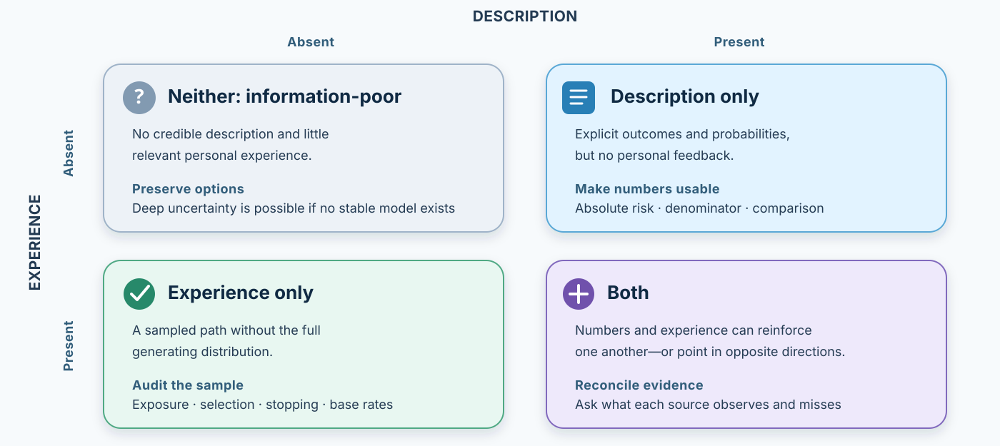

# Decisions from Experience: When Rare Events Are Not Encountered

*A probability can be written on a page. An experience must happen—and what happens is only a sample of what could have happened.*

::: {.callout-note .core-idea icon=false}
## Core Idea

Description gives a decision-maker an explicit model of outcomes and probabilities. Experience makes the decision-maker learn that model from a path of observations. The path may be short, selective, recent, memorable, or produced by the person's own earlier choices. Decisions from experience therefore depend not only on how probabilities are weighted, but also on which evidence is encountered.
:::

## Learning goals

- Distinguish decisions from description, experience, and mixtures of the two.
- Explain why a rare event can loom large in description yet disappear from a small experience sample.
- Diagnose sampling error, recency, contingent sampling, stopping, and feedback.
- Explain why experience can sometimes underweight and sometimes overweight rare events.
- Separate decision quality from outcome quality when learning from feedback.
- Design risk communication that combines numerical description with interpretable experience.

## Opening puzzle: the rare outcome that did not happen

Option A always pays €3. Option B pays €32 with probability 10% and €0 otherwise. You may sample either option as often as you wish before making one consequential choice.

The description gives everything required to calculate expected value: A is worth €3; B is worth €3.20. Experience creates another problem. A learner who samples B five times has a probability of about 59% of seeing no €32 outcome at all. For that learner, B has so far looked like a machine that pays zero. Another learner may encounter €32 on the first draw and see B as extraordinarily attractive. The underlying distribution is identical. The evidence they encountered is not.

This is the central move in decisions from experience:

> The learner does not merely respond to a probability distribution. The learner first has to discover it from a path.

The path matters in computer backups, maintenance failures, floods, side effects, investment returns, hiring, supply disruptions, and negotiations. Long stretches without trouble can make prevention feel unnecessary. One painful incident can make a safe option feel dangerous. Feedback can teach the wrong lesson when a good process produces a bad outcome or a bad process is rescued by luck.

## Description and experience are different information conditions

A **decision from description** states the possible outcomes and their probabilities. A weather forecast gives a probability of rain. A medicine fact box reports estimated benefits and harms. An insurance contract specifies covered events and deductibles. The decision-maker may misunderstand, neglect, or transform these numbers, but the distribution is externally represented.

A **decision from experience** requires the distribution to be learned from observations. A driver infers how dangerous a familiar road is from previous journeys. A manager estimates supplier reliability from deliveries that happened to be observed. A person decides whether to back up a computer after years without a disk failure. Outcomes and probabilities are not fully listed; the person samples, remembers, and updates.

Many consequential decisions contain both. A physician can read trial evidence and also remember patients. A resident can see a flood map and also remember years without flooding. An investor can study a long return series and still give special weight to the market experienced during early adulthood. Description and experience need not agree, and neither is automatically superior.

{#fig-decision-experience-states fig-alt="A two-by-two matrix. Columns indicate description absent or present; rows indicate experience absent or present. Neither means deep uncertainty; description only means an explicit model without personal feedback; experience only means a sampled path without an explicit distribution; both means evidence sources can reinforce or conflict. A bottom band recommends combining calibrated numbers, representative experience, and transparent updating."}

### Four epistemic states

Hertwig and Wulff (2022) organize risk situations by asking whether description and experience are present or absent. The resulting four states prevent a false choice between “numbers” and “intuition.”

| Information state | What the chooser has | Central danger | Useful response |
| --- | --- | --- | --- |
| Neither | No credible statistical model and little relevant experience | Unknown hazards are treated as if they were zero—or imagined without constraint | Seek information, use scenarios, preserve reversibility, and state ignorance |
| Description only | Outcomes and probabilities, but no lived feedback | Rare outcomes can be unusually salient, misunderstood, or detached from action | Use natural frequencies, absolute risks, denominators, and comparisons |
| Experience only | A sequence of observed outcomes, but no explicit distribution | Small or selective samples can miss rare events and conceal the generating process | Enlarge the sample, examine selection, and add base rates |
| Both | Statistical description and personal or simulated experience | Vivid experience can contradict representative evidence, or abstract numbers can fail to become usable | Reconcile the sources; explain why they differ and what each can identify |
: Four information states require different diagnoses {#tbl-experience-states}

The fourth state—neither description nor experience—is not an empty residual. It is **deep uncertainty**. A new technology, emerging disease, or unprecedented operational shock may provide neither reliable frequencies nor a stable personal history. The honest response is not to manufacture a probability. It is to stress-test, diversify information, use reversible steps, and specify what would trigger revision.

## The description–experience gap

Early experiments found that choices based on sampled outcomes often differ from choices based on explicitly described lotteries (Barron & Erev, 2003; Hertwig et al., 2004). In many description tasks, small-probability outcomes receive more decision weight than their objective probability. An unlikely gain can make a lottery attractive; an unlikely loss can make insurance attractive. This is one part of the fourfold pattern developed in the previous chapter.

In many experience tasks, rare outcomes have less impact. If the rare outcome is not sampled—or appears less often than its population probability—it cannot strongly affect choice. A person may therefore select the option with an unlikely severe loss more often after sampling than after reading the same loss probability.

This contrast is often summarized as:

- **description:** rare events tend to receive relatively high decision weight;
- **experience:** rare events often receive relatively low decision weight.

The word **often** is essential. Wulff, Mergenthaler-Canseco, and Hertwig's (2018) meta-analysis found a robust aggregate description–experience gap, but its size and even its behavioral expression depend on the structure of the problem and the learning procedure. Experience does not contain a universal reverse probability-weighting function. Sometimes the sample is unrepresentative; sometimes memory or learning changes the use of observed outcomes; sometimes a single severe event produces lasting avoidance.

### Prospect theory does not absorb the experience problem

Prospect theory begins with represented outcomes and probabilities, then explains how reference dependence, diminishing sensitivity, loss aversion, and probability weighting shape valuation. A decision-from-experience task adds an upstream stage:

$$
\text{environment} \rightarrow \text{sampled path} \rightarrow \text{learned representation} \rightarrow \text{valuation} \rightarrow \text{choice}.
$$

The sample is partly endogenous. The chooser decides where to look, how long to sample, whether to stop after a striking result, and which feedback to revisit. Two people can therefore apply the same valuation process to different learned representations of the same environment.

That distinction prevents a common conceptual mistake. Underweighting a rare event in experience need not mean that a person observed the true probability and assigned it a low weight. The event may simply be absent from the person's evidence.

## Why the gap emerges

### Small samples can erase rare events

In sampling-paradigm experiments, participants often stop after surprisingly few draws; medians around 11–19 observations per problem have appeared in this literature. A sample of that size can easily omit a 1% or 5% event. It can also overrepresent it. Sampling error therefore creates heterogeneity across learners before psychological weighting begins.

Larger forced samples reduce this source of the gap, but do not always eliminate the gap (Hau et al., 2008, 2010; Wulff et al., 2018). That residual matters. If exposure were the entire explanation, choices should converge once experienced frequencies are controlled. Remaining differences direct attention to memory, recency, learning, format, and choice rules.

### Stopping is part of the evidence

Sampling is rarely neutral. People may stop when one option looks sufficiently good, when uncertainty feels tolerable, or immediately after a striking outcome. Optional stopping changes the sample that reaches the final choice. In autonomous-sampling tasks, apparent recency can partly reflect the fact that the last observations help determine when sampling ends.

The practical question is not only “How many cases did we see?” It is also:

- Why were those cases observed?
- What made observation stop?
- Were failures more likely to be documented than uneventful cases?
- Did the decision rule remove an option before it could reveal its long-run distribution?

A ten-year record without supplier failure is weak reassurance if the firm quietly dropped vulnerable suppliers after one early problem. The experience sample was produced by policy.

### Recent and memorable outcomes receive more influence

Learning models often fit experienced choice better when recent observations receive more weight. Recency can be adaptive when an environment changes: yesterday's defect rate may predict tomorrow better than the rate from five years ago. But recency can be misleading in a stationary environment, especially when the recent run is unrepresentative.

Memory adds another selection layer. Frequent ordinary outcomes blur together; a vivid loss remains retrievable. Frequency in memory is therefore not identical to frequency in the world. The correct diagnostic is conditional: should the environment have changed, and is the memorable event informative about that change?

### Contingent sampling retrieves “similar” histories

Real-world experience is seldom a random draw from all past events. Firefighters recall fires that resemble the current situation. Managers recall projects from the same market. Negotiators recall counterparts who looked or behaved similarly. This **contingent sampling** can extract relevant structure, but it can also create a small, biased reference class.

Similarity needs an explicit test. Which features made the prior case comparable? Which disconfirming cases were excluded? A compelling analogy is not yet a representative sample.

### Format changes what can be understood

Descriptions often use percentages or one-event probabilities. Experience naturally produces counts: three failures in one hundred trials. Natural frequencies can support better Bayesian reasoning than normalized probabilities in some tasks (Gigerenzer & Hoffrage, 1995). But format and experience should not be conflated. A description can also be written as frequencies, and a simulation can obscure denominators.

The useful comparison holds the information constant. Show absolute risks with the same denominator, state the reference class and time horizon, and make both benefits and harms visible. Then ask whether sequential experience adds learning beyond a clear description.

## Experience can hide a rare event—or make one event dominate

### The hot-stove effect

A forager who touches a hot stove once may avoid it forever. In organizations, a team may abandon a promising strategy after an unlucky early loss. Denrell and March (2001) show why adaptive sampling can create this pattern: actions with uncertain outcomes are sampled less after bad experiences, so the learner receives fewer opportunities to discover their higher mean.

This is “as-if” overweighting of a rare adverse outcome. It does not require a stable probability-weighting preference. The bad outcome changes future exposure. Avoidance protects itself from correction.

Exploration therefore has value. But exploration is not automatically wise. A hospital should not repeatedly sample a treatment suspected of severe harm merely to learn its distribution. The value of information must be weighed against the cost and reversibility of experimentation.

### Personal history becomes a reference class

Experience effects extend beyond laboratory sampling. Malmendier and Nagel (2011) studied U.S. household data from 1960–2007 and found that people whose lifetimes included lower stock-market returns reported less willingness to take financial risk, participated less in the stock market, invested a smaller share in stocks when participating, and expected lower returns. More recent lifetime experiences received more weight, especially among younger people.

The result is sometimes called the **Depression Baby hypothesis**, but the mechanism should be stated carefully. The evidence links lifetime macroeconomic experience to later financial beliefs and behavior; it does not imply that one generation shares one immutable risk preference. Cohort, age, wealth, institutions, and selection remain important, and experience can change beliefs as well as preferences.

Lejarraga, Woike, and Hertwig (2016) created experimental investment environments with booms and busts. Whether people learned through descriptions or sequential experience changed their stock allocations and responses to market regimes. The teaching point is broader than one graph: investors do not encounter a timeless return distribution. They observe a path, and the path teaches them which world they think they inhabit.

### Locals and visitors can encounter different risk signals

Yechiam, Barron, and Erev (2005) reported that residents of areas exposed to repeated terrorist attacks appeared less behaviorally sensitive to the risk than international tourists, with sensitivity among residents diminishing over time even while attacks continued. Their laboratory task produced a related description–experience contrast.

This does not show that residents had irrationally forgotten danger or that tourists had calculated it correctly. Locals and tourists differed in exposure, incentives, routines, alternatives, and information. The study is useful because it makes the information path visible: repeated ordinary days coexist with rare attacks for residents, while media descriptions can make the rare event central for visitors.

## Disasters and the experience trap

Mount Vesuvius, the 2021 eruption on La Palma, and floods in Passau provide vivid teaching cases. A city can go decades without a catastrophic event. Everyday experience then supplies thousands of “safe” observations, while historical and scientific description carries the tail risk. The absence of a recent disaster is evidence about frequency—but not evidence that the hazard is zero.

These examples should not become a morality tale about people who live in dangerous places. Location reflects family, employment, housing prices, insurance, identity, public protection, and the feasibility of moving. Nor should a dramatic photograph substitute for a probability model. The decision requires at least four layers:

1. **Hazard:** What is the best available estimate of event frequency and severity?
2. **Exposure:** Who and what would be in harm's way?
3. **Vulnerability:** How much damage would follow, given infrastructure and preparation?
4. **Agency:** Which protections, insurance, evacuation plans, or relocation options are feasible?

Long calm periods can produce underpreparedness. A recent disaster can produce excessive avoidance after conditions have changed. Good design keeps historical evidence available between events and updates it after each event without letting one experience stand for the whole distribution.

## Beyond rare-event lotteries

The description–experience framework travels beyond one-shot monetary risk, but it should be transported with care.

- **Ambiguity:** Sampling can make an unknown probability feel learnable, yet the sample may create false precision.
- **Intertemporal choice:** Waiting through a delay can feel different from reading a date; experienced delay includes boredom, uncertainty, anticipation, and changing states.
- **Adolescence:** Age differences in risky choice can depend on whether risks are described or learned through feedback; “adolescents are risk seeking” is too coarse.
- **Generalization:** Experience can teach frequent local regularities while a description supplies an abstract rule that transfers to new cases.
- **Reinforcement learning:** Outcomes update expected values through prediction errors; partial feedback teaches only about chosen options, whereas full feedback also reveals forgone outcomes.
- **Operations:** Inventory, maintenance, and quality decisions are learned from demand and failure histories whose samples may be censored by earlier policy.

The boundary condition is always the same: specify what description and experience contain. A simulated animation is an experience-like presentation, not actual repeated exposure to the consequence. A numerical history is a description of other people's experience. Labels alone do not identify the mechanism.

## Learning from outcomes without being fooled by luck

Experience is feedback, but an outcome is an imperfect teacher under uncertainty. A good decision can produce a bad result; a bad decision can be rescued by luck.

|  | Good outcome | Bad outcome |
| --- | --- | --- |
| **Good process** | Preserve the process; do not assume success proves every assumption | Preserve what was sound; identify which uncertainty realized |
| **Bad process** | Treat success as a warning: luck can reinforce a fragile rule | Diagnose the process without pretending the bad outcome was inevitable |
: Process quality and outcome quality must be reviewed separately {#tbl-process-outcome}

Several retrospective biases interfere:

- **outcome bias:** evaluating the earlier decision by the result rather than by what was knowable then;
- **hindsight bias:** after learning the result, treating it as more predictable than it was;
- **self-serving attribution:** crediting success to skill while assigning failure to circumstances;
- **rationalization:** constructing a coherent reason that protects the choice or identity after the fact.

Introspection cannot reliably recover every cause of a choice. Choice-blindness and position-effect studies show that people can offer sincere quality-based explanations for decisions influenced by unnoticed substitutions or context (Nisbett & Wilson, 1977; Johansson et al., 2005). The remedy is not cynicism. It is a record made before the outcome.

### A decision record for experiential learning

Before choosing, record:

- the alternatives considered;
- the evidence and reference class;
- predictions with ranges or probabilities;
- values and trade-offs;
- the principal unknowns;
- the review date and evidence that would change the rule.

After the outcome, ask:

- What happened, and what remains unobserved?
- Which part reflects process and which part reflects luck?
- Which assumption failed or gained support?
- Did the choice itself determine the feedback received?
- What should change next time—and what should not change?

This turns reflection into an update rather than a defense.

## Exploration, exploitation, and feedback design

Experience-based choice contains an **exploration–exploitation trade-off**. Exploitation selects the option that currently looks best. Exploration chooses an uncertain option partly to learn. Too little exploration freezes beliefs around early luck. Too much exploration spends resources learning what is already known or exposes people to avoidable harm (Hills et al., 2015; Sutton & Barto, 2018).

Feedback determines what can be learned:

- **partial feedback** reports only the result of the chosen option;
- **full feedback** also reports what the unchosen option would have produced;
- **aggregate feedback** reports a running average or distribution;
- **process feedback** reports whether the action followed a sound rule;
- **delayed feedback** can weaken credit assignment because many actions occur before the result.

Platforms often optimize feedback for engagement rather than calibration. A trading app can make each gain vivid while keeping portfolio risk and forgone alternatives obscure. A workplace dashboard can display easily measured short-run output while concealing quality and learning. Ethical feedback makes outcome variability, denominators, counterfactuals, and time horizons recoverable.

## Communicating risk: combine numbers and experience

The description–experience gap is not solved by replacing numbers with animation. Description and simulation provide different benefits.

Kaufmann, Weber, and Haisley (2013) compared investment-risk presentations, including experience-sampling displays of return distributions. Experience-like tools increased risky allocation in their setting and helped participants recall features such as expected return and loss probability. The conclusion is not that greater risk taking was inherently better, nor that every underinvested group should be nudged toward stocks. The tool changed what participants could encounter and retrieve.

Wegwarth and colleagues (2022) randomly assigned 300 German patients with chronic noncancer pain to a descriptive fact box or an interactive simulated-experience format about long-term strong-opioid use. Both formats improved objective risk perception. The fact box produced more accurate estimates for some outcomes, while the simulation group showed a larger reduction or termination of opioid use and greater uptake of alternative therapies. The trial was exploratory, and behavior at follow-up was self-reported; the study supports complementarity, not the blanket claim that simulation is superior.

A strong risk display therefore combines:

1. **Calibrated description:** absolute risks and benefits, common denominators, time horizon, reference class, and uncertainty.
2. **Representative experience:** enough simulated draws to reveal ordinary variability and rare tails without allowing selective stopping to manufacture a story.
3. **Comparison:** the same scale for every option, including no action.
4. **Reflection:** a prompt to state what was learned and which outcomes were not encountered.
5. **Agency:** time to decide, access to advice, and freedom to refuse.

In medicine, neither a calm personal history nor a dramatic side-effect story should replace current clinical evidence and professional guidance. A fact box can make a rare event salient because it names it; omitting the event would not make the communication more truthful. The ethical task is to show the numerator, denominator, benefits, harms, uncertainty, and feasible alternatives together.

## Worked application: a supplier has never failed us

A team rejects dual sourcing because its supplier has delivered reliably for eight years.

**Experience audit.** How many relevant disruptions occurred in the wider industry? Did the eight years include the geopolitical, climate, logistics, and financial states that matter now? Did earlier screening remove fragile suppliers, making the observed history conditional on a successful policy?

**Description audit.** What do base rates, financial indicators, network dependencies, and scenario models imply? Are reported probabilities traceable, or are they precise-looking guesses?

**Choice audit.** Dual sourcing has a visible current cost; disruption has an uncertain tail cost. What resilience threshold would justify a pilot rather than a full switch?

**Learning design.** Run a limited second-source qualification, stress-test a delay, record predicted recovery times, and review near misses. The pilot generates information while preserving production.

The redesign does not assume failure is imminent. It refuses to treat “not yet observed” as “cannot happen.”

## Ethics: whose experience counts?

Experience is persuasive because it is concrete. That makes it easy to exploit. A seller can curate favorable testimonials, let users sample only winning outcomes, stop an animation before losses appear, or present one victim's story without a denominator. An institution can also dismiss lived experience because it conflicts with an aggregate average.

Both moves are errors. Representative statistics may miss subgroup harm, implementation failure, or outcomes that were never measured. Personal experience can reveal a mechanism worth investigating without estimating its prevalence. A defensible system asks:

- Who generated the experience sample, and who is absent?
- Which choices or institutions selected what became visible?
- Does the description match the chooser's reference class?
- Can rare harms be discovered and reported?
- Are uncertainty and conflicts between evidence sources shown?
- Could the person inspect, refuse, or revise the learning process?

Good judgment uses experience as evidence, not as proof; description as a model, not as reality.

## Key ideas

- Description states a distribution; experience supplies a path from which the distribution must be learned.
- Rare outcomes often receive more influence in described choice and less in experienced choice, but the gap varies with task structure and learning procedure.
- Small samples, optional stopping, recency, contingent sampling, memory, and format shape the evidence before valuation begins.
- Experience can also make a rare adverse event dominate through avoidance and reduced future sampling—the hot-stove effect.
- Personal macroeconomic histories, local exposure, and market paths can shape beliefs and behavior without proving one stable risk preference.
- Good learning separates process from outcome and records beliefs before hindsight arrives.
- Risk communication works best when calibrated description and representative experience complement one another.

## Study and practice

1. In the opening puzzle, calculate the probability of missing the rare outcome in 5, 10, and 20 samples.
2. Give one example of each of the four information states: neither, description only, experience only, and both.
3. Explain why experiential underweighting does not necessarily imply a reverse probability-weighting function.
4. Describe a hot-stove effect in work, investing, health, education, or relationships. How did avoidance prevent corrective learning?
5. Take one personal experience that feels diagnostic. Define the reference class and name three observations that the experience did not contain.
6. Redesign a risk communication so that description and simulation add distinct information.
7. Review a past success. What evidence would tell you that it resulted from a weak process plus good luck?

::: {.callout-tip .activity icon=false}
## Activity: sample, stop, and compare

In pairs, create two concealed distributions. Let one option pay DKK 30 every time. Let the other pay DKK 300 on 12% of draws and DKK 0 otherwise. One student samples freely and records when they choose to stop; the other receives the full description. Compare choices, sample sizes, encountered frequencies, and confidence. Repeat with 40 forced samples. Which gap changes, and which remains?

EXPERIENCE – EXPLAIN – APPLY (MAXIMUM 120 WORDS)  
Experience: report what your learner actually sampled. Explain: distinguish sampling error from probability weighting. Apply: design one rule that would improve learning without forcing a preferred choice.
:::

## References

Barron, G., & Erev, I. (2003). Small feedback-based decisions and their limited correspondence to description-based decisions. *Journal of Behavioral Decision Making, 16*(3), 215–233.

Denrell, J., & March, J. G. (2001). Adaptation as information restriction: The hot stove effect. *Organization Science, 12*(5), 523–538.

Gigerenzer, G., & Hoffrage, U. (1995). How to improve Bayesian reasoning without instruction: Frequency formats. *Psychological Review, 102*(4), 684–704.

Hau, R., Pleskac, T. J., Kiefer, J., & Hertwig, R. (2008). The description–experience gap in risky choice: The role of sample size and experienced probabilities. *Journal of Behavioral Decision Making, 21*(5), 493–518.

Hau, R., Pleskac, T. J., & Hertwig, R. (2010). Decisions from experience and statistical probabilities: Why they trigger different choices than a priori probabilities. *Journal of Behavioral Decision Making, 23*(1), 48–68.

Hertwig, R., Barron, G., Weber, E. U., & Erev, I. (2004). Decisions from experience and the effect of rare events in risky choice. *Psychological Science, 15*(8), 534–539.

Hertwig, R., & Erev, I. (2009). The description–experience gap in risky choice. *Trends in Cognitive Sciences, 13*(12), 517–523.

Hertwig, R., & Wulff, D. U. (2022). A description–experience framework of the psychology of risk. *Perspectives on Psychological Science, 17*(3), 631–651.

Hills, T. T., Todd, P. M., Lazer, D., Redish, A. D., Couzin, I. D., & the Cognitive Search Research Group. (2015). Exploration versus exploitation in space, mind, and society. *Trends in Cognitive Sciences, 19*(1), 46–54.

Johansson, P., Hall, L., Sikström, S., & Olsson, A. (2005). Failure to detect mismatches between intention and outcome in a simple decision task. *Science, 310*(5745), 116–119.

Kaufmann, C., Weber, M., & Haisley, E. (2013). The role of experience sampling and graphical displays on one's investment risk appetite. *Management Science, 59*(2), 323–340.

Lejarraga, T., Woike, J. K., & Hertwig, R. (2016). Description and experience: How experimental investors learn about booms and busts affects their financial risk taking. *Cognition, 157*, 365–383.

Malmendier, U., & Nagel, S. (2011). Depression Babies: Do macroeconomic experiences affect risk taking? *Quarterly Journal of Economics, 126*(1), 373–416.

Nisbett, R. E., & Wilson, T. D. (1977). Telling more than we can know: Verbal reports on mental processes. *Psychological Review, 84*(3), 231–259.

Sutton, R. S., & Barto, A. G. (2018). *Reinforcement learning: An introduction* (2nd ed.). MIT Press.

Wegwarth, O., Ludwig, W.-D., Spies, C., Schulte, E., & Hertwig, R. (2022). The role of simulated-experience and descriptive formats on perceiving risks of strong opioids: A randomized controlled trial with chronic noncancer pain patients. *Patient Education and Counseling, 105*(6), 1571–1580.

Wulff, D. U., Mergenthaler-Canseco, M., & Hertwig, R. (2018). A meta-analytic review of two modes of learning and the description–experience gap. *Psychological Bulletin, 144*(2), 140–176.

Yechiam, E., Barron, G., & Erev, I. (2005). The role of personal experience in contributing to different patterns of response to rare terrorist attacks. *Journal of Conflict Resolution, 49*(3), 430–439.
