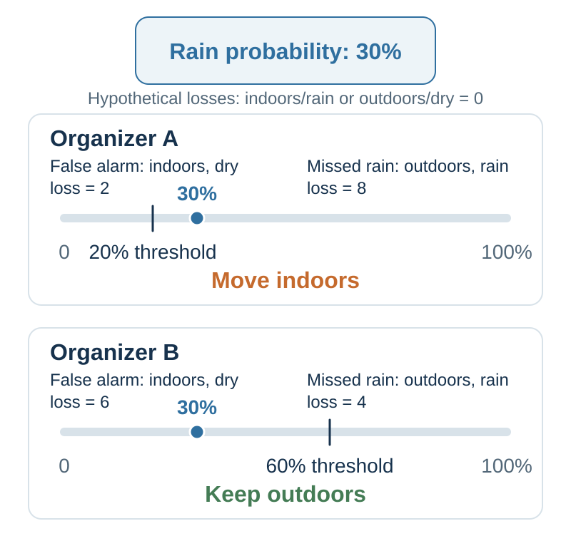
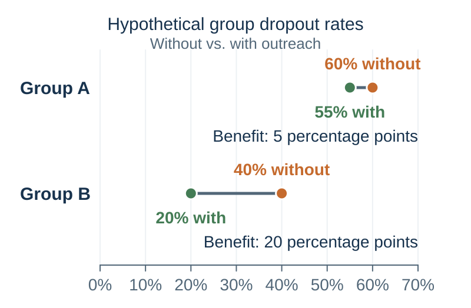

---
aliases:
  - 42-data-driven-decision-making.html
---

# Deciding With Data and AI {#data-driven-decision-making}

*Data Driven Decision Making*

::: {#chapter-42-start .chapter-epigraph}
> “We will need intelligent machines to help us turn our grandest dreams into reality.”
>
> — Garry Kasparov, [“Don’t Fear Intelligent Machines. Work with Them”](https://blog.ted.com/humans-must-face-our-fears-garry-kasparov-speaks-at-ted2017/), TED talk, 24 April 2017
:::

[]{#opening-puzzle-where-should-the-city-dig}Flint, Michigan, needed to find and replace hazardous water-service lines. The pipes were underground, the records were incomplete, and excavation was expensive. Every crew sent to uncover a copper line that did not need replacement was a crew unavailable to replace a dangerous one. Machine learning offered a way to direct the search: combine property records and inspection results to predict where lead or galvanized lines were most likely to be found (Abernethy et al., 2018; Webb et al., 2020).

A method that helped crews find more dangerous pipes might seem easy to welcome. **Yet the machine-learning-guided priorities met angry opposition from some residents.** Homes judged more likely to have hazardous lines were inspected sooner, while other households waited. Agrawal and colleagues describe anxious residents in streets left out of the immediate search, including wealthier residents angry that their pipes were not being checked. They wanted an inspection of their own connection; a low predicted risk did not provide the reassurance they sought (Agrawal et al., 2022a, chapter 15).

The conflict changed the programme. The city brought in a new contractor and directed excavation across its wards without following the model's risk priorities. More residents could see work taking place in their area, but crews increasingly dug up lines that did not need replacement. **The share of excavations finding hazardous pipes fell from about 80 percent under model-guided targeting to just 15 percent in 2018 under the new priorities** (Agrawal et al., 2022a; Webb et al., 2020).

Concentrating work where dangerous pipes are most likely can remove more of them with limited money and crews. Spreading inspections more widely can answer residents who fear being overlooked. Those aims can pull the next excavation in different directions. **How should the city use these predictions when residents contest the priorities built around them—and who has authority to decide whose claim comes first?**

The [previous chapter](41-decision-hygiene.qmd#ai-accountable-judgment) separated forecasts from the priorities and authority that turn them into a choice. Flint shows why that separation matters: residents could dispute the excavation policy without resolving their dispute by improving the pipe estimates. We begin with why data analysis has become more accessible, distinguish the questions it can answer, and then examine how AI can help turn evidence into better decisions. Throughout, the test is whether the resulting process works better for the people affected.

::: {.callout-note .core-idea icon=false}
## Core Idea

More recorded data and cheaper computation make it feasible to inform many more decisions with evidence. Start with the question: describe what happened, investigate why, predict what is unknown, or compare actions. Use the simplest adequate analysis, including validated AI where it helps. People remain responsible for what matters, whose interests count, and which actions are authorized. Test the whole arrangement, because inexpensive analysis creates value when it improves an actual decision.
:::

## Learning goals

- Explain how growing data availability and falling costs of computation expand the practical uses of evidence.
- Distinguish descriptive, diagnostic, predictive, and prescriptive analysis, and recognize when a causal claim requires additional evidence.
- Separate a prediction from a value judgment, an intervention effect, and an authorization to act.
- Explain how AI, machine learning, and algorithms relate, and match tools to a specific decision task.
- Explain why probability thresholds, data labels, and evaluation criteria embody human choices.
- Design a small, testable decision workflow using data and, where useful, AI, with a baseline, an owner, and a learning rule.

## More data and cheaper computation {#data-and-computation}

**Data-driven decision making** uses observations and analysis to inform choices and learn from their results. A decision once informed by memory and occasional reports may now leave a continuous digital record. Payments record purchases, booking systems record demand, sensors record equipment conditions, and inspections update information about properties. Documents, photographs, and messages add evidence that does not begin as a tidy spreadsheet. Much of this information is produced while people carry out ordinary work. Reusing appropriate records can make learning less expensive than collecting every observation afresh.

The scale of recorded activity has grown rapidly. In 2014, IDC estimated that the data created and copied worldwide during 2013 amounted to **4.4 zettabytes** and projected **44 zettabytes for 2020**—ten times as much. A zettabyte is a trillion gigabytes. The estimate included copies and transient data (IDC, 2014). The practical opportunity is the growing range of activities that can be observed, compared, and learned from.

Availability has several meanings. Data may exist somewhere without being accessible, lawful to use for this purpose, or relevant to this decision. A city's property database can contain millions of entries and still omit the pipe material needed for a particular house. More rows can improve precision when the observations are informative, but they do not automatically correct selective coverage, inaccurate labels, or a poorly chosen outcome.

At the same time, better hardware, more efficient methods, and reusable software have reduced the cost of many analytical tasks. Spreadsheets, databases, and statistical tools let small organizations summarize records, compare groups, and update estimates without building a computing system from scratch. Cloud services can make computing capacity available when needed. What matters economically is the cost of obtaining a useful result at the required scale and quality, rather than the number of calculations alone.

A recent example concerns the cost of using an already trained AI model. Stanford's 2025 AI Index reports that the inference price of achieving approximately GPT-3.5-level performance on the MMLU benchmark fell from **US\$20 per million tokens in November 2022 to US\$0.07 in October 2024**—a reduction of more than 280-fold. Tokens are the pieces of text a language model processes. The same report documents falling hardware costs and improving energy efficiency (Stanford Institute for Human-Centered Artificial Intelligence, 2025). These are dated comparisons at specified performance levels; they do not imply that every model or every computing project becomes cheaper at the same rate.

The combination matters: more useful observations can improve an analysis, while cheaper processing can make it worth repeating frequently and for smaller decisions. A bakery can examine sales by product and hour; a maintenance team can update inspection priorities after each new finding. Data-informed decision making becomes practical in places where a bespoke analysis for every choice would once have cost too much.

The complete process still includes collecting and cleaning records, checking results, changing work, and monitoring consequences. Training a new model can also be expensive even when using an existing one is cheap. The opportunity is therefore to lower the cost of useful evidence and bring it closer to action. To realize that opportunity, first specify what the analysis needs to answer.

## Four questions data analysis can answer {#four-uses-of-data}

Data analysis is the systematic use of observations to answer a question. **Descriptive, diagnostic, predictive, and prescriptive analytics** distinguish four purposes, not four products or mutually exclusive techniques (INFORMS, n.d.). The same records can serve several purposes. In @tbl-four-uses-of-data, Flint provides a common setting so that the change in question is easy to see.

| Purpose | Main question | Application to the pipe-replacement decision |
| --- | --- | --- |
| **Descriptive** | What happened, or what is happening? | Count inspections and hazardous pipes found; report hit rates, costs, waiting times, and coverage. |
| **Diagnostic** | Why did this pattern occur? | Investigate whether a falling hit rate reflects changes in inspected properties, records, procedures, or the targeting policy. |
| **Predictive** | What is likely, including what we cannot yet observe? | Estimate the probability that an uninspected property has a hazardous service line. |
| **Prescriptive** | What should we do, given our objectives and constraints? | Compare excavation schedules using risk estimates, crew capacity, costs, access, and agreed allocation priorities. |
: Four uses of data, illustrated within one decision {#tbl-four-uses-of-data}

**Description establishes the pattern that needs attention.** A hit rate requires both a numerator and a denominator: hazardous lines found divided by lines inspected. A count of successful replacements alone cannot tell us whether targeting improved, because the city may simply have excavated more properties. Descriptive work also makes missing coverage visible and supplies the baseline for judging change.

**Diagnosis investigates explanations.** Breaking results down by neighborhood, property age, or contractor can reveal where a pattern originates and suggest mechanisms to test. Such comparisons do not automatically identify a cause: the groups may differ in several ways, and the inspection policy determines which properties enter the data. A causal answer to “Why did this happen?” needs a research design and assumptions that distinguish the proposed explanation from alternatives (Cunningham, 2021).

**Prediction fills an information gap.** Forecasting next month's demand is one example; estimating the material of a pipe that already exists is another. A useful predictor can exploit an association without explaining why that association exists. Whether the model predicts well for new cases is an empirical question, and it is different from whether changing one of its inputs would change the outcome.

**Prescription compares feasible actions.** It combines information with an objective, constraints, and consequences. An optimizer can recommend an excavation schedule that performs best under its stated assumptions, but the objective and acceptable trade-offs must come from somewhere. Research on prescriptive analytics formalizes this connection between prediction and constrained decision making (Bertsimas & Kallus, 2020). When an action changes the outcome being predicted, credible evidence of its effect is an additional input; a risk score alone is insufficient.

These purposes connect **hindsight, insight, and foresight** to action. They do not form a universal ladder of increasing value or difficulty. A reliable count revealing an overlooked street can be more useful than a sophisticated forecast of the wrong target. In practice, the questions recur: an action produces outcomes to describe, unexpected results prompt diagnosis, and new evidence changes predictions and plans. The method should follow the question.

## AI, machine learning, and algorithms: a short guide {#ai-a-short-guide}

The four purposes of analysis do not map onto four kinds of AI. A descriptive table may need only a database query; an allocation problem may be solved with conventional optimization. AI offers additional tools, particularly when the task involves complex patterns, language, or images. A pipe-risk model, a chatbot, and a chess-playing program can all be described as AI while doing different jobs. The following terms help identify what each tool contributes.

**Artificial intelligence (AI)** is the broad field of building computer systems that perform tasks associated with intelligence: recognizing patterns, working with language, reasoning, and planning. Such systems can use inputs such as records, text, images, or sound to produce predictions, recommendations, content, or actions (National Institute of Standards and Technology, 2023; OECD, 2024).

An **algorithm** is a step-by-step procedure for carrying out a task. Sorting names alphabetically uses an algorithm; so does training a pipe-risk model. Algorithms are building blocks of ordinary software as well as AI. Some AI systems reason with explicitly supplied rules or search through possible moves; others learn patterns from data.

**Machine learning** is a major approach within AI in which a learning algorithm uses data to build or adjust a **model**. The model captures patterns that can be applied to new inputs. In Flint, examples linking property characteristics to observed pipe materials help the model estimate what lies beneath an uninspected property. **Training** builds or adjusts the model; **inference** applies it to an input to produce an output (James et al., 2023; OECD, 2024).

These capabilities extend beyond numerical forecasts. **Generative AI** produces content such as text, images, audio, or video using patterns learned from data. **Large language models (LLMs)** are machine-learning models that work with language; those used in chatbots can draft an explanation, summarize a document, or suggest questions. Other AI tools can flag unusual transactions, recognize objects in images, or help plan a sequence of actions (OECD, 2024).

For decision making, the useful question is which task needs help: estimating demand, finding relevant information, generating alternatives, or planning how to act. Specifying that task gives us something concrete to test—and keeps the choice of technology connected to the decision it should improve.

[]{#image-recognition-a-historical-gain-in-predictive-capability}

Image classification shows how much a defined task can improve. In the ImageNet competition, the best classification error fell from **28.2 percent in 2010** to **3.57 percent in 2015**, when an ensemble of residual neural networks won. These are **top-five error rates**: an image counts as an error when its correct category is absent from the system's five proposed labels (Russakovsky et al., 2015; He et al., 2016). The widely reproduced human reference of about 5 percent came from a particular trained annotator, not a universal limit on human vision.[^ch42-imagenet-comparison]

The result illustrates gains in capability made possible by the combination of training data, algorithms, and computing resources. Tasks such as sorting images or flagging cases for inspection became more plausible candidates for automation or assistance. It does not directly measure the price of computation, nor establish reliable performance on every new image source. Images from a different setting, different error costs, and a different workflow still require evaluation. Falling costs and improving performance are distinct changes; together they expand the tasks worth testing.

## What becomes possible when prediction becomes cheap? {#cheap-prediction}

A bakery wants every customer to find fresh bread, yet producing enough for an unexpectedly busy day can leave shelves full at closing. Baking less cuts waste but risks losing customers. A better demand forecast helps with both pressures. What changes when producing that forecast becomes cheap enough to do repeatedly, by product and time of day?

In *Prediction Machines*, Agrawal, Gans, and Goldfarb frame the economic significance of AI as a fall in the cost of prediction (Agrawal et al., 2022b). Their use of **prediction** includes filling in missing information about the present: whether a transaction is fraudulent, what an image contains, or which material lies underground. It is broader than forecasting the future. *Power and Prediction* extends the argument from improving individual tasks to reorganizing the systems in which decisions depend on one another (Agrawal et al., 2022a).

The earlier cost comparison explains why this matters for repeated decisions. When producing a useful estimate becomes inexpensive, a small organization may be able to classify more incoming requests, inspect more documents, or update forecasts more frequently. Problems once handled by one broad rule may support more differentiated responses.

The opportunity reaches beyond doing the same work faster. If a bakery can anticipate demand by product and time, it may change when batches are baked, how staff are scheduled, and when unsold stock is offered elsewhere. These are linked decisions. Improving a forecast without changing the production schedule may achieve little; redesigning the schedule without reliable forecasts may create new waste.

Cheaper prediction can therefore increase the value of its **complements**: useful observations, clear objectives, good interventions, implementation capacity, and feedback. If the city cannot obtain access to a property, a better pipe-risk score cannot make the excavation happen. If nobody is authorized to adjust a production schedule, a better demand forecast may remain an attractive dashboard.

Before selecting a tool, complete the connection: **If we could estimate this more accurately, we would change this decision.** If the intended action is unclear, the project may need work on its objective or options before another forecast.

## Separate the forecast from the value of its consequences {#separate-prediction-and-valuation}

A prediction describes possibilities and uncertainty. **Valuation** assigns importance to consequences: money, time, safety, dignity, fairness, enjoyment, or other ends. A **choice** commits to an available action. A decision process needs all three, together with evidence about what the actions can change.

Values enter early because they help determine which outcomes deserve prediction. Evidence can then reveal a trade-off that people had overlooked. What matters is keeping the contributions visible, so a disagreement about probabilities does not quietly become a disagreement about priorities—or the reverse.

Return to @fig-normative-decision-loop in [Chapter 1](01-understanding-decision-making.qmd#a-rational-benchmark). It supplies the normative framework here: information about alternatives supports prediction; predicted consequences are valued; choice and implementation lead to outcomes; and feedback can inform later judgment. AI can assist prediction within that process. People and institutions remain responsible for specifying what matters, deciding whether the evidence is sufficient, authorizing the action, and learning from its consequences.

Agrawal and colleagues use *judgment* in a narrower sense for assigning payoffs to consequences. Here we retain the book's term *valuation*, so that *judgment* can continue to describe forming beliefs and assessments more broadly (Agrawal et al., 2019).

### How consequences set an action threshold {#one-rain-forecast-two-sensible-choices}

Two organizers receive the same forecast: a 30 percent probability of rain during an outdoor event. One moves indoors; the other stays outside. They agree about the weather, yet choose opposite actions. Rain would badly damage the first event, while moving inside would sacrifice much of the second event's appeal. How can the same forecast support both choices?

To see the logic clearly, use an **error-loss model**. A false alarm means moving indoors when the weather would have been dry. A miss means staying outdoors when it rains. Assign zero incremental loss to the two correct matches: outdoors when dry and indoors when rainy. The figures below are hypothetical loss points.

| Organizer | Loss from an unnecessary move indoors | Loss from staying outdoors in rain | Expected loss if moving indoors | Expected loss if staying outdoors |
| --- | ---: | ---: | ---: | ---: |
| Rain would be especially damaging | 2 | 8 | 1.4 | 2.4 |
| Moving indoors would sacrifice much of the event | 6 | 4 | 4.2 | 1.2 |
: The same forecast can imply different actions under different values {#tbl-ai-rain-losses}

Expected loss weights each possible error by its probability: 70% for dry weather and 30% for rain. The comparison in @tbl-ai-rain-losses favors moving indoors for the first organizer and remaining outdoors for the second. Neither needs a different weather forecast. They face different consequences.

The more costly it would be to miss rain, relative to making an unnecessary move, the less confidence in rain is needed to justify moving indoors.

With these hypothetical losses, the thresholds in @fig-ai-same-forecast-different-values are 20 percent and 60 percent, placing the same 30 percent forecast on opposite sides of the action threshold. At equality, the model leaves the organizer indifferent. A threshold of 50 percent would be appropriate only for equal error losses under these assumptions.

{#fig-ai-same-forecast-different-values fig-alt="Both organizers face a 30 percent rain probability. With false-alarm loss 2 and missed-rain loss 8, the threshold is 20 percent and moving indoors minimizes expected loss. With losses 6 and 4, the threshold is 60 percent and remaining outdoors minimizes expected loss." width=100% .phone-fit}

:::: {#math-rain-decision-threshold}
::: {.callout-note .research-lens .mathematical-analysis icon=false collapse=true}
## Mathematical analysis: the action threshold for a rain forecast

More generally, let $p$ be the probability of rain, $C_F$ the false-alarm loss, and $C_M$ the missed-rain loss. In this model, moving indoors has lower expected loss when

$$
(1-p)C_F < pC_M,
$$

or equivalently

$$
p > \frac{C_F}{C_F+C_M}.
$$

For the first organizer, the threshold is $2/(2+8)=0.20$; for the second it is $6/(6+4)=0.60$. At a 30% rain probability, the expected losses are $0.70\times2=1.4$ versus $0.30\times8=2.4$, and $0.70\times6=4.2$ versus $0.30\times4=1.2$, respectively. Correct matches have zero incremental loss in this illustrative model.
:::
::::

Real choices can include reserving a tent, delaying a decision, accepting some weather exposure, or cancelling. They may also involve fixed costs, uncertain forecasts, capacity limits, and protected rights that cannot simply be priced away. The arithmetic reveals where valuation enters.

[]{#ai-target-variable-problem}

A model's training target is already a consequential choice. In a widely used healthcare-management algorithm, spending was used as a proxy for health need. Obermeyer and colleagues found that Black patients were sicker than White patients with the same risk score: unequal spending patterns made costs an inadequate stand-in for need (Obermeyer et al., 2019).

The model could perform well at predicting its label while allocating help in a way that conflicted with the stated purpose. Better prediction of the same proxy would not resolve that mismatch. A person or institution had to reconsider what the system should identify.

Before discussing model sophistication, finish two sentences: **“The outcome we can measure is…”** and **“The consequence we actually care about is…”** If they differ, explain why the first is an acceptable proxy, how it could fail, and who bears the cost of that failure.

## Turn predictions into an allocation policy {#flint-lead-pipes}

Using predictions to allocate scarce resources requires a policy: which cases take priority, how limited capacity is used, and who can revise the rule. Flint's contested excavation plan shows why that policy cannot be read directly from the probability map. Agrawal and colleagues develop this conflict in chapter 15 of *Power and Prediction*, “The New Judges” (Agrawal et al., 2022a). The technical task was a form of **supervised learning**: use properties with observed service-line materials to learn relationships that help estimate materials at other properties. Features included information about parcels and buildings, historical records, and inspection findings. The work used predictive models including gradient-boosted decision trees, alongside methods for deciding where additional inspection would be informative (Abernethy et al., 2018; Webb et al., 2020).

A **decision tree** divides cases through a sequence of feature-based splits. A tree ensemble combines many trees; in boosting, successive trees help improve the model's predictions under a specified loss function. The resulting score can express an estimated probability of a class, rather than only a yes-or-no label (James et al., 2023). Here the target was the material of the service line.

The field record makes the contrast clear. Model-guided targeting found hazardous pipes in about **80 percent** of excavations. When the new contractor largely bypassed high-risk areas in **2018**, the hit rate fell to **15 percent**. A **2019** legal settlement required the city to return to model-guided prioritization, after which the hit rate recovered to about **70 percent** (Agrawal et al., 2022a, chapter 15; Webb et al., 2020).[^ch42-flint-hit-rates]

The earlier technical paper asked a further question: could the search become more efficient still? It compared an actual unnecessary-visit rate of 18.8 percent with 2.0 percent under a proposed procedure in a **backtesting simulation** (Abernethy et al., 2018).

[^ch42-flint-hit-rates]: The hit rate is the share of excavations that uncover a service line containing hazardous material. Agrawal and colleagues report the approximate 80 percent and 70 percent rates for model-guided phases; Webb and colleagues report 15 percent for the whole of 2018. These are successive phases of the field programme, with changing excavation locations and remaining pipe stock, rather than randomized groups of otherwise identical properties.

The residents' objections exposed a question that the probability map could not answer: how much weight should the city give to reassurance and visible coverage across neighborhoods relative to finding hazardous pipes quickly? The settlement changed who could settle that trade-off and which priorities the programme had to follow. In Agrawal and colleagues' account, better prediction became a struggle over decision authority (Agrawal et al., 2022a).

The distinctions in @tbl-ai-flint-decision show what turns the probability map into a programme: an objective, feasible actions, operating constraints, and authority to decide and review.

| Decision component | In a pipe-replacement program |
| --- | --- |
| Prediction target | Which service-line materials are likely at this property, and how uncertain is the estimate? |
| Public objective | How should exposure, access, fairness, disruption, and replacement progress count? |
| Feasible action | Inspect, excavate, replace, gather records, or investigate an uncertain area. |
| Operational constraints | Crew time, access, street works, budgets, and the ability to respond to findings. |
| Authority and review | Who approves the plan, explains exceptions, hears challenges, and changes it when evidence warrants? |
: Decisions in a pipe-replacement program {#tbl-ai-flint-decision}

There is also a learning problem. If crews inspect only properties with high scores, the next dataset contains more information about those properties and less about the rest. A low score in a poorly documented neighborhood may be unreliable; the estimated risk and the amount of evidence behind it are different things. Spending some inspection capacity to learn can improve later decisions, although it may reduce the immediate number of hazardous lines found. **Active learning** studies the selection of informative observations; choosing how much present capacity to devote to future learning remains a decision about costs and benefits.

This is one reason a map should distinguish predicted risk from uncertainty and missing information. An uninspected property should not look as though it has been verified safe. A color-coded display can otherwise give incomplete records the authority of physical inspection.

## Predicting risk and estimating intervention benefits {#risk-is-not-treatment-benefit}

A university has more students at risk of leaving than its advisers can contact. An algorithm identifies those most likely to leave, so directing outreach to them seems sensible. But the students facing the greatest risk may be facing problems a call cannot change, while others could stay with timely advice. Which ranking should determine who receives the limited places: risk of leaving or benefit from the intervention?

The risk estimate describes what is expected under the existing conditions. Allocating outreach requires an additional estimate: how much this particular intervention would change the outcome. Both groups may deserve support, while needing different forms of it.

Consider the two hypothetical groups in @fig-ai-risk-is-not-benefit. Without outreach, their expected dropout rates are 60 and 40 percent. Suppose valid intervention evidence suggested rates of 55 and 20 percent with outreach. The expected reductions would be 5 and 20 percentage points. Ranking only baseline risk would prioritize the first group; ranking expected benefit per equal-cost place, with equal value assigned to each prevented dropout, would prioritize the second.

{#fig-ai-risk-is-not-benefit fig-alt="Group A has hypothetical dropout rates of 60 percent without outreach and 55 percent with it, a reduction of 5 percentage points. Group B has rates of 40 and 20 percent, a reduction of 20 percentage points. Group A has higher baseline risk, while Group B has greater expected benefit from this specific intervention." width=100% .phone-fit}

For one student, we cannot observe both outcomes at the same time: leaving after receiving outreach and leaving without it. Causal inference uses research designs and assumptions to estimate such comparisons across appropriate groups. Randomized assignment is one route; credible observational designs require other defensible assumptions (Cunningham, 2021). Machine learning can assist estimation, but predictive flexibility does not by itself establish the causal comparison.

The same distinction is useful in business. A customer with a high purchase probability may buy without a discount. An offer can then reduce revenue on a purchase that would have happened anyway. Predicting purchase propensity and estimating the **incremental effect** of an offer answer different questions. A randomized offer test, where appropriate, helps distinguish them.

Even a credible benefit estimate does not finish the allocation decision. A university may protect a minimum level of access, prioritize people facing severe disadvantage, or provide a different intervention where outreach is insufficient. Those commitments should be explicit. The figure makes the causal input visible alongside those allocation priorities.

Discovering which students benefit most introduces a further challenge: searching many possible groups can uncover apparently large effects by chance. One approach uses separate data to discover group definitions and to estimate their effects. The [research note on discovering who benefits](../appendices/appendix-e-how-behavioral-evidence-is-built.qmd#discovering-who-benefits) explains this separation and its limits. A flexible model can help investigate differences in benefit, provided the underlying comparison supports a causal interpretation.

## Choose tools by the work they must do {#ai-workbench}

Suppose the city asks a team to “use AI” to improve pipe replacement. One member proposes a risk model, another a chatbot to answer residents' questions, and a third a scheduling tool for crews. Each addresses a different obstacle. The four analytical purposes help the team identify which obstacle matters before choosing a tool. The workbench in @tbl-ai-workbench includes ordinary reporting and causal analysis alongside predictive models, language models, retrieval systems, and optimizers. A workflow can combine them, with a different check for each output.

| Work inside the decision | Possible tool | Output to request | Human check that matters |
| --- | --- | --- | --- |
| Describe outcomes and coverage | Spreadsheet, database query, statistical summary, chart | Counts, rates, distributions, and missing cases | Are units, denominators, definitions, and coverage correct? |
| Estimate a quantity or probability | Regression, tree ensembles, neural networks | Demand range, failure risk, or class probability | Is it validated for these cases and this time horizon? |
| Find structure or unusual cases | Clustering or anomaly detection | Groups or flagged deviations | Does the pattern have a useful interpretation, and could the flag be harmless? |
| Estimate what an action changes | Randomized comparison or a credible observational causal design, with suitable estimation | Expected difference under alternative actions | Does the design support that causal comparison, and for whom? |
| Find and organize evidence | Search, retrieval, document extraction, assisted summarization | Relevant passages with traceable sources | Does the source actually support the claim, and what was omitted? |
| Generate and compare language | A large language model | Drafts, alternative explanations, questions, or a comparison table | Are facts, calculations, implications, and the option set sound? |
| Allocate resources under explicit rules | Optimization, possibly using model estimates | A feasible schedule or allocation | Are the objective, constraints, and uncertainty acceptable? |
: Select methods for the work a decision needs; their uses overlap {#tbl-ai-workbench}

[]{#machine-learning-and-behavioral-discovery}

::: {.callout-note .research-lens icon=false collapse=true}
## Research Lens: discovering what predicts a choice

A bargaining record can contain more than the final agreement. The sequence of offers, the pauses between them, and the size of concessions may help predict whether negotiations will break down. Machine learning gives researchers a way to examine many such features and ask what they add to a simpler account based on the amount available for division.

Camerer (2019) describes experiments in which two people negotiated by moving cursors along a number line. One knew the amount available; the other did not. Features of the cursor movements predicted disagreement about as well as the amount being divided. Combining the process records with that amount improved prediction on held-out data. How bargaining unfolded therefore contained information beyond what was at stake.

This result creates questions for theory. A pause might reflect calculation, uncertainty, or a strategic attempt to make the other person concede. Those are candidate explanations, not conclusions established by the predictive model. Researchers can formulate competing predictions, vary information or bargaining rules in a new experiment, and examine which account survives. Camerer presents this use of machine learning as a research agenda for discovering behavioral regularities.

The available measurements can expand too. Athey (2019) explains how methods that organize text and images can turn previously unstructured material into variables for analysis. For example, classifying negotiation messages might reveal patterns that offer amounts miss. That proposed measure would need checking: a category labeled “hostility” is not validated merely because a model can assign it. The useful progression is to construct a defensible measure, establish whether it predicts new cases, and then test the explanation it suggests. Each step asks for different evidence.
:::

A central training task for many LLMs is predicting subsequent tokens—pieces of text—given a context. Additional training and connected tools can support instruction following, retrieval, coding, and other tasks. A fluent answer is therefore not equivalent to a calibrated forecast about the external world. Generated facts and references can be false; asking the model to sound more certain does not validate them (Ji et al., 2023).

The optional [Research Lens in Chapter 4](04-predictive-mind.qmd#generative-ai-and-predictive-processing) explains how prompts guide generation through context, why this offers a limited analogy with human perception, and why plausible content still needs external evidence. Much organizational work consists of turning scattered information into something another person can understand and use. A useful LLM can lower that cost, provided the workflow preserves the evidence and gives someone the means to check it.

[]{#ai-customer-support}

A support worker needs a useful answer while the customer is still waiting. Searching a long manual costs time, but an immediate answer that is wrong leaves the problem unresolved. An assistant that brings relevant guidance into the live conversation could change that trade-off. Brynjolfsson and colleagues studied a staggered rollout of a generative-AI assistant among 5,172 customer-support agents. Compared with working without the assistant, access increased issues resolved per hour by 15 percent on average, with substantial differences across workers (Brynjolfsson et al., 2025).

The assistant's value was connected to an immediate task: helping a worker respond to a customer. Translating that idea elsewhere requires identifying what the worker needs at the moment of action. A draft that arrives too late, cannot be checked, or contradicts the organization's obligations may save writing time while worsening the service.

[]{#ai-masai-screening}

Screening programmes need to find cancers while managing the work of reading large numbers of examinations. Reducing the number of human readings would save effort, but missed cancers could make that saving costly. The Swedish MASAI trial tested an AI-supported mammography workflow in which scores helped route examinations to one or two radiologists and supported detection. In the 2023 interim analysis of about 80,000 women, screen-reading workload fell by 44.3 percent relative to standard double reading (Lång et al., 2023).

The later randomized analysis examined **interval cancers**: cancers diagnosed between scheduled screening rounds. Rates were **1.55 per 1,000 women with AI-supported screening versus 1.76 with standard double reading**, meeting the trial's **non-inferiority** criterion: ruling out worsening beyond a prespecified margin. The rate ratio was 0.88, with a 95 percent confidence interval of 0.65–1.18. The AI-supported workflow detected 80.5 percent of cancers, compared with 73.8 percent under standard double reading (**sensitivity**). Both workflows correctly cleared 98.5 percent of women without cancer (**specificity**) (Gommers et al., 2026).

[]{#ai-physician-vignettes}

Strong performance on a clinical case gives a reason to test a model as a physician’s assistant. The physician must still know when to consult it, recognize a useful answer, and change the relevant judgment. A study can therefore find capable model output without finding better performance by people given access to it. In a randomized study, 50 physicians solved clinical vignettes using conventional resources, with half also given access to an LLM. Their median diagnostic-reasoning scores per case were **76 percent with LLM access and 74 percent without it**. The adjusted difference was 2 percentage points, with a 95 percent confidence interval from −4 to 8. Yet in a separate assessment using a standardized prompt, the LLM alone achieved a median score of **92 percent** on the same scoring rubric. A strong standalone result had not translated into a significant improvement for physicians given access to the tool (Goh et al., 2024).

A tool's standalone performance and its effect on a person using it are different quantities. The user must recognize when to consult it, interpret its output, detect errors, and change an appropriate action. Interface design, training, time pressure, and incentives can all become part of the intervention. Their contribution has to be tested rather than assumed.

The cases differ in setting and research design, but each directs attention to the arrangement around the tool. The useful comparison concerns the work and its consequences under that arrangement, rather than the impressive output considered alone.

## Trust, valuation, and responsibility {#trust-and-responsibility}

Flint's residents could be offered a better estimate while still disputing the decision made with it. The conflict asks us to separate confidence in a forecast from willingness to let a system determine what happens to one's household. People's willingness to accept algorithmic advice depends on what the advice is for. Bigman and Gray's experiments found reluctance to let machines make morally consequential decisions, with less aversion when machines advised rather than decided. Other experiments found **algorithm appreciation**: people sometimes placed more weight on advice attributed to an algorithm than on advice attributed to a person (Bigman & Gray, 2018; Logg et al., 2019).

Distinguish between **trust in a prediction**, **acceptance of a value trade-off**, and **recognition of legitimate authority**. A resident can believe that a pipe-risk model is useful while still expecting public officials to justify whose street is excavated next.

This chapter's recommendation is that valuation and consequential final choice remain human responsibilities. People and institutions should own the objectives, constraints, trade-offs, authorization, and remedies. AI can help articulate competing values, reveal inconsistencies, estimate consequences, or summarize affected people's expressed preferences. Predicting what people are likely to approve is different from establishing what they ought to accept.

Human authority must also have substance. A reviewer who cannot inspect the relevant evidence, has no time to disagree, or is punished for overriding the system offers little protection. Responsibility belongs to those who design and control the process as well as those who use it. The previous chapter develops the danger of making the frontline operator a convenient bearer of blame without corresponding power (Elish, 2019).

For a consequential decision, retain a person or authorized body who can hear reasons, approve or refuse the action, explain exceptions, and arrange review. People can authorize bounded automated actions under an explicit policy, while retaining responsibility for the policy, monitoring, escalation, and withdrawal of that authority. The boundary should be chosen in advance and scaled to the consequences (National Institute of Standards and Technology, 2023).

In Flint, this would mean distinguishing a challenge to the risk estimate from a challenge to the allocation policy, and identifying who can respond to each. Accountability becomes meaningful when an objection has somewhere to go and can change the relevant decision.

## Test the whole decision, not just the model {#test-the-whole-decision}

Evaluation should match the analytical purpose. A descriptive report needs accurate definitions, denominators, and coverage. A diagnostic explanation must address competing accounts; a causal claim needs a defensible comparison. A prediction needs testing on relevant new cases. A prescription needs evaluation against the objective, constraints, costs, and consequences of the action. These checks build on the distinctions in @tbl-four-uses-of-data.

Imagine receiving a report that a model is “95 percent accurate.” Before celebrating, ask what was predicted, which cases were included, and what comparison matters. If an event occurs in only 5 percent of cases, a rule that always predicts its absence is already 95 percent accurate. It may still be useless for finding the cases that require action.

Begin by testing the estimate on observations that did not determine the fitted model, keeping validation separate from final testing (James et al., 2023). Then follow the estimate into use: which errors change actions, what capacity limits those actions, and what consequences follow? Keeping these checks separate prevents a favorable model score from standing in for an evaluation of the decision.

[]{#make-the-test-resemble-the-task}

Begin with the unit and moment of decision. Are we predicting a property, a customer session, a student term, or tomorrow's demand? Use only information available at that moment. **Data leakage** occurs when information that should be unavailable to the prediction enters its development or evaluation. A variable recorded after the outcome can make a model look excellent by leaking the answer into its inputs.

Keep an untouched test set for the final comparison. Use the training and validation data to fit and tune the model. When future performance is the target, respect time order; when the same person or organization appears repeatedly, avoid treating their related observations as independent evidence of generalization. Apply preprocessing within the relevant training partitions. Document exclusions, missingness, source versions, and the exact model that produced the result.

Compare a complex model with a credible simple rule on the same cases and under the same information constraints. A base rate, a transparent regression, or the existing procedure may be hard to beat after operating costs are included.

[]{#evaluate-probabilities-and-decisions-separately}

A city may use a risk cutoff to decide whether an inspection is worth its cost. A model can rank properties correctly while overstating their probabilities; the ranking then looks useful, but more properties may cross the action threshold than the evidence justifies. Evaluation needs to test both what the scores separate and what their numerical values mean. **Discrimination** concerns how well scores distinguish cases with different outcomes. **Calibration** concerns whether stated probabilities agree with observed frequencies across appropriate groups of predictions. Among many comparable cases assigned a 30 percent probability, roughly 30 percent should have the event.

Then evaluate the action rule. Count the important kinds of error, inspect subgroup performance, and apply the stated costs and capacity limits. A model with a slightly better ranking metric can still produce a worse decision if its probabilities are poorly calibrated around the action threshold. Conversely, an improvement far from any threshold may change almost no actions.

Record the number of cases underlying each result and the uncertainty in estimated performance. [Chapter 15](15-randomness-and-overconfidence.qmd#calibration-makes-confidence-answerable) develops the discipline of calibration and learning from samples.

[]{#compare-workflows-before-scaling}

A practical pilot should compare the current process, a simple baseline, and the proposed AI-assisted process. A model-only comparison can be informative in a retrospective or otherwise safe evaluation even when it would not be an acceptable live policy. Measure verification time, error consequences, appropriate reliance, and outcomes—not only how quickly a draft appears.

Start with a mode that lets the system produce outputs without automatically changing consequential actions when that is feasible. Then use a limited, monitored deployment; randomize or use another credible evaluation design when the question is whether the new workflow causes improvement. Prespecify what would justify expansion, revision, or stopping.

The live system also changes its own evidence. A fraud review prevents some losses; outreach may prevent some departures; an excavation reveals a previously unknown pipe. Outcomes under the new policy are not a neutral test of what would have happened under the old one. Log the action as well as the prediction, and preserve the distinction between forecasting quality and policy effects.

[]{#communicate-enough-uncertainty-to-support-a-choice}

A useful display makes the relevant comparison visible. Show the same units and time horizon across alternatives, label the action threshold, and distinguish observations from predictions. If an interval is shown, say whether it concerns an average effect, an estimated parameter, or an individual future outcome; those are different uncertainties. Wilke's treatment of uncertainty emphasizes that a visually precise mark can easily be mistaken for certainty (Wilke, 2019).

For the city, a map should make missing inspections visible. For the event organizer, the forecast should appear beside the consequences of moving or remaining. For the university, the display should distinguish baseline dropout risk from estimated benefit of outreach. A dashboard earns its place when updated information can trigger a useful decision.

## Why this is the final chapter {#why-this-final-chapter}

The book began by asking how a decision should be made and how it actually takes shape. Data analysis brings those two questions together. Description makes the current process visible; diagnosis investigates its failures; prediction reduces uncertainty; and prescription compares possible actions. AI can assist this work, while the human discussion of what matters and who may act remains explicit. A city with better pipe estimates still needs to decide what its replacement program should accomplish.

Using that opportunity draws on the whole book:

- **Attention and interpretation:** [Chapter 3](03-limited-attention.qmd#inattentional-blindness-what-attention-leaves-out) asks what becomes evidence; [Chapter 12](12-framing.qmd#equivalent-facts-different-meanings) examines how its presentation changes a decision. These questions apply to the cases included in a dataset, the information supplied to an AI assistant, and the way a score or recommendation is displayed.
- **Prediction and evidence:** [Chapters 14](14-base-rates-and-updating.qmd#probability-begins-with-a-model) and [15](15-randomness-and-overconfidence.qmd#calibration-makes-confidence-answerable) supply base rates, updating, and calibration. They help us judge whether an AI forecast deserves reliance and whether an apparent improvement survives an appropriate comparison.
- **Valuation and a better life:** [Chapter 6](06-valuation.qmd#using-valuation-wisely) examines how outcomes become worth pursuing; [Chapter 22](22-deciding-for-a-better-life.qmd#one-word-several-targets) asks what makes the resulting life better. Together they keep a convenient target—spending, clicks, or speed—from silently defining success.
- **Other minds and institutions:** [Chapter 28](28-social-influence.qmd#authority-and-responsibility) examines authority and responsibility, while [Chapter 35](35-negotiation-as-joint-decision-design.qmd#prepare-the-joint-decision) treats negotiation as joint decision design. An AI-supported policy still needs a way to address conflicting interests, hear objections, and assign authority over the final choice.
- **Design and learning:** [Chapters 39](39-behavior-design.qmd#one-primary-workflow) through [41](41-decision-hygiene.qmd#decision-hygiene-build-a-process-that-can-learn) turn these distinctions into changes that can be implemented and tested. A forecast becomes useful when someone can act on it, record the result, and revise the process.

These connections give the chapter its practical test: identify the uncertainty a tool could reduce, decide what action would follow, and compare that arrangement with the existing process. A model’s score matters because of what it enables people to do.

## Practice Lab: improve a decision with data {#practice-lab-build-a-small-ai-decision-system}

Work with a recurring decision that is important enough to improve but small enough to test: scheduling staff, classifying incoming requests, prioritizing maintenance inspections, or preparing a document review. First state whether the missing contribution is descriptive, diagnostic, predictive, or prescriptive. A spreadsheet or simple comparison may be sufficient; add AI when it has a defined job. If using real records, use data authorized for this purpose and the chosen tool. The exercise can also use fictional cases. Working alone, record your assessment before seeing the analysis and preserve that version. You can study how the output changes your judgment, but you cannot use your own two assessments as evidence about disagreement between independent people.

[]{#ai-decision-canvas}

Use @tbl-ai-decision-canvas to specify the decision, missing evidence, protected values, and review rule before selecting a product or writing a prompt. The separate fields make it possible to judge the tool by the contribution the decision actually needs.

| Field | What to write before the pilot |
| --- | --- |
| **Decision and owner** | Who must choose what, by when, from which feasible alternatives? |
| **Analytical question** | Is the immediate task description, diagnosis, prediction, or prescription? What would its answer change? |
| **Evidence or estimate** | What information is needed? For a prediction, specify unit, target, horizon, and uncertainty. |
| **Valuation** | Whose benefits, burdens, rights, and error costs count? Which constraints are protected? |
| **Causal link** | Why would the proposed action improve the outcome? What evidence is still needed? |
| **Tool and baseline** | Which function should the tool perform? What simple rule or existing process must it improve upon? |
| **Evidence and test** | Which data are legitimate and available at decision time? What held-out or prospective comparison will be used? |
| **Authority and exceptions** | Who authorizes actions, checks uncertain cases, handles challenges, and can stop the system? |
| **Learning rule** | What is logged, when is it reviewed, and what result triggers continuation, revision, or withdrawal? |
: A decision canvas that keeps the analytical question, valuation, causal evidence, and responsibility distinct {#tbl-ai-decision-canvas}

**Round 1: preserve independent judgment.** Give two people the same case. Each records the available actions, the missing information, any relevant forecast, the consequences that matter, and a provisional choice before seeing analytical output. This uses the independence principle from [Chapter 41](41-decision-hygiene.qmd#chapter-41-start).

**Round 2: assign the analysis a bounded job.** Produce the summary, investigate the pattern, estimate the missing quantity, or compare feasible actions under stated criteria. Select a tool suited to that job and record the time and cost of obtaining and checking the result. If using AI, request a specific contribution. If the system cannot justify a probability from an appropriate model and validation, keep its suggestions qualitative rather than inventing precision.

For an LLM helping with a document-based decision, a useful instruction is:

> Using only the supplied material, make a comparison table for these alternatives. Link each factual claim to its supporting passage. Separate stated facts, assumptions, and missing information. Show which additional evidence could change the comparison. Use our stated criteria; flag any value trade-off that we have not resolved.

Verify the supporting passages and important calculations before using the table.

**Round 3: diagnose the disagreement.** When individual assessments and analytical results differ, classify the reason. Do they disagree about evidence, probability, values, feasibility, or authority? A model cannot settle a disagreement about priorities merely by restating its forecast. A senior person cannot refute a well-validated forecast merely by disliking its implications.

**Round 4: record a choice and a test.** Use the canvas to authorize a limited action or decide that more evidence is needed. Preserve the initial forecasts, the advice received, what was checked, and why the advice changed—or did not change—the decision. Set a review date before the outcome can rewrite the story.

Debrief with one question: **What became better because of the analysis, and what evidence would show that improvement?** A useful answer identifies a changed part of the process and an observable consequence, taking the cost of analysis and implementation into account. “The output sounded professional” is not enough.

## Take it forward

Flint needed a replacement policy it could explain to anxious residents and evaluate against the removal of hazardous pipes. Better predictions made the search more informative; the dispute concerned how those predictions should guide action and who could set the priorities. A defensible process needs both useful evidence and accountable authority over the trade-offs.

More available data and cheaper computation make this discipline feasible for more recurring decisions. Choose one this week. State the question, identify the relevant records, and begin with a simple analysis. Use AI where it improves a defined contribution. Make the values behind the choice explicit, keep an identifiable owner, and preserve a record that later evidence can challenge.

Return finally to the hiring committee that opened the book. AI might help compare applications or estimate later performance. The committee still has to define which kinds of performance matter, examine how evidence was selected and presented, hear disagreement, and justify its choice. It then needs to check what happened without letting the outcome rewrite the original reasoning. Attention, prediction, valuation, influence, design, and learning meet in that one decision.

The decision map in @fig-normative-decision-loop gives us a common reference from the first chapter to the last. We can ask which part a tool improves, which judgment still needs attention, and what later evidence would justify a change. The more a machine can tell us about what may happen, the more clearly we need to decide what is worth making happen.

[^ch42-imagenet-comparison]: Russakovsky et al. (2015) report 5.1% top-five error for a trained annotator on 1,500 test images; a second, less-trained annotator had 12.0% error on 258 images. The often-used human line is therefore a task- and annotator-specific reference. The paper also notes changes in challenge categories between 2010 and 2012. The historical sequence shows progress in the benchmark family, rather than the same test administered unchanged each year. He et al. (2016) report the 2015 winning ensemble's 3.57% error on the full test set.

## References cited in this chapter

::: {.reference}
Abernethy, J., Chojnacki, A., Farahi, A., Schwartz, E., & Webb, J. (2018). ActiveRemediation: The search for lead pipes in Flint, Michigan. In *Proceedings of the 24th ACM SIGKDD International Conference on Knowledge Discovery & Data Mining*. https://doi.org/10.1145/3219819.3219896
:::

::: {.reference}
Agrawal, A., Gans, J., & Goldfarb, A. (2018). *Prediction machines: The simple economics of artificial intelligence*. Harvard Business Review Press.
:::

::: {.reference}
Agrawal, A., Gans, J., & Goldfarb, A. (2019). Prediction, judgment, and complexity: A theory of decision-making and artificial intelligence. In A. Agrawal, J. Gans, & A. Goldfarb (Eds.), *The economics of artificial intelligence: An agenda* (pp. 89–110). University of Chicago Press.
:::

::: {.reference}
Agrawal, A., Gans, J., & Goldfarb, A. (2022a). *Power and prediction: The disruptive economics of artificial intelligence*. Harvard Business Review Press. https://store.hbr.org/product/power-and-prediction-the-disruptive-economics-of-artificial-intelligence/10580
:::

::: {.reference}
Agrawal, A., Gans, J., & Goldfarb, A. (2022b). *Prediction machines: The simple economics of artificial intelligence* (Updated and expanded ed.). Harvard Business Review Press. https://store.hbr.org/product/prediction-machines-updated-and-expanded-the-simple-economics-of-artificial-intelligence/10598
:::

::: {.reference}
Athey, S. (2019). The impact of machine learning on economics. In A. Agrawal, J. Gans, & A. Goldfarb (Eds.), *The economics of artificial intelligence: An agenda* (pp. 507–547). University of Chicago Press. https://doi.org/10.7208/chicago/9780226613475.003.0021
:::

::: {.reference}
Bertsimas, D., & Kallus, N. (2020). [From predictive to prescriptive analytics](https://doi.org/10.1287/mnsc.2018.3253). *Management Science, 66*(3), 1025–1044.
:::

::: {.reference}
Bigman, Y. E., & Gray, K. (2018). People are averse to machines making moral decisions. *Cognition, 181*, 21–34. https://doi.org/10.1016/j.cognition.2018.08.003
:::

::: {.reference}
Brynjolfsson, E., Li, D., & Raymond, L. (2025). Generative AI at work. *The Quarterly Journal of Economics, 140*(2), 889–942. https://doi.org/10.1093/qje/qjae044
:::

::: {.reference}
Camerer, C. F. (2019). Artificial intelligence and behavioral economics. In A. Agrawal, J. Gans, & A. Goldfarb (Eds.), *The economics of artificial intelligence: An agenda* (pp. 587–608). University of Chicago Press. https://doi.org/10.7208/chicago/9780226613475.003.0024
:::

::: {.reference}
Cunningham, S. (2021). *Causal inference: The mixtape*. Yale University Press.
:::

::: {.reference}
Elish, M. C. (2019). Moral crumple zones: Cautionary tales in human-robot interaction. Engaging Science, Technology, and Society, 5, 40–60.
:::

::: {.reference}
Goh, E., Gallo, R., Hom, J., Strong, E., Weng, Y., Kerman, H., Cool, J. A., Kanjee, Z., Parsons, A. S., Ahuja, N., Horvitz, E., Yang, D., Milstein, A., Olson, A. P. J., Rodman, A., & Chen, J. H. (2024). Large language model influence on diagnostic reasoning: A randomized clinical trial. *JAMA Network Open, 7*(10), e2440969. https://doi.org/10.1001/jamanetworkopen.2024.40969
:::

::: {.reference}
Gommers, J., Hernström, V., Josefsson, V., Sartor, H., Schmidt, D., Hjelmgren, A., Larsson, A.-M., Hofvind, S., Andersson, I., Rosso, A., Hagberg, O., & Lång, K. (2026). Interval cancer, sensitivity, and specificity comparing AI-supported mammography screening with standard double reading without AI in the MASAI study: A randomised, controlled, non-inferiority, single-blinded, population-based, screening-accuracy trial. *The Lancet, 407*(10527), 505–514. https://doi.org/10.1016/S0140-6736(25)02464-X
:::

::: {.reference}
He, K., Zhang, X., Ren, S., & Sun, J. (2016). [Deep residual learning for image recognition](https://openaccess.thecvf.com/content_cvpr_2016/html/He_Deep_Residual_Learning_CVPR_2016_paper.html). In *Proceedings of the IEEE Conference on Computer Vision and Pattern Recognition* (pp. 770–778).
:::

::: {.reference}
IDC. (2014). *[The digital universe of opportunities: Rich data and the increasing value of the Internet of Things](https://idcclients.cycloneinteractive.net/emc-digital-universe-iview-2014/executive-summary.htm)* [EMC-sponsored report].
:::

::: {.reference}
INFORMS. (n.d.). *[Explore the INFORMS Analytics Framework](https://www.informs.org/Professional-Development/INFORMS-Analytics-Framework/Explore)*. Retrieved September 17, 2026.
:::

::: {.reference}
James, G., Witten, D., Hastie, T., Tibshirani, R., & Taylor, J. (2023). *An introduction to statistical learning: With applications in Python*. Springer. https://doi.org/10.1007/978-3-031-38747-0
:::

::: {.reference}
Ji, Z., Lee, N., Frieske, R., Yu, T., Su, D., Xu, Y., Ishii, E., Bang, Y. J., Madotto, A., & Fung, P. (2023). Survey of hallucination in natural language generation. ACM Computing Surveys, 55(12), Article 248. https://doi.org/10.1145/3571730
:::

::: {.reference}
Lång, K., Josefsson, V., Larsson, A.-M., Larsson, S., Högberg, C., Sartor, H., Hofvind, S., Andersson, I., & Rosso, A. (2023). Artificial intelligence-supported screen reading versus standard double reading in the Mammography Screening with Artificial Intelligence trial (MASAI): A clinical safety analysis of a randomised, controlled, non-inferiority, single-blinded, screening accuracy study. *The Lancet Oncology, 24*(8), 936–944. https://doi.org/10.1016/S1470-2045(23)00298-X
:::

::: {.reference}
Logg, J. M., Minson, J. A., & Moore, D. A. (2019). Algorithm appreciation: People prefer algorithmic to human judgment. *Organizational Behavior and Human Decision Processes, 151*, 90–103. https://doi.org/10.1016/j.obhdp.2018.12.005
:::

::: {.reference}
National Institute of Standards and Technology. (2023). Artificial intelligence risk management framework (AI RMF 1.0) (NIST AI 100-1). U.S. Department of Commerce. https://doi.org/10.6028/NIST.AI.100-1
:::

::: {.reference}
Obermeyer, Z., Powers, B., Vogeli, C., & Mullainathan, S. (2019). Dissecting racial bias in an algorithm used to manage the health of populations. Science, 366(6464), 447–453.
:::

::: {.reference}
OECD. (2024). *Explanatory memorandum on the updated OECD definition of an AI system*. OECD Artificial Intelligence Papers, No. 8. OECD Publishing. https://doi.org/10.1787/623da898-en
:::

::: {.reference}
Russakovsky, O., Deng, J., Su, H., Krause, J., Satheesh, S., Ma, S., Huang, Z., Karpathy, A., Khosla, A., Bernstein, M., Berg, A. C., & Fei-Fei, L. (2015). [ImageNet large scale visual recognition challenge](https://doi.org/10.1007/s11263-015-0816-y). *International Journal of Computer Vision, 115*(3), 211–252.
:::

::: {.reference}
Stanford Institute for Human-Centered Artificial Intelligence. (2025). *The 2025 AI Index report* [Report overview]. Stanford University. https://hai.stanford.edu/ai-index/2025-ai-index-report
:::

::: {.reference}
Webb, J., Abernethy, J., & Schwartz, E. (2020, February 12). *Getting the lead out: Data science and water service lines in Flint*. Author report. https://storage.googleapis.com/flint-storage-bucket/d4gx_2019%20%282%29.pdf
:::

::: {.reference}
Wilke, C. O. (2019). *Fundamentals of data visualization*. O'Reilly Media. https://clauswilke.com/dataviz/
:::
