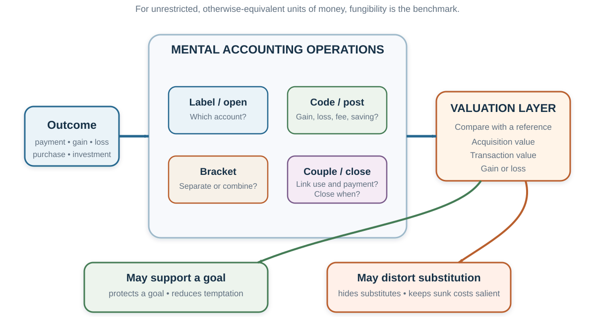

# Mental Accounting: Money Is Fungible; Minds Label It

*Two kroner with the same purchasing power can produce different choices when one is called salary, another a windfall, one belongs to the holiday budget, and another would close an account in the red.*

::: {.callout-note .core-idea icon=false}
## Core idea

Mental accounting is the cognitive bookkeeping through which people code, label, group, and evaluate economic outcomes. The labels can protect goals and simplify control. But they can also hide opportunity costs, preserve sunk costs, and make economically interchangeable resources behave as if they were not substitutes.
:::

## Learning goals

- Explain acquisition utility, transaction utility, mental budgets, sunk-cost sensitivity, payment coupling, and choice bracketing.
- Predict when identical total outcomes will be evaluated differently because an account, reference point, or closing rule changes.
- Distinguish a mental-accounting explanation from alternative mechanisms such as constraints, information, taxes, or transaction costs.
- Use broad-bracketing and forward-looking tests without ignoring dependence, wealth, liquidity, or self-control.
- Design account boundaries that protect considered goals without making money needlessly nonfungible.

## Opening puzzle: is saving DKK 40 worth the trip?

Imagine that another shop is twenty minutes away. It sells the product you want for DKK 40 less.

- In one version, the product costs DKK 120 here and DKK 80 there.
- In another, it costs DKK 1,200 here and DKK 1,160 there.

The trip, time, and saving are identical. Yet many people are more willing to travel when the DKK 40 is one third of the price than when it is only a small percentage. The economic benchmark asks whether DKK 40 exceeds the value of forty minutes of travel and any inconvenience. The product's original price should not change that comparison.

But the mind often codes the saving inside the purchase account. “Saving 33%” feels like a better transaction than “saving 3%,” even when wealth changes by exactly the same amount. The implicit value of time moves with the context (Thaler, 1985). Waiting-time research shows a related pattern: people may pay more to avoid the same wait when the underlying purchase is more expensive (Leclerc et al., 1995).

This is the central tension of mental accounting. A decision can be locally coherent inside one account and globally poor across the person's full set of resources and goals.

## The benchmark: fungibility and total wealth

Money is **fungible** when one unit can substitute for another unit of equal value. A DKK 100 note received as salary can buy the same groceries as DKK 100 won in a raffle. Under a broad economic benchmark, the source label does not change purchasing power. A prior payment that cannot be recovered is sunk and should not determine a forward-looking choice. Two decisions should be evaluated together when their combined consequences determine wealth and welfare.

Mental accounting describes systematic departures from that representation. It is the set of cognitive operations people use to organize, evaluate, and keep track of financial activities (Thaler, 1985, 1999). At least five questions define an account:

1. **Which account is opened?** Entertainment, food, housing, savings, salary, bonus, or a particular investment?
2. **How is an outcome posted?** As a gain, a loss, a fee, a saving, a refund, or “house money”?
3. **What is evaluated together?** One purchase, a day of trading, a portfolio, a month, or lifetime wealth?
4. **What is the reference point?** Expected price, purchase price, budget, target, or status quo?
5. **When is the account closed?** At payment, consumption, sale, month-end, or never?

{#fig-mental-accounting-map fig-alt="Economic outcomes enter an accounting layer with four operations: open an account, post an entry, choose the bracket, and close the account. A valuation layer compares the coded outcome with a reference point. Two arrows lead to useful self-control and distorted trade-offs, followed by a diagnostic question asking whether the boundary still serves the person's goal."}

The accounts are **representations**, not literal containers in the brain. The same person can use different boundaries across goals, times, and settings. An observed refusal to move money across categories does not identify the mechanism by itself. Borrowing while saving may reflect mental accounting, but it may also reflect withdrawal penalties, credit access, tax treatment, liquidity needs, or information. A mechanism claim needs evidence that separates these explanations.

## Acquisition utility and transaction utility

Suppose you want a cold beer on a hot beach. A companion can buy the same beer either from an expensive resort or from a run-down grocery shop. People commonly state a higher maximum price when the seller is the resort, even though the beer and the pleasure from drinking it are unchanged. In Thaler's original demonstration, mean stated willingness to pay differed substantially across the two seller contexts (Thaler, 1985).

The distinction is between two evaluations:

- **Acquisition utility** is the value of the item minus the money given up. It resembles consumer surplus: is the beer worth at least its price to me?
- **Transaction utility** is the pleasure or pain of the deal relative to a reference price: am I paying less or more than I expected to pay here?

A price below the reference can create a satisfying “deal” even when the item is not valuable enough to justify buying. Conversely, a price that feels unfair can block a purchase whose total benefit exceeds its total cost. “€45 plus €5 shipping” may feel worse than “€50 with free shipping” because the fee is posted as a separate loss, although total expenditure is identical.

The reference price is not always mistaken. A high resort price may signal scarcity, service, or future replacement cost. But transaction utility becomes dangerous when “how good is this deal?” silently replaces “is this worth buying?” The two questions need separate answers.

The failed transformation of JCPenney in 2012 is often used as a business illustration. The retailer reduced frequent promotions and familiar price endings in favor of simpler everyday pricing; sales then fell sharply. That sequence is consistent with customers missing transaction utility, but the pricing move was one element of a much broader strategy change. It cannot establish a single psychological cause. A memorable case should generate hypotheses, not close the account on explanation.

## Sunk costs and the pain of closing an account

[Chapter 14](14-anchors-halos-decoys-and-escalation.qmd) introduced sunk costs as one route into escalation. Mental accounting adds a more specific mechanism: abandoning an activity can feel like closing its account at a loss, even when the past payment cannot alter any future consequence.

Vince prepays for a tennis season and later develops a painful elbow. He continues playing because stopping would “waste” the membership. Yet if a friend offered the same painful game for free, he would refuse.

The payment is unrecoverable. Under a forward-looking benchmark, the choice should compare the future benefits and costs of playing: enjoyment, exercise, time, and injury. Paying in the past does not make playing now healthier. But mental accounting opens the tennis account with a negative balance. Attendance appears to repay the payment; quitting closes the account with an explicit loss (Arkes & Blumer, 1985).

The same structure appears when a person drives through a blizzard because a ticket was expensive, finishes an unpleasant meal because it was paid for, or continues a failing project because too much has already been invested. The past expenditure creates a psychological debt even when it cannot change the future payoff.

The sunk-cost effect is not proof that every persistence decision is wrong. Prior investment can contain information about quality, commitment, reputation, switching costs, or learning. The diagnostic is narrower:

> If the past payment disappeared from memory but every future consequence remained, would the best next action change?

If yes, ask what legitimate future consequence carries the effect. If none can be named, the account may be keeping an irrelevant cost alive.

### Payment coupling: when consumption repays a purchase

Payments and consumption can be tightly or weakly coupled. After a bill arrives, use can feel like repayment. Gourville and Soman (1998) found gym attendance rose after periodic payments and then declined as the payment became less salient. In a field experiment with theatre season tickets, randomly assigned discounts reduced later attendance during the first part of the season; the difference faded over time (Arkes & Blumer, 1985). Sunk costs can motivate consumption, but their salience decays.

Payment design therefore changes experience:

- Cash or a visible per-use charge keeps the “running meter” salient.
- Credit cards and delayed billing weaken the link between consumption and payment.
- Flat rates remove the pain of each use and may be preferred even when metered use would cost no more.
- Prepayment can encourage use immediately after purchase but later become forgotten.

Weak coupling is not inherently harmful. It can make a valuable experience easier to enjoy. But it can also conceal cumulative spending. The ethical issue is whether payment timing helps the chooser implement a considered plan or makes total cost difficult to recover.

## Mental budgets: useful boundaries that can become walls

People commonly organize expenditures into food, housing, entertainment, education, and holiday budgets; wealth into cash, investments, and retirement savings; and income into salary, bonus, refund, or windfall. These categories reduce computational burden and can protect long-run goals. “The retirement account is not for ordinary spending” is a self-control rule before it is a financial calculation.

But a notional budget can become nonfungible. Someone may reject a worthwhile theatre ticket because the entertainment budget was used on a sports event, yet buy it after an equally costly medical expense or after receiving the sports ticket as a gift. Heath and Soll (1996) used such comparisons to show category-sensitive spending. The reconstructed table below reports the percentage of participants showing the predicted “no after a related purchase, yes after a gift, yes after an unrelated purchase” pattern for several combinations. The variation matters: account boundaries were not identical across goods.

| Prior “related” purchase | New theatre ticket | New Chinese takeaway | New sweatshirt |
| --- | ---: | ---: | ---: |
| Sports ticket | **38** | 12 | 12 |
| Boat tour | **41** | 16 | 6 |
| Party snacks | 21 | 12 | 6 |
| Salmon | 21 | **24** | 0 |
| Dinner out | 32 | **32** | 6 |
| Wine | 15 | **18** | 3 |
| Jeans | 0 | 0 | **12** |
| Watch | 15 | 3 | 9 |
| Costume | **38** | 9 | 9 |
: Mental-budget boundaries vary across category pairings; percentages reconstructed from Heath and Soll (1996) {#tbl-mental-budgets}

Field evidence can make nonfungibility more consequential. When gasoline prices fell sharply in 2008, consumers shifted toward higher grades. In the paper's baseline model, marginal utility responded about fifteen times more to a gasoline-price increase than to an equivalent income reduction; comparable quality shifts did not appear for milk or orange juice (Hastings & Shapiro, 2013). A plausible interpretation is that consumers kept part of the saving inside a gasoline account rather than reallocating it across the household budget.

Again, the contrast is not “irrational people versus rational economists.” A budget boundary may preserve money for an important goal. It becomes costly when a person saves at a low return while carrying avoidable high-interest debt, refuses a necessary substitution, or spends a windfall on something they would reject if it were called salary.

### Lost ticket, lost cash

Before entering a theatre, one person loses a DKK 150 ticket. Another loses DKK 150 in cash before buying the ticket. Should either person spend DKK 150 now to attend?

If preferences, remaining wealth, and all future consequences are the same, the two losses leave total wealth in the same place. Yet replacing the lost ticket often feels like spending DKK 300 on theatre, whereas buying after lost cash feels like a separate decision. The first loss is posted to the entertainment account; the second may be posted to general wealth (Thaler, 1985).

A strong budgeting rule does two things at once: it protects goals before temptation, and it allows deliberate exceptions when the original categories no longer serve the whole plan.

## Prior outcomes: house money, break-even, and realization

The current gamble is not always evaluated alone. A recent gain or loss can determine which account is open.

In stylized experiments, a prior gain sometimes increases subsequent risk taking: the **house-money effect**. A loss feels less painful when it can be coded as giving back part of a recent gain. A prior loss can also increase attraction to a gamble that offers a salient chance to recover it: the **break-even effect**. But a loss does not universally create risk seeking. The pattern depends on whether the outcomes are integrated, how large they are, and whether the new gamble can plausibly close the account near zero (Thaler & Johnson, 1990).

The same logic helps organize the **disposition effect**: investors are often more willing to sell assets trading above their purchase price than assets trading below it. Selling a winner closes an account with a gain; selling a loser realizes an explicit loss (Shefrin & Statman, 1985). In Odean's (1998) brokerage data, investors displayed a stronger propensity to realize gains than losses. The winners sold subsequently outperformed the losing positions retained by about 3.41 percentage points in market-adjusted return over the following year, which is inconsistent with the simple claim that retained losers had better prospects.

But a sale pattern does not uniquely identify realization utility. Taxes, rebalancing, information, liquidity, transaction costs, and differing expectations can all affect which positions are sold. Experimental markets provide more control and have also produced disposition-like behavior (Weber & Camerer, 1998). The practical decision remains forward-looking:

> If I did not already own this asset, would I buy this amount today at its current price, given my portfolio, taxes, costs, information, and alternatives?

The purchase price matters for taxes and learning. It should not become a forecast.

## Choice bracketing: one decision or a portfolio?

**Narrow bracketing** evaluates each choice in isolation. **Broad bracketing** evaluates related choices jointly across time, states, or a portfolio (Read et al., 1999).

Consider a 50–50 gamble that gains DKK 200 or loses DKK 100. Many people reject one play because the possible loss is salient. Now consider one hundred independent repetitions. Expected value accumulates, while diversification makes a loss on the full sequence much less likely. Treating each trial as a separate account can reject every component of an attractive portfolio.

Broad bracketing is useful only with guardrails:

- The gambles must have positive value under defensible probabilities.
- Losses must be affordable relative to wealth and liquidity.
- Independence cannot be assumed when exposures share the same industry, shock, or funding source.
- Rare but catastrophic tail risk cannot be diversified away by repetition.
- Leverage and transaction costs belong inside the bracket.

Evaluation frequency can itself create myopia. Investors who see frequent returns encounter many visible losses even when long-horizon performance is favorable. Benartzi and Thaler (1999) found that participants shown annual return distributions allocated about 40% to stocks, whereas those shown long-term distributions allocated about 90%. The result illustrates **myopic loss aversion**: loss aversion combined with narrow, frequent evaluation can make long-run risk look worse.

The lesson is not “check investments less often” in every environment. New information may require action. The lesson is to choose an evaluation horizon that matches the decision horizon and still permits disciplined review.

## Hedonic editing: how outcomes are bundled

Reference-dependent value is typically concave for gains and convex for losses. That shape produces hypotheses about how separate outcomes will feel (Thaler, 1999):

- **Segregate gains.** Two positive surprises may feel better when experienced separately than when integrated into one total.
- **Integrate losses.** Combining two losses can hurt less than experiencing each as a separate negative event.
- **Integrate a small loss with a larger gain.** A fee can feel less painful when absorbed into a larger positive outcome—the cancellation effect.
- **Segregate a small gain from a larger loss.** A rebate, reward point, or “silver lining” can preserve a visible positive entry.

These are descriptive hypotheses, not instructions to manipulate disclosure. Releasing bad news as one opaque bundle may hide material information. Separating trivial positive features can distract from a large loss. Ethical presentation keeps the total recoverable even when experience is staged.

Mental accounting also explains why a gift may be appreciated precisely because the recipient would not buy it from an ordinary budget, and why consumers may pay a per-unit premium for small packages of tempting goods as a self-control device. The category creates permission or restraint. The value is partly in crossing—or protecting—the boundary.

## Naïve diversification: when the menu becomes the portfolio

When people allocate across several options at once, they often use a simple **1/n heuristic**: divide resources approximately equally among the available categories. If a retirement menu offers one stock fund and one bond fund, equal division implies 50% stocks. Adding a second stock fund can shift the same rule to two-thirds stocks even though the investor's goals and risk tolerance have not changed (Benartzi & Thaler, 2001).

Diversification is valuable; equal allocation is not automatically naïve. It becomes a problem when the architecture of the menu, rather than underlying exposure, determines the portfolio. Company stock is especially easy to misclassify as a separate account even though employment income and investment value may already depend on the same firm.

Ask about underlying risks, not the number of labels. Ten funds can still hold the same assets.

## Boundary case: daily income targets

New York taxi-driver data produced a famous claim: drivers appeared to stop sooner on high-wage days and work longer on low-wage days, as if a daily income target defined the account (Camerer et al., 1997). Later analyses found that conclusions depend on reference-point specification, changing opportunities, driver experience, and empirical method (Farber, 2005, 2008; Crawford & Meng, 2011).

The case teaches two lessons. First, a daily account can plausibly shape labor supply. Second, an observational pattern rarely identifies a psychological mechanism on its own. “Consistent with reference dependence” is a claim; “caused by a daily target” requires stronger separation from alternatives.

## A mental-accounting audit

When a money decision feels obvious, reconstruct it twice.

| Audit step | Narrow representation | Broader test |
| --- | --- | --- |
| Label | What is this money called? | Would another source label change the choice? |
| Reference | Compared with what does it feel like a gain or loss? | Is that comparison relevant to future value? |
| Boundary | Which budget or transaction contains it? | What substitutes and opportunity costs sit outside? |
| Time | When did the account open, and when will it close? | Which costs are sunk; which consequences remain? |
| Portfolio | Is this one gamble, purchase, or asset? | What is the combined exposure across choices? |
| Function | What goal does the boundary protect? | Could a more flexible rule protect it at lower cost? |
: A two-representation audit for mental accounts {#tbl-mental-accounting-audit}

### Worked application: savings beside expensive debt

A household keeps DKK 30,000 in a “do not touch” savings account while revolving DKK 20,000 on a high-interest credit card. The narrow labels are safety and ordinary spending. The broad balance sheet reveals simultaneous lending at a low rate and borrowing at a high rate.

But simply ordering the household to use all savings may destroy the emergency buffer that prevents future expensive borrowing. A better redesign protects the function rather than the rigid label: define a minimum emergency reserve, use excess cash against high-cost debt, automate repayment, and set a rule for rebuilding the buffer. The goal is not perfect fungibility. It is an account system whose boundaries serve the household rather than the reverse.

### Worked application: a project in the red

A team has spent two years on a product that has not met adoption targets. “We cannot waste the investment” posts future spending to the account opened by past effort. A forward-looking review asks:

1. What future cash, learning, mission, and reputation consequences follow from continuing, changing, pausing, or stopping?
2. Which past investments create reusable assets, and which are unrecoverable?
3. If another team offered us this project today at its current state and required the remaining budget, would we acquire it?
4. What milestone would justify the next tranche—and what evidence would close the account?

The red account becomes data, not a command.

## Ethics: labels can protect or exploit

Mental accounts are designable. Employers label compensation as salary or bonus. Platforms separate a purchase price from fees. Gambling products convert money into chips and prior gains into “house money.” Credit systems weaken payment coupling. Retail promotions manufacture transaction utility. Savings products create useful commitment boundaries.

The ethical test is not whether a label changes behavior. Every representation does. Ask whether the design keeps total cost, alternatives, reversibility, and the designer's objective legible. A defensible mental account helps people protect a goal they would endorse under fuller understanding. An exploitative one hides fungibility when the seller benefits from the mistake.

## Key ideas

- Mental accounting codes, labels, brackets, and closes economic outcomes; the construct is a representation, not a literal bank account.
- Acquisition utility asks whether the item is worth its cost. Transaction utility asks whether the deal looks good relative to a reference price.
- Sunk costs influence action when people try to close an account without a loss; a forward-looking test removes unrecoverable expenditure from the next choice.
- Mental budgets can protect self-control, but rigid nonfungibility can block valuable substitution.
- Prior gains and losses can create house-money, break-even, and realization effects, but the observed pattern does not uniquely identify the mechanism.
- Broad bracketing can improve portfolio decisions when dependence, tail risk, affordability, and costs remain visible.
- Account boundaries should be judged by the goals they protect and the distortions they create.

## Study and practice

1. Why can the same DKK 40 saving produce different travel decisions? Give the benchmark and the mental-accounting explanation.
2. Distinguish acquisition utility from transaction utility with a purchase of your own.
3. Apply the “if I had not paid” test to one sunk-cost decision. Which future consequences still matter?
4. Explain why losing a ticket and losing an equal amount of cash can feel different despite the same wealth effect.
5. When is a category budget a useful commitment device, and when is it an inefficient wall?
6. What alternative mechanisms could produce a disposition-like selling pattern?
7. Give one case in which broad bracketing is better and one in which aggregation would conceal correlated risk.

::: {.callout-tip .activity icon=false}
## Activity: redraw the accounts

Choose one real expenditure, subscription, investment, or project. First draw the accounts as they currently feel: their labels, reference points, entries, and closing rules. Then redraw the same decision as a combined balance sheet or portfolio. Identify one boundary that protects a valued goal and one that hides an opportunity cost. Redesign only the second boundary and state how you will detect whether the change helped.

EXPERIENCE – EXPLAIN – APPLY (MAXIMUM 120 WORDS)  
Experience: describe the choice and its current labels. Explain: identify the account, reference point, and bracket. Apply: propose one broader test with one safeguard.
:::

## References cited in this chapter

::: {.reference}
Arkes, H. R., & Blumer, C. (1985). The psychology of sunk cost. Organizational Behavior and Human Decision Processes, 35(1), 124–140.
:::

::: {.reference}
Benartzi, S., & Thaler, R. H. (1999). Risk aversion or myopia? Choices in repeated gambles and retirement investments. Management Science, 45(3), 364–381.
:::

::: {.reference}
Benartzi, S., & Thaler, R. H. (2001). Naive diversification strategies in defined contribution saving plans. American Economic Review, 91(1), 79–98.
:::

::: {.reference}
Camerer, C., Babcock, L., Loewenstein, G., & Thaler, R. (1997). Labor supply of New York City cabdrivers: One day at a time. Quarterly Journal of Economics, 112(2), 407–441.
:::

::: {.reference}
Crawford, V. P., & Meng, J. (2011). New York City cab drivers' labor supply revisited: Reference-dependent preferences with rational-expectations targets for hours and income. American Economic Review, 101(5), 1912–1932.
:::

::: {.reference}
Farber, H. S. (2005). Is tomorrow another day? The labor supply of New York City cabdrivers. Journal of Political Economy, 113(1), 46–82.
:::

::: {.reference}
Farber, H. S. (2008). Reference-dependent preferences and labor supply: The case of New York City taxi drivers. American Economic Review, 98(3), 1069–1082.
:::

::: {.reference}
Gourville, J. T., & Soman, D. (1998). Payment depreciation: The behavioral effects of temporally separating payments from consumption. Journal of Consumer Research, 25(2), 160–174.
:::

::: {.reference}
Hastings, J. S., & Shapiro, J. M. (2013). Fungibility and consumer choice: Evidence from commodity price shocks. Quarterly Journal of Economics, 128(4), 1449–1498.
:::

::: {.reference}
Heath, C., & Soll, J. B. (1996). Mental budgeting and consumer decisions. Journal of Consumer Research, 23(1), 40–52.
:::

::: {.reference}
Leclerc, F., Schmitt, B. H., & Dubé, L. (1995). Waiting time and decision making: Is time like money? Journal of Consumer Research, 22(1), 110–119.
:::

::: {.reference}
Odean, T. (1998). Are investors reluctant to realize their losses? Journal of Finance, 53(5), 1775–1798.
:::

::: {.reference}
Read, D., Loewenstein, G., & Rabin, M. (1999). Choice bracketing. Journal of Risk and Uncertainty, 19, 171–197.
:::

::: {.reference}
Shefrin, H., & Statman, M. (1985). The disposition to sell winners too early and ride losers too long. Journal of Finance, 40(3), 777–790.
:::

::: {.reference}
Thaler, R. H. (1985). Mental accounting and consumer choice. Marketing Science, 4(3), 199–214.
:::

::: {.reference}
Thaler, R. H. (1999). Mental accounting matters. Journal of Behavioral Decision Making, 12(3), 183–206.
:::

::: {.reference}
Thaler, R. H., & Johnson, E. J. (1990). Gambling with the house money and trying to break even. Management Science, 36(6), 643–660.
:::

::: {.reference}
Weber, M., & Camerer, C. F. (1998). The disposition effect in securities trading: An experimental analysis. Journal of Economic Behavior & Organization, 33(2), 167–184.
:::
