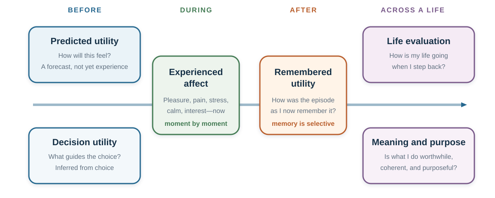

# Subjective Well-Being: Income Is Not the Same as a Good Life

*A better decision must name the life it is trying to improve*

::: {.callout-note .core-idea icon=false}
## Core idea

“Happiness” is not one outcome. A choice can improve momentary feeling, remembered experience, life satisfaction, meaning, or material security—and worsen another. Good decision-making therefore begins by naming the person, measure, time horizon, and trade-off rather than assuming that preference, income, or a single happiness score settles welfare.
:::

## Learning goals

- Separate experienced affect, life evaluation, meaning and purpose, remembered utility, predicted utility, and choice utility.
- Explain impact bias, focalism, projection bias, peak–end weighting, and duration neglect without treating them as universal laws.
- Evaluate evidence on income, adaptation, and social comparison without inventing a magic income threshold.
- Use subjective well-being as a complement to objective conditions and freedom, not as a replacement for them.

## Opening question: which job produces the better life?

Imagine two jobs. Job A pays substantially more, carries status, and requires a long commute with unpredictable evening work. Job B pays less, leaves time for sleep and relationships, and offers work you find more meaningful.

Which job would you choose? Which would make you feel better during an ordinary Tuesday? Which would you remember as the better career move? Which would make your life feel more successful? Which would make your days feel worthwhile?

Those are not repetitions of one question. They ask about different objects.

Benjamin, Heffetz, Kimball, and Rees-Jones (2012) asked people to rank hypothetical alternatives both by what they would choose and by the subjective well-being they predicted. The rankings often agreed, but not always. Predicted purpose, control, family well-being, status, and other attributes helped explain choices even after predicted happiness was held constant. The lesson is not that people reject well-being. It is that a single well-being question may omit something they value.

{#fig-well-being-six-lenses fig-alt="A timeline titled One decision, six lenses on well-being. Before a choice are predicted utility and choice utility. During the outcome is experienced affect. After the outcome is remembered utility. Across a life are life evaluation and meaning and purpose. A final bar says there is no master measure and asks the reader to audit the person, horizon, distribution, objective conditions, and freedom to revise."}

Figure @fig-well-being-six-lenses makes the central discipline visible: **do not move between measures without saying so**. A decision can look successful through one lens and costly through another.

## One word, several targets

The OECD distinguishes three components of subjective well-being: life evaluation, affect, and eudaimonia. Work on experienced utility adds a second distinction across time: what a person predicts, chooses, experiences, and later remembers (Kahneman et al., 1997; OECD, 2025).

| Target | Question it answers | Typical measurement | What it can miss |
| --- | --- | --- | --- |
| Predicted utility | How do I expect the outcome to feel? | Forecast before an event | Adaptation, competing events, changing tastes |
| Choice or decision utility | What weight did the option receive in choice? | Actual or hypothetical choice | Experience, coercion, mistakes, values not represented in the menu |
| Experienced affect | How does life feel while it is happening? | Experience sampling, affect yesterday, day reconstruction | Long-run meaning, remembered narrative, rare but consequential episodes |
| Remembered utility | How do I now evaluate the episode? | Retrospective rating | Duration and moment-to-moment variation |
| Life evaluation | How is my life going when I step back? | Life satisfaction or a life ladder | Daily emotional texture and domain-specific hardship |
| Eudaimonia or meaning | Does life feel worthwhile, purposeful, and coherent? | Meaning, purpose, or worthwhile-activity items | Pleasure, pain, and material constraint |
: Six targets that should not be collapsed into one happiness score {#tbl-well-being-targets}

These measures are related. They are not additive pieces of one simple total. A demanding thesis can feel stressful in the moment, memorable with pride, and meaningful across a life. A luxury purchase can produce anticipation, a brief positive experience, and almost no durable change in life evaluation. A job can score high on purpose and low on sleep.

The right question is therefore not “Which measure is the true one?” It is “Which measure is relevant to this decision, what else matters, and who has authority to make the trade-off?”

## Before the outcome: predicted utility is a forecast

Many decisions are forecasts in disguise. We choose a home, partner, course, job, holiday, treatment, or purchase partly by imagining how the resulting life will feel. But the simulation spotlights the focal event and leaves the rest of life dim.

### Impact bias and focalism

**Impact bias** is the tendency to overestimate the intensity or duration of a future emotional reaction. Gilbert and colleagues (1998), for example, studied why people can underestimate their capacity to adapt psychologically to negative events. A related mechanism is **focalism**: when imagining one change, people give it more attention than it will receive once daily life resumes.

This does not mean that “nothing matters because people adapt.” Some events have durable effects, some people face continuing constraints, and forecasts can also be too mild. The disciplined claim is narrower: a vivid focal event can occupy more of the simulation than it will occupy the lived day.

Use a Tuesday test. Instead of asking only, “How will I feel when I receive the promotion?” simulate an ordinary Tuesday six months later: waking, commuting, working, caring, resting, and seeing other people. The broader scene often reveals what the focal forecast omitted.

### Projection bias: the present self forecasts the future self

Forecasting also begins from the current state. Hungry shoppers buy for a hungrier future than the one who will consume the food. A person making plans while enthusiastic may underestimate fatigue; a person making plans while distressed may underweight recovery. **Projection bias** describes the tendency to project current tastes or states too strongly into future utility (Loewenstein et al., 2003).

A simple protection is to forecast from more than one state. Revisit an important commitment when rested and rushed, excited and ordinary. If the decision changes sharply, the state is part of the evidence.

### Choice utility is not the same as happiness

Economics often infers value from choice. This is powerful: action reveals trade-offs that a verbal rating may hide. But choice can express duty, identity, status, care for others, moral commitment, habit, constraint, or error. A parent may knowingly choose less leisure to protect a child. A researcher may choose difficult work because it is meaningful. A consumer may choose an option because the menu or default directed attention.

Choice is evidence about value. It is not proof that the chosen option maximizes every form of subjective well-being.

## During the outcome: experience has a time structure

**Experienced affect** concerns feelings while life is happening: pleasure, pain, stress, calm, sadness, affection, interest, or boredom. Experience-sampling methods ask people at sampled moments. The Day Reconstruction Method asks people to reconstruct episodes from the previous day and report the affect associated with them (Kahneman et al., 2004).

These methods solve one problem and create others. They reduce reliance on a single global memory, but they still depend on sampling, wording, compliance, and what moments are captured. A “yesterday” item can miss unusual days. A phone prompt can interrupt the experience it measures. Positive and negative affect are not exact opposites; a day can contain both engagement and stress.

Time use makes the measure concrete. A higher income may improve security and housing while the work required to obtain it increases commuting, time pressure, or fatigue. An intervention can raise life satisfaction yet leave pain unchanged. Before calling the intervention successful, state which outcome changed.

## After the outcome: memory edits experience

Decisions are shaped not only by experience but by the experience we remember. Retrospective evaluations can give disproportionate weight to the most intense moment and the ending. They can also underweight duration. This family of findings is often summarized as the **peak–end pattern** and **duration neglect** (Fredrickson & Kahneman, 1993; Redelmeier & Kahneman, 1996).

The pattern is not a mechanical formula for every episode. Meaning, expectations, sequence, agency, and later information can change memory. But it reveals a general design problem: the measure that governs a repeated choice may be a compressed memory rather than the integral of all experienced moments.

That can create disagreement inside one person. The experiencing self may prefer a shorter unpleasant procedure. The remembering self may prefer an episode with a gentler ending. A holiday planner may optimize memorable highlights while accepting long stretches of stress. Neither perspective automatically has final authority. The decision requires an explicit welfare judgment.

Three records help:

1. Before the event, record the forecast.
2. During or immediately after representative moments, record experience.
3. Later, record memory and the next choice.

The gaps are data. They reveal which self the next decision is likely to serve.

## Across a life: evaluation is not affect, and meaning is not pleasure

**Life evaluation** asks a person to step back and assess life as a whole. **Eudaimonic** measures ask whether activities feel worthwhile, purposeful, or meaningful. These global judgments can incorporate achievement, autonomy, health, relationships, identity, and comparison standards that do not appear in momentary affect.

The distinction matters. Income and education can relate more strongly to life evaluation than to daily emotion. Chronic pain, loneliness, and caregiving can be especially visible in daily affect. Difficult but self-concordant work can reduce comfort and increase purpose. Ryff's (1989) account of psychological well-being similarly emphasizes dimensions such as purpose, autonomy, growth, and positive relations rather than equating well-being with pleasant affect alone.

Domain measures add resolution: satisfaction with health, work, family, finances, housing, or time. They can reveal a severe local problem concealed by a tolerable global average. But many domain scores create a new question: who decides the weights?

There is no neutral escape from valuation. A dashboard makes the trade-offs visible; it does not choose them for the person.

## Income: no magic number

Within many samples, higher income is associated with higher life evaluation and, on average, better emotional well-being. That is unsurprising at the lower end: money can reduce hunger, insecurity, unsafe housing, unpaid bills, and painful lack of choice. The relationship is often closer to linear in **log income** than in income itself, which means that an additional unit of currency is usually associated with a larger difference at low income than at high income.

The famous fixed threshold should not survive as a universal teaching rule.

Kahneman and Deaton (2010), analyzing more than 450,000 US survey responses, found that life evaluation rose with log household income while their measures of emotional well-being flattened around an income category centered near US$75,000 in 2008–2009 dollars. Killingsworth (2021), using repeated experience-sampling reports from employed US adults, found experienced well-being rising beyond that level. An adversarial collaboration reanalyzed the apparent conflict. It found flattening at higher incomes mainly among the least happy part of the distribution, while experienced well-being continued to rise among happier groups (Killingsworth et al., 2023).

The cumulative lesson is stronger than either slogan:

- life evaluation and experienced affect must be measured separately;
- averages can hide different slopes across the well-being distribution;
- a dollar threshold depends on year, price level, sample, measure, and model;
- the studies estimate associations, not the causal effect of handing any particular person more income;
- income can matter through security, control, status, time use, health, and comparison, which policy changes affect differently.

“Money buys happiness” and “money does not buy happiness” are both too coarse. Ask: for whom, starting where, through which mechanism, and measured how?

## Adaptation: selective, incomplete, and morally easy to misuse

People often adapt to changes. Attention shifts, aspirations move, routines form, and an initially intense event becomes part of the background. This is one reason purchases and achievements may produce smaller durable changes than forecast.

But adaptation is not a universal reset button. Longitudinal evidence suggests incomplete or heterogeneous adaptation to events such as unemployment, and persistent pain, poor mental health, insecurity, loneliness, discrimination, and loss can continue to damage experience or evaluation (Lucas et al., 2004). Positive and negative events need not adapt at the same rate. People also differ.

This creates an ethical boundary. Evidence that some people adapt to harmful conditions is not evidence that the conditions are acceptable. A worker's capacity to cope does not erase unsafe work. A person's reported satisfaction under restricted options does not prove that the restriction serves them. Subjective well-being belongs beside rights, health, material conditions, and agency.

## Social comparison and the focusing illusion

Income and achievement carry social information. People compare upward and downward, locally and across time. A raise can improve purchasing power and still disappoint if peers gain more. A smaller home can feel adequate until the comparison group changes. Adaptation and aspiration therefore move the reference point.

Comparison also enters judgment through attention. Schkade and Kahneman (1998) asked students to predict differences in life satisfaction between people living in California and the Midwest. Respondents focused on climate and predicted a larger difference than the reported life-satisfaction data showed. The study illustrates a **focusing illusion**: nothing that receives concentrated attention while answering a global question is as dominant in life as it appears at that moment.

The result does not show that climate never matters, nor that every relocation forecast is wrong. It shows that the feature highlighted by the question can receive more weight in judgment than it receives in ordinary life.

Use a comparison audit:

- What reference group am I using?
- Did the decision change my resources, my rank, or both?
- Which life domain has become focal?
- What ordinary activities will remain unchanged?

## What appears to help—and what the evidence can support

The question “What makes people happy?” is worth keeping. The answer must become more disciplined.

Health, material security, social connection, autonomy, sleep, manageable time pressure, purposeful activity, and freedom from persistent pain or fear are repeatedly associated with dimensions of well-being. Generosity and prosocial spending have produced positive effects in some experiments, including Dunn, Aknin, and Norton's (2008) early studies. Gratitude practices, exercise, meditation, journaling, time affluence, and self-concordant goals may help some people in some conditions.

But a list of correlates is not a prescription engine. People select into marriage, volunteering, religion, self-employment, exercise, and social activity. The treatment can vary in quality and meaning. Small interventions can have heterogeneous and temporary effects. A practice that supports one person can burden another. Clinical distress and unsafe conditions require more than a positivity exercise.

The useful teaching move is to turn advice into a testable personal hypothesis:

> If I protect two evenings from low-value commitments for four weeks, then sleep, time pressure, and connection should improve without unacceptable cost to work or care.

Now the action, horizon, measures, and stopping rule are visible. Reflection remains valuable, but it is no longer disguised as a universal causal law.

## Measuring well-being without manufacturing a verdict

Reliability asks whether a measure is sufficiently consistent for its purpose. Validity asks whether it captures the intended construct. Neither is established merely because a self-report correlates with physiology, observer ratings, or another questionnaire. Brain activity and heart rate can be evidence about processes; they are not simple meters that certify a person's happiness.

Subjective well-being measures are sensitive to design choices:

- **Wording and scale:** “happy,” “satisfied,” “worthwhile,” and “yesterday” ask different questions.
- **Question placement:** preceding questions about income, politics, health, or social rank can change what becomes salient.
- **Survey mode:** phone, in-person, and web administration can produce different response patterns.
- **Timing:** weekday, holiday, season, shock, and news context may matter.
- **Scale use:** people and cultures can interpret response labels differently.
- **Aggregation:** a mean can improve while a distressed subgroup worsens.

The OECD (2025) therefore recommends standardized modules and treats subjective well-being as a complement to objective indicators of economic, social, and environmental progress. That is the right policy posture. Measure life evaluation, affect, and meaning where relevant; report the question, scale, mode, sampling, timing, distribution, and uncertainty; and place the results beside income, health, housing, safety, relationships, time use, and rights.

### A policy dashboard, not a happiness maximum

Before using a well-being result to defend a policy, answer five questions:

1. **Measure:** Which component changed—affect, evaluation, meaning, or something else?
2. **Distribution:** Who improved, who did not, and who left the sample?
3. **Identification:** Was the evidence descriptive, predictive, or causal?
4. **Displacement:** Did the intervention move costs, time, risk, or opportunity to someone else?
5. **Agency:** Could affected people understand, refuse, correct, and revise the arrangement?

A high average score cannot compensate automatically for coercion, severe harm to a minority, or the removal of future options. Policy needs a welfare argument, not only a regression coefficient.

::: {.callout-warning icon=false}
## What this chapter deliberately does not claim

- It does not use the old claim that “environment explains only 10% of happiness.” Variance partitions depend on measures, populations, models, and environments; they do not assign a person's destiny.
- It does not treat “happiness is a choice” as an empirical conclusion. Choice matters, but so do health, income, violence, discrimination, relationships, institutions, and chance.
- It does not use disputed hedonic-versus-eudaimonic genomic signatures as validation of the distinction.
- It does not infer that country-level correlations identify causal effects of democracy, religion, inequality, or culture on an individual.
:::

## A well-being decision audit

For a consequential choice, write one line under each heading:

| Heading | Question |
| --- | --- |
| Predicted | What do I expect, and what might focalism or my present state omit? |
| Chosen | Which values, duties, constraints, and stakeholders does the choice express? |
| Experienced | What will representative days feel like? |
| Remembered | Which peaks, endings, and narratives may govern repetition? |
| Evaluated | How might the choice change my assessment of life as a whole? |
| Meaning | What purpose, identity, relationship, or worthwhile activity is affected? |
| Objective | What happens to income, health, time, safety, rights, and future options? |
| Learning | When will I review the forecast, and what would justify revision? |
: A decision audit that keeps welfare measures separate {#tbl-well-being-decision-audit}

The audit will not collapse the answers into one mechanically correct choice. That is its value. It exposes the sacrifice and places the final judgment where it belongs.

## Key ideas

- Subjective well-being includes distinct evaluative, affective, and eudaimonic components.
- Predicted, choice, experienced, and remembered utility can disagree because they answer different questions at different times.
- Impact bias, focalism, and projection bias identify common forecasting problems, not a claim that adaptation erases every event.
- Peak–end weighting and duration neglect show why memory can guide future choice differently from moment-to-moment experience.
- Higher income is associated with well-being on average, but there is no universal magic threshold and no single causal mechanism.
- Adaptation is selective and incomplete; it must never be used to excuse harmful conditions.
- Subjective measures should complement objective conditions, distributions, rights, and agency.

## Study and practice

1. Why can a person's choice differ from the option they predict will make them happiest?
2. Give one example in which experienced affect and remembered utility could recommend different options.
3. How do focalism and projection bias create different forecasting errors?
4. Why did the apparent US$75,000 threshold not become a universal law?
5. What would count as evidence of adaptation, and what would not follow ethically from it?
6. Why can a country-level correlation fail to identify an individual causal effect?
7. Design a dashboard for a policy that improves average life satisfaction but increases pain for a small group.

::: {.callout-tip .activity icon=false}
## Activity: forecast the ordinary Tuesday

Choose a live but reversible decision. Record the option you expect to choose and your forecast for experienced affect, remembered utility, life evaluation, meaning, time, and material security. Then write an ordinary Tuesday under each option rather than its dramatic first day. Name one projection risk, one comparison group, and one observation date. If possible, collect the later measure and compare forecast with experience.

EXPERIENCE – EXPLAIN – APPLY (MAXIMUM 120 WORDS)  
Experience: describe the decision and original forecast. Explain: identify one well-being measure and one forecasting mechanism. Apply: state what you will measure, when, and what would make you revise.
:::

## References cited in this chapter

::: {.reference}
Benjamin, D. J., Heffetz, O., Kimball, M. S., & Rees-Jones, A. (2012). What do you think would make you happier? What do you think you would choose? *American Economic Review, 102*(5), 2083–2110.
:::

::: {.reference}
Dunn, E. W., Aknin, L. B., & Norton, M. I. (2008). Spending money on others promotes happiness. *Science, 319*(5870), 1687–1688.
:::

::: {.reference}
Fredrickson, B. L., & Kahneman, D. (1993). Duration neglect in retrospective evaluations of affective episodes. *Journal of Personality and Social Psychology, 65*(1), 45–55.
:::

::: {.reference}
Gilbert, D. T., Pinel, E. C., Wilson, T. D., Blumberg, S. J., & Wheatley, T. P. (1998). Immune neglect: A source of durability bias in affective forecasting. *Journal of Personality and Social Psychology, 75*(3), 617–638.
:::

::: {.reference}
Kahneman, D., & Deaton, A. (2010). High income improves evaluation of life but not emotional well-being. *Proceedings of the National Academy of Sciences, 107*(38), 16489–16493.
:::

::: {.reference}
Kahneman, D., Krueger, A. B., Schkade, D. A., Schwarz, N., & Stone, A. A. (2004). A survey method for characterizing daily life experience: The Day Reconstruction Method. *Science, 306*(5702), 1776–1780.
:::

::: {.reference}
Kahneman, D., Wakker, P. P., & Sarin, R. (1997). Back to Bentham? Explorations of experienced utility. *Quarterly Journal of Economics, 112*(2), 375–406.
:::

::: {.reference}
Killingsworth, M. A. (2021). Experienced well-being rises with income, even above $75,000 per year. *Proceedings of the National Academy of Sciences, 118*(4), e2016976118.
:::

::: {.reference}
Killingsworth, M. A., Kahneman, D., & Mellers, B. (2023). Income and emotional well-being: A conflict resolved. *Proceedings of the National Academy of Sciences, 120*(10), e2208661120.
:::

::: {.reference}
Loewenstein, G., O'Donoghue, T., & Rabin, M. (2003). Projection bias in predicting future utility. *Quarterly Journal of Economics, 118*(4), 1209–1248.
:::

::: {.reference}
Lucas, R. E., Clark, A. E., Georgellis, Y., & Diener, E. (2004). Unemployment alters the set point for life satisfaction. *Psychological Science, 15*(1), 8–13.
:::

::: {.reference}
OECD. (2025). *OECD guidelines on measuring subjective well-being (2025 update).* OECD Publishing.
:::

::: {.reference}
Redelmeier, D. A., & Kahneman, D. (1996). Patients' memories of painful medical treatments: Real-time and retrospective evaluations of two minimally invasive procedures. *Pain, 66*(1), 3–8.
:::

::: {.reference}
Ryff, C. D. (1989). Happiness is everything, or is it? Explorations on the meaning of psychological well-being. *Journal of Personality and Social Psychology, 57*(6), 1069–1081.
:::

::: {.reference}
Schkade, D. A., & Kahneman, D. (1998). Does living in California make people happy? A focusing illusion in judgments of life satisfaction. *Psychological Science, 9*(5), 340–346.
:::

::: {.reference}
Wilson, T. D., & Gilbert, D. T. (2003). Affective forecasting. *Advances in Experimental Social Psychology, 35*, 345–411.
:::
