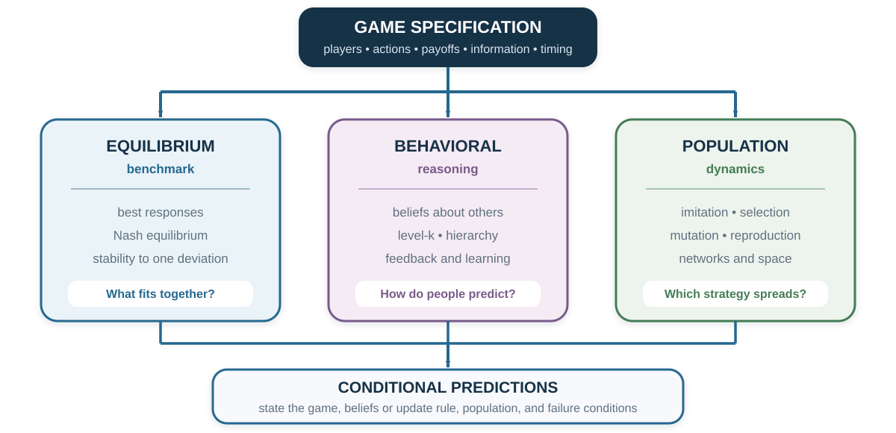

# Behavioral Game Theory: Equilibrium Is a Benchmark, Not a Portrait

*Game theory asks what fits together. Behavioral game theory asks how people actually decide what others will do.*

::: {.callout-note .core-idea icon=false}
## Core Idea

An equilibrium is a conditional benchmark: if the game, payoffs, beliefs, and rationality assumptions are right, no player wants to deviate alone. Real behavior can depart because people represent a different game, reason only a few steps, hold different beliefs, learn from feedback, value others' outcomes, or follow rules that spread through a population. The departure is evidence to explain—not permission to call people irrational.
:::

## Learning goals

- Solve a simple beauty-contest game and state the assumptions behind its equilibrium.
- Distinguish level-*k* reasoning from cognitive hierarchy and from Nash equilibrium.
- Explain why an observed action does not uniquely reveal a belief or depth of reasoning.
- Separate deliberate best response, repeated-game learning, and evolutionary population dynamics.
- Use replicator-style updating and the evolutionarily stable strategy criterion in simple two-strategy games.
- Evaluate spatial and agent-based demonstrations without treating one simulation path as a general result.

## Opening puzzle: should a sophisticated player choose zero?

Everyone chooses a number from 0 to 100. The winner is closest to two-thirds of the group's mean.

If choices were random, the mean would be about 50, so a best response would be about 33. If others make that calculation, a best response is about 22. If they expect one more step, the answer is about 15. Repeating the reasoning drives the choice toward zero.

Under common knowledge of rationality, iterated elimination removes choices above $66\frac{2}{3}$, then above $44\frac{4}{9}$, and so on. The unique Nash equilibrium is zero.

But now imagine that most participants choose between 20 and 40. A player who chooses zero because “zero is the equilibrium” may lose to a player who predicts the group. The equilibrium calculation is correct under its assumptions. The decision is poor because the population is not at equilibrium.

This is the central puzzle. Strategic sophistication is not the number of steps one can calculate in isolation. It is choosing the depth of reasoning that fits other people's reasoning.

{#fig-three-lenses-strategic-behavior fig-alt="A game specification feeds three evenly spaced columns. The equilibrium benchmark asks which strategies are mutual best responses. Behavioral reasoning asks what players believe and how many steps they take. Population dynamics asks which strategies spread through imitation, selection, and mutation. The three paths converge on conditional predictions, followed by an audit box warning that stability, observed choice, and evolutionary prevalence are different claims."}

## Three lenses, three questions

| Lens | Decision rule | Primary question | What it does not establish |
| --- | --- | --- | --- |
| Equilibrium benchmark | Each strategy is a best response to the others. | Which strategy profiles are mutually stable? | That people know the game, reach equilibrium, or approve of it. |
| Behavioral reasoning | Players respond to beliefs about less or differently sophisticated players. | How many strategic steps fit observed play? | A fixed intelligence trait or the true belief behind one action. |
| Population dynamics | More successful strategies become more common through selection, imitation, or reproduction. | Which strategies grow, shrink, or coexist under a specified update rule? | Deliberate reasoning, moral endorsement, or transport to human populations. |
: Three lenses on strategic behavior {#tbl-three-strategic-lenses}

The lenses can complement one another. They cannot be substituted without changing the claim. A Nash equilibrium is not an estimate of average behavior. A level-2 choice is not an evolutionarily stable strategy. A strategy that spreads in a spatial simulation need not be anyone's conscious best response.

## Limited strategic depth: level-*k*

A level-*k* model replaces the assumption of perfectly matched equilibrium beliefs with a hierarchy of simple responses (Nagel, 1995; Stahl & Wilson, 1995).

- **Level 0** is a specified nonstrategic anchor. In the number game, it is often modeled as uniform random choice with mean 50.
- **Level 1** best responds to level 0 and chooses about $\frac{2}{3}\times50=33$.
- **Level 2** best responds to level 1 and chooses about $\frac{2}{3}\times33=22$.
- **Level 3** best responds to level 2 and chooses about 15.

The labels describe a model of choice in one task. They are not ranks of intelligence. The same person can use different depths when the game, incentives, time, experience, presentation, or opponent changes. Level 0 is also a modeling decision: random play may be plausible in one game and implausible in another.

### Cognitive hierarchy: best respond to a mixture

Cognitive hierarchy makes a different assumption. A step-$k$ thinker best responds not to one lower type, but to a distribution of steps $0$ through $k-1$ (Camerer, Ho, & Chong, 2004). The population frequency of step $h$ is often modeled with a Poisson distribution,

$$
f(h)=\frac{e^{-\tau}\tau^h}{h!},
$$

and a step-$k$ player renormalizes this distribution over the lower steps they believe exist. The parameter $\tau$ governs the population's average number of steps. Camerer, Ho, and Chong report that an average of about 1.5 steps fits behavior across many games. That is a model fit across tasks—not a law that every person takes one and a half steps.

The following cross-group number-game summary makes heterogeneity visible. It is descriptive, drawn from different settings and samples, and should not be read as a causal ranking of occupations or education.

| Participant group | Group size | Mean choice | Modal choice | Fitted $\tau$ |
| --- | ---: | ---: | ---: | ---: |
| Chief executives | 20 | 37.9 | 33 | 1.0 |
| German students | 66 | 37.2 | 25 | 1.1 |
| U.S. high-school students | 52 | 32.5 | 33 | 1.6 |
| Economics PhDs | 16 | 27.4 | — | 2.3 |
| Portfolio managers | 26 | 24.3 | 22 | 2.8 |
| Caltech students | 42 | 23.0 | 35 | 3.0 |
| Newspaper participants | 7,884 | 23.0 | 1 | 3.0 |
| Game theorists | 136 | 19.1 | 0 | 3.7 |
: Descriptive number-game results used to illustrate heterogeneous strategic depth {#tbl-beauty-contest-groups}

Large within-group dispersion remains. A fitted $\tau$ is a population-and-model parameter. It should not be converted into an individual psychological diagnosis.

## The action does not identify the thought

Suppose someone chooses 22. They may be level 2. But they may also believe the mean will be 33 for another reason, copy a familiar answer, misunderstand the target, anchor on a previous round, or choose strategically after observing the participant pool.

This is an **identification problem**. Choice data can be consistent with several combinations of beliefs and preferences. Better evidence may include:

- an incentive-compatible belief report;
- response time and information search;
- repeated choices across games with different best responses;
- exogenous changes in information about opponents;
- learning after feedback;
- process measures interpreted alongside, not instead of, behavior.

Coricelli and Nagel (2009) compared strategic reasoning against human and computer opponents using behavioral and neural measures. Their results are consistent with different processing as strategic depth increases. Yet a brain region is not a unique label for “level 2,” and correlational activation cannot by itself identify the computation or show that the process caused the choice. Neural evidence narrows some accounts; it does not eliminate the behavioral identification problem.

## Learning is not the same as deeper initial reasoning

After several rounds, choices in a number game often move toward lower values. That path may reflect belief learning, reinforcement, imitation, comprehension, or selection among participants. Calling it “more rational” skips the mechanism.

To distinguish accounts, vary what participants receive:

- **choices only:** participants see others' actions but not payoffs;
- **payoffs only:** participants learn success but not the full action distribution;
- **belief information:** participants receive a credible signal about others;
- **counterfactual feedback:** participants see what alternative actions would have earned;
- **no feedback:** repeated choices reveal mere task familiarity or self-generated change.

Different models predict different responses to these information treatments. A learning claim becomes useful when it states what is learned, from which signal, under which update rule.

## From individual reasoning to population dynamics

Classical game theory often asks, “What should a deliberate player choose against another strategy?” Evolutionary game theory asks, “Which strategies become more common when success affects replication, survival, or imitation?” (Maynard Smith & Price, 1973).

The evolutionary language can describe genes, cultural transmission, organizational routines, or social learning. But the transmission mechanism must be named. A cultural strategy is not literally inherited like an allele, and a learning rule is not natural selection.

### A payoff-monotonic update

A two-strategy demonstration uses a discrete replicator-style update. Let $x$ be the share using strategy 1, let

$$
A=\begin{pmatrix}a&b\\c&d\end{pmatrix},
$$

and let $w$ represent the weight placed on game payoffs. The two fitness terms are

$$
f_1=1-w+w[ax+b(1-x)],
$$

$$
f_2=1-w+w[cx+d(1-x)].
$$

The next-period share is

$$
x'=\frac{xf_1}{xf_1+(1-x)f_2}.
$$

When strategy 1 earns more than strategy 2, its share rises under this rule. The trajectory is conditional on the payoff matrix, $w$, initial share, population mixing, and the absence of other strategies or mutation. Change the update rule, and the prediction can change.

### Dominance: the beetle arms race

Consider a stylized Small–Large contest:

| Focal  Other | Small | Large |
| --- | ---: | ---: |
| **Small** | 3, 3 | 0, 5 |
| **Large** | 5, 0 | 1, 1 |
: Stylized beetle-size game {#tbl-beetle-game}

If $x$ is the share of Large, Small earns $3(1-x)$ and Large earns $5(1-x)+x$. Large earns more for every $x\in[0,1]$, so it spreads under payoff-monotonic updating. This is a model of directional selection. It does not show that every observed biological trait is optimal; costs outside the matrix, ecological constraints, and alternative traits could reverse the result.

## Evolutionarily stable strategies

An **evolutionarily stable strategy** (ESS) resists invasion by a small share of mutants. In a symmetric two-strategy game with resident strategy $S$, mutant $T$, and row payoffs

$$
\begin{array}{c|cc}
&S&T\\\hline
S&a&b\\
T&c&d
\end{array},
$$

$S$ is an ESS if either

$$
a>c,
$$

or

$$
a=c \quad\text{and}\quad b>d.
$$

The first condition says a rare mutant does worse against residents. If the mutant ties against residents, the second asks residents to do better in encounters with mutants. Every ESS is a symmetric Nash equilibrium, but a symmetric Nash equilibrium need not be evolutionarily stable.

### Basin dependence: stag hunt

Use the following evolutionary stag-hunt payoffs:

| Focal  Other | Stag | Hare |
| --- | ---: | ---: |
| **Stag** | 2, 2 | 0, 1 |
| **Hare** | 1, 0 | 1, 1 |
: Evolutionary stag hunt {#tbl-evolutionary-stag-hunt}

If $x$ is the share of Hare, Stag earns $2(1-x)$ and Hare earns 1. Stag grows when $x<1/2$; Hare grows when $x>1/2$. Both pure populations are stable, and the initial condition selects the basin. Superior coordination can fail to emerge because it begins below a threshold—not because anyone makes a computational error.

### Coexistence: hawk–dove

Now consider:

| Focal  Other | Dove | Hawk |
| --- | ---: | ---: |
| **Dove** | 3, 3 | 1, 5 |
| **Hawk** | 5, 1 | 0, 0 |
: Hawk–dove game {#tbl-hawk-dove}

If $x$ is the share of Dove, Dove earns $1+2x$ and Hawk earns $5x$. Payoffs are equal at $x=1/3$. Under the specified population dynamics, the mixed population contains one-third Dove and two-thirds Hawk. This population mixture is not the same statement as each person deliberately randomizing with those probabilities.

## Space changes who meets whom

Well-mixed models assume random encounters. Real interaction is local. Neighbors, teams, platforms, schools, and networks determine whose behavior is observed and whose payoff is copied.

The spatial Prisoner's Dilemma demonstration gives each cooperator's neighbor a benefit $r>1$ at a personal cost of 1. Pairwise payoffs are therefore mutual cooperation $(r-1,r-1)$, cooperation against defection $(-1,r)$, and mutual defection $(0,0)$. Agents imitate a locally successful neighbor. One illustration uses a 50-by-50 torus with eight neighbors; companion models include a 101-by-101 four/eight-neighbor version and labeled 10-by-10 teaching variants.

Clusters can protect cooperators from exploitation in some parameter regions because cooperators inside a cluster receive benefits from one another. But one picture cannot establish a general effect. A cooperative cluster surviving is different from a single cooperator invading an all-defector population. The result also depends on topology, update timing, tie-breaking, benefit, mutation, starting density, and stopping rule.

### What the models can—and cannot—support

| Model layer | Substantive lesson | Reproducibility gate |
| --- | --- | --- |
| Two-strategy update | Payoff differences can change population shares; basins and mixtures matter. | Declare $a,b,c,d,w$, initial $x$, time horizon, and numerical precision. |
| Spatial game/PD | Local interaction can permit clusters that a well-mixed model removes. | Declare grid, torus/boundary, four/eight neighbors, update rule, ties, seed, and replications. |
| Ethnocentrism | Conditional help can spread in a particular immigration–reproduction–mutation model. | Preserve its 12% reproduction attempt, 10% death, 1% giving cost, 3% recipient benefit, 0.5% per-trait mutation, and local interaction—or explicitly change them. |
| Schelling segregation | Mild local thresholds can produce pronounced aggregate sorting. | Declare population, vacancies, threshold, move rule, seed, and the outcome measure. |
: Model demonstrations require parameter and process provenance {#tbl-model-provenance}

The NetLogo models are scientifically useful as specifications, but their screenshots are not empirical evidence. Several have stale Info tabs, and the files carry CC BY-NC-SA licensing conditions. A publishable result should be independently implemented from the declared rule, rerun with a seed policy and replications, and displayed with uncertainty—not inferred from one screenshot.

## Ethnocentrism and segregation: name the inference boundary

The Hammond–Axelrod ethnocentrism model allows agents to condition help on group markers. In one implementation, four strategies—help all, help only the same group, help only other groups, or help nobody—interact locally while immigration, reproduction, death, and mutation change the population (Hammond & Axelrod, 2006). “Ethnocentric” behavior can dominate for some parameter combinations.

That is a model result, not evidence that human group favoritism is innate, universal, or morally justified. The result follows from a specific benefit–cost structure, spatial interaction, inherited tags and strategies, and evolutionary update.

Schelling's segregation model supplies a parallel warning. Agents who require only a modest share of similar neighbors can generate highly segregated aggregate patterns (Schelling, 1969). One model description reports that a 30% threshold can produce about 70% same-type neighbors in a particular setup; another configuration uses 500 agents of each type on a 32-by-32 lattice and a 40% threshold. These are model-conditional demonstrations. Aggregate segregation does not reveal each person's intent, and the model does not establish the empirical cause of segregation in a city where income, discrimination, zoning, history, networks, and housing supply also matter.

## Repeated-game success is not evolutionary stability

Tit-for-tat cooperates first and then copies the other player's previous move. It is memorable because it was successful in Axelrod's computer tournaments: it is nice, retaliatory, and forgiving after the opponent returns to cooperation (Axelrod, 1984).

Noise exposes two weaknesses. A mistaken defection can trigger retaliation, and unconditional cooperators can drift into a population because they behave identically against tit-for-tat until exploited by defectors. Win-stay, lose-shift repeats an action after a satisfactory outcome and switches after an unsatisfactory one, so it can correct some errors.

Imhof, Fudenberg, and Nowak (2007) compare always defect, always cooperate, tit-for-tat, and win-stay, lose-shift in a particular finite-population mutation–selection process with implementation errors. Below a critical cooperation benefit, always defect is selected; above it, win-stay, lose-shift is selected. Tit-for-tat is not selected in that process, although its presence lowers the threshold at which win-stay, lose-shift succeeds. This result does not prove that tit-for-tat “does not work.” Tournament payoff, repeated-game equilibrium, learning, and stochastic evolutionary selection are different criteria.

## Application: choose the model after diagnosing the process

Suppose a team asks why one work routine is spreading.

1. **Best response:** Are employees deliberately choosing the routine because it fits colleagues' actions?
2. **Level reasoning:** Are they anticipating what colleagues will anticipate?
3. **Reinforcement:** Did recent success increase repetition even without a strategic model?
4. **Imitation:** Are employees copying visible high performers?
5. **Selection:** Are teams using other routines disappearing, losing resources, or not being hired?
6. **Institution:** Did software, incentives, or management make one routine easier or mandatory?

These accounts can generate the same observed diffusion. Test them by varying information, feedback, visibility, incentives, mobility, or rules. Do not call every spread behavior “evolutionary” merely because its frequency changes.

## Ethics: strategic classification can become a weapon

Level labels, brain images, and evolutionary language can give a fragile inference an aura of inevitability.

- A low number-game choice is not proof of superior intelligence.
- An equilibrium is not a moral endorsement.
- A neural correlate is not a diagnosis.
- A simulated group pattern is not proof of an innate tendency.
- A successful strategy can impose costs on people outside the modeled population.

The defensible use of a strategic model makes its payoff assumptions, population, update rule, uncertainty, and failure conditions inspectable. People affected should be able to ask what the model leaves out and how a classification can be corrected.

## Key ideas

- Equilibrium predicts mutual best responses under stated assumptions; it is not a portrait of average initial play.
- Level-*k* and cognitive-hierarchy models capture bounded strategic reasoning, but fitted levels are task- and model-dependent.
- One action rarely identifies one belief or cognitive process.
- Evolutionary models replace deliberate optimization with a declared population update.
- ESS is an invasion-resistance criterion; Nash equilibrium and ESS are related but not identical.
- Initial conditions, local interaction, mutation, noise, and update rules can reverse population outcomes.
- One-shot incentives, repeated reciprocity, and evolutionary selection answer different questions.

## Study and practice

1. Why can zero be the equilibrium choice but a poor choice in a number game?
2. Compute the level-1, level-2, and level-3 choices when the target is three-quarters of the mean and level 0 has mean 50.
3. How does cognitive hierarchy differ from a simple level-*k* model?
4. Give two mechanisms that can generate movement toward equilibrium across rounds.
5. For the stag-hunt population, which strategy grows when 30% are Hare? What about 70%?
6. Why is the mixed hawk–dove population not necessarily individual randomization?
7. What parameters and seed information would you require before interpreting a spatial-cooperation chart?
8. State one claim that the ethnocentrism or segregation model cannot support.

::: {.callout-tip .activity icon=false}
## Activity: three explanations for the same path

Run five rounds of the two-thirds number game. Record the full distribution, not only the winning number. After each round, reveal the mean and target. Then write three explanations for any downward movement: deeper reasoning, belief learning, and imitation or reinforcement. Identify one additional treatment that would separate the explanations.

EXPERIENCE – EXPLAIN – APPLY (MAXIMUM 150 WORDS)  
Experience: describe the path without calling it rational or irrational. Explain: compare one equilibrium and one behavioral mechanism. Apply: propose one discriminating treatment and one ethical boundary on classifying participants.
:::

## References cited in this chapter

::: {.reference}
Axelrod, R. (1984). *The evolution of cooperation*. Basic Books.
:::

::: {.reference}
Camerer, C. F. (2003). *Behavioral game theory: Experiments in strategic interaction*. Princeton University Press.
:::

::: {.reference}
Camerer, C. F., Ho, T.-H., & Chong, J.-K. (2004). A cognitive hierarchy model of games. *Quarterly Journal of Economics, 119*(3), 861–898. https://doi.org/10.1162/0033553041502225
:::

::: {.reference}
Coricelli, G., & Nagel, R. (2009). Neural correlates of depth of strategic reasoning in medial prefrontal cortex. *Proceedings of the National Academy of Sciences, 106*(23), 9163–9168. https://doi.org/10.1073/pnas.0807721106
:::

::: {.reference}
Crawford, V. P., Costa-Gomes, M. A., & Iriberri, N. (2013). Structural models of nonequilibrium strategic thinking: Theory, evidence, and applications. *Journal of Economic Literature, 51*(1), 5–62. https://doi.org/10.1257/jel.51.1.5
:::

::: {.reference}
Hammond, R. A., & Axelrod, R. (2006). The evolution of ethnocentrism. *Journal of Conflict Resolution, 50*(6), 926–936. https://doi.org/10.1177/0022002706293470
:::

::: {.reference}
Imhof, L. A., Fudenberg, D., & Nowak, M. A. (2007). Tit-for-tat or win-stay, lose-shift? *Journal of Theoretical Biology, 247*(3), 574–580. https://doi.org/10.1016/j.jtbi.2007.03.027
:::

::: {.reference}
Maynard Smith, J., & Price, G. R. (1973). The logic of animal conflict. *Nature, 246*, 15–18. https://doi.org/10.1038/246015a0
:::

::: {.reference}
Nagel, R. (1995). Unraveling in guessing games: An experimental study. *American Economic Review, 85*(5), 1313–1326.
:::

::: {.reference}
Schelling, T. C. (1969). Models of segregation. *American Economic Review, 59*(2), 488–493.
:::

::: {.reference}
Stahl, D. O., & Wilson, P. W. (1995). On players' models of other players: Theory and experimental evidence. *Games and Economic Behavior, 10*(1), 218–254. https://doi.org/10.1006/game.1995.1031
:::

::: {.reference}
Wilensky, U. (1997). *NetLogo Segregation model*. Center for Connected Learning and Computer-Based Modeling, Northwestern University. http://ccl.northwestern.edu/netlogo/models/Segregation
:::

::: {.reference}
Wilensky, U. (2002). *NetLogo PD Basic Evolutionary model*. Center for Connected Learning and Computer-Based Modeling, Northwestern University. http://ccl.northwestern.edu/netlogo/models/PDBasicEvolutionary
:::

::: {.reference}
Wilensky, U. (2003). *NetLogo Ethnocentrism Alternative Visualization model*. Center for Connected Learning and Computer-Based Modeling, Northwestern University. http://ccl.northwestern.edu/netlogo/models/EthnocentrismAlternativeVisualization
:::
