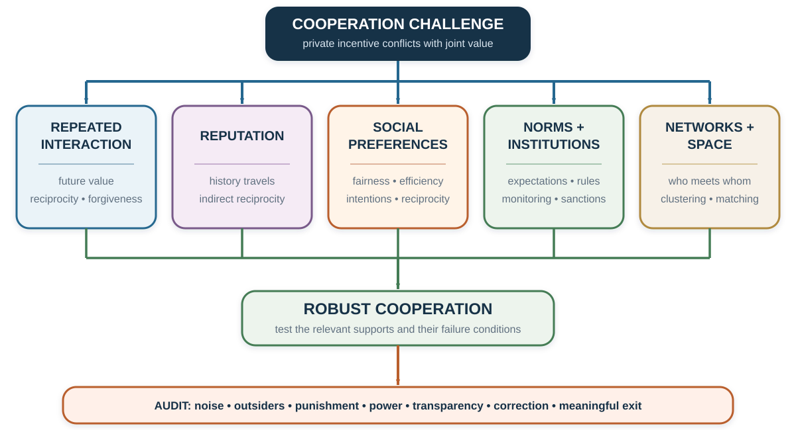

# Cooperation and Social Preferences: Self-Interest Is Not the Only Payoff

*Cooperation can survive because the future matters, because institutions change incentives, or because people value more than their own material payoff. These mechanisms look similar in the outcome and differ in what they predict.*

::: {.callout-note .core-idea icon=false}
## Core Idea

Mutual cooperation does not identify a cooperative motive. It may reflect repetition, reputation, punishment, communication, group boundaries, norms, or concern for others. Conversely, defection need not reveal selfish character; a person may distrust the partner or face a structure that punishes unilateral cooperation. Good analysis separates the game's material incentives from beliefs, social preferences, and social norms.
:::

## Learning goals

- Explain the conflict between individual incentives and joint surplus in a one-shot Prisoner's Dilemma.
- Derive the continuation-value condition that can support cooperation in a repeated game.
- Distinguish one-shot, repeated, and evolutionary explanations.
- Compare outcome-based social preferences, intention-based reciprocity, and social norms.
- Interpret ultimatum, dictator, punishment, and cross-cultural evidence without reducing it to one motive.
- Design cooperation while auditing noise, outsiders, coercion, and the right to exit.

## Opening puzzle: why cooperate when defection dominates?

Two people choose simultaneously between Cooperate and Defect. Consider this illustrative matrix:

| Player 1 \ Player 2 | Cooperate | Defect |
| --- | ---: | ---: |
| **Cooperate** | 4, 4 | 0, 6 |
| **Defect** | 6, 0 | 2, 2 |
: One-shot Prisoner's Dilemma {#tbl-one-shot-pd}

If Player 2 cooperates, Player 1 receives 6 by defecting instead of 4 by cooperating. If Player 2 defects, Player 1 receives 2 by defecting instead of 0 by cooperating. Defection is therefore a dominant strategy for both players, and Defect–Defect is the unique Nash equilibrium. Yet Cooperate–Cooperate gives both a higher payoff.

The matrix produces a dilemma only under its stated payoffs. If a player feels guilt, values the other person's payoff, expects reputational consequences, or treats a promise as binding, the experienced payoff differs from the material table. If the interaction continues, the game itself differs. Before declaring behavior inconsistent with self-interest, decide which self-interest and which game are being modeled.

### Is the scene really a Prisoner's Dilemma?

Fictional interrogation and betrayal scenes are useful because their omitted details are visible. Choose one linked scene from [*Murder by Numbers*](https://youtu.be/UAR7WDrL3Ec), [*Numb3rs*](https://youtu.be/dSOrAQMXTcc), [*L.A. Confidential*](https://youtu.be/-opqUSOUDQY), or [*The Dark Knight*](https://youtu.be/Yqvbv-SB4bg). Reconstruct each player's actions and payoff ranking. Check whether Defect truly dominates, whether choices are simultaneous, whether communication changes beliefs, and whether a future relationship remains. The clips are copyrighted illustrations, not empirical evidence; no frames are reproduced here.

{#fig-cooperation-architecture fig-alt="A cooperation challenge at the top branches from one centered point to five evenly spaced support boxes: repeated interaction, reputation, social preferences, norms and institutions, and network or spatial structure. Arrows converge from a common line on robust cooperation. A final audit box asks about implementation error, outsiders, punishment, power, transparency, and exit."}

## Similar outcomes can come from different mechanisms

| Setting | What changes? | Why cooperation may appear | Main boundary |
| --- | --- | --- | --- |
| One-shot material-payoff game | No future strategic consequence. | Social preferences, norms, mistakes, communication, or beliefs about the game. | A cooperative action does not identify which motive operated. |
| Repeated game | Current behavior changes future play. | Direct reciprocity, threats, forgiveness, relationship value. | Requires sufficient continuation, monitoring, and credible response. |
| Reputation system | Others observe or learn one's history. | Indirect reciprocity and future access. | Records may be noisy, manipulable, or impossible to escape. |
| Institution | Rules change payoffs, information, or enforcement. | Contracts, sanctions, matching, insurance, or dispute resolution. | Enforcement can be costly, unequal, or crowd out meaning. |
| Evolutionary or learning process | Successful strategies become more frequent. | Selection, imitation, reproduction, mutation, or local clustering. | Prevalence is not conscious intention or moral approval. |
: One-shot, repeated, institutional, and evolutionary cooperation are distinct {#tbl-cooperation-mechanisms}

This separation prevents a common error. Observing stable cooperation over time does not prove that people have altruistic preferences. Observing cooperation in a one-shot anonymous game does not prove pure altruism either. The action is a starting point for mechanism diagnosis.

## Repetition gives current behavior a future

In an indefinitely repeated Prisoner's Dilemma, today's defection can change tomorrow's response. Let $T$ be the temptation payoff from defecting against a cooperator, $R$ the reward from mutual cooperation, and $P$ the payoff from mutual defection. Let $\delta$ be the continuation weight.

Under a grim-trigger strategy, continued cooperation yields

$$
\frac{R}{1-\delta}.
$$

A one-time deviation followed by permanent punishment yields

$$
T+\frac{\delta P}{1-\delta}.
$$

Cooperation is sustainable under this comparison when

$$
\frac{R}{1-\delta}\geq T+\frac{\delta P}{1-\delta},
$$

or

$$
\delta\geq\frac{T-R}{T-P}.
$$

With $T=6$, $R=4$, and $P=2$, the threshold is $\delta\geq0.5$.

This condition is not a universal cooperation rate. It belongs to a specific strategy, payoff matrix, monitoring environment, and continuation structure. If actions are misobserved, punishment can start after an innocent error. If the end date is known, backward induction can unravel cooperation under narrow assumptions. If relationships can be renewed, rematched, or reputationally connected, the effective future may remain.

### Tit-for-tat, forgiveness, and noise

Tit-for-tat begins by cooperating and then copies the partner's previous move. Axelrod's tournaments made four properties memorable: be nice, be provocable, be forgiving, and be clear (Axelrod, 1984). These properties help explain tournament success; they are not a theorem that tit-for-tat is always optimal.

Implementation error can lock two tit-for-tat players into retaliatory cycles. Generous tit-for-tat sometimes forgives defection; win-stay, lose-shift repeats an action after satisfactory outcomes and switches after unsatisfactory ones. As the previous chapter explains, Imhof, Fudenberg, and Nowak (2007) find win-stay, lose-shift rather than tit-for-tat selected above a cooperation-benefit threshold in their particular finite-population evolutionary process. Strategy success is conditional on noise, population process, and the alternatives present.

The “live-and-let-live” system that emerged in parts of the Western Front during the First World War is a powerful historical illustration of reciprocal restraint: units facing one another repeatedly could respond to local restraint and punish violations (Axelrod, 1984). It is not a controlled test of tit-for-tat. Command structures, shared routines, geography, survival, communication, and selection all changed together.

## Five routes in the evolution-of-cooperation taxonomy

Nowak (2006) organizes cooperation mechanisms into five rules. The taxonomy is useful when treated as a map, not an exhaustive causal verdict.

| Rule | Link that supports cooperation | Diagnostic question |
| --- | --- | --- |
| Kin selection | Help benefits genetically related recipients. | Is relatedness part of the actual transmission process? |
| Direct reciprocity | The same parties meet again. | Is continuation likely enough, and can actions be observed? |
| Indirect reciprocity | Reputation affects treatment by others. | Who observes, records, corrects, and can escape the record? |
| Network reciprocity | Cooperators interact disproportionately with cooperators. | How are links formed, broken, and inherited? |
| Group or multilevel selection | Groups with more cooperation differentially persist or grow. | What competes at each level, and how much movement occurs across groups? |
: Five-rule taxonomy for the evolution of cooperation {#tbl-five-rules}

The evolutionary label must not erase institutions. Kin, repeated contact, reputation, and networks can matter in human settings, but laws, organizations, language, and deliberate design also determine who interacts and which outcomes reproduce.

## Large stakes do not remove context

The television game *Golden Balls* ended with contestants choosing Split or Steal for large and widely varying prizes. Before reading the evidence, watch [one Split-or-Steal round](https://youtu.be/7FbkwrhW_0I) and an [unusual communication strategy](https://youtu.be/LPwZ3wYoSmA). Record promises, threats, commitments, and the options that remain credible. The linked clips are selected cases, not estimates of average behavior.

Van den Assem, van Dolder, and Thaler (2012) report stakes averaging more than $20,000. Cooperation remained high relative to what a simple own-money-only model would predict. The authors find evidence consistent with reciprocal preferences from earlier interaction, little support in their sample for conditional cooperation based on an opponent's expected action, and an age-dependent gender pattern.

The study matters because the stakes were consequential. But it is not an anonymous laboratory Prisoner's Dilemma. Contestants interacted on television, selected into the program, experienced the prize relative to a larger show context, and could communicate before choosing. The evidence rejects the claim that high stakes automatically eliminate cooperative behavior. It does not identify one universal motive or transport rate.

## Social preferences: other outcomes enter utility

A **social preference** means that utility depends on more than one's own material payoff. People may care about another person's outcome, inequality, total surplus, the minimum payoff, reciprocity, intentions, or identity.

### Ultimatum game: fairness has strategic force

In the ultimatum game, a proposer divides a sum. A responder accepts—implementing the division—or rejects—giving both zero. Under common knowledge of narrow material self-interest and divisible money, the benchmark predicts that the proposer offers the smallest positive amount and the responder accepts.

Classic experiments instead commonly find modal offers around 40–50% and mean offers around 30–40%; offers below 20% are often rejected roughly half the time in multi-study summaries (Camerer, 2003; Oosterbeek, Sloof, & van de Kuilen, 2004). These are broad historical regularities, not universal constants. Stakes, anonymity, entitlement, procedure, repetition, population, and cultural setting change behavior.

An offer can also mix motives. A proposer may care about fairness, fear rejection, follow a norm, signal identity, or misunderstand responders. The responder may dislike inequality, punish an insulting intention, preserve self-respect, or enforce a norm. A rejection identifies willingness to sacrifice money; it does not uniquely identify why.

The linked [ultimatum scene](https://youtu.be/7mETgb-fPRo) provides a communication exercise. Identify the demand, the threatened consequence, and the recipient's outside options. Then ask whether posing the ultimatum changes only the material menu or also respect, identity, and the perceived intention behind the offer. The clip is an illustration, not evidence for an effect size.

### Dictator game: remove strategic rejection

In the dictator game, the recipient cannot reject. Removing strategic punishment usually reduces transfers. In classic comparable treatments, average giving is around 20% in Forsythe and colleagues (1994) and closer to 10% under the double-blind procedures of Hoffman and colleagues (1994).

The difference shows that anonymity and the action environment matter. It does not reveal a pure generosity parameter. Demand effects, experimenter observation, property rights, earned entitlement, menu design, sorting, and the ability to take rather than give can all change the meaning of the action.

{#fig-social-preference-games-redraw fig-alt="Three cards compare ultimatum, dictator, and take or menu-variant games. Each card states the game mechanics and historical reported patterns. A boundary note says stakes, anonymity, entitlement, population, culture, repetition, and procedure affect the results." width=100%}

Figure @fig-social-preference-games-redraw shows why a result cannot be separated from the action set that produced it. The numerical ranges redraw findings summarized by Forsythe et al. (1994), Hoffman et al. (1994), Camerer (2003), and Oosterbeek et al. (2004); the graphic design is original, and the boundaries prevent the ranges from becoming claims about a universal human type.

## Distributional models make motives testable

### Inequality aversion

For two people, Fehr and Schmidt's (1999) model can be written as

$$
U_i=x_i-\alpha_i\max(x_j-x_i,0)-\beta_i\max(x_i-x_j,0),
$$

with the standard restrictions $\alpha_i\geq\beta_i$ and $0\leq\beta_i<1$. The first penalty represents disadvantageous inequality; the second represents advantageous inequality. Because disadvantageous inequality can hurt more, a responder may reject a low ultimatum offer, while a proposer may share even when rejection is impossible.

The model is descriptive and falsifiable. It is not a claim that inequality is the only concern. Bolton and Ockenfels's (2000) ERC model emphasizes one's relative share, while Charness and Rabin (2002) allow concerns for total surplus, the worst-off person, and reciprocity. Efficiency and equality can conflict: giving an extra euro to the better-off person may create several euros of total benefit, while equalization may reduce the sum.

### Revealed preference over allocations

Andreoni and Miller (2002) gave 176 participants 8–11 allocation choices at varying prices of giving, producing more than 1,600 decisions. Fewer than 2% violated the generalized axiom of revealed preference in the reported classification summary, so most choices could be represented by a well-behaved utility function.

A familiar summary assigns 47.2% to a selfish type, 30.4% to an egalitarian or maximin type, and 22.4% to a utilitarian type. But only 43% fit one of the pure categories exactly; the remaining 57% were assigned to the nearest category. The percentages demonstrate structured heterogeneity. They do not show that every person possesses one pure and permanent type.

### Outcomes and intentions are different

Outcome-based models ask who gets what. **Reciprocity** also asks why the other person acted. The same unequal allocation can be judged differently if it was freely chosen, forced by the available menu, produced by chance, or intended to help.

This creates another identification test. Hold final payoffs constant while changing the feasible alternatives or the actor's control. If responses change, allocation alone is insufficient. Intention-based models can explain the difference, but beliefs about intention must be measured rather than inferred from punishment alone.

## Cross-cultural evidence: variation is part of the theory

Henrich and colleagues (2001) conducted ultimatum, public-goods, and dictator-type experiments across 15 small-scale societies. Behavior varied substantially. In Lamalera, Indonesia, offers were often hyperfair and have been discussed in relation to the cooperative organization of whale hunting. Among the Au and Gnau in Papua New Guinea, some high offers were rejected and have been interpreted in relation to obligations created by accepting gifts.

The lesson is not that one society is cooperative and another selfish. Experimental stakes, recruitment, comprehension, market integration, production systems, kinship, and local norms move together. A cultural example should generate a mechanism hypothesis: which shared practice changes entitlements, expectations, or enforcement, and what comparison could test it?

Meta-analysis also shows that ultimatum behavior varies across settings (Oosterbeek et al., 2004). Culture is therefore not a residual label attached after a difference appears. It must be represented by measurable institutions, meanings, experiences, and expectations.

### A memorable primate comparison—and its limits

In a well-known capuchin demonstration, one monkey receives cucumber for a task while a neighbor receives a preferred grape for the same action. The lower-paid monkey sometimes refuses the cucumber. Watch the [cucumber–grape demonstration](https://youtu.be/xot4z1CKFMo), then list at least three accounts: aversion to unequal treatment, frustration from seeing a better reward, changed expectation, or protest against the experimenter (Brosnan & de Waal, 2003).

The video makes the contrast memorable. It does not prove that capuchins hold a human moral concept of fairness, nor that one mechanism explains every refusal. A decisive design varies inequality, reward expectation, social presence, and food quality separately.

## Neural evidence can locate correlates, not settle the motive

Tricomi and colleagues (2010) studied neural responses to advantageous and disadvantageous inequality in a sample of 40 participants. Hsu and colleagues (2008) examined equity–efficiency trade-offs in a sample of 26. These studies connect allocation choices to neural signals consistent with social valuation.

But localization does not decide whether a participant cared about inequality, norm compliance, reputation, attention, or task structure. Small task-specific imaging studies can support process hypotheses. They should not be used to naturalize a moral theory or classify individuals.

## Social preference is not social norm

A person can dislike inequality privately even when no one else expects sharing. That is a social preference. A person can keep all the money yet believe that sharing is socially appropriate. That is a norm belief that loses against another motive. The concepts should not be merged.

| Concept | What enters the account? | How to measure it | Typical intervention |
| --- | --- | --- | --- |
| Social preference | Value placed on own and others' outcomes, inequality, efficiency, or intentions. | Incentivized choices across payoff and intention variations. | Change allocation consequences or matching. |
| Empirical expectation | Belief about what others do. | Elicit expected behavior with clear reference group. | Provide credible descriptive information. |
| Normative expectation | Belief about what others think one should do. | Elicit perceived approval or appropriateness. | Create common expectations, legitimacy, and voice. |
| External enforcement | Reward or sanction from others or institutions. | Vary observability, punishment, or formal rule. | Monitoring, contracts, restorative processes, appeal. |
| Internal enforcement | Guilt, shame, pride, identity, or self-sanction. | Private choices plus validated self-report/process evidence. | Reflection and identity-consistent commitments, without coercion. |
: Social preferences and social norms require different evidence {#tbl-preference-norm}

Bicchieri (2006) emphasizes that social norms depend on empirical and normative expectations within a relevant group. This definition forces specificity: who is the reference group, what behavior is expected, whose approval matters, and what happens after violation?

## Eliciting norms as a coordination problem

Krupka and Weber (2013) ask participants to rate how socially appropriate an action is, with payment for matching the modal rating of others. The task converts a private opinion into a coordination problem: “Which rating will people in this setting recognize as shared?”

A pedagogical representation is

$$
u(a_k)=\beta\pi(a_k)+\gamma N(a_k),
$$

where $\pi(a_k)$ is the material payoff and $N(a_k)$ is the perceived appropriateness of action $a_k$. This equation is an organizing device, not a uniquely estimated psychological law. The weight $\gamma$, the reference group, and the norm score must be measured.

Dictator variants illustrate why this matters. Giving from an unearned windfall, taking from another person's endowment, choosing whether to enter the allocation task, or selecting from a menu with a harmful alternative can yield the same final allocation with different social meaning. A model based only on final payoffs misses what the action communicates relative to the alternatives.

## Punishment can enforce cooperation—and create another dilemma

People sometimes pay to punish defectors or unfair partners. Punishment can stabilize cooperation when future interactions, reputation, or internalized norms are present. It can also be antisocial, mistaken, retaliatory, or captured by powerful actors.

De Quervain and colleagues (2004) found striatal activity associated with decisions to punish a defector in a trust-game setting. The correlation is consistent with punishment having reward value for some participants. It does not prove that punishment is intrinsically pleasurable, just, or effective outside the task.

Before adding sanctions, ask:

1. Can contribution and violation be observed accurately?
2. Who decides that a violation occurred?
3. Can the accused correct the record or appeal?
4. Does punishment repair cooperation or merely impose pain?
5. Can high-status members punish low-status members without reciprocal accountability?

## When a fine changes the meaning of the act

Gneezy and Rustichini's (2000) daycare study found that introducing a fine for late pickup increased lateness in the treated centers, and the effect did not simply disappear when the fine was removed. One interpretation is that the fine changed a social obligation into a priced service: “I should not impose on staff” became “I can pay to arrive late.”

The result is a warning, not a universal crowding-out rule. A fine can deter when it is large, legitimate, well enforced, and does not license the behavior. Incentives carry both a price and a meaning. Design must test both.

## Fairness in markets: entitlement constrains price

Kahneman, Knetsch, and Thaler (1986) asked respondents to judge market practices. Selected historical vignette results are:

| Market action | Judged unfair |
| --- | ---: |
| Raise the price of snow shovels after a snowstorm | 82% |
| Auction one scarce doll to the highest bidder | 74% |
| Raise rent to exploit a tenant's location-specific dependence | 91% |
| Pass through an increase in the wholesale cost of lettuce | 21% |
| Charge more than the list price for a scarce car | 71% |
| Remove a discount and return to list price | 42% |
: Selected fairness judgments from historical vignettes {#tbl-market-fairness}

The contrast suggests that people protect reference transactions and accepted entitlements while allowing some cost-based adjustments. Exact wording, year, population, and market institution matter. The percentages should not be treated as current legal standards or universal moral shares.

For managers, the lesson is not “never raise price.” Explain the changed cost or scarcity, preserve procedural consistency, avoid exploiting a trapped party, and consider rationing rules that remain defensible if customers understand them.

## Group identity changes the social boundary

Minimal-group experiments show that arbitrary categorization can produce in-group favoritism under some conditions (Tajfel, 1970). Chen and Li (2009) find that experimentally induced group identity changes social preferences and strategic responses. Yet effect size and direction depend on salience, task, norms, and how groups are created.

The evidence does not show that favoritism is biologically fixed. Nor does the ethnocentrism simulation in the previous chapter supply human causal evidence. Identity can enlarge cooperation inside a boundary while shrinking concern outside it. A cooperation design must therefore ask not only “Can we make this group cooperate?” but also “Who becomes the out-group, and who bears the cost?”

## Application: build cooperation around the diagnosed failure

Suppose members of a project team withhold information.

1. **Map material incentives.** Does sharing help the project but reduce individual credit or bargaining power?
2. **Measure beliefs.** Do members expect others to share? Do they expect sharing to be valued?
3. **Check repetition and reputation.** Will contributors meet again, and is the record accurate?
4. **Test social preferences.** Do people sacrifice to help the team when strategic consequences are removed?
5. **Elicit the norm.** What do members believe a responsible colleague should disclose, and when?
6. **Change the institution.** Align credit, create reciprocal access, document contributions, provide a safe correction process, and protect sensitive information.
7. **Audit boundaries.** Could “sharing” expose a vulnerable person, violate consent, or become compulsory surveillance?

Do not begin with a team-building slogan if the payoff system rewards hoarding. Do not begin with punishment if the behavior is unobservable or the norm is contested. Match the lever to the mechanism.

## Ethics: cooperation for whom?

Cooperation is not automatically good.

- A cartel is cooperation among sellers against buyers.
- Silence can be cooperation with a harmful organizational norm.
- Strong in-group reciprocity can finance exclusion of outsiders.
- Reputation can sustain trust or create an unerasable social score.
- Punishment can protect a commons or suppress dissent.
- Commitment can stabilize a relationship or trap someone who needs to leave.

The ethical test asks whether affected people understand the rule, whose objective it serves, how evidence is corrected, whether sanctions are proportionate, and whether refusal or exit remains meaningful.

## Key ideas

- The one-shot Prisoner's Dilemma separates individually dominant defection from jointly better cooperation.
- Repetition can support cooperation when the future is valuable, actions are observable, and responses are credible.
- Cooperation can arise from incentives, beliefs, social preferences, norms, institutions, networks, or evolutionary processes.
- Ultimatum and dictator games reject a universal own-money-only description, but no single game uniquely identifies fairness or altruism.
- Social preferences concern what outcomes and intentions people value; social norms concern shared expectations and enforcement.
- Context, culture, identity, and action menus change the meaning of the same material allocation.
- Cooperation must be audited for noise, power, outsiders, punishment, and exit.

## Study and practice

1. In the one-shot matrix, why is Defect dominant even though mutual cooperation is better for both?
2. Derive the repeated-game threshold when $T=10$, $R=7$, and $P=4$.
3. Give two reasons why cooperation in *Golden Balls* cannot be interpreted as pure altruism.
4. How does a dictator game change the identification problem relative to an ultimatum game?
5. In the Fehr–Schmidt model, which parameter concerns disadvantageous inequality?
6. Why do the Andreoni–Miller classification percentages not imply three pure human types?
7. Give an example in which a social preference and a social norm predict different behavior.
8. How could a fine increase the targeted behavior?
9. Design one safeguard against erroneous or abusive punishment.

::: {.callout-tip .activity icon=false}
## Activity: one shot, then a future

Play one anonymous Prisoner's Dilemma round with a randomly assigned partner. Then announce a new interaction with the same partner for four additional rounds, without promising what happens after round five. Record actions, beliefs about the partner, and reasons separately after each round.

Do not report the class rate as scientific evidence. Use the exercise to identify candidate mechanisms: continuation, learning, reciprocity, communication, or norm compliance. Propose one treatment that would distinguish two of them.

EXPERIENCE – EXPLAIN – APPLY (MAXIMUM 150 WORDS)  
Experience: describe the path and belief reports. Explain: compare one repeated-game and one social-preference account. Apply: propose one institutional change, one test, and one ethical boundary.
:::

## References cited in this chapter

::: {.reference}
Andreoni, J., & Miller, J. (2002). Giving according to GARP: An experimental test of the consistency of preferences for altruism. *Econometrica, 70*(2), 737–753. https://doi.org/10.1111/1468-0262.00302
:::

::: {.reference}
Axelrod, R. (1984). *The evolution of cooperation*. Basic Books.
:::

::: {.reference}
Bicchieri, C. (2006). *The grammar of society: The nature and dynamics of social norms*. Cambridge University Press.
:::

::: {.reference}
Bolton, G. E., & Ockenfels, A. (2000). ERC: A theory of equity, reciprocity, and competition. *American Economic Review, 90*(1), 166–193. https://doi.org/10.1257/aer.90.1.166
:::

::: {.reference}
Brosnan, S. F., & de Waal, F. B. M. (2003). Monkeys reject unequal pay. *Nature, 425*, 297–299. https://doi.org/10.1038/nature01963
:::

::: {.reference}
Camerer, C. F. (2003). *Behavioral game theory: Experiments in strategic interaction*. Princeton University Press.
:::

::: {.reference}
Charness, G., & Rabin, M. (2002). Understanding social preferences with simple tests. *Quarterly Journal of Economics, 117*(3), 817–869. https://doi.org/10.1162/003355302760193904
:::

::: {.reference}
Chen, Y., & Li, S. X. (2009). Group identity and social preferences. *American Economic Review, 99*(1), 431–457. https://doi.org/10.1257/aer.99.1.431
:::

::: {.reference}
Dal Bó, P., & Fréchette, G. R. (2018). On the determinants of cooperation in infinitely repeated games: A survey. *Journal of Economic Literature, 56*(1), 60–114. https://doi.org/10.1257/jel.20160980
:::

::: {.reference}
de Quervain, D. J.-F., Fischbacher, U., Treyer, V., Schellhammer, M., Schnyder, U., Buck, A., & Fehr, E. (2004). The neural basis of altruistic punishment. *Science, 305*(5688), 1254–1258. https://doi.org/10.1126/science.1100735
:::

::: {.reference}
Fehr, E., & Schmidt, K. M. (1999). A theory of fairness, competition, and cooperation. *Quarterly Journal of Economics, 114*(3), 817–868. https://doi.org/10.1162/003355399556151
:::

::: {.reference}
Forsythe, R., Horowitz, J. L., Savin, N. E., & Sefton, M. (1994). Fairness in simple bargaining experiments. *Games and Economic Behavior, 6*(3), 347–369. https://doi.org/10.1006/game.1994.1021
:::

::: {.reference}
Gneezy, U., & Rustichini, A. (2000). A fine is a price. *Journal of Legal Studies, 29*(1), 1–17. https://doi.org/10.1086/468061
:::

::: {.reference}
Henrich, J., Boyd, R., Bowles, S., Camerer, C., Fehr, E., Gintis, H., & McElreath, R. (2001). In search of Homo economicus: Behavioral experiments in 15 small-scale societies. *American Economic Review, 91*(2), 73–78. https://doi.org/10.1257/aer.91.2.73
:::

::: {.reference}
Hoffman, E., McCabe, K., Shachat, K., & Smith, V. (1994). Preferences, property rights, and anonymity in bargaining games. *Games and Economic Behavior, 7*(3), 346–380. https://doi.org/10.1006/game.1994.1056
:::

::: {.reference}
Hsu, M., Anen, C., & Quartz, S. R. (2008). The right and the good: Distributive justice and neural encoding of equity and efficiency. *Science, 320*(5879), 1092–1095. https://doi.org/10.1126/science.1153651
:::

::: {.reference}
Imhof, L. A., Fudenberg, D., & Nowak, M. A. (2007). Tit-for-tat or win-stay, lose-shift? *Journal of Theoretical Biology, 247*(3), 574–580. https://doi.org/10.1016/j.jtbi.2007.03.027
:::

::: {.reference}
Kahneman, D., Knetsch, J. L., & Thaler, R. H. (1986). Fairness as a constraint on profit seeking: Entitlements in the market. *American Economic Review, 76*(4), 728–741.
:::

::: {.reference}
Krupka, E. L., & Weber, R. A. (2013). Identifying social norms using coordination games: Why does dictator game sharing vary? *Journal of the European Economic Association, 11*(3), 495–524. https://doi.org/10.1111/jeea.12006
:::

::: {.reference}
Nowak, M. A. (2006). Five rules for the evolution of cooperation. *Science, 314*(5805), 1560–1563. https://doi.org/10.1126/science.1133755
:::

::: {.reference}
Oosterbeek, H., Sloof, R., & van de Kuilen, G. (2004). Cultural differences in ultimatum game experiments: Evidence from a meta-analysis. *Experimental Economics, 7*, 171–188. https://doi.org/10.1023/B:EXEC.0000026978.14316.74
:::

::: {.reference}
Tajfel, H. (1970). Experiments in intergroup discrimination. *Scientific American, 223*(5), 96–102. https://doi.org/10.1038/scientificamerican1170-96
:::

::: {.reference}
Tricomi, E., Rangel, A., Camerer, C. F., & O'Doherty, J. P. (2010). Neural evidence for inequality-averse social preferences. *Nature, 463*, 1089–1091. https://doi.org/10.1038/nature08785
:::

::: {.reference}
van den Assem, M. J., van Dolder, D., & Thaler, R. H. (2012). Split or steal? Cooperative behavior when the stakes are large. *Management Science, 58*(1), 2–20. https://doi.org/10.1287/mnsc.1110.1413
:::
