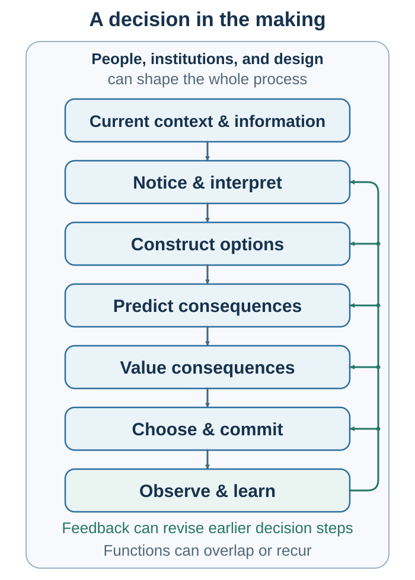

# Preface: Follow the Decision Upstream—and Outward {.unnumbered}

People often describe a decision as a moment: a hand is raised, a contract is signed, a candidate is selected, or a purchase is made. This book begins with a different claim. **The visible choice is the endpoint of a hidden process.**

Before a person chooses, attention has selected some information and ignored the rest. An inner model has interpreted what the information means. Prediction has estimated what may happen. Valuation has made some outcomes worth pursuing, avoiding, or protecting. The available menu has opened some paths and closed others. After action, feedback should update the process—but memory and rationalization may instead rewrite what the person believed before choosing.

The individual loop is therefore:

**Notice → Interpret → Predict → Value → Construct options → Choose → Act → Learn**

But decisions do not remain inside one mind. They move through relationships, teams, markets, organizations, and cultures. One person's action changes another person's options. A message changes what an audience notices and believes. A conversation makes two interpretations testable. A negotiation changes payoffs and future relationships. A default, platform, incentive, or institutional rule changes the environment in which many later choices will be made.

When other minds enter, the loop extends through **asking, influencing, coordinating, negotiating, and designing the environment**. These are interaction modes, not a second rigid sequence: other people and institutions can alter every stage of a decision.

{#fig-master-loop fig-alt="The recursive individual loop moves from context and information through notice and interpret, predict and value, construct options, choose and commit, act, and observe and learn. An outer layer names other minds, institutions, and designed environments, with interaction modes Ask, Influence, Coordinate, Negotiate, and Design."}

This map supplies the book's spine. Each part highlights a different region. Each chapter asks the same causal question: **Where does this mechanism enter the loop, and what can it change?** Availability changes which instances come to mind. Framing changes the representation of a choice. Culture changes what an action means. Story changes how evidence is organized. Negotiation changes the option set and the payoffs. Choice architecture changes the path through which action becomes possible.

The book's broadest claim follows from this map. **Decision, persuasion, communication, negotiation, and design are different forms of model management.** In a decision, one person uses a model to turn evidence into action. In persuasion, one person offers another a reason to revise a model. In communication, two people make their models mutually testable. In negotiation, they construct a model of interests, alternatives, and possible agreements. In design, they embed assumptions in an environment that will shape later choices.

That unity matters because a catalogue of effects is not yet an explanation. Naming a bias can create the illusion of diagnosis. The more useful question is causal: *Where did the process bend?* What entered attention? What model gave it meaning? What was predicted, valued, or sacrificed? Which other person, norm, market, or designed environment entered the loop? What evidence supports that explanation, and what feedback could correct it?

The journey begins with one choice taking shape. It then moves through judgment under uncertainty; risk, time, self-regulation, and well-being; markets as an applied interlude; strategic and social decisions; influence, communication, and connection; negotiation; and the design of better behavioral and organizational loops. The sequence is cumulative. Later chapters do not leave earlier mechanisms behind: they place them inside more social, strategic, and consequential settings.

The same knowledge can improve a decision or manipulate it. Attention can be directed toward relevant evidence or harvested for engagement. A story can make evidence understandable or make weak evidence feel true. A default can help people act on considered goals or conceal the designer's preferred outcome. A negotiation tactic can protect a legitimate interest or exploit confusion.

The ethical test used throughout the book is therefore demanding but practical:

> Would this message, conversation, agreement, or decision environment remain defensible if the people affected understood how it worked, whose objective it served, what evidence supported it, and how they could refuse, correct, or revise it?

Better decision-making does not require eliminating uncertainty, emotion, intuition, sociality, or disagreement. It requires conditions in which these forces can become visible, testable, and correctable. The aim is not the perfectly rational person. The aim is a better loop.
