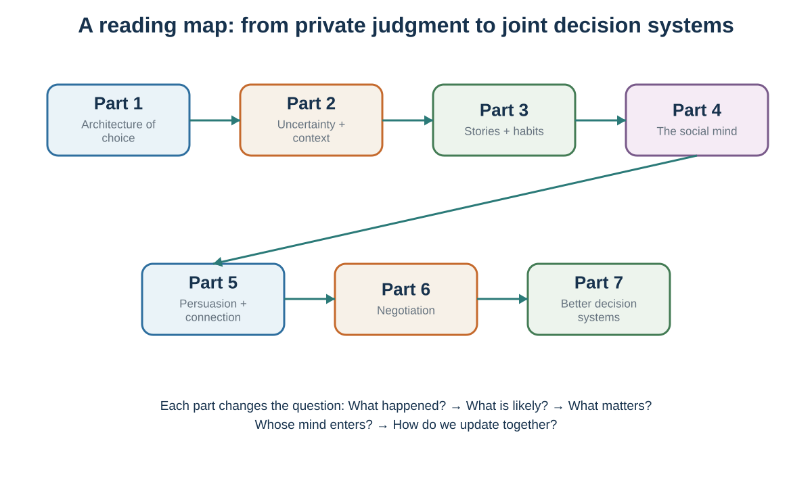

# Preface: Follow the Decision Upstream—and Outward {.unnumbered}

People often talk about a decision as if it were a moment: a hand is raised, a contract is signed, a candidate is selected, or a purchase is made. This book begins with a different claim. The visible choice is the endpoint of a hidden process.

Before a person chooses, attention has already selected some information and ignored the rest. An inner model has interpreted what the information means. Prediction has estimated what may happen. Valuation has made some outcomes feel worth pursuing, avoiding, or protecting. Social signals have changed what seems normal or credible. The available menu may have hidden better alternatives. After the outcome, memory and rationalization may rewrite what the person believed before choosing.

But decisions do not remain inside one mind. They interact through markets, relationships, groups, organizations, and cultures. One person's choice changes another person's options. A message changes what an audience notices and believes. A conversation creates or repairs shared meaning. A negotiation changes payoffs and future relationships. A default, incentive, platform, or institutional rule changes the environment in which many later choices will be made. The book therefore follows decisions upstream into hidden judgment and outward into the systems that connect people.

That is why the book does not begin—or end—with a list of biases. A catalogue can help readers name effects, but naming is not yet diagnosis. The more useful question is causal: **Where did the process bend?** What entered attention? What model gave it meaning? What mattered and what was sacrificed? Whose action changed the payoff? Which relationship, norm, market, or designed environment entered the loop? What evidence supports the explanation, and what feedback could correct it?

## The organizing logic

| Part | Central movement | Diagnostic question |
|------------------------|------------------------|------------------------|
| I\. The Decision-Making Process | Judgment, valuation, sacrifice, choice, outcome, and the story told afterward. | What happened before the moment of choice? |
| II\. Attention, Prediction, and Expectation | What becomes evidence, how it acquires meaning, and when a belief becomes part of the cause. | What did attention select, and what model interpreted it? |
| III\. Heuristics, Biases, and Probability Judgment | Fast and slow thinking, useful shortcuts, statistical discipline, and contextual error. | What easier question did the mind answer—and what denominator is missing? |
| IV\. Risk, Experience, Time, and Self-Control | Expected utility, prospect theory, learning from experience, delayed outcomes, habits, and wanting. | How do probabilities, reference points, experience, delay, and learned cues become action? |
| V\. Money, Finance, and Well-Being | Mental accounts, investor behavior, market anomalies, bubbles, and happiness. | When do money, price, value, and well-being come apart? |
| VI\. Strategic and Social Decisions | Interdependence, behavioral game theory, cooperation, social learning, norms, and culture. | How does the best action depend on other minds and institutions? |
| VII\. Influence and Persuasion | Authority, model updating, and evidence-aligned story. | What prevents an audience from updating? |
| VIII\. Communication and Connection | Recoverable meaning, verified understanding, warm honesty, and repair. | What am I guessing that I could ask? |
| IX\. Negotiation | Alternatives, bargaining zones, anchors, interests, packages, contingencies, and implementation. | How can value be protected, created, and divided? |
| X\. Behavior and Decision Design | Behavior design, choice architecture, and decision hygiene. | What should be redesigned before effort or judgment is needed? |

{#fig-book-flow fig-alt="Ten connected boxes show the book's cumulative sequence: decision process; attention and prediction; heuristics and probability; risk and self-control; money and well-being; strategy and society; influence and persuasion; communication; negotiation; and decision design."}

## One cumulative journey

We begin with the anatomy of one decision. Rational choice provides a benchmark: not a portrait of the mind, but a way to state alternatives, beliefs, values, constraints, and opportunity costs clearly. We then move upstream to attention, predictive inference, and expectation. Only after that foundation do heuristics and biases become intelligible: shortcuts are necessary, and error appears when a cue or rule does not fit the environment. Probability judgment closes the part because it converts the preceding lessons about availability, resemblance, bias, framing, priming, and fluency into a disciplined belief. It supplies the direct bridge from a persuasive story to risky choice.

But a probability is not yet a choice. Risky decision-making asks how probabilities and consequences should be combined; prospect theory asks how reference points and probability weighting bend that combination. Decisions from experience show why rare events look different when they must first be encountered. Intertemporal decision-making adds another distance between action and consequence. Habits and wanting then show why repeated cues and urgent feelings can defeat a plan even when the future is valued correctly in the abstract.

Those mechanisms become concrete in choices about money and life. Mental accounting shows how labels and brackets make fungible money behave as if it belonged to separate worlds. Behavioral finance and asset bubbles examine what happens when biased or bounded investors interact through markets. Subjective well-being then separates what people choose, what they predict will make them happy, what they feel, and how they evaluate a life.

Next, another mind enters the payoff itself. Strategic interdependence explains why the best action depends on expectations about other people. Behavioral game theory keeps equilibrium as a benchmark while adding bounded strategic reasoning, fairness, reciprocity, and heterogeneity. Cooperation, social learning, norms, and culture show how repeated interaction and shared meaning change what people notice, value, and do. Culture supplies hypotheses about learned meaning; it never licenses treating a group average as an individual's identity.

Influence then becomes intentional. Authority, identity, and story change what is noticed and believed. Persuasion becomes the design of a path from an audience's current model to a warranted update—not the delivery of more facts to an empty mind.

But communication is not a message delivered to a passive audience. Another person answers, interprets, questions, and sometimes repairs the exchange. Language is not a file transfer. Good communication replaces confident mind-reading with recoverable meaning, questions, visible listening, and repair.

Negotiation then combines the preceding ideas under direct interdependence. The other person has alternatives, interests, priorities, forecasts, dignity, and power. Preparation protects the ability to walk away. Communication makes interests and misunderstandings discoverable. Integrative analysis asks whether differences can create value before the value is divided.

The journey ends with intervention. Behavior design makes a desired action feasible before the moment of temptation. Choice architecture examines the environment that presents the menu, default, mapping, and friction. Decision hygiene then turns the book's ideas into a repeatable system that can preserve independence, aggregate judgment, and learn.

The appendices add a second layer to that journey. Appendix A turns recurring ideas into portable tools, and Appendix B makes the book's examples retrievable. Appendix C follows an experimental study from question and construct through implementation, analysis, and reporting. Appendix D asks what happens when the evidence system itself bends: low power, analytical flexibility, publication bias, failed replication, honest error, and research misconduct. The book therefore teaches both behavioral claims and the discipline required to produce, evaluate, correct, and responsibly use them.

## How the chapters and appendices work

Most chapters follow the same rhythm:

1. **Experience a puzzle.** Make a prediction, encounter a case, or notice a reaction before receiving the definition.
2. **Diagnose the intuitive answer.** Identify the evidence, model, value, cue, norm, or interest that produced it.
3. **Introduce a distinction or tool.** Prediction versus valuation; process versus outcome; liking versus wanting; position versus interest; perspective-taking versus perspective-getting.
4. **Test the tool.** Apply it to a worked case, brief activity, conversation, message, or decision.
5. **Add the boundary condition.** Ask when the memorable result should weaken, reverse, or require another explanation.
6. **Retrieve and apply.** Produce one question, sentence, diagram, forecast, redesign, or next action that can travel to a new setting.

Examples therefore do work. A video is not present merely because it is entertaining; it comes with an observation task. A diagram is not decoration; every arrow is a causal claim the reader should be able to explain and challenge.

The appendices use the same rhythm but change the task. They ask readers to retrieve a tool, reconstruct a study, audit an evidence chain, or diagnose how a credible-looking result could become distorted. This makes research practice part of the subject rather than a technical note placed outside it.

## Scientific caution and citation policy

Decision science contains robust patterns, useful models, contested findings, and claims that became more famous than their evidence deserved. This book distinguishes laboratory demonstrations from field effects, mechanisms from metaphors, averages from identities, prediction from explanation, and an original finding from its replication record.

The memorable simplifications are therefore followed by guardrails. Fast thinking is not foolish, and slow thinking is not free. Emotion is not the enemy of rationality; valuation would be impossible without it. Perception is inference, but not unconstrained fantasy. Dopamine is not simply pleasure. Body language is evidence, not a private truth detector. Culture offers hypotheses to test, not instructions for stereotyping a person. A story can make evidence meaningful, but it cannot make weak evidence true.

The text uses APA-style author–date citations. Every chapter and appendix ends with only the works cited there; the master bibliography is the deduplicated union of those lists.

## Design is an ethical act

The same knowledge that improves a decision can manipulate it. Attention can be directed toward relevant evidence or harvested for engagement. A default can help people act on considered goals or conceal the designer's preferred outcome. Social proof can inform or manufacture conformity. Identity can invite agency or threaten belonging. A negotiation tactic can protect a legitimate interest or exploit confusion.

The ethical test used throughout the book is demanding but practical:

> Would this intervention remain defensible if the people affected understood how it worked, whose objective it served, what evidence supported it, and how they could refuse or revise it?

Better decision-making does not mean eliminating uncertainty, emotion, intuition, sociality, or disagreement. It means building conditions in which these forces can become visible, testable, and correctable. The aim is not the perfectly rational person. The aim is a better loop.

## Suggested reading routes

- **Complete journey:** read in order; the sequence is cumulative.
- **Decision, judgment, and self-control:** Chapters 1–24.
- **Money, markets, and well-being:** Chapters 25–28.
- **Strategy and social decisions:** Chapters 29–34.
- **Influence and persuasion:** Chapters 35–38.
- **Communication and connection:** Chapters 39–40.
- **Negotiation:** Chapters 41–45, with Chapters 1–4, 14–15, and 29–40 as foundations.
- **Behavior and decision design:** Chapters 46–48.
- **Review and research practice:** use Appendix B to locate major examples, Appendix A to rehearse the portable tools, Appendix C to run an experimental study from question to report, and Appendix D to diagnose replication, selection, power, and research-integrity problems.
