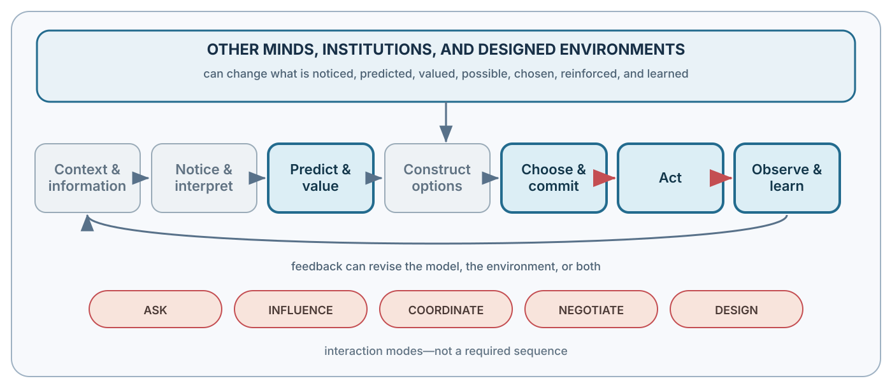

# Applied Interlude. Markets, Mispricing, and Bubbles {.unnumbered}

::: {.callout-note .part-overview icon=false}
## Why this is an interlude

Markets are a demanding application of the preceding chapters: investors judge under uncertainty, prices aggregate and redirect attention, and an apparent error may remain difficult to exploit. The chapter is self-contained enough to assign in a finance or business course and optional enough that readers can continue to social interaction without losing the book's causal spine.
:::

{fig-alt="Prediction and valuation are highlighted separately, together with choosing, commitment and action, learning, and the outer social and institutional environment. A shared rail shows that this environment can influence every function."}

The central question is not whether investors make mistakes. It is whether a claim about mispricing survives the joint-hypothesis problem, risk, costs, data mining, limits to arbitrage, and a specified correction path. Bubbles are treated as hypotheses about reinforcing processes, not labels attached after a large price increase.

## Guiding questions

- What does the market-efficiency claim rule out, and what model is tested jointly with it?
- Why can a visible pricing discrepancy remain costly or dangerous to correct?
- When does price report information, and when does observing price help create the process being diagnosed?

## Bridge

Market feedback makes interdependence visible: the best action now depends on what other people believe and do. Part IV generalizes that problem beyond finance.
