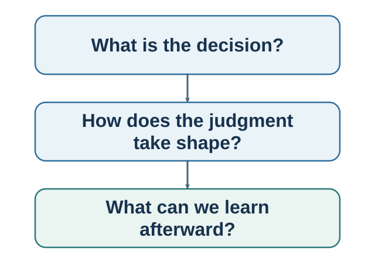

# Part I. How a Choice Takes Shape {.unnumbered}

**Book I — Choice within a mind.**

::: {.callout-note .part-overview icon=false}
## The movement

A choice is an endpoint, not a beginning. This part first asks how a decision should be made and how it is actually made. A rational benchmark makes alternatives, beliefs, and values explicit, but seven context-sensitive choices show why the benchmark is not a psychological portrait. The part then turns that contrast into a practical decision process before following evidence through attention, prediction, valuation, expectation, commitment, and the story told afterward.
:::

{fig-alt="The author's recursive navigation model highlights the full individual loop from context and information through noticing, option construction, prediction, valuation, choosing, commitment and action, and learning. A shared rail shows that the social and institutional environment can influence every function. It is not a validated universal stage order."}

The chapters use hiring as a developing case. Its apparently simple choice reveals criteria, missing alternatives, selective evidence, predicted outcomes, values, causal expectations, and post-outcome explanation. Chapter 1 establishes the rational benchmark, tests it against seven evidence-calibrated encounters with actual choice, and opens the hidden process. Chapter 2 then asks how to improve that process: define the decision, construct alternatives, name opportunity cost, separate prediction from valuation, seek information that could change action, and stress-test the recommendation.

## Guiding questions

- What happened before the visible moment of choice?
- Where is the disagreement—evidence, prediction, valuation, feasibility, or sacrifice?
- What record would let an outcome teach without rewriting the original judgment?

## Bridge

Once the loop is visible, the next problem is uncertainty: how can a bounded mind form a useful judgment without confusing an accessible story with a calibrated probability?
