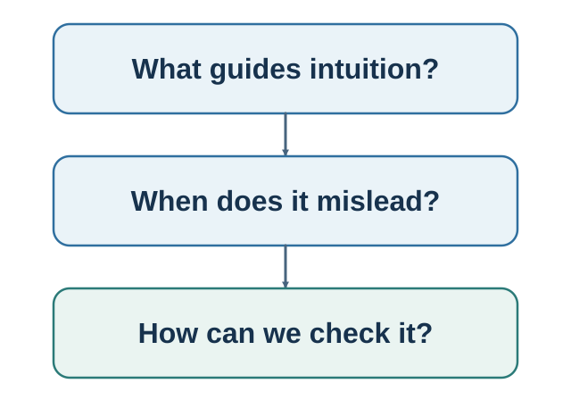

# Part II. Judgment Under Uncertainty {.unnumbered}

::: {.callout-note .part-overview icon=false}
## The movement

A bounded mind cannot calculate from scratch. It uses cues, learned patterns, accessible memories, resemblance, comparison, frames, and fluency. This part asks when those shortcuts fit the environment and when a story must yield to a denominator, reference class, sample, or scored forecast.
:::

{fig-alt="The author's recursive navigation model highlights noticing and interpretation, prediction and valuation, and observation and learning. It is not a validated universal stage order."}

The progression is mechanism-first: fast and frugal judgment; intuitive likelihood; belief protection; contextual comparison; framing; accessibility and ease; conditional probability and Bayes; then sampling, regression, randomness, and calibration. Framing remains distinct because changing the representation of a choice is not identical to supplying an anchor or comparison.

## Guiding questions

- Which cue or easier question produced the intuitive answer?
- Does the cue fit an environment with stable patterns and useful feedback?
- Which denominator, reference class, comparison, or disconfirming observation is missing?

## Bridge

A disciplined probability is still not a decision. The next part asks how consequences, reference points, lived samples, time, habits, and well-being turn judgment into a life.
