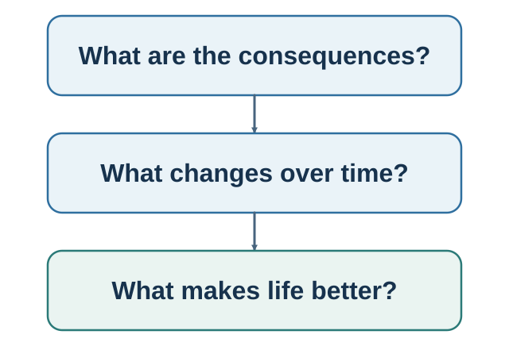

# Part III. Risk, Time, and Well-Being {.unnumbered}

**Book I — Choice within a mind.**

::: {.callout-note .part-overview icon=false}
## The movement

Risk joins beliefs to consequences. Experience determines which consequences are encountered. Delay separates intention from action. Mental accounts organize resources and trade-offs before repetition lets a cue acquire control. This part follows those forces and ends with the question that gives valuation its purpose: what is the decision ultimately trying to improve?
:::

{fig-alt="The author's recursive navigation model separately highlights prediction and valuation, together with choosing, commitment and action, and observation and learning. A shared rail shows that the social and institutional environment can influence every function. It is not a validated universal stage order."}

The sequence moves from expected value and expected utility to prospect theory; from described risk to experienced samples; from future value to present action; from fungible money to mental accounts; from deliberate control to habit and wanting; and from predicted utility to lived experience, satisfaction, connection, and meaning.

## Guiding questions

- Which probability, consequence, reference point, and decision weight enter the choice?
- Does apparent impatience reflect discounting, liquidity, trust, uncertainty, or an implementation gap?
- Which cue and immediate consequence now control the repeated behavior?
- Is the objective predicted pleasure, experienced affect, remembered experience, life satisfaction, connection, meaning, or something else?

## Bridge

A better life is not made alone. The next part asks what changes when other people's actions enter both valued outcomes and the process that produces them: payoffs, evidence, support, conflict, norms, and responsibility become interdependent. Markets appear there as an applied synthesis: individual predictions and valuations become prices, and those prices become social signals that can redirect attention, expectations, and action. A later part returns directly to communication and connection—how shared meaning is built, tested, and repaired.
