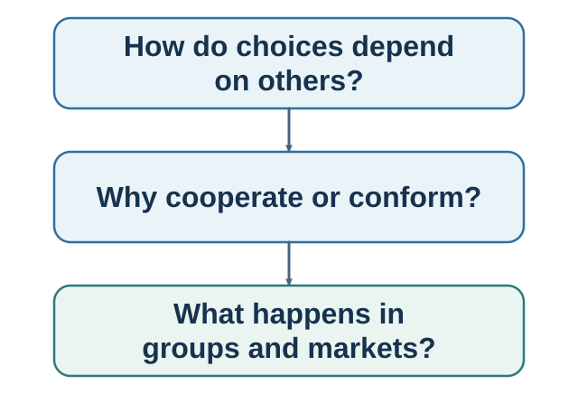

# Part IV. When Choices Become Interdependent {.unnumbered}

::: {.callout-note .part-overview icon=false}
## The movement

Other people affected earlier choices, but now they enter the payoff directly. Strategy asks what each actor can do given what others may do. Social learning, cooperation, conformity, culture, and authority add shared information, norms, identity, power, and institutional enforcement.
:::

{fig-alt="Option construction, choice, action, learning, and the outer layer of other minds and institutions are highlighted."}

The sequence moves from strategic archetypes to bounded strategic reasoning and learning; from future interaction to social preferences and norms; from independent observation to correlated social evidence and cascades; and from group averages to the meaning an action acquires in a particular relationship or institution.

## Guiding questions

- What game are the actors actually playing, and what has been left outside the model?
- Can similar behavior arise from different beliefs, motives, norms, or enforcement systems?
- Are social observations independent evidence or repetitions of one another?
- What does the action mean here, and how could we ask rather than assume?

## Bridge

Social influence can arise without a deliberate persuader. Part V turns to intentional influence and then to communication between people who can question, correct, and repair one another's models.
