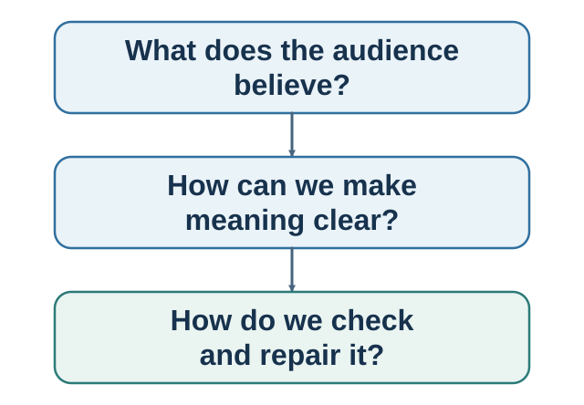

# Part V. Persuasion, Communication, and Connection {.unnumbered}

::: {.callout-note .part-overview icon=false}
## The movement

Part III established that connection can be part of what a better decision is meant to protect, and Part IV showed how other minds enter evidence, payoffs, norms, markets, culture, and authority. Persuasion now seeks a warranted change in another model. Communication makes two models mutually testable. Connection and repair protect shared meaning and relationship when inference fails. The focus here is deliberate model change, shared understanding, and repair rather than a second survey of social influence.
:::

{fig-alt="The author's recursive navigation model separately highlights noticing and interpretation, prediction, valuation, asking, and influencing. A shared rail shows that the social and institutional environment can influence every function. It is not a validated universal stage order."}

One organizational-change message develops across the persuasion and evidence-aligned-message chapters. A difficult workplace conversation then carries the transition from message design to questions, verified understanding, warm honesty, and repair. Connection is treated here not as a generic happiness prescription but as a relational accomplishment that depends on attention, responsiveness, truth, safety, and a recoverable path through misunderstanding.

## Guiding questions

- What response is sought, what model currently guides the audience, and what blocks revision?
- Does the story help evidence enter a causal model or make weak evidence feel convincing?
- What am I inferring that I could ask, test, reflect, or correct?

## Bridge

Negotiation adds alternatives, power, interdependent payoffs, and the ability to walk away. Communication supplies the process; the next part uses it to construct and implement a joint decision.
