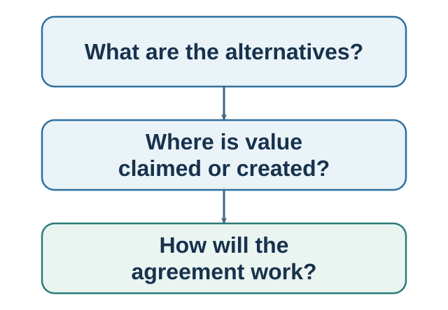

# Part VI. Negotiating Joint Decisions {.unnumbered}

**Book III — Agreement between interdependent minds.**

::: {.callout-note .part-overview icon=false}
## The movement

Negotiation is not persuasion with a reply button. Each side has alternatives, interests, constraints, information, dignity, and power. The task is to prepare, claim, create, and implement value without treating agreement itself as proof of success.
:::

{fig-alt="The author's recursive navigation model highlights option construction, the combined function of choosing, commitment and action, and negotiation. A shared rail shows that the social and institutional environment can influence every function. It is not a validated universal stage order."}

A supplier relationship and an employment package recur across the chapters. Stable facts let the analysis accumulate: first the alternatives and bargaining range, then opening and movement, then the differences that create trades, and finally packages, contingent terms, verification, governance, and review.

## Guiding questions

- What will each side do without agreement, and how uncertain are those alternatives?
- Which opening, response, concession, or silence protects value without destroying information?
- Which differences in priorities, beliefs, risk, timing, or capabilities can create value?
- What terms make performance measurable, enforceable, and robust to predictable disagreement?

## Bridge

An agreement is another designed path from intention to action. The final part generalizes that lesson to repeated behavior, choice environments, and organizational decision systems.
