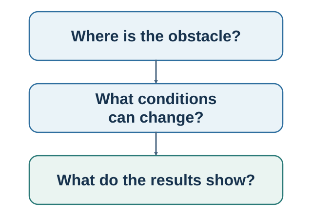

# Part VII. Designing Better Loops {.unnumbered}

::: {.callout-note .part-overview icon=false}
## The movement

Knowledge is not implementation. Behavior design changes a repeated action for a person or team. Choice architecture changes how a menu and its consequences are presented. Decision hygiene changes how judgments are elicited, challenged, committed, and reviewed. All three treat intervention as a testable and ethical hypothesis.
:::

{fig-alt="The author's recursive navigation model highlights context, option construction, action, learning, and the designed environment. It is not a validated universal stage order."}

The sequence deliberately returns to mechanisms diagnosed earlier. Habits and wanting explained how repeated control is learned; behavior design changes that loop. Framing, defaults, and friction explained how paths bend choice; choice architecture governs the path. Bias, noise, conformity, and hindsight explained how systems fail; decision hygiene protects independent evidence and learning.

## Guiding questions

- What ability, prompt, cue, friction, or immediate consequence should change?
- Which choice-path feature changes attention, understanding, action, feedback, or exit?
- What should be judged independently, challenged visibly, documented, and reviewed?
- Would the design remain defensible if affected people understood and could contest it?

## Closing the loop

The book returns to its opening claim. Visible action is the endpoint of a hidden process, and that process is partly built by other people. A better loop makes its evidence, objectives, assumptions, alternatives, power, and feedback easier to inspect—and therefore easier to correct.
